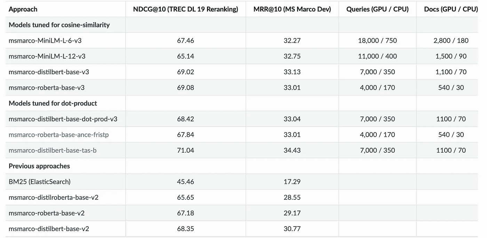
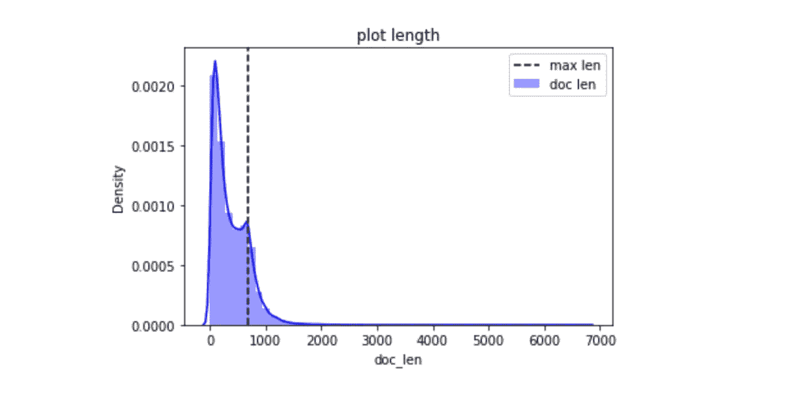
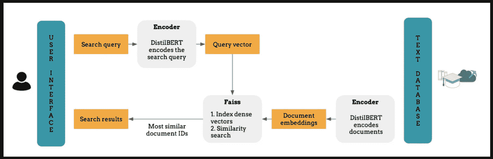
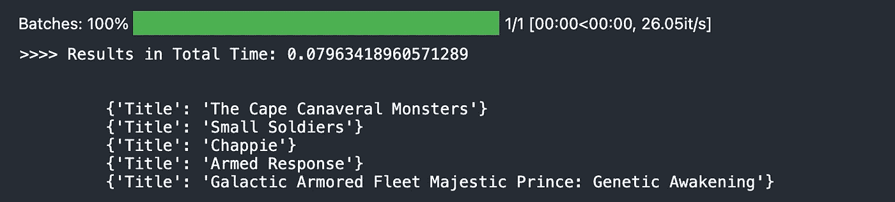
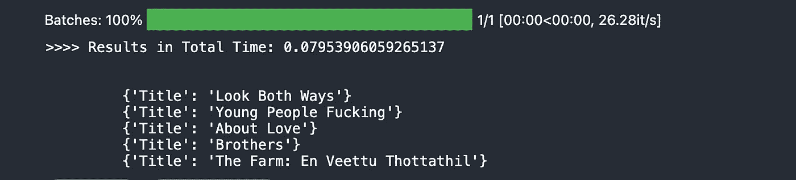
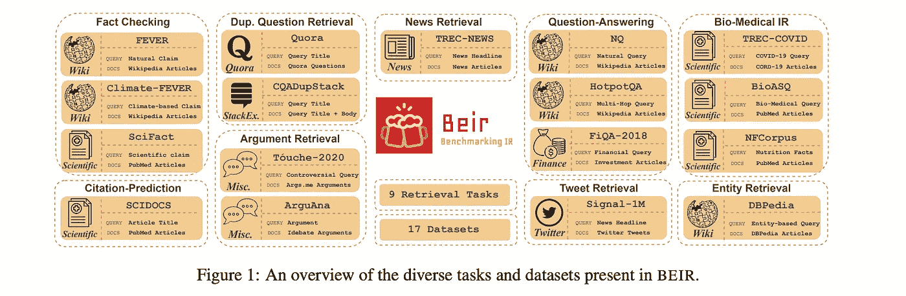
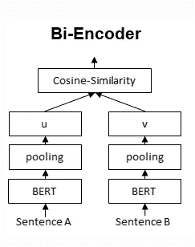
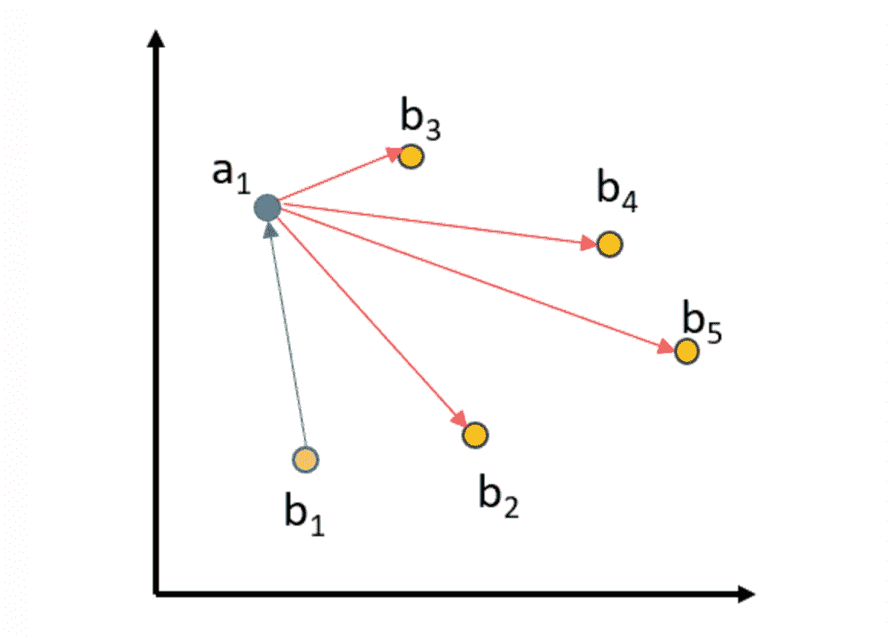
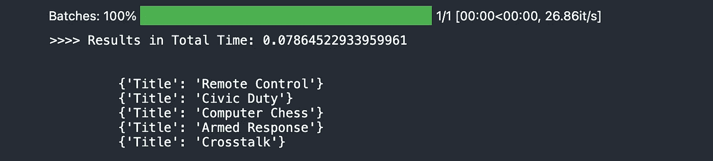
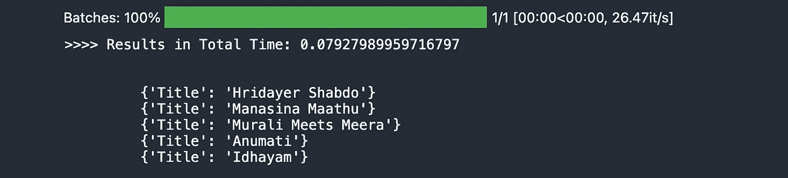

# 使用 S-BERT 进行语义搜索是您所需要的

> 原文：<https://medium.com/mlearning-ai/semantic-search-with-s-bert-is-all-you-need-951bc710e160?source=collection_archive---------0----------------------->

## 从头开始构建内部语义搜索引擎—快速而准确


Photo by [Markus Winkler](https://unsplash.com/@markuswinkler?utm_source=medium&utm_medium=referral) on [Unsplash](https://unsplash.com?utm_source=medium&utm_medium=referral)

**-*语义搜索是一种**数据搜索技术**，其中搜索查询不仅旨在找到关键词，还旨在**确定一个人用于[搜索](https://www.youtube.com/watch?v=Yo4NqGPISXQ)的词语**的意图和上下文含义。*

*语义学是指对意义的哲学研究。诚然，哲学很少与软件工程押韵，但这个概念确实帮助我们达成了一个定义。的确，**语义搜索是要搞清楚你的用户是什么意思。***

*[语义](https://www.youtube.com/watch?v=Yo4NqGPISXQ)搜索试图通过理解搜索查询的内容来提高搜索的准确性。传统搜索引擎只能根据词汇匹配来查找文档，与之相反，语义搜索也可以查找同义词。*

*事实上，这种类型的搜索通过几乎准确地理解用户试图询问的内容，而不是简单地将关键词与页面匹配，从而使浏览更加完整。语义搜索背后的思想是将你的语料库中的所有条目嵌入到一个向量空间中，这些条目可以是句子、段落或文档。*

*在搜索时，*查询被嵌入到相同的向量空间中，并且从您的语料库中找到最接近的嵌入*。这些条目应该与查询有很高的语义重叠。*

*参考消息——在这篇博客中，我坚持使用句子变形金刚的变体。 *SentenceTransformers 的设计使得微调你自己的句子/文本嵌入模型变得很容易*。它提供了大多数构建模块，您可以将这些模块结合在一起，为您的特定任务调整嵌入。如果你不知道这个概念，请在这里阅读他们的出版物:[https://www.sbert.net/docs/publications.html](https://www.sbert.net/docs/publications.html)*

*在我们开始之前，让我们问自己这些问题，并寻找它的解决方案，而不是直接跳入解决方案:*

*[](https://subirverma.medium.com/simulating-content-personalization-with-contextual-bandits-6f4efb902af) [## 用上下文强盗模拟内容个性化🤖

### 用 Vowpal Wabbit 模拟一个内容个性化场景，使用上下文强盗在动作之间做出选择…

subirverma.medium.com](https://subirverma.medium.com/simulating-content-personalization-with-contextual-bandits-6f4efb902af) 

> Q1。什么样的嵌入会起作用？Q2。如果使用 BERT，如何存储文档及其庞大的嵌入？
> Q3。如果我们有像博客这样的长文档和像产品描述这样的小块内容会怎么样？方法将如何改变？
> Q4。模型微调如何能给我好的结果？

让我们看看是否能找到所有问题的答案。当我们这样做的时候，下面的概念将被涵盖。搜索类型
2。余弦和点积度量
3。文件嵌入技术
4。存储和检索。
5。合成查询生成。
6。双编码器微调

我已经通过视频[在这里](https://www.youtube.com/watch?v=Yo4NqGPISXQ)分享了这篇博客的详细分析。

# 对称与非对称语义搜索

**Q1&Q3
A**关键区别**对于您的设置是*对称* vs. *非对称语义搜索*:**

*   对于**对称语义搜索，**您的查询和您的语料库中的条目具有大约相同的长度和相同的内容量。一个例子是搜索类似的问题:例如，你的查询可以是*“如何在线学习 Python？”*而你想找一个类似*“如何在 web 上学习 Python？”*。对于对称任务，您可能会翻转查询和语料库中的条目。
*   对于**非对称语义搜索**，你通常有一个**短查询**(比如一个问题或者一些关键词)，你想找到一个较长的段落回答查询。一个例子是类似于*“什么是 Python”*的查询，并且你想要找到段落*“Python 是一种解释的、高级的和通用的编程语言。Python 的设计哲学……”*。对于非对称任务，翻转查询和语料库中的条目通常没有意义。

上述概念非常重要，因为这将帮助我们更好地理解我们的问题，因此我们可以使用专门为我们手头的任务/问题开发的方法。

*为你的任务类型选择合适的型号* *很关键。它最大的区别在于它接受训练的数据类型。此外，针对余弦相似性调整的模型将更喜欢检索短文档，而针对点积调整的模型将更喜欢检索较长的文档。根据您的任务，这种或那种类型的模型是更可取的。*



**对称语义搜索**的适用模型:

*   **释义-蒸馏-基础-v1 /释义-xlm-r-多语种-v1**
*   **quora-distilbert-base/quora-distilbert-多语言**
*   **distiluse-base-multilingual-cased-v2**

**不对称语义搜索的适用模型**:

*   **msmarco-distilbert-base-v2**
*   **msmarco-bert-base-v3**

更多详情请点击:[https://www.sbert.net/docs/pretrained_models.html](https://www.sbert.net/docs/pretrained_models.html)

***为了理解为什么 S-BERT 不是 BERT 我在这里极力推荐这篇论文:***[***【https://arxiv.org/pdf/1908.10084.pdf】***](https://arxiv.org/pdf/1908.10084.pdf)

**Q2 的解决方案**
此时，我们已经了解了我们的数据，因此，我们选择了嵌入模型。接下来，我们需要了解如何对数据进行编码，以及我们需要用编码存储的其他哪些信息将有助于检索搜索结果。

对于存储，我们有这样的选项:
(a) **ElasticSearch** :如果我们有很多元信息存储，并且我们想要运行一些跨集群搜索，这可能是一个非常好的选项。话虽如此，但如果将产品投入生产和规模化，您可能会花费大量成本，而且维护可能会花费您另一位专家的成本。
(b) **FAISS** :(脸书 AI 相似性搜索)是一个允许开发者快速搜索彼此相似的多媒体文档嵌入的库。它解决了针对基于散列的搜索而优化的传统查询搜索引擎的局限性，并提供了更多可扩展的相似性搜索功能。
(C)**:一个 C++库，使用 Python 绑定来搜索空间中靠近给定查询点的点。它还创建基于文件的大型只读数据结构，这些数据结构被映射到内存中，这样许多进程可以共享相同的数据。**

**你的选择完全取决于你和你的需求。我现在选择 FAISS，因为它的易用性(pythonic)和 GPU 支持使得它非常快。FAISS 的唯一限制是你必须用你的 FAISS id 的映射在一些数据库中单独维护你的元数据信息。
***看这里:***[**https://medium . com/swlh/add-similarity-search-to-dynamo db-with-faiss-c 68 EB 6 a 48 b 08**](/swlh/add-similarity-search-to-dynamodb-with-faiss-c68eb6a48b08)**

# **开始—快速构建一些东西**

**数据集:[维基百科电影剧情](https://www.kaggle.com/jrobischon/wikipedia-movie-plots)
内容:数据集包含了全球 34886 部电影的描述。下面列出了列说明:**

*   ***上映年份* —电影上映的年份**
*   ***片名* —电影片名**
*   ***起源/种族* —电影的起源(即美国、宝莱坞、泰米尔等。)**
*   ***导演* —导演**
*   ***演员阵容* —主要演员**
*   ***类型* —电影类型**
*   ***维基页面* —从中抓取情节描述的维基页面的 URL**
*   ***剧情* —电影剧情的长篇描述(警告:可能包含剧透！！！)**

**我们想为用户建立一个搜索栏来搜索电影，为了简单起见，我们假设我们只想在*电影情节字段*中进行搜索。用户可以输入一些关键字或句子来描述他们的电影，我们通过密切理解查询和电影情节来提供最好的服务。**

**在编码之前，我们先来看看这个文本信息有多长。**

```
df['doc_len'] = df['Plot'].apply(lambda words: len(words.split()))
max_seq_len = np.round(df['doc_len'].mean() + df['doc_len'].std()).astype(int)
sns.distplot(df['doc_len'], hist=True, kde=True, color='b', label='doc len')
plt.axvline(x=max_seq_len, color='k', linestyle='--', label='max len')
plt.title('plot length'); plt.legend()
plt.show()
```

****

**Movie Plot Length Distribution**

**有几种方法可以处理文档长度超过 512 的情况。
(1)最容易也是最可怕的是将长度大于 512 的所有东西都切掉。
(2)运行提取或抽象总结
(3)文档池嵌入的平均值。**

**现在我们将选择最可怕的一个。我浏览了一些情节样本，得出结论，采取最大长度应该足以满足我们试图建立电影搜索。
在这里，如上所述，我们正在处理不对称搜索，并试图检索长段落，因此对于我们的情况，点积模型将非常适合。对于这个实验，我选择了**"*sentence-transformers/ms Marco-distilbert-base-dot-prod-v3*"**模型，它在语义文本相似性(不对称)任务中表现很好，并且它比 bert 快得多，因为它小得多。该模型被优化为使用点积作为查询和文档之间的相似性函数。
*注:如果你有简短的描述，****distilbert-base-nli-stsb-mean-tokens】，*** *效果更好更快。***

****

**Search Architecture**

```
from sentence_transformers import SentenceTransformer
model = SentenceTransformer('msmarco-distilbert-base-dot-prod-v3')
```

**因为我们使用 FAISS，一旦我们解决了索引工厂和映射，存储嵌入就很容易了。**

```
import faiss
encoded_data = model.encode(df.Plot.tolist())
encoded_data = np.asarray(encoded_data.astype('float32'))
index = faiss.IndexIDMap(faiss.IndexFlatIP(768))
index.add_with_ids(encoded_data, np.array(range(0, len(df))))
faiss.write_index(index, 'movie_plot.index')
```

**我们已经对我们的电影情节进行了编码，其中每个情节都用 768 维向量进行了编码，并以 movie_plot.index 名称存储到磁盘上。
注意这里我们使用了**索引**。**add _ with _ id**它按照数据帧的顺序对数据进行编码，并存储它们的索引 id。**

**让我们写几个实用函数来帮助编码用户查询，并从 FAISS 索引目录中获取类似的电影。**

```
def fetch_movie_info(dataframe_idx):
    info = df.iloc[dataframe_idx]
    meta_dict = dict()
    meta_dict['Title'] = info['Title']
    meta_dict['Plot'] = info['Plot'][:500]
    return meta_dict

def search(query, top_k, index, model):
    t=time.time()
    query_vector = model.encode([query])
    top_k = index.search(query_vector, top_k)
    print('>>>> Results in Total Time: **{}**'.format(time.time()-t))
    top_k_ids = top_k[1].tolist()[0]
    top_k_ids = list(np.unique(top_k_ids))
    results =  [fetch_movie_info(idx) for idx **in** top_k_ids]
    return results
```

****函数:搜索** 查询:string - >用户键入查询
top_k: integer - >返回的结果数
index:faiss _ index->index 查询 for 结果
model: sbert - > model 对用户进行编码-查询
**函数:fetch _ movie _ info** data frame _ idx:integer->索引值提取自 movie_plot.index，可用于**

```
from pprint import pprintquery="Artificial Intelligence based action movie"
results=search(query, top_k=5, index=index, model=model)print("\n")
for result in results:
    print('\t',result)
```

****

```
from pprint import pprint

query="movie about romance and pain of separation"
results=search(query, top_k=5, index=index, model=model)

print("**\n**")
for result **in** results:
    print('**\t**',result)
```

****

**我试着运行一些非常模糊的查询，得到了一些不错的结果。印象不深，但相比之下，仅仅通过缩小任务范围，对其进行训练和微调，然后将其与我们的用例联系起来，就给了我们一些好的结果。**

**Not impressed*** 

# ***微调***

*****Q4 的解决方案**
如果我们有**查询&相关段落信息，我们可以很容易地在给定的数据集上微调句子转换器模型。但是如果从零开始建造，你就不会有这些数据。(这里我们不处理变压器模型的预训练方法。它很昂贵，并且需要大量的数据。这里不要忘记域)*****

***在这一点上，我们一无所获。但是等等，我们所有的电影情节和文本信息呢？我们能设计一些无监督的方法来微调我们数据集上的模型吗？***

## ***1.合成查询生成***

***我们使用**综合查询生成**来实现我们的目标。我们从文档集合中的段落开始，并为用户可能询问/可能搜索的这些可能的查询创建。
**BEIR** :信息检索模型零命中率评测异构基准提出了一种不需要训练数据就能学习(或适应)不对称语义搜索模型的方法。***

******

*****论文【https://arxiv.org/abs/2104.08663】[:](https://arxiv.org/abs/2104.08663)
**GitHub**:[https://github.com/UKPLab/beir](https://github.com/UKPLab/beir)*****

> ***这篇论文在多任务学习和微调方面有一些惊人的想法。
> **转自**
> GenQ 类似以往的工作(梁等，2020；马等，2021)，我们提出了一个无监督的领域适应方法密集检索模型使用合成查询。首先，我们微调 T5-base (Raffel 等人，2020)模型，以生成给定段落的查询。我们使用 MSMARCO 数据集并训练 2 个时期。然后，对于目标语料库，我们使用 top-k 和 nucleus-sampling(top-k:25；top-p: 0.95)。由于资源限制，我们将每个数据集中目标文档的最大数量限制为 100K。我们发现 T5 模型比 BART (Lewis 等人，2020)执行得更好，我们的解码设置比 beam-search 更好。对于检索，我们继续在合成查询和文档对上微调 SBERT 模型(第 4.1.3 节)。注意，这为每个任务创建了一个独立的模型。***

***受论文的启发，我们将对 SBERT 使用类似的微调技术。我们先来看看合成查询生成代码。***

```
****# Parameters for generation*
batch_size = 16 *#Batch size*
num_queries = 5 *#Number of queries to generate for every paragraph*
max_length_paragraph = 512 *#Max length for paragraph*
max_length_query = 64   *#Max length for output query*def _removeNonAscii(s): return "".join(i for i **in** s if ord(i) < 128)with open('generated_queries_all.tsv', 'w') as fOut:
    for start_idx **in** tqdm(range(0, len(paragraphs), batch_size)):
        sub_paragraphs = paragraphs[start_idx:start_idx+batch_size]
        inputs = tokenizer.prepare_seq2seq_batch(sub_paragraphs, max_length=max_length_paragraph, truncation=True, return_tensors='pt').to(device)
        outputs = model.generate(
            **inputs,
            max_length=max_length_query,
            do_sample=True,
            top_p=0.95,
            num_return_sequences=num_queries)

        for idx, out **in** enumerate(outputs):
            query = tokenizer.decode(out, skip_special_tokens=True)
            query = _removeNonAscii(query)
            para = sub_paragraphs[int(idx/num_queries)]
            para = _removeNonAscii(para)
            fOut.write("**{}\t{}\n**".format(query.replace("**\t**", " ").strip(), para.replace("**\t**", " ").strip()))*** 
```

***输入到这段代码中的段落不过是电影情节的片段，每个片段最多有 5 个综合生成的查询。如果你想一下，我们在这里尝试做的是将段落中可能存在的信息表示为问题，然后使用这个**知识元组**来微调 s-bert 模型，该模型将捕获这些元组之间的语义和句法信息映射。***

## ***2.双编码器微调***

******

***SBERT 是一个连体双编码器，使用平均池进行编码，使用余弦相似度进行检索。SentenceTransformers 的设计使得微调你自己的句子/文本嵌入模型变得很容易。它提供了大部分构建模块，我们可以将这些模块结合在一起，为我们的特定任务调整嵌入。
我们可以通过定义各个层来从头开始创建网络架构。例如，以下代码将创建所示的网络架构:***

```
****# Now we create a SentenceTransformer model from scratch*
word_emb = models.Transformer('sentence-transformers/msmarco-distilbert-base-dot-prod-v3')
pooling = models.Pooling(word_emb.get_word_embedding_dimension())
model = SentenceTransformer(modules=[word_emb, pooling])***
```

***注意:这里我使用了与前半部分相同的"**句子-transformers/ms Marco-distil Bert-base-dot-prod-v3**"进行微调。没有变化。
我想在这里谈谈我们将要使用的损失函数。`sentence_transformers.losses`定义不同的损失函数，可用于根据训练数据微调网络。在微调模型时，损失函数起着至关重要的作用。它决定了我们的嵌入模型对于特定的下游任务的效果如何。遗憾的是，没有“一刀切”的损失函数。哪个损失函数是合适的取决于可用的训练数据和目标任务。***

```
****MultipleNegativesRankingLoss: MultipleNegativesRankingLoss* is a great loss function if you only have positive pairs, for example, only pairs of similar texts like pairs of paraphrases, pairs of duplicate questions, pairs of (query, response), or pairs of (source_language, target_language).**paper:** [**https://arxiv.org/pdf/1705.00652.pdf**](https://arxiv.org/pdf/1705.00652.pdf)***
```

***这种损失期望作为输入的是一批由句子对(a_1，p_1)，(a_2，p_2)…，(a_n，p_n)组成的句子对，其中我们假设(a_i，p_i)为正对，而(a_i，p_j)为 I！=j 一个负对。对于每个 a_i，它使用所有其他 p_j 作为负样本，即对于 a_i，我们有 1 个正例(p_i)和 n-1 个负例(p_j)。然后，它最小化 softmax 标准化分数的负对数似然性。这个损失函数非常适合于为具有正对(例如(query，relevant_doc))的检索设置训练嵌入，因为它将在每批 n-1 个负文档中随机采样。性能通常会随着批量的增加而提高。还可以通过如下方式构造数据，为每个锚正对提供一个或多个硬否定:(a_1，p_1，n_1)，(a_2，p_2，n_2)。这里，n_1 是(a_1，p_1)的硬否定。损失将用于对(a_i，p_i)所有 p_j (j！=i)且所有 n_j 为负数。***

***但为什么不是 CosineSimilarityLoss 呢？最简单的方式是让**知识元组**用指示其相似性的分数来注释，例如在 0 到 1 的范围内。然后，我们可以使用连体网络架构来训练网络。但是我们没有标注分数。
使用 NLI 数据的 softmax-loss 产生(相对)好的句子嵌入是相当巧合的。[**multiple negative ranking loss**](https://www.sbert.net/docs/package_reference/losses.html#multiplenegativesrankingloss)更加直观，产生的句子表达也明显更好。***

*****multiple negativerankingloss**的训练数据由句子对[(a1，b1)，…，(an，bn)]组成，其中我们假设(ai，bi)是相似的句子，而(ai，bj)是 I！= j。最小化(ai，bj)之间的距离，同时最大化所有 I！= j。***

***例如在下图中:***

******

***(a1，b1)之间的距离减小，而(a1，b2…5)之间的距离将增大。对于 a2，…，a5 也是如此。***

***对 NLI 使用 MultipleNegativeRankingLoss 相当简单:我们将带有*蕴涵*标签的句子定义为正对。例如，我们有像(*“多名男性参与的足球比赛”这样的配对*，*“一些男人在玩一项运动。”*)并希望这些对在向量空间中接近。***

```
***from sentence_transformers import SentenceTransformer, InputExample, losses, models, datasets
from torch import nn
import os

train_examples = [] 
with open('../input/user-query-data/generated_queries_all (1).tsv') as fIn:
    for line **in** fIn:
        try:
            query, paragraph = line.strip().split('**\t**', maxsplit=1)
            train_examples.append(InputExample(texts=[query, paragraph]))
        except:
            pass

*# For the MultipleNegativesRankingLoss, it is important*
*# that the batch does not contain duplicate entries, i.e.*
*# no two equal queries and no two equal paragraphs.*
*# To ensure this, we use a special data loader*
train_dataloader = datasets.NoDuplicatesDataLoader(train_examples, batch_size=8)*# MultipleNegativesRankingLoss requires input pairs (query, relevant_passage)*
*# and trains the model so that is is suitable for semantic search*
train_loss = losses.MultipleNegativesRankingLoss(model)***
```

***微调框架已准备好进行微调。我们已经成功地建立了模型架构和损失函数以及为什么要使用它们。***

```
****#Tune the model*
num_epochs = 3
warmup_steps = int(len(train_dataloader) * num_epochs * 0.1)
model.fit(train_objectives=[(train_dataloader, train_loss)], epochs=num_epochs, warmup_steps=warmup_steps, show_progress_bar=True)

os.makedirs('search', exist_ok=True)
model.save('search/search-model')***
```

***调优完成后，不要忘记使用该模型再次对数据集运行 FAISS 编码和索引。***

***完成后，我对新模型发出了类似的查询，瞧！！推荐或搜索结果改善了很多。如果你不相信，看看情节，你就会明白了。***

******

*****Artificial Intelligence based action movie*****

******

*****movie about romance and pain of separation*****

***somewhat impressed now***

***这是成功的一半。我们只是触及了搜索的表面。我们还没有谈到检索、重新排序和个性化的质量。***

***[](/mlearning-ai/search-rank-and-recommendations-35cc717772cb) [## 搜索、排名和推荐

### 重新排列搜索结果和个性化推荐的简单方法。

medium.com](/mlearning-ai/search-rank-and-recommendations-35cc717772cb) 

在下一篇文章中，我将详细讨论用用户行为重新排序和改善搜索结果的策略。在那之前继续学习。请提出您的想法和意见。

干杯！！

Youtube 链接:[https://youtu.be/Yo4NqGPISXQ](https://youtu.be/Yo4NqGPISXQ)

注意:感谢 SBERT 论文和他们的文档。

[](https://github.com/99sbr/semantic-search-with-sbert) [## 99sbr/带 sbert 的语义搜索

### 此时您不能执行该操作。您已使用另一个标签页或窗口登录。您已在另一个选项卡中注销，或者…

github.com](https://github.com/99sbr/semantic-search-with-sbert) 

此外，如果您正在为基于 ML/DL 的项目寻找基于 Fast-API 的项目框架，请查看

[](https://github.com/99sbr/fastapi-template) [## 99sbr/fastapi-模板

### ML/DL 和 NLP 驱动的基于微服务的项目需要干净和可伸缩的代码架构吗？运行命令 uvicon…

github.com](https://github.com/99sbr/fastapi-template) [](https://www.linkedin.com/in/sbrvrm/) [## 苏比尔维尔马-数据科学家 lll -塔塔 1mg | LinkedIn

### Subir 是一位充满激情、自学成才的数据科学家。他从 2016 年开始从事数据科学领域的工作…

www.linkedin.com](https://www.linkedin.com/in/sbrvrm/) 

RedisAI 矢量搜索演示—[https://github.com/RedisAI/vecsim-demo](https://github.com/RedisAI/vecsim-demo)

[](/mlearning-ai/mlearning-ai-submission-suggestions-b51e2b130bfb) [## Mlearning.ai 提交建议

### 如何成为 Mlearning.ai 上的作家

medium.com](/mlearning-ai/mlearning-ai-submission-suggestions-b51e2b130bfb) 

🔵 [**成为 ML 作家**](/mlearning-ai/mlearning-ai-submission-suggestions-b51e2b130bfb)***