# PyTorch 语义分割:从零开始的 U-NET

> 原文：<https://medium.com/mlearning-ai/semantic-segmentation-with-pytorch-u-net-from-scratch-502d6565910a?source=collection_archive---------0----------------------->

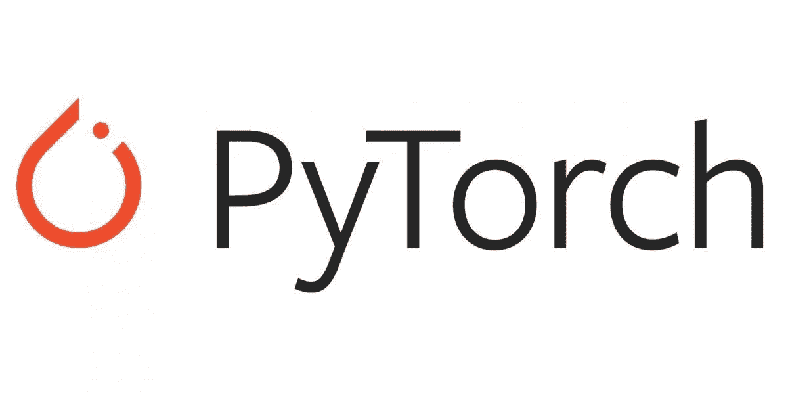

首先，让我们了解一下这篇文章是否适合您:

*   如果你是一个数据科学家/ML 工程师或者是一个接近语义分割的书呆子，你应该读读它。
*   如果你试图理解多类语义分割，你不应该读它。我的 U-NET 是在 [Davis 2017 数据集](https://davischallenge.org/index.html)上训练的，目标遮罩不是特定于类的(它们的颜色是随机的)。

如果你已经到了这一步，那么这篇文章是给你的。现在让我们把重点放在实现上。

整个模型由以下部分组成。py 文件:

1.  model.py
2.  dataset.py
3.  train.py
4.  配置. py

## 模型。巴拉圭

这是 UNET 架构，突出显示的部分是我用来构建模型的子类:CNNBlock、CNN block、编码器和解码器。

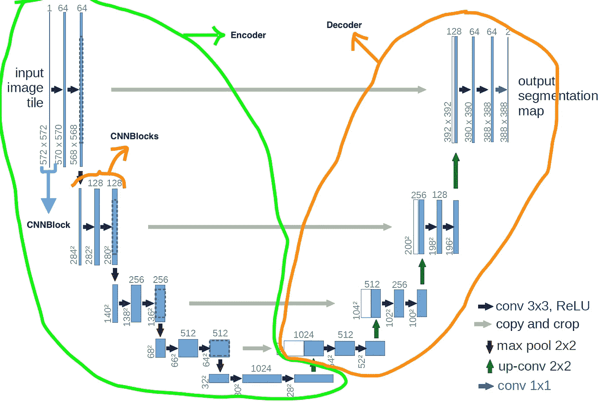

*   **CNNBlock** 只是依次应用卷积层、批量归一化和 RELU 激活函数。

*   **CNNBlocks** 连续执行 *x 次*一个 CNNBlock(在我们的例子中是 2 个)。这里的 *n_conv* 参数表示完成的卷积数:如果像我们的例子中那样设置为 2，那么它将执行两次卷积。

*   **编码器**执行*下坡*次 CNNBlocks，存储 route_connection，然后应用 MaxPool2d 层。如果你回到 UNET 建筑的图像，你可以通过计算两个蓝色箭头后面跟着一个红色箭头的次数来形象化它:4 次。由于最后一个 CNNBlocks 不需要 MaxPool2d，我们将其添加到 for 循环之外。

**解码器** →执行*上坡*次数的转置卷积，将输出与相应的 route_connection 连接，并将连接的张量输入到 CNNBlocks。最后，在图片的右上角，输出层返回一个形状张量[batch_size，n_classes=1，height，width]。注意:编码器的*下坡*参数必须等于解码器的*上坡*参数。

最后，我们把所有的部分放在一起，创建我们的 **UNET** 类:

在这里，我想考虑一下我的实现的优点和缺点:

1.  这是多余的:正如 Aladdin Persson 在[他的实现](https://github.com/aladdinpersson/Machine-Learning-Collection/blob/master/ML/Pytorch/image_segmentation/semantic_segmentation_unet/model.py)中所示，这个模型可以用大约 70 行代码构建(我的是大约 150 行)。主要原因是我为编码器和解码器创建了两个不同的类，而不是直接在 UNET 类中实现它们。另一方面，我的版本的优点是灵活性:你可以通过修改 *first_out_channels* 和*download*参数来试验调整原始 UNET。
2.  允许解码器中的第二个输入变量 *forward(self，x，route_connection)* 这不是很优雅。这可以通过在一个独特的 UNET 类中编写编码器和解码器来解决。

## 数据集。巴拉圭

因为这个类大约有 80 行，所以我没有粘贴到文章中，但是你可以在这里找到它。

这是 DAVIS_2017 数据集的树形结构:

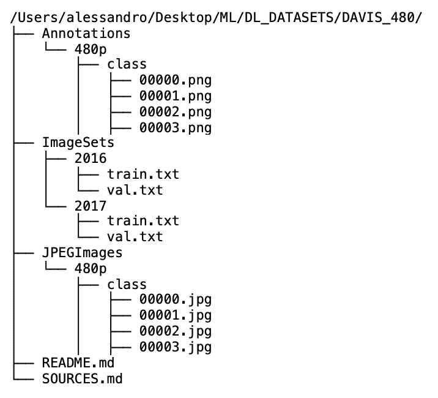

To help the visualisation I replaced all the classes with “class” in the subfolders of 480p

我使我的数据加载器适应了这个 [one](https://github.com/kmaninis/OSVOS-PyTorch/blob/master/dataloaders/davis_2016.py) ，并对其进行了修改，使其更简洁、更易于阅读。

它是如何工作的？

除了初始化参数之外， **__init__()** 的作用是创建两个列表，img_list 和 labels，它们包含了以相同顺序排列的每个图像的所有路径( *img_list[i]* 引用 *labels[i]* )。

为了实现这一点，我们采用了这一策略(以下示例针对 *img_list* 完成，但针对*标签*也是如此):

1.  我们用 root_folder (DAVIS_2017 文件夹)的路径初始化这个类。
2.  我们打开并加载 train.txt，其中包含所有类的列表(“熊”、“跑酷”等)
3.  通过 os.path.join()我们到达每个 class_folder，然后用 os.listdir()列出所有包含的图像。
4.  我们应用这个函数:"*list(map(lambda x:OS . path . join(' path _ to->'，" class_folder "，x)，images))* ，它为一个给定的 class_folder 创建一个到每个图像的路径列表。可以这样读: *map(function，iterable)* 将给定的*函数*应用到一个 *iterable* 的每个元素上。这里我们的函数是*λ*，它为*图像*列表*中的每个 *img_name* 创建一个到 *img_name* 的路径。*

然后 **__getitem__(self，idx)** 方法将基于它们在 *img_list* 和*标签*中的 idx 来检索图像和遮罩。

**__getitem__(self，idx)** 的步骤如下:

*   我们用 PIL 库加载图像，并将它们转换成 np.arrays
*   我们应用数据扩充。
*   白蛋白库不会对面具进行标准化，因此我们自己进行标准化。
*   在 UNET 的原始论文中，他们使用了*“有效卷积”* (kernel_size=3，stride=1，padding=0)而不是*“相同卷积”* (kernel_size=3，stride=1，padding=1)。由于我们已经加载了形状为[batch_size，channels，height=388，width=388]的图像和遮罩，为了使我们的模型输出形状相同的张量，我们必须输入形状为[batch_size，channels，height=572，width=572]的张量。为了增加输入张量的高度和宽度，我们使用了 92((572–388)/2)的[反射填充(或镜像](https://res.cloudinary.com/practicaldev/image/fetch/s--ENjk_7PR--/c_limit%2Cf_auto%2Cfl_progressive%2Cq_auto%2Cw_880/https://dev-to-uploads.s3.amazonaws.com/uploads/articles/16zxbk5x7jegfof422bk.png))。

## 火车。巴拉圭

[该文件](https://github.com/AlessandroMondin/computer_vision/blob/main/U-NET/train.py)使用了许多在 [utils.py](https://github.com/AlessandroMondin/computer_vision/blob/main/U-NET/utils.py) 中定义的函数，而超参数和其他变量位于 [config.py](https://github.com/AlessandroMondin/computer_vision/blob/main/U-NET/config.py) 中。

***If you’re new to torch.cuda.amp.GradScaler check it*** [***here***](https://pytorch.org/docs/stable/amp.html) ***and then a look at the train_loop() in the utils.file linked above.***

这些是在 train 中执行的步骤。py:

*   定义损失函数、模型和优化器。
*   如果定义了检查点，则加载模型和优化器的工件。
*   导入数据集的数据加载器。
*   然后，对于 EPOCHS 时间，它在整个数据集上训练模型，在控制台中登录评估度量( [dice-score](https://towardsdatascience.com/metrics-to-evaluate-your-semantic-segmentation-model-6bcb99639aa2) &先前定义的 loss_fn)，保存模型，最后保存图像，比较地面 _ 真相掩码和预测 _ 掩码(模型的输出)

## 结果

我用 SageMaker 中的 ml.p2.xlarge 对模型进行了训练，当它在验证集的**0.48**回忆**和骰子点数**的 **0.52 上达到时，在第 14 个历元获得了最佳结果。一开始，我对这些结果非常失望，但后来我注意到，在 DAVIS_2017 比赛中取得最佳成绩的模型在 ImageNet 或 COCO 数据集上进行了预训练。这个事实应该提醒我们迁移学习的力量和重要性。**

以下是 14 个时期验证集的一些最佳和最差预测:

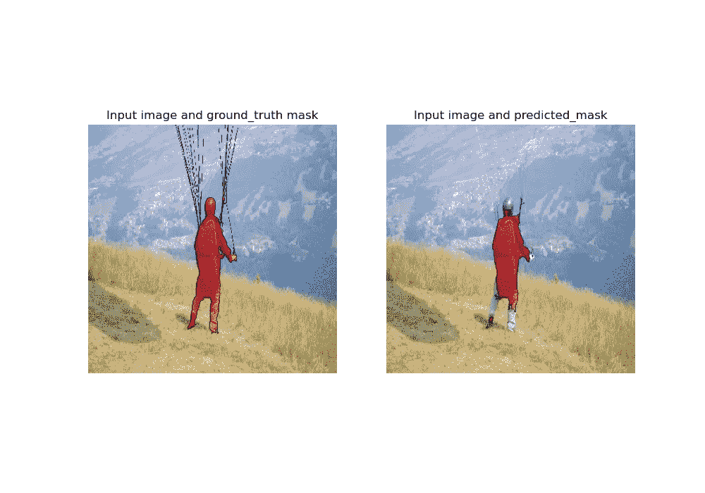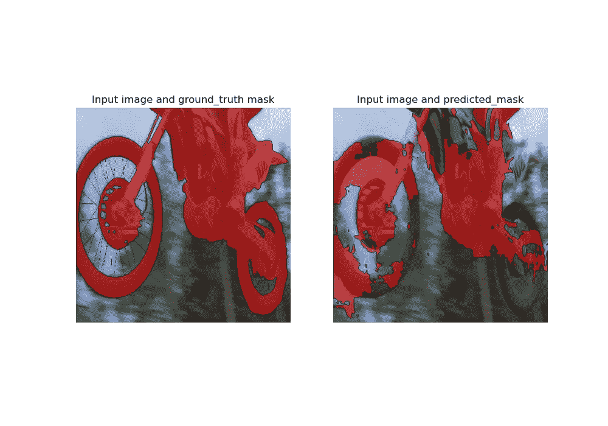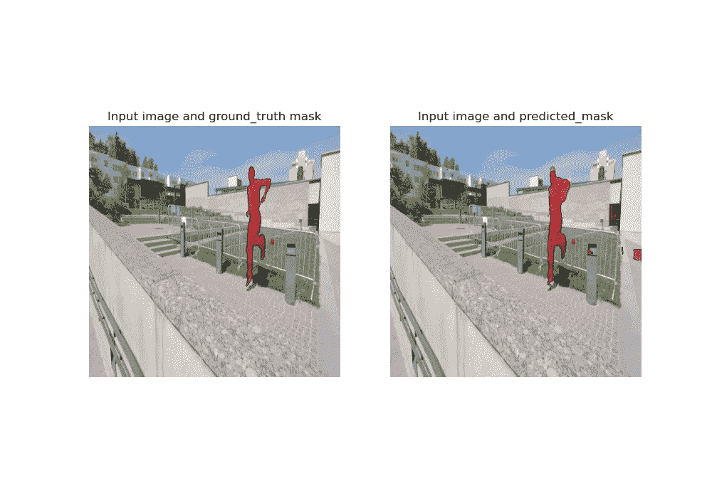

Some of the best predictions

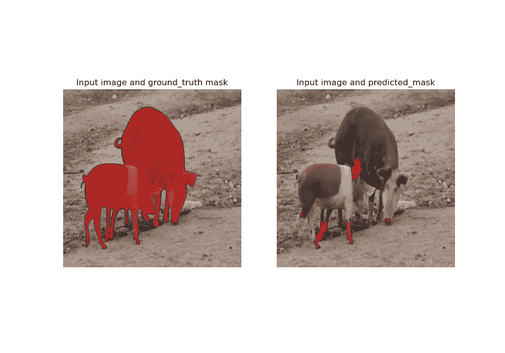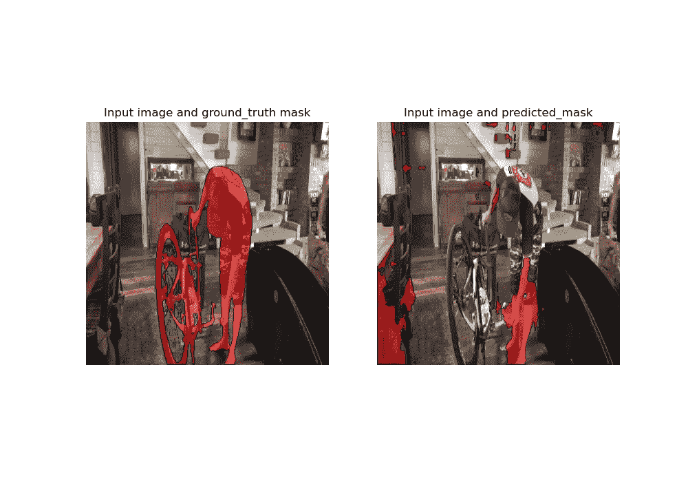

Some of the worst predictions

很难在糟糕的预测中找出共同的模式:也就是说，你可以认为在两张图片中，棕色占主导地位，前景和背景的颜色相似。改进这种对象的检测的最佳方式可能是，一如既往地，在更大的数据集上利用预训练。

## 结论

在开始一个项目之前，你应该检查你的数据集是否符合你的目的。在我的案例中，DAVIS datasat 是为了支持视频对象检测的研究而创建的，因此每一类的观察都是(几乎相同的)视频的连续帧。

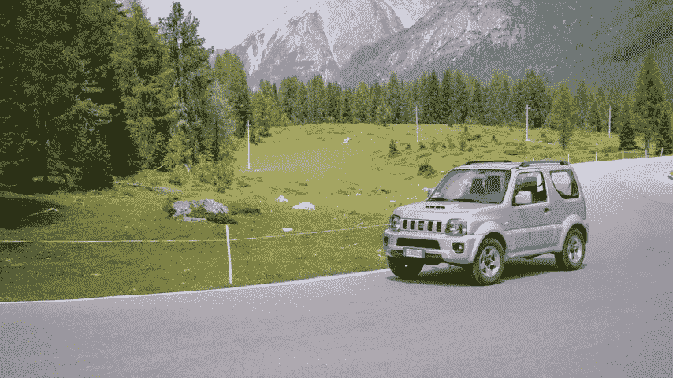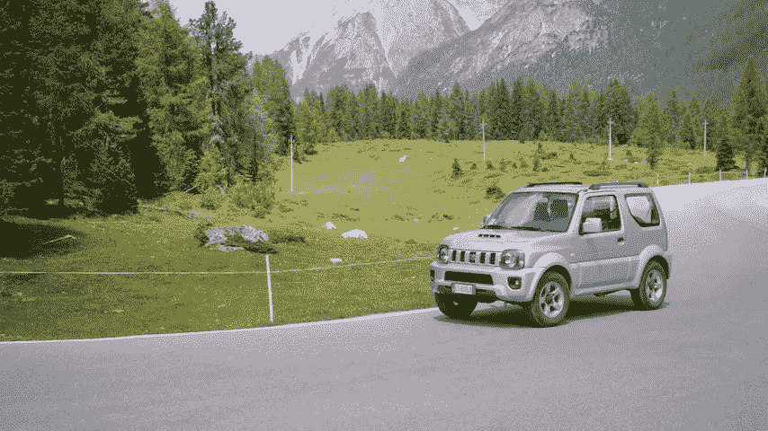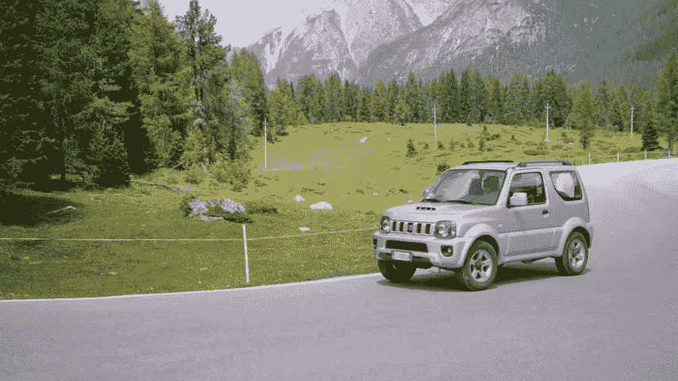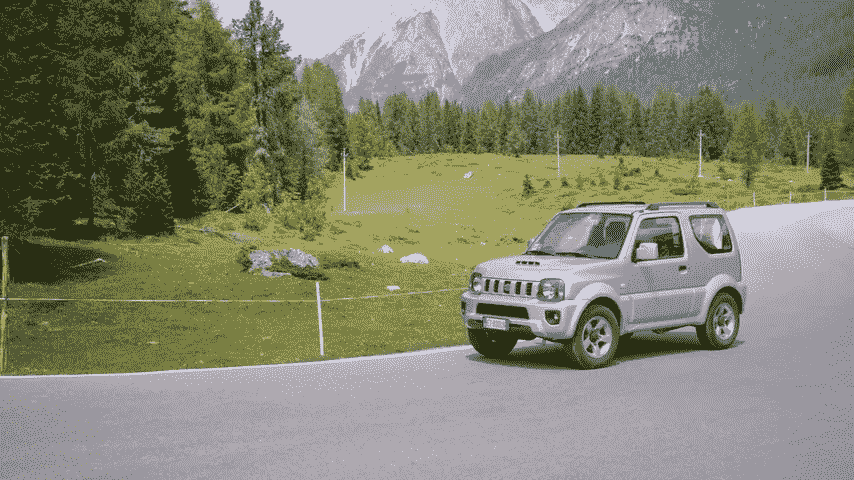

These are the images 00034.jpg, 00035.jpg, 00036.jpg, 00037.jpg of the car-turn class

鉴于我最初的目的是训练一个图像语义分割算法，我宁愿选择另一个数据集，因为戴维斯没有提供足够的概括。

当在远离 DAVIS 的环境中测试模型时，这些限制会明显出现:

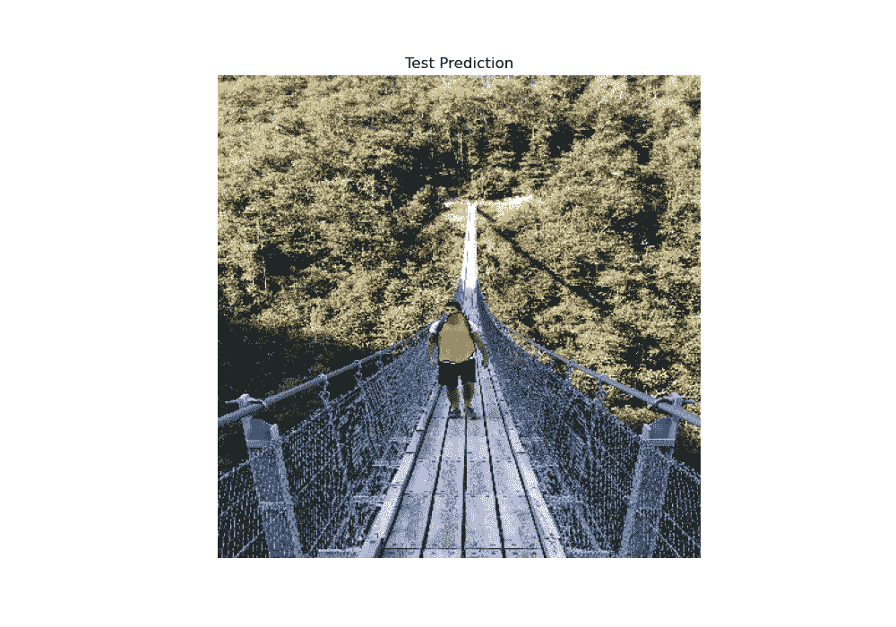

Myself while crossing the Ponte Tibetano of Bellinzona (CH)

这应该提醒我们，为了训练神经网络来有效地检测我们的目标对象，我们必须为它提供大量适合我们目的的高质量数据。

我希望这篇教程对你有帮助，感谢你阅读它！

 [## Mlearning.ai 提交建议

### 如何成为 Mlearning.ai 上的作家

medium.com](/mlearning-ai/mlearning-ai-submission-suggestions-b51e2b130bfb)