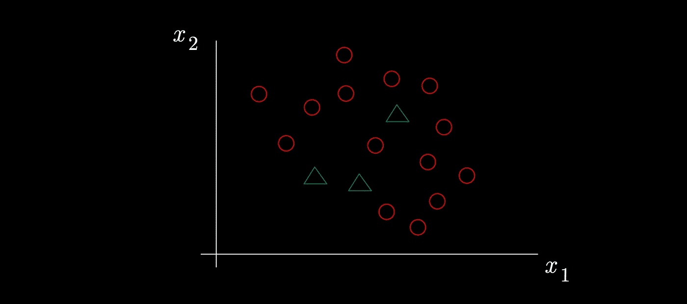

# 半监督学习—充分利用噪声数据

> 原文：<https://medium.com/mlearning-ai/semi-supervised-learning-making-the-most-of-noisy-data-5fbc711d2384?source=collection_archive---------2----------------------->

在本文中，我强调了**半监督学习**的有用性及其背后的不同技术，并进一步讨论了**主动学习**。

Photo by [Bianca Ackermann](https://unsplash.com/@biancablah?utm_source=medium&utm_medium=referral) on [Unsplash](https://unsplash.com?utm_source=medium&utm_medium=referral)

**半监督学习**是一种机器学习，其中学习算法给定了少量的训练示例以及大量的未标记示例。半监督学习的目标是从训练数据中学习模型，并利用未标记数据提高模型的精度。

有许多方法可以执行半监督学习。一种常见的方法是使用无监督学习算法从未标记的数据中学习模型，然后使用所学习的模型来提高有监督学习算法的精度。另一种方法是使用**强化学习算法**从未标记的数据中学习策略，然后使用所学习的策略来提高监督学习算法的精度。

半监督学习是一种很有前途的机器学习方法，因为它可以用很少的附加数据来提高模型的精度。

让我们进一步探讨这个问题…

# 为什么是半监督学习？

现实世界的问题由许多缺少数据的情况组成，包括训练模型所需的标签。我们如何弥补这一点，并能够正确解决问题？

让个人或专家手动标记数据既*昂贵*又*耗时*。那么，解决方案是什么？

需要注意的是，根据范·恩格伦和霍斯的[大调查](https://link.springer.com/content/pdf/10.1007/s10994-019-05855-6.pdf)*可知，大部分关于半监督学习的研究都集中在分类*上。因此，该领域应用的大多数方法都是针对分类问题的。这显然不是问题，因为现实世界中的场景充斥着分类问题。

> 半监督分类方法试图利用未标记的数据点来构建一个学习者，该学习者的表现超过了仅使用标记数据时获得的学习者的表现(范·恩格伦和霍斯)。

他们强调了定义当今大多数半监督算法的 3 个假设:

*   **平滑度假设**:一个输入上的两个相近样本 x1 和 x2 应该有相同的输出(y)。
*   **低密度假设**:类间的决策边界以输入空间中的低密度区域为特征。
*   **流形假设**:同一低维流形(低维子结构)上的数据点应该有相同的标签。

基于这些假设，算法应该能够根据已经标记的数据点对未标记的数据点进行分类。然而，**当且仅当不同的问题类别在标记的数据点**中被很好地表示时，这种完美的场景才会出现:

正如你所看到的，由绿色三角形形成的类没有被充分代表，导致半监督学习模型不能正确区分类

因此，为了获得最准确和有效的模型，在标记和未标记数据之间划分数据集是很重要的。这并不总是可能的，因为数据集在一个类上缺少太多的点，我们将在本文后面看到克服这一点的方法。

现在让我们来概述一下最著名的半监督算法/技术…

# 半监督学习算法

首先，这些算法有一个主要区别:

> 归纳方法 vs **直推**方法

虽然**归纳方法**正在寻求建立一个分类模型，目的是从未标记的数据点获得预测，但**直推方法**正在直接进行预测，而不试图拥有一个分类器。

**归纳**可与监督学习相关联，这与转导不同，因为它使用所有数据集(训练和测试)来预测标签。

如果你对这两种方法的区别感兴趣，可以看看[Vijini mallawatarachchi](https://towardsdatascience.com/inductive-vs-transductive-learning-e608e786f7d)[的这篇文章](https://vijini.medium.com/)。

让我们深入研究半监督学习算法的 4 种主要方法…

## 1 —包装方法*(归纳方法)*

**包装器方法**背后的想法是有一个 ***训练步骤*** ，其中分类器从已标记的数据点中学习，还有一个 ***伪标记步骤*** ，其中先前的分类器用于从未标记的数据中获得预测。然后，验证新标签(预测)的准确性，并将最准确的标签(基于置信度)添加到训练数据集中。重复这些步骤，直到模型达到最佳性能。

我们可以区分两种包装方法:

*   **自我训练**:包括在标记数据上训练任何类型的唯一分类器，并使用它来伪标记未标记的数据点。这是最简单的包装方法。
*   **协同训练**:对标记数据训练两个或多个分类器，并基于它们的预测，为下一次迭代将伪标记添加到训练数据点。主要的补充是不同类型的各种分类器应该具有更精确的信息，并且倾向于通过组合它们最有把握的预测来更好地概括。

另一种包装器方法基于**集成学习** ( **助推**和**装袋**)，并通过让多分类器在来自标记数据点的随机样本上学习来扩展 co 训练。

## **2 —无监督预处理(归纳方法)**

这种类型的方法基本上是使用**无监督技术**和**算法**从所有数据中提取信息，以改进分类器的未来训练。它是无监督技术和有监督技术的混合。

作为例子，我们发现**特征提取**或者甚至**聚类**在无监督学习阶段。

## **3 —固有半监督方法(归纳方法)**

这些方法的思想是基于一种假设，例如我们之前介绍的低密度假设，来推断一个可以分类数据点(标记的和未标记的)的函数。

这里列出了三种主要的内在半监督方法:

*   **最大间隔法(低密度分离)**:基于前述*低密度假设*的算法，其中所有数据点，尤其是未标记的数据点允许确定低密度区域。因此，分类器能够根据其在输入空间中的位置来预测新的数据点。这些方法的一个例子是半监督 SVM。
*   **流形**:数据点因其给出的信息而以其低维流形为特征的技术。因此，同一流形上的 2 个点应该有相同的标号，这就是*流形假设*。两种技术组成了流形方法:**流形正则化**和**流形逼近**。
*   **生成模型**:试图理解数据是如何生成的方法。最广为人知的技术是**混合模型**和**生成对抗网络** (GAN)。

## **4 —基于图形的方法(直推式方法)**

这是唯一的直推类方法，因此，它不使用任何分类器来解决问题。

> 转导方法通常在所有数据点(包括已标记和未标记数据点)上定义一个图，用可能的加权边对数据点的成对相似性进行编码。(朱小金，[半监督图学习](https://pages.cs.wisc.edu/~jerryzhu/pub/thesis.pdf))

为了评估算法，通过观察标记的数据是否被正确分类以及相似的数据点是否在正确的位置，来优化**目标函数**。

一般分为三个步骤:**图形创建**、**图形权重** g 和**推理**。如果你对这些方法的过程感兴趣，你可以在*范·恩格伦*和*霍克斯* [论文](https://link.springer.com/content/pdf/10.1007/s10994-019-05855-6.pdf)的 7.1 部分找到很好的解释。

现在我们已经描述了一些最先进的半监督学习算法，让我们以讨论什么是**主动学习**来结束…

# 主动学习

主动学习是半监督学习的一种扩展，包括确定和选择**高潜力的未标记数据**以使模型更有效。一旦被识别，这些数据点被标记，分类器获得准确性。

这种技术与我们之前看到的方法相结合，最大限度地减少了昂贵和耗时的标签工作。

## 如何检测信息丰富的未标记数据点？

可以注意到检测这些数据点的三种不同方法:

*   **不确定性**:标注模型对其预测最不自信的样本。
*   **多样性** / **多样性**:选择尽可能多样的样本，以最好地覆盖整个输入空间。
*   **模型改进**:选择能够提高模型性能(降低损失函数)的样本。

如果您对主动学习感兴趣，您可以从*毛刺沉淀*看一下[这篇伟大的论文](https://burrsettles.com/pub/settles.activelearning.pdf)。

# 结论

**半监督学习**在一个数据缺失、数据嘈杂的世界里是必不可少的。能够最大限度地利用任何数据至关重要，即使它不是我们寻求解决的问题的标签。

许多方法的存在使得这成为可能，例如**包装方法**、**无监督预处理**、**本质上半** - **有监督方法**或**基于图的方法。**

关于这个主题的一个有趣的开端是关于**弱监督**以及这如何挑战半监督学习算法。

感谢你阅读这篇文章，我希望你喜欢它，并学到了很多东西！如果你对数据科学和机器学习感兴趣，可以在这里查看我的文章。

# 资源:

 [## 半监督学习文献综述

### 本文回顾了一些关于半监督学习的文献。传统分类器需要标记数据…

minds.wisconsin.edu](https://minds.wisconsin.edu/handle/1793/60444)  [## 半监督学习——机器学习综述

### 半监督学习是机器学习的一个分支，它涉及使用有标签和无标签的数据进行分类

link.springer.com](https://link.springer.com/article/10.1007/s10994-019-05855-6)  [## GitHub-yassoua Li/awesome-半监督学习:😎一个最新的和策划的列表真棒…

### 令人敬畏的半监督学习资源的精选列表。灵感来自令人敬畏的深度视觉…

github.com](https://github.com/yassouali/awesome-semi-supervised-learning)  [## 归纳学习与传导学习

### 浅谈归纳式和直推式学习方法

towardsdatascience.com](https://towardsdatascience.com/inductive-vs-transductive-learning-e608e786f7d)  [## Mlearning.ai 提交建议

### 如何成为 Mlearning.ai 上的作家

medium.com](/mlearning-ai/mlearning-ai-submission-suggestions-b51e2b130bfb)