# 基于感官的 ML 在现代工业生产线中的应用

> 原文：<https://medium.com/mlearning-ai/sensorial-based-ml-applications-in-modern-industrial-product-lines-d4fed701b450?source=collection_archive---------4----------------------->

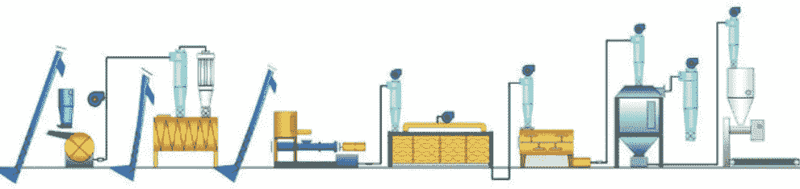

When Machine-Learning (ML) meets modern sensorial-based product-lines

# TL；速度三角形定位法(dead reckoning)

现代工业生产线通常包括几十个传感器，这些传感器沿着产品的生成路径对每一个发展中的产品进行连续采样。从数据科学家的角度来看，这被解释为一座金矿，即一个巨大的数据集，它不断增长，并包含多个时间序列向量。在某些情况下，数据甚至可以用宁滨结果、质量测试标签等进行注释。

本文对现代工业生产线领域中常见的机器学习(ML)应用进行了技术概述。它没有过多地涉及编码细节，而是侧重于架构方面，并强调了几个定性讨论。

# 议程

1.  问题定式化
2.  探索性数据分析
3.  特征工程
4.  聚类分析
5.  异常检测
6.  时间预测
7.  质量(QA)预测

# 1.问题定式化

每个工业批次沿着生产线路径经历不同的阶段(即状态)。每个阶段由多个传感器以给定的采样率监控。来自所有传感器的数据通常由指定的 BI ETL 管道收集和管理。BI，即商业智能，是指一套用于将原始数据转换为有意义的可用信息并获得对业务运营和机会的可操作洞察的流程和技术。BI ETL 指的是从多个来源提取数据、将其转换为用于查询、报告和分析的适当格式或结构，并将其加载到数据仓库或其他类型的集中式数据存储库中的过程。

BI ETL 与 AI 或人工智能核心交互，该核心保存所有与数据科学相关的分析。BI 提供输入数据，AI 最终提交回相应的机器学习见解。AI 和 BI 之间的通信通常通过 SQL 协议来应用。

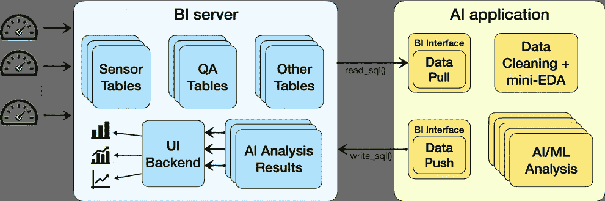

BI/AI interaction for modern sensorial-based product-lines — illustration

常见基本术语:

*   **批次**:沿着产品线发展的独特对象
*   **样本**:特定时间内所有传感器输出的集合。每批包括多个样本，即多个传感器结果。
*   **状态**:批次生命周期中的一个独特阶段。产品线可以保持多种状态
*   **传感器**:监控生产过程中批次状态的物理设备。现代生产线通常维护多个传感器，每个传感器监控不同的指标，使用不同的标度
*   **虚拟传感器**:物理传感器在不同状态下的拆分。例如，如果*传感器 0* 在*状态 0* 和*状态 1* 上采样数据，那么对应的虚拟传感器是*传感器 0 _ 状态 0* 和*传感器 0 _ 状态 1*
*   **全球时间**:时间轴代表每个批次的整个生命周期
*   **状态时间**:时间轴代表每个批次的每个状态的生命周期

接下来的部分将深入上图的人工智能应用方面。

# 2.探索性数据分析(“迷你 EDA”)

在数据科学中，EDA 术语通常是指对工程特性及其与因变量(以及它们自身)的相关性的初步分析。因此，“**迷你 EDA** 的主要目标是感受数据，获得关于其统计分布和各种变量(因变量和自变量)的一些初步见解。这种见解可以帮助数据科学家评估人工智能方法对于给定问题的可行性和潜力。应当注意，在提取任何特征之前，对原始感觉数据执行“迷你 EDA”。

下面列出了几个主要观察结果，并附有相应的图表

*   每批样品(*左上角*)
*   每个传感器的样本(*中左*)
*   每个状态的样本数(*左下角*)
*   传感器与全球时间(*右上*)
*   传感器与状态时间(*中右*)
*   质量保证(QA) /每批实验室结果(*右下角*)

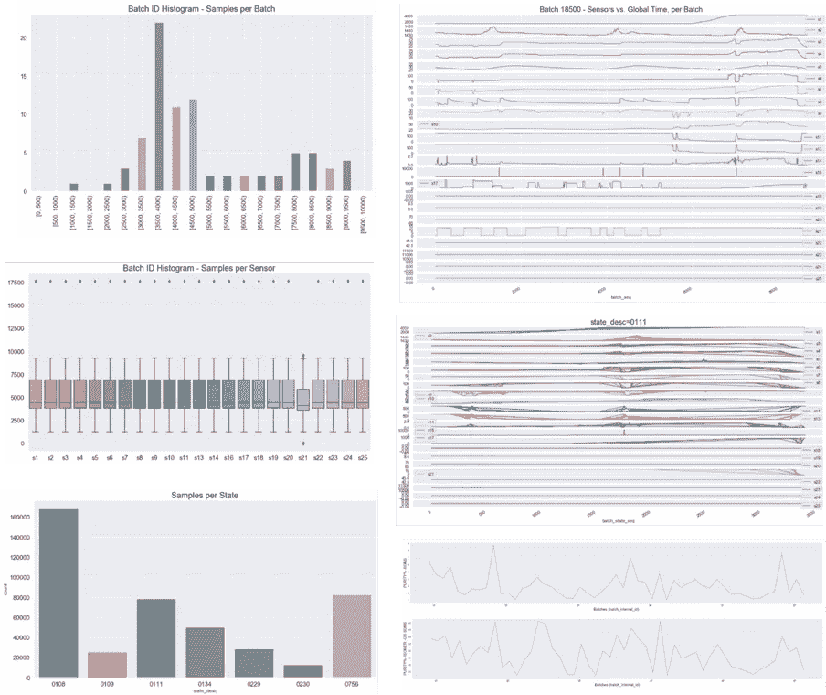

mini-EDA phase — key observations

mini-EDA 提供了对数据分布的快速了解，并解决了以下问题:

*   这些批次包含多少样本(从统计角度来看)？
*   传感器包含多少样本(统计意义上)？
*   每个州包含多少个样本？
*   传感器如何随时间变化(对于任意批次)？
*   质量保证/实验室结果如何分布在各个批次中？

# 3.特征工程

传感数据包括多个批次，每个批次充当一个多维时间序列(每个单个传感器代表一个一维时间序列)。**特征工程**阶段将问题从时域转移到特征域，同时通过统计度量利用时间信息。这允许在时间序列域之外的普通人工智能方法中的进一步处理。

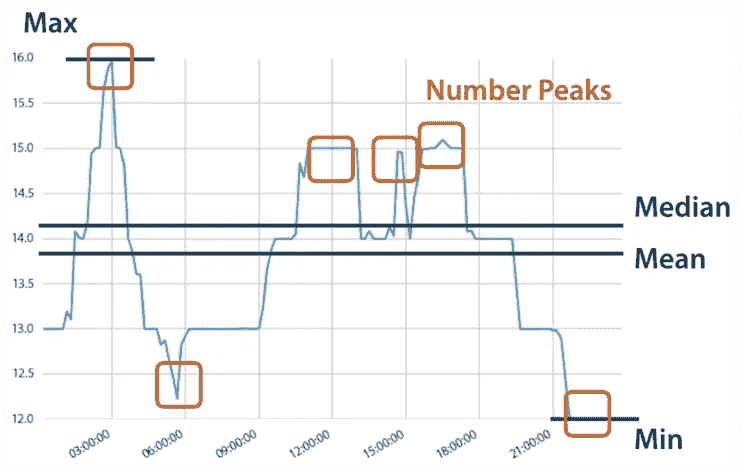

Features-Engineering (figure captured from tsfresh python package page

人工智能工具箱包含几个强大的方法，可以应用于当前的问题。这些方法可以分为两大类，即经典方法和神经网络方法。第一类是所谓的“浅层学习”方法，最后一类是所谓的“深度学习”方法。当谈到特征工程时，经典方法需要显式实现，而神经网络方法隐式地学习/工程特征，因此不需要显式实现。因此，本节指的是经典方法。一个非常流行的针对 features-engineering 的 python 包是[***ts fresh***。它自动计算大量的时间序列特征，即所谓的特征。此外，该软件包还包含评估这些特征对回归或分类任务的解释能力和重要性的方法。](https://tsfresh.readthedocs.io)

[*tsfresh*](https://tsfresh.readthedocs.io) 包提供了 4 个级别的功能工程:

*   **综合 FCParameters** —提取所有特征
*   **efficient fcparameters**—跳过计算成本高的功能
*   **MinimalFCParameters**——仅一小部分特征(快速设置)
*   **TimeBasedFCParameters**—仅需要 DateTimeIndex 的功能

一旦特征被提取出来，探索它们与因变量的相关性是很有趣的，因此是 QA / Lab 结果。为此，常见的相关性指标是皮尔逊和斯皮尔曼系数，其范围在-1 和+1 之间，分别评估线性关系和单调关系。

下图显示了每个特征(x 轴)的**皮尔森**(上)和**斯皮尔曼**(下)系数值，以及特定的 QA/Lab 结果。

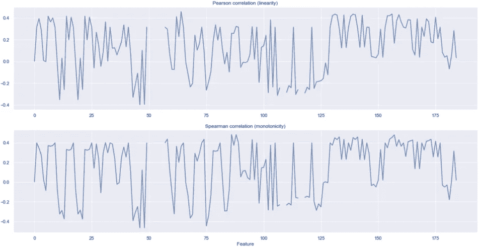

Pearson and Spearman correlation metrics

皮尔逊和斯皮尔曼系数通常用热图方式的**相关矩阵**设置来处理。这不仅允许对特征和因变量之间的相关性进行更深入的分析，还允许对特征和它们自身之间的相关性进行更深入的分析。

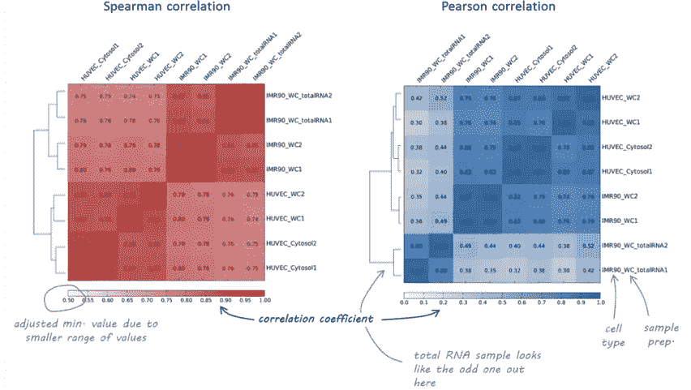

Correlation Matrix analysis (figure captured from plotCorrelation python package page)

基于可用的特征，相关性分析建议监督学习方法是否可能成功预测因变量。显著的相关性(系数接近 1 的许多特征)可能会促使这种方法最终工作良好。

# 4.聚类分析

在这一点上，每一批都在反映原始感觉数据的关键统计度量的高维特征域中表示。聚类的目标是尝试将每一批标记到相应的桶中，其方式在数学上(例如，最小化给定的误差度量)和直观上(例如，每个桶将理想地能够检索一些人工解释)都有意义。

**聚类分析**是机器学习的一个分支，驻留在无监督学习框架中。无监督学习是一种机器学习，它在没有预先存在的标签和最少人工监督的情况下，在数据集中寻找以前未检测到的模式。一种常用的聚类分析算法是 **K-Means** 算法。

K-Means 算法通过尝试将样本分成 n 组相等的方差来对数据进行聚类，从而最小化称为 ***惯性*** 或类内平方和的标准。该算法要求指定聚类数。它适用于大量样品，并已在许多不同领域的大范围应用中使用。k-means 算法将一组 N 个样本 X 分成 K 个不相交的聚类 C，每个聚类由聚类中样本的平均值μj 来描述。这些平均值通常被称为星团“质心”。

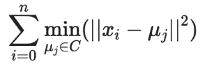

K-Means Inertia criterion, aka within-cluster sum-of-squares

平均复杂度由 O(k n T)给出，其中 n 是样本数，T 是迭代次数。在实践中，k-means 算法非常快(可用的最快的聚类算法之一)，但它会陷入局部最小值。这就是为什么重启几次会很有用。然而，对于许多实际应用，局部最小值是一个足够好的解决方案。

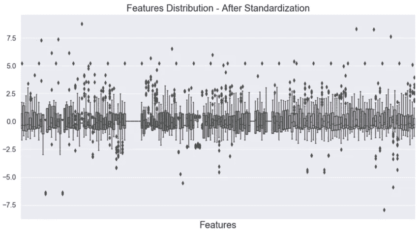

Features Normalization, aka Standardization

在应用 K-Means 聚类算法之前，对特征进行规范化是必不可少的，也称为**标准化**(回想一下，每个特征可能存在于完全不同的范围内)。两个常见的规范化实现是[*scipy . cluster . VQ . whiten*](https://docs.scipy.org/doc/scipy/reference/generated/scipy.cluster.vq.whiten.html)和[*sk learn . preprocessing . standard scaler*](https://scikit-learn.org/stable/modules/generated/sklearn.preprocessing.StandardScaler.html)*(python 库)。在这个阶段结束时，每个批次都在一个标准化的高维特征域中表示，并准备好进行聚类分析。*

*K-Means 的常见 python **实现是[*sk learn . cluster . K Means*](https://scikit-learn.org/stable/modules/generated/sklearn.cluster.KMeans.html)，它遵循劳埃德或埃尔坎的算法。***

*总体编码可能会如下所示:*

```
*from sklearn.cluster import KMeans
from scipy.cluster.vq import whitenfeatures_df_whiten = features_df.copy()km = KMeans(n_clusters=clusters_num, 
            init=’random’, 
            n_init=10, 
            max_iter=300, 
            tol=1e-04, 
            random_state=0,
            algorithm=”auto”)y_km = km.fit_predict(features_df_whiten)cluster_centers_df = pd.DataFrame(km.cluster_centers_)*
```

*其中 *features_df* 保存特征数据帧(N 批 x M 个特征),而 *cluster_num* 是定义 K-Means 的聚类数的参数。得到的数据帧被称为 *cluster_centers_df* ，大小为 C×M，其中 C 等于 *cluster_num* 。换句话说，上面的代码片段以 C 个集群结束，其中每个集群由 M 个特征的向量表示。另外一个结果是 *y_km* 向量，它将每个给定的批次映射到其对应的集群索引上，从 0 到 C-1。*

*为了可视化的目的，有必要将高维(M)特征域减少到更少的坐标(2 或 3)。实现这一目标的常见策略是**主成分分析(PCA)** 算法。*

*PCA 是一种无监督的学习技术，它提供了许多好处。例如，通过降低数据的维度，PCA 能够实现更好的一般化机器学习模型，从而有助于处理“[维度诅咒](https://en.wikipedia.org/wiki/Curse_of_dimensionality)”。此外，主成分分析可以帮助我们以非常低的模型精度成本提高性能，因为大多数算法的性能取决于数据的维度。PCA 的其他好处包括减少数据中的噪声、特征选择(在一定程度上)以及产生独立的、不相关的数据特征的能力。*

*这里，PCA 被应用于可视化目的，并且允许检查 K-Means 聚类结果。PCA 常见的 python **实现是[*sk learn . decomposition . PCA*](https://scikit-learn.org/stable/modules/generated/sklearn.decomposition.PCA.html)。除了可视化，它实际上提供了一个额外的重要结果，这就是**集群的贡献**。例如，下图暗示 14 个聚类可能是 K-Means *cluster_num* 参数的合适选择，因为 14 个聚类似乎覆盖了约 90%的解释方差。***

*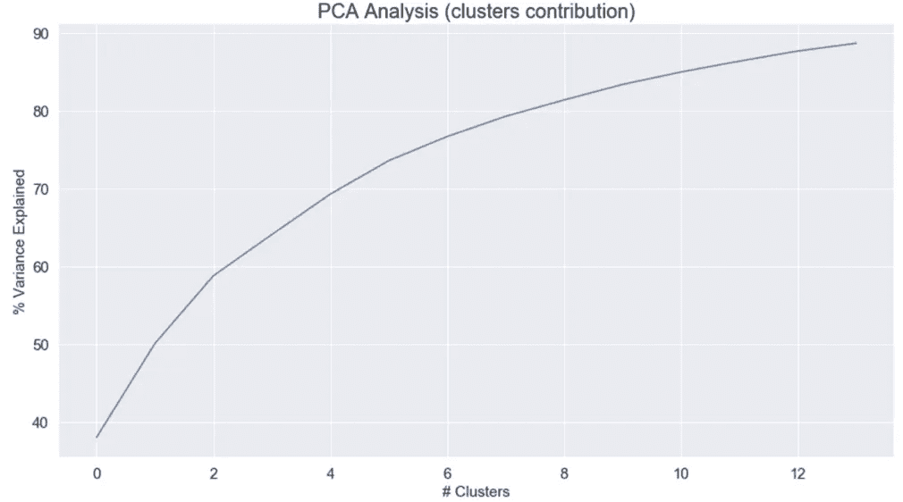*

*Clusters Contribution, by PCA*

*最后，通过选择 2(对于 2D 图)或 3(对于 3D 图)最高有效坐标，可以在 PCA 域中可视化 K 均值聚类结果。*

**

*K-Means Cluster-Analysis result in a 2D PCA domain*

*因此，每个**点**代表一个批次，每个**星**代表一个集群。*

*总之，我们从特征工程开始，将问题从原始感知领域(时间序列)转移到高维特征领域。这些特征进入标准化阶段，然后通过 K-Means 算法进行聚类。最后，在 2D 主成分分析域中可视化得到的聚类。*

*最后一点，时间序列分析的另一个常用策略叫做**动态时间弯曲** (DTW)，可以应用于**层次聚类分析** (HCA)。DTW/HCA 常见的 python 实现是[*dtaidistance . clustering*](https://dtaidistance.readthedocs.io/en/latest/modules/clustering.html)。这里不再详细讨论这一策略，古玩读者可以在本文[中找到一个很好的起点。](https://towardsdatascience.com/time-series-hierarchical-clustering-using-dynamic-time-warping-in-python-c8c9edf2fda5)*

*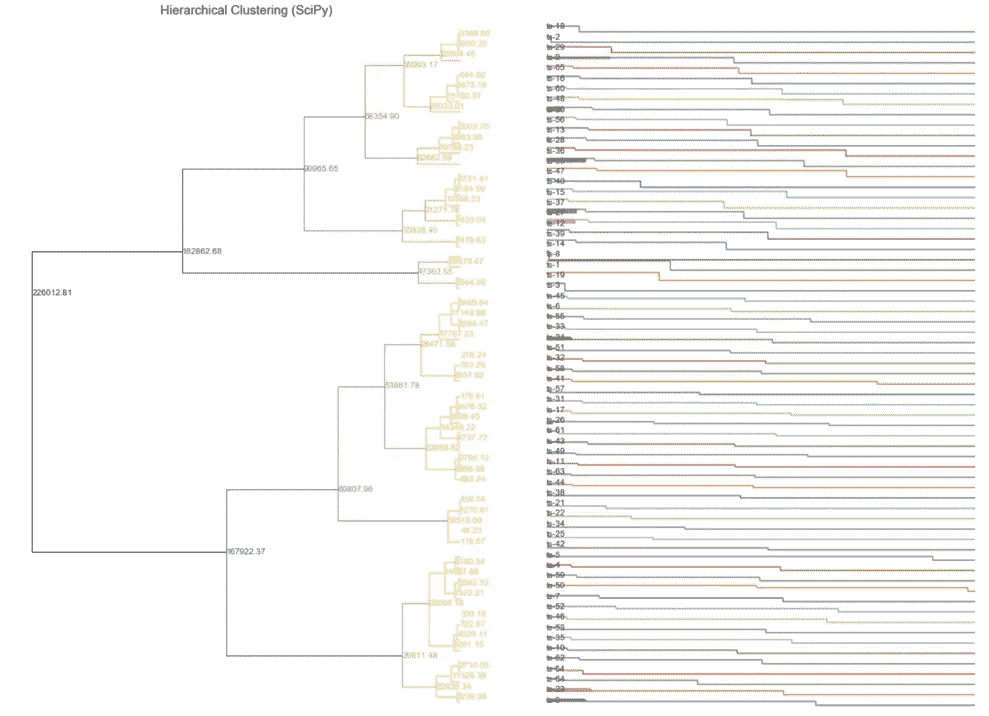*

*Hierarchical-Clustering Analysis (HCA) using Dynamic Time Warping (DTW)*

# *5.异常检测*

# *隔离森林*

***“隔离森林**是一种用于异常检测的无监督学习算法，其工作原理是隔离异常”([维基百科](https://en.wikipedia.org/wiki/Isolation_forest))。该算法的核心是通过在随机属性上创建决策树来“隔离”异常。随机分区为异常产生明显更短的路径，因为更少的(异常)实例导致更小的分区，并且因为可区分的属性值更可能在早期分区中被分离。因此，当随机树的森林集体地为一些特定点产生较短的路径长度时，那么它们很可能是异常的。下图展示了(在 2D 域中)隔离异常通常需要较少数量的分裂。*

*图 12 —隔离林概念—异常需要更少的拆分*

*隔离森林的常见 python **实现是[*sk learn . ensemble . Isolation Forest*](https://scikit-learn.org/0.20/modules/generated/sklearn.ensemble.IsolationForest.html)，只需要几行代码:***

```
*from sklearn.ensemble import IsolationForestX = np.array(features_pca_df)model = IsolationForest(behaviour=’new’, # Decision_function
                        contamination=0.01, # outliers_fraction
                        random_state=42) # seed
                        model.fit(X)

y_pred = model.predict(X)*
```

*上述代码片段的输入称为 *X* ，包含 PCA 域中的特征。从这个意义上说，它是上一个集群部分的直接延续。这意味着原始感知数据(时间序列)在进入隔离森林阶段之前要经过特征工程、标准化和 PCA 阶段。产生的输出是一个向量，称为 *y_pred* ，它预测每个例子是否应该被认为是内侧(+1)或外侧(-1)。同样，PCA 方法可以应用于 2D(或 3D)可视化。*

*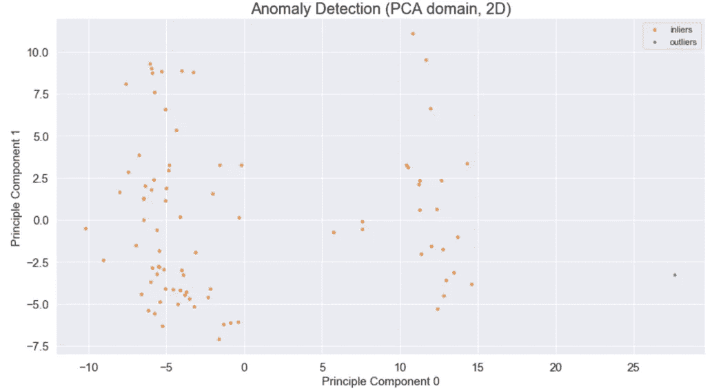*

*Anomaly-Detection with Isolation-Forest, visualized in a 2D PCA domain*

*上图中的每个点代表一个不同的批次，颜色暗示异常决策。可以观察到，在右下方区域有一个孤立的孤立批次。接下来，探索异常推理通常很有趣，一种常见的技术是根据每个特征将异常值批次与平均值进行比较。*

*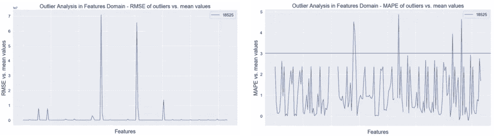*

*Anomaly-Detection with Isolation-Forest — Exploring anomalies reasoning*

*左图应用了 RMSE 指标，而右图应用了 MAPE 指标进行比较。红色水平线(右图)表示参数阈值。可以观察到，5 个特征负责异常判定。*

# *LSTM 自动编码器*

*这是本文中第一次遇到深度学习，也是在问题公式化部分介绍的“虚拟传感器”术语的使用。*

*自动编码器神经网络试图学习其输入的数据表示，通常是通过学习使用较少参数/内存的**高效编码**。在某种意义上，该模型使用尽可能少的参数来学习数据的最重要特征。*

*使用这种架构进行**异常检测**的基本原理是，模型根据“正常”数据进行训练，并确定产生的**重建误差**。然后，当模型遇到超出规范的数据并试图重建时，它将以重建误差的增加而结束，因为该模型从未被训练来准确地重建超出规范的项目。*

*使用 LSTM 单元的一个优点是能够在分析中包含**多变量特征**。这里是每个时间步的多个传感器读数。但是，在在线异常检测分析中，它可能是每个时间步长的要素。*

*自动编码器神经网络模型通常使用长短期记忆(LSTM)递归神经网络(RNN)细胞创建，这在 Keras/TensorFlow 框架内得到支持。Brent Larzalere 的文章很好地涵盖了这个主题。*

*以下步骤适用于每个状态的**:***

1.  ***将所有批次连接成一个时间线(“虚拟传感器”)***
2.  ***交叉验证** —训练/测试数据集分割，例如 80:20*
3.  ***标准化**，例如最小/最大*
4.  ***重塑**将标准化数据转换成适合输入 LSTM 网络的格式。LSTM 单元期望一个形式为[数据样本，时间步长，特征]的三维张量。这里，输入到 LSTM 网络中的每个样本代表一个时间步长，并包含 4 个特征(在该时间步长上四个方位的传感器读数)*
5.  *使用 Keras 库创建一个作为 Python 函数的自动编码器神经网络模型。**编译**使用 Adam 作为神经网络优化器，计算损失函数的平均绝对误差。*
6.  ***使**模型符合训练数据并对其进行训练，例如 100 个时期。查看模型性能评估的培训损失通常很有趣。*
7.  *探索**损失分布**，相应设置**异常阈值**。*

*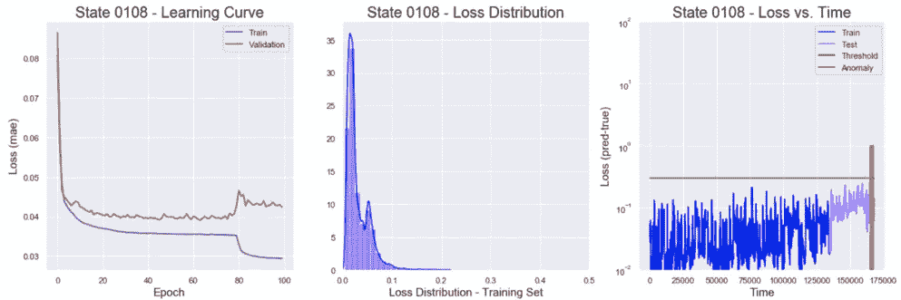*

*Anomaly-Detection with LSTM AutoEncoder — Learning phase Anomaly prediction*

*上图指的是某个任意状态，称为“0108”。学习曲线图(左)表明，就偏差和方差而言，学习在年进展良好，因为训练和验证曲线最终都足够低且相对紧密。不过，应用较低的回声(~80)来提前结束学习并避免过度拟合似乎是个好主意。损失分布图(中间)意味着下降异常阈值可以设置为~0.3，因为较高的损失相对较少。最后，损失-时间图(右)提供了串联批次损失的有趣视图，分为训练和验证组。绿色水平线标记异常阈值，可以观察到异常已经被检测到并超过了阈值。*

*对于相关状态，可以通过探索传感器-时间图来获得准确的异常推理。*

*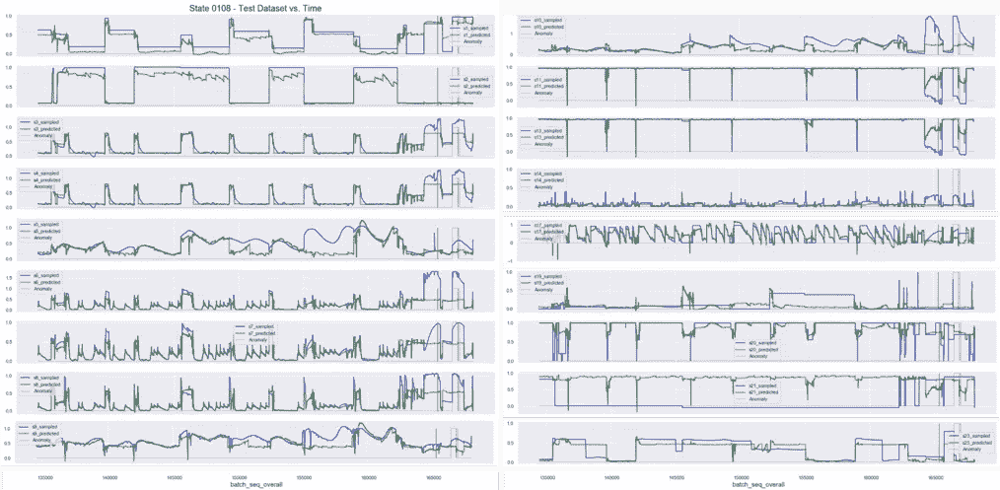*

*Anomaly-Detection with LSTM AutoEncoder — Exploring anomalies reasoning*

*上图指的是示例状态(“0108”)，包括多个每个传感器的子图。每个子图将采样值与预测值进行比较，另外用红色标记突出显示异常时间戳。这一观点暗示了特定的异常原因。*

# *6.时间预测*

*在题目的背景下，一个关键的观察结果是大多数时间序列数据可以由三个部分描述:*

*   ***趋势** →随时间变化且不重复的一般系统线性或(最常见的)非线性成分*
*   ***季节性** →一般系统的线性或(最常见的)非线性成分，随时间变化并重复*
*   ***噪声** →数据中非趋势/季节性的非系统成分*

*将给定的时间序列分解成上述组成部分的过程被称为**季节分解**，通常以相加的方式应用。*

*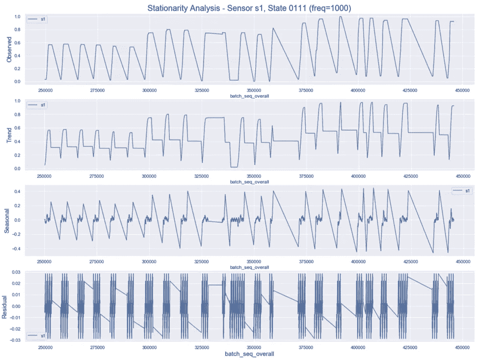*

*Seasonal Decomposition example*

***时间预测**是一个热门话题，有很多可能的应用，比如股票价格预测、天气预报、商业规划、资源分配等等。时间预测技术有很多种，在[大卫·伯巴的文章](https://towardsdatascience.com/an-overview-of-time-series-forecasting-models-a2fa7a358fcb)中也有描述，因此重点放在 ARIMA 框架上。*

***ARIMA 模型有三个特征:d，p，q***

*   ***d 是差分的**阶，即使时间序列平稳所需的差分次数。“d”参数可以从 ACF 图中提取，作为进入显著性圆锥的最小差分阶数*****
*   ***p 是 AR 项的**阶，即用作预测值的 Y 的滞后数。在进入显著性圆锥之前，可以从 PACF 图中提取“p”参数，作为初始尖峰的数量。*****
*   ***q 是 MA 项的**阶，即应该进入模型的滞后预测误差的数量。在进入显著性圆锥之前，可以从 ACF 图中提取“q”参数，作为初始尖峰的数量*****

***ARIMA 模型是这样一种模型，其中时间序列被微分 d 次以使其平稳，然后组合 AR 和 MA 项。
所以等式变成了:***

***𝑌𝑡=𝛼+𝛽1𝑌𝑡−1+𝛽2𝑌𝑡−2+…+𝛽𝑝𝑌𝑡−𝑝+𝜖𝑡+𝜙1𝜖𝑡−1+𝜙2𝜖𝑡−2+…+𝜙𝑞𝜖𝑡−𝑞***

***ARIMA 的 **SARIMAX** 扩展，它在单变量数据中显式地模拟季节性因素。除了 ARIMA d、p、q 参数之外，还有四个季节性因素:***

*   ***p:季节性自回归序列。***
*   ***d:季节性差异订单。***
*   ***问:季节性移动平均订单。***
*   ***m:单个季节周期的时间步长数。***

***当预测值不相关且相互独立时，线性回归模型效果最佳。因此，建立 ARIMA 模型的第一步是使时间序列**平稳**。平稳过程具有均值、方差和自相关结构不随时间变化的特性。检查平稳性的最流行方法之一是应用[增强的 Dickey Fuller (ADF)](https://en.wikipedia.org/wiki/Augmented_Dickey%E2%80%93Fuller_test) 测试。ADF 测试得到一个输入时间序列，并返回一个名为 *p 值*的分数。如果 *p 值*大于显著性水平 0.05，则输入时间序列不是平稳的。***

***常见的 python 实现 arima(和 SARIMAX)是[*pmdarima . ARIMA . auto _ ARIMA*](https://alkaline-ml.com/pmdarima/modules/generated/pmdarima.arima.auto_arima.html)，自动发现 ARIMA 模型的最优阶。对每个传感器和每个状态重复该过程。所有的批处理都被连接起来，通过标准化，进入 *auto_arima* 管道。结果是每个传感器和每个状态的时间预测模型，其可以应用于未来的传感器/状态行为。该模型可被视为额外的异常检测引擎，例如，如果实际样本明显偏离相应的预测，则称之为“异常”。***

***下图指的是一个称为“s22”的特定传感器，其中每一列对应一个不同的状态。顶行和底行分别提供时间轴上的缩小和放大视图。灰色圆锥代表预测确定性，其中窄圆锥意味着高确定性。***

***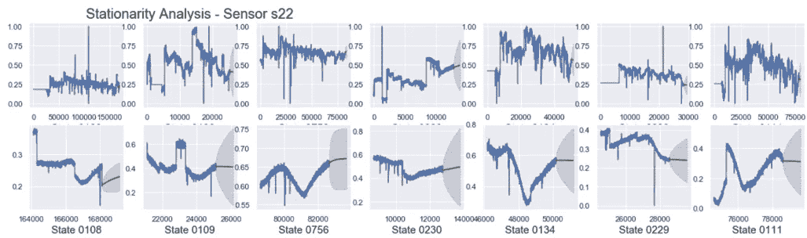***

***Time Forecasting — Example of a specific sensor, per each state***

***最后一点，时间序列预测的另一个常用工具叫做**脸书预言家**。它是一个加法回归模型，有四个主要组成部分:***

*   ***分段线性或逻辑增长曲线趋势。Prophet 通过从数据中选择变化点来自动检测趋势的变化。***
*   ***使用傅立叶级数模拟的年度季节性成分。***
*   ***使用虚拟变量的每周季节性成分。***
*   ***用户提供的重要节假日列表。***

***不过，这里不会进一步详细讨论这一策略，古玩读者可能会在[这个链接](https://facebook.github.io/prophet/)找到一个很好的起点。***

# ***7.质量(QA)预测***

# ***XGBoost***

***XGBoost 代表“极端梯度推进”，其中术语“梯度推进”源自弗里德曼的论文*贪婪函数近似:梯度推进机器*。XGBoost 用于监督学习问题，其中训练数据(具有多个特征)用于预测目标变量。***

***XGBoost 实际上是一个**决策树集成**模型。树集成模型由一组分类和回归树(CART)组成。下图是一个简单的购物车示例，它对某人是否会喜欢一个假想的电脑游戏 x 进行分类。***

***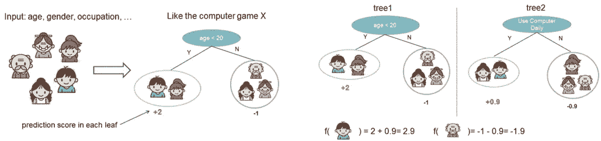***

***XGBoost CART example for whether someone will like a hypothetical computer game X***

***家庭成员被分类到不同的叶子中，并在相应的叶子上分配分数。CART 与决策树有点不同，决策树的叶子只包含决策值。在 CART 中，一个真实的分数与每片叶子相关联，这给了我们比分类更丰富的解释。通常情况下，单棵树的强度不足以在实践中使用。实际使用的是系综模型，将多棵树的预测汇总在一起(见上图右侧子图)。***

***回到我们关注的基于感觉的问题，来自系综森林的真实决策树将如下结束:***

***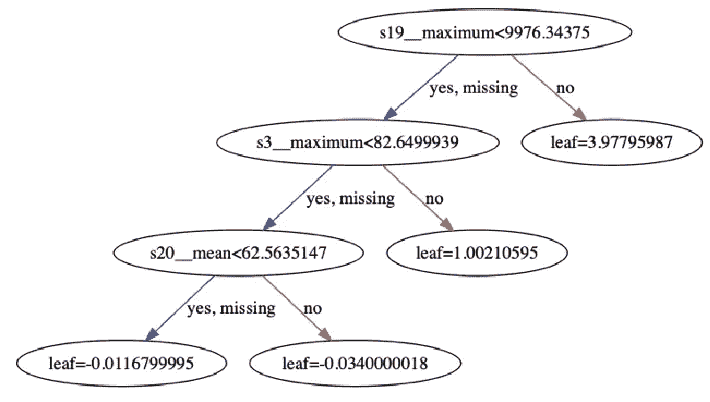***

***XGBoost — a realistic example for a sensorial decision tree***

***常见的 python 实现 XGBoost 是 [XGBoost Python 包](https://xgboost.readthedocs.io/en/latest/python/index.html)，它是一个开源库，提供了梯度增强决策树的高性能实现。底层的 C++代码库与顶层的 Python 接口相结合，构成了一个极其强大而又易于实现的包。XGBoost 带有多个超参数，结合 **GridSearch** 来寻找最佳设置通常是一个好的实践。***

```
***import xgboost as xgb
from sklearn.model_selection import GridSearchCVmodel = xgb.XGBRegressor()parameters = {'nthread':[4],
              'objective':['reg:linear'],
              'learning_rate': [.03, 0.05, .07],
              'max_depth': [5, 6, 7],
              'min_child_weight': [4],
              'silent': [1],
              'subsample': [0.7],
              'colsample_bytree': [0.7],
              'n_estimators': [500]}xgb_grid = GridSearchCV(model,
                        parameters,
                        cv = 3,
                        n_jobs = 4, 
                        verbose = True)xgb_grid.fit(X, y)model_score = xgb_grid.best_score_
model_params = xgb_grid.best_params_***
```

****X* 和 *y* 表格中的每一行对应不同的批次(索引保存批次 id)。 *X* 中的每一列对应一个不同的特性，而 *y* 中有一列保存 QA/Lab 结果。因为通常有多种 QA/Lab 类型，所以对于每种类型，该过程重复多次。***

***为了建立更健壮的模型，通常应用 **K 重交叉验证**，其中原始训练数据集中的所有条目都用于训练和验证(每个条目仅用于验证一次)。另一个重要的结果是 XGBoost 训练的最佳步数。***

***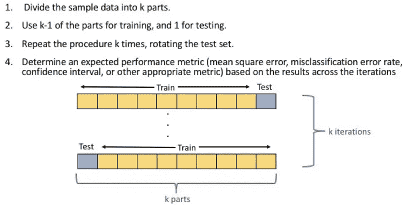***

***XGBoost applies K-Fold Cross Validation method***

***接下来，在训练集上训练最佳模型。然后将训练好的模型用于预测测试集 QA/Lab 结果。最后，将模型预测与真实的已知结果进行比较，以评估模型性能。在竞赛中，比较模型性能与每个 QA/Lab 结果的内在差异通常很有意思，以便评估误差范围。***

***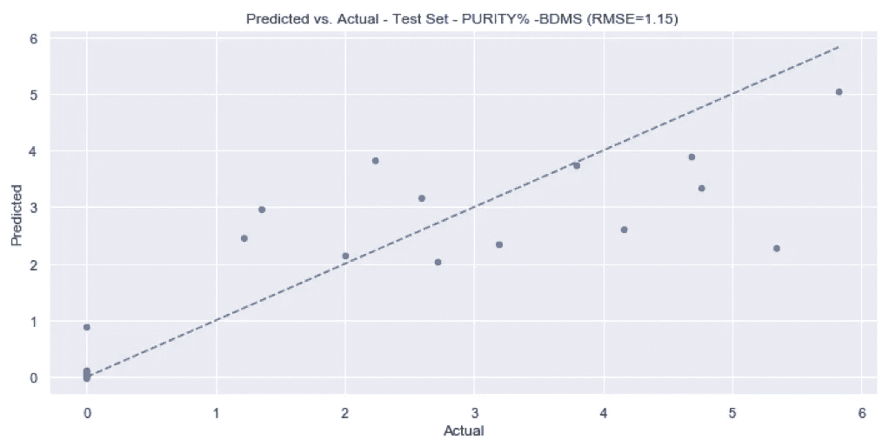***

***XGBoost result example — Actual vs. Predicted, for a specific QA/Lab types***

***XGBoost 模型的另一个重要输出是**特性重要性**。可以检查模型内原始数据集中每个特征列的重要性。通过计算每个特征在模型中的所有推进回合(树)中被分割的次数来检索该结果。***

***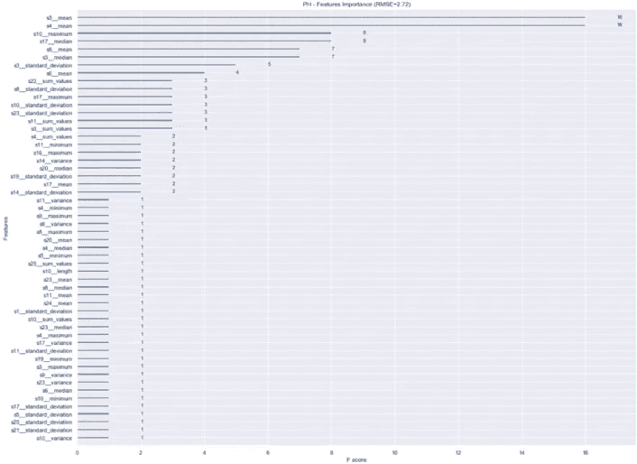***

***XGBoost result example — Features Importance, for a specific QA/Lab types***

# ***LSTM-RNN(多对多)***

***递归神经网络( **RNN** )已经被证明可以有效地解决序列问题。特别地，长短期记忆网络(**【LSTM】**)是 RNN 的变体，目前被用于各种领域来解决序列问题。***

*****多对一**序列问题获取一系列数据作为输入，并且必须预测单个输出。**多对多**序列问题有一个数据序列作为输入，必须预测一个维度的输出。***

***多对一 LSTM 网络常用于基于传感器的**活动识别**(如 [Chung，Seungeun 等人，2019](https://www.mdpi.com/1424-8220/19/7/1716) )、情感分析**(如 [Wen，Shiping 等人，2019](https://ieeexplore.ieee.org/abstract/document/8692753) )等任务。在这里，我们愿意训练一个 LSTM 网络来预测 QA/Lab 结果评分(输出)，基于多变量传感器数据(输入)。*****

*****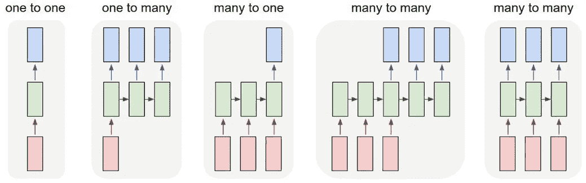*****

*****Common sequence problem types*****

*****作为**虚拟传感器**公式的一部分，每个传感器(Sx)按状态(Sx_State)分开，并根据最长的系列用零填充。一个附加的表格保存了每个批次的所有质量保证/实验室结果。接下来，从这两个表的交集中提取出 *X* 和 *y* 数组(数据和标签)。*****

*****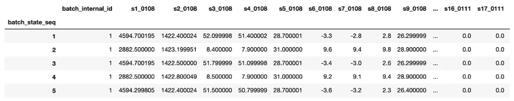*****

*****Virtual Sensors formulation*****

*****执行交叉验证，例如 80/20，用于将数据和标签分成训练集和测试集。然后，每个集合都经过标准化(也称为标准化)。最后，每一组都被整形以符合 LSTM 格式。数据集被整形为(*样本、时间步长、特征)*维度，而标签集被整形为*(样本、特征)*维度。*****

*****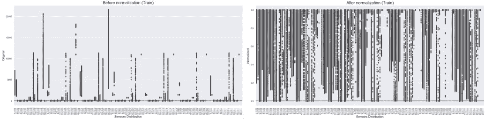*****

*****Virtual Sensors before (left) and after (right) normalization*****

*****在这个阶段，数据和相应的标签已经准备好被注入到 LSTM 中，所以是时候编译神经网络了。确切的架构需要一定程度的探索，尽管在实践中，即使是如下相对简单的网络也可能产生下降结果。据此，最长系列有 17626 个样本，有 23 种 QA/Lab 结果。*****

*****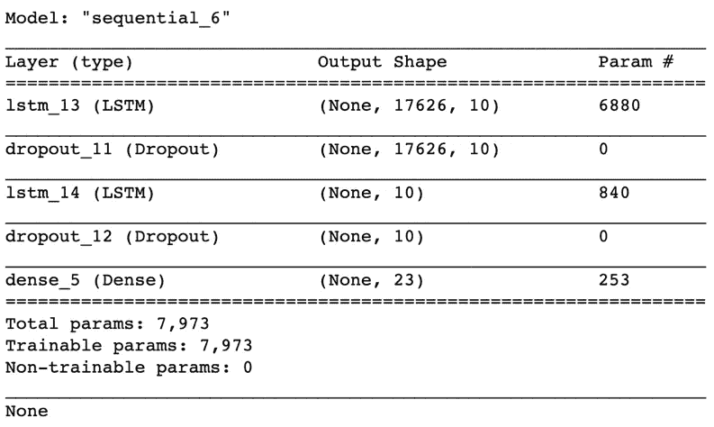*****

*****RNN LSTM architecture example for QA/Lab results prediction*****

*****LSTM 模型以小批量方式训练 1000 个时期，验证分割为 5%:*****

```
*****history = model.fit(X,
                    y, 
                    epochs=1000, 
                    batch_size=512,
                    validation_split=0.05,
                    verbose=2).history*****
```

*****最后，通过比较实际标签和预测标签，可以在测试集上评估模型性能。*****

*****[](/mlearning-ai/mlearning-ai-submission-suggestions-b51e2b130bfb) [## Mlearning.ai 提交建议

### 如何成为 Mlearning.ai 上的作家

medium.com](/mlearning-ai/mlearning-ai-submission-suggestions-b51e2b130bfb)*****