# 亚马逊产品评级恶化的情感分析

> 原文：<https://medium.com/mlearning-ai/sentiment-analysis-of-amazons-deteriorated-product-ratings-f17bf38f85f?source=collection_archive---------3----------------------->

## 自然语言处理如何帮助企业增加品牌价值

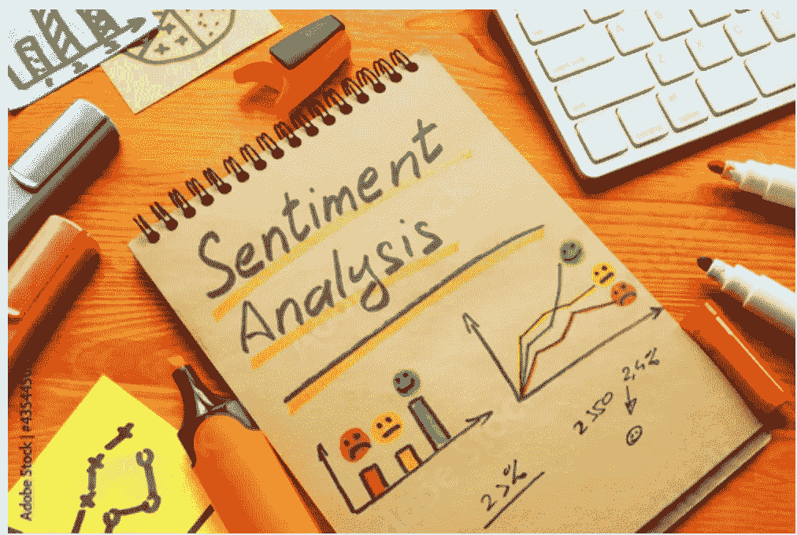

[Github](https://github.com/SwetaPrabh/Sentiment_Analysis_of_Amazon-s_Deteriorated_Product_Ratings)

# 介绍

情感分析，也称为意见挖掘，是自然语言处理的一个分支，帮助企业理解消费者的品牌和产品情感。它帮助企业通过分析评论、博客、社交媒体、新闻等来衡量客户的意见。进行市场调查，预测市场趋势，以满足相应的产品需求。从通过不同来源收集的分解文本中识别带有情感的短语，并分配情感分数。在更复杂的模型中，多个层分数被组合起来进行分析。为了这个项目，我对亚马逊的美容产品进行了情感分析，该产品从 2014 年到 2021 年降低了评级。包含产品特征(包括来自 2014 年的评级和评论)的起始数据集用于与相同产品的新搜集的评论和评级进行比较。该项目分为四个部分。**数据抓取、数据清洗、探索性数据分析和情感分析。**这是无监督的机器学习，因为没有目标变量。

# 数据抓取

第一步是数据收集。这个项目的大部分时间都花在清理和收集数据上。亚马逊美容产品的原始文本数据包含 9 个功能和 12101 个独特的 asins，从 [UCSD 知识库](http://jmcauley.ucsd.edu/data/amazon/index.html)下载，该知识库与公众共享用于研究目的。图 1 显示了从存储库中下载的 9 个特性。独特的 asin 数字被列入清单，供未来使用硒和美丽的汤报废。图 2 显示了从 2021 年的 4242 个独特的 asins 中提取的 7 个特征，用于 2021 年仍然可用的产品。

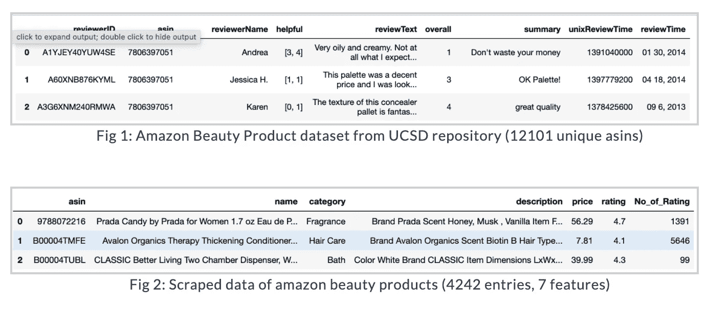

# 数据清理

这两个数据集是根据唯一的 asin 号合并的。移除不需要的柱，保留 12 个特征用于分析。数据集存储在 pandas 数据框架中，使用正则表达式和 nltk 库进行数据清洗。nltk 是 NLP 中经常使用的文本预处理库。2014 年和 2021 年的审查通过将所有文本转换为小写、格式化空白空间、扩展缩写(例如 mgmt)为进一步分析做准备。to management)、过滤标点和停用词(像 have、has)，最后是词条化(提取词根的过程，如 better: lemma good)。图 3 列出了将用于进一步分析的最终数据框中的所有 12 个要素。

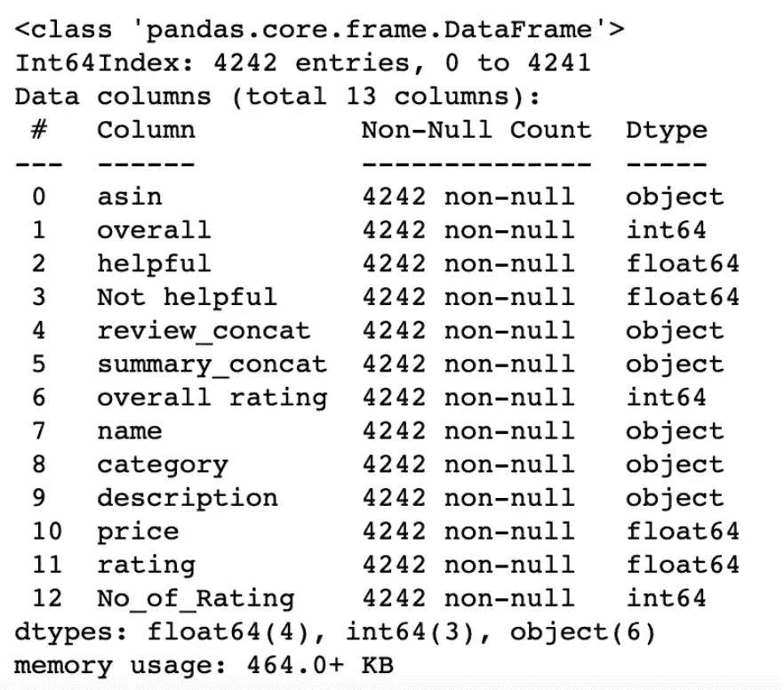

Fig 3: Features in the final dataframe

# 探索性数据分析

旧的和拼凑的数据被可视化，以显示每个类别中购买习惯的任何趋势。图 1 显示了亚马逊美容产品给定数据集中数量最多的 10 个类别。可以看出，大多数产品都列在护肤、护发和化妆类别中。这三组中的产品特性被分离出来，用于进一步的探索性分析。图 2 显示了 3 大组产品的价格分布。可见，发制品的价格区间最高。

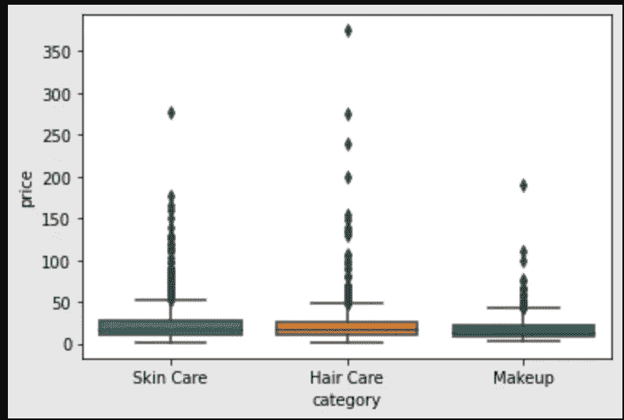

Plot 1: Top 10 Product categories. Plot 2: Distribution of Price within each group.

## 护肤品:

护肤产品构成了数据集中亚马逊美容和健康产品的大部分。对于这个项目，产品评级的数量被认为是对销售数量的估计。图 3.i)显示了每个价格范围内产品数量的分布。图 3.iii)是图表 3.ii)的微观视图，显示了护肤产品中每个价格范围的评级数量(这又是销售数量的估计)。可以看到，最多的产品列在 10-20 美元之间，这大约是吸引最多顾客的范围。

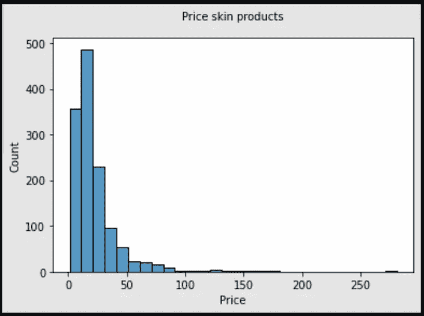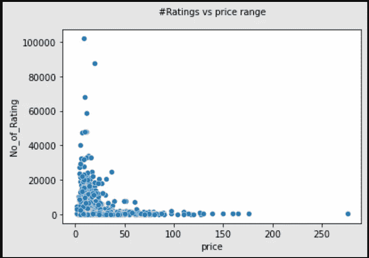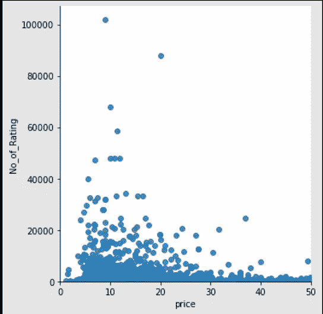

Fig 3.i) distribution of number of products within each price range. Fig 3\. ii)number of ratings within each price range Fig 3.iii) microscopic view of graph 3.ii)

## 护发产品:

护发产品是该数据集中仅次于护肤产品的第二大产品。图 4。I)、ii)和 iii)对护发产品遵循与图 3 对护肤产品相同的模式。据观察，消费者通常在网上花更多的钱购买美发产品，而不是护肤或化妆产品。相反，在 30-50 美元范围内列出的产品数量相对较少，根据给定的购买模式，可以列出该范围内的更多产品。

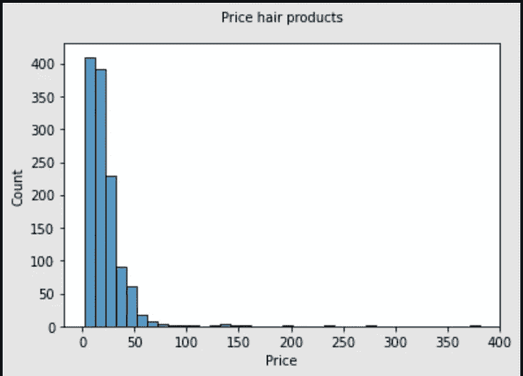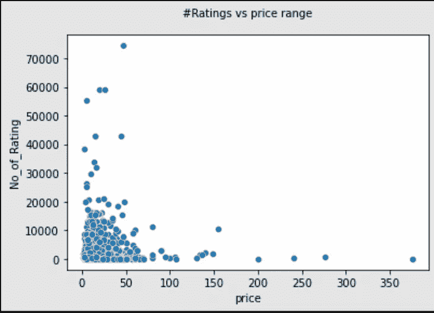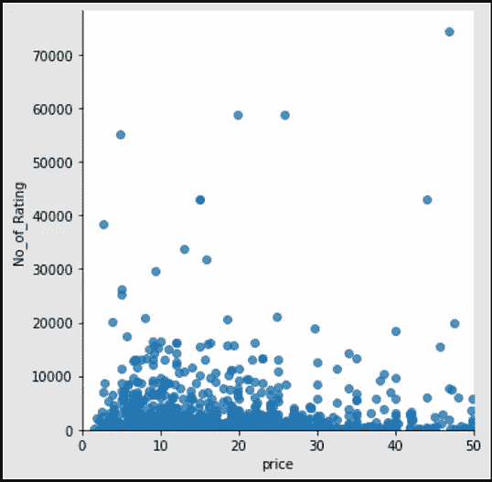

Fig 4.i) distribution of number of products within each price range. Fig 4\. ii)number of ratings within each price range Fig 4.iii) microscopic view of graph 4.ii)

## 化妆产品:

从数据集来看，化妆品是美容和健康类别中销量第三大的产品。有一种趋势是人们在化妆产品上花费最少。大多数产品都列在 0-10 美元的范围内，最高评论(销售额)也在同一范围内。

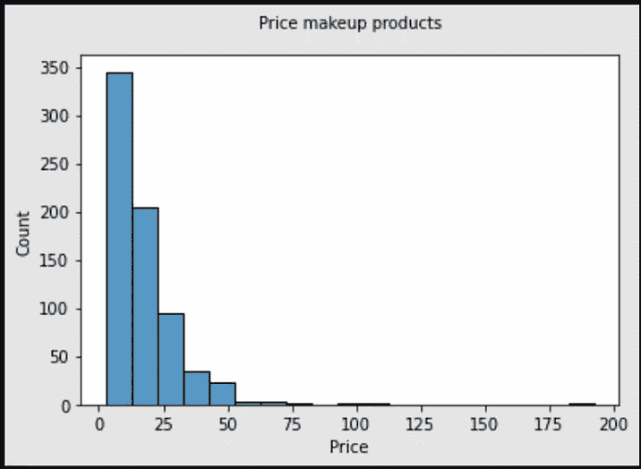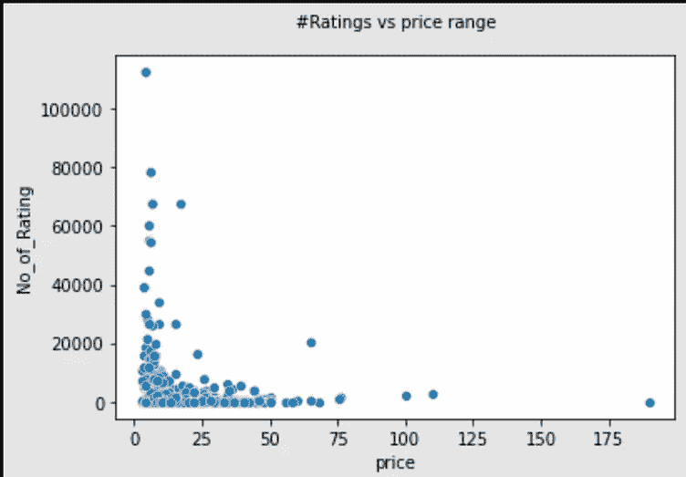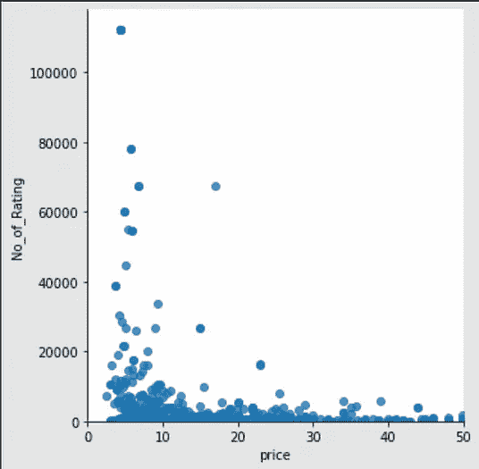

Fig 5.i) distribution of number of products within each price range. Fig 5\. ii)number of ratings within each price range Fig 5.iii) microscopic view of graph 5.ii)

## 2014 年至 2021 年排名下降的 10 大产品

计算了 2014 年至 2021 年三组中每种产品的评级差异，并分析了降幅最大的 10 种产品。图 7。、8 和 9 给出了每个类别中降幅最大的前 10 种产品。将对这些产品进行情感分析，以了解这些产品类别的趋势和观点变化。

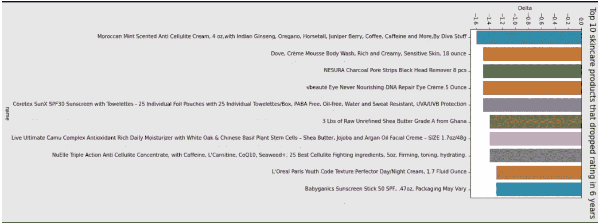

Fig 7\. Top 10 skincare products that dropped ratings in last 6 years

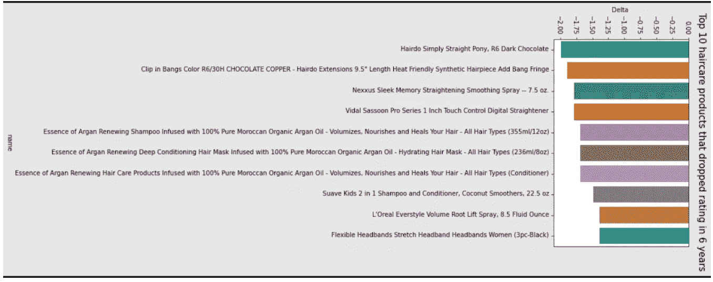

Fig 8\. Top 10 haircare products that dropped ratings in last 6 years

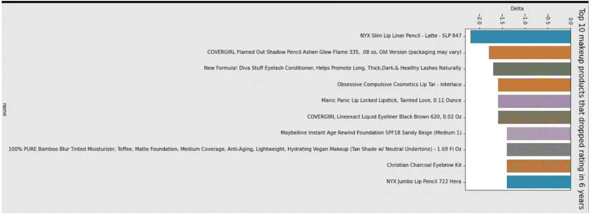

Fig 9\. Top 10 makeup products that dropped ratings in last 6 years

# 情感分析

由于情绪分析是对恶化的产品评级进行的，因此极性被假定为负面。词云和 N-gram 用于自然语言处理。对于这个项目，每个类别中所有 10 个产品的评论被连接起来，以观察是否有任何突出的东西。理想情况下，应该对每个品牌的词云进行比较，以了解对该品牌的情感，但由于每个产品的评论数量在 5 到 8 条之间，因此所有评论都被连接起来，以便更好地了解。

## 调查结果和建议

## 护肤品:

护肤品词云(单字和 2N 个字母)

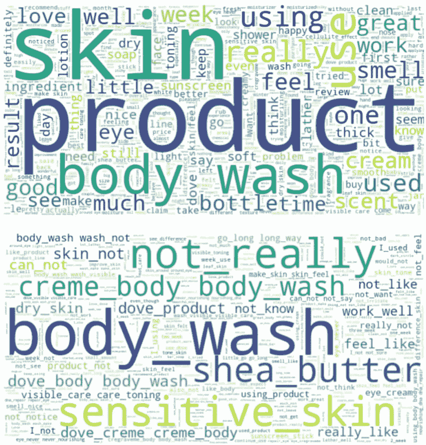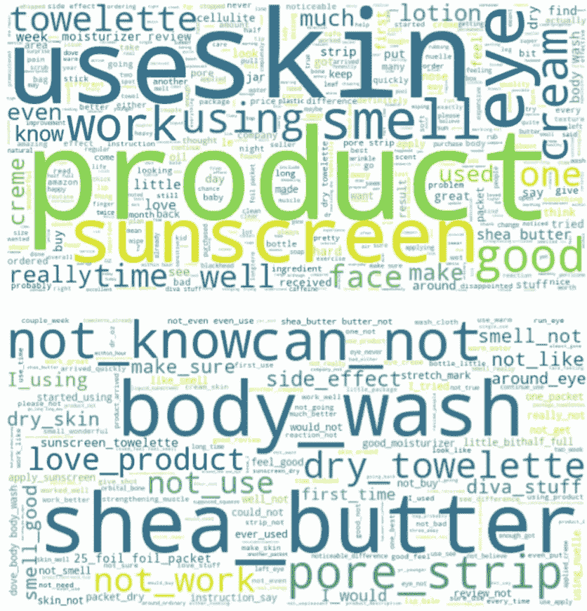

2014 word cloud(left) and 2021 word cloud(right)

## 建议:

对于亚马逊美容产品的护肤类别，

*   与 2014 年相比，2021 年有更多的评论使用了像**不能、真的不能、不能工作、不知道**这样的词，暗示产品质量下降
*   **副作用**一词在 2021 年被频繁使用，从卖家的角度来看，产品的内容可以针对任何**副作用导致因素**进行重新评估
*   像**柔软、光滑**这样的词在 2014 年出现得更频繁，但是**坚硬、干燥**在 2021 年出现得更多，成分**的变化**可以被追踪
*   **不太好**在 2014 年也经常使用，表示 2014 年有投诉迹象，当时可以检查
*   10 种产品的评论词云可以更好地描述 6 年来客户情绪的变化

## 护发产品:

护肤品词云(单字和 2N 个字母)

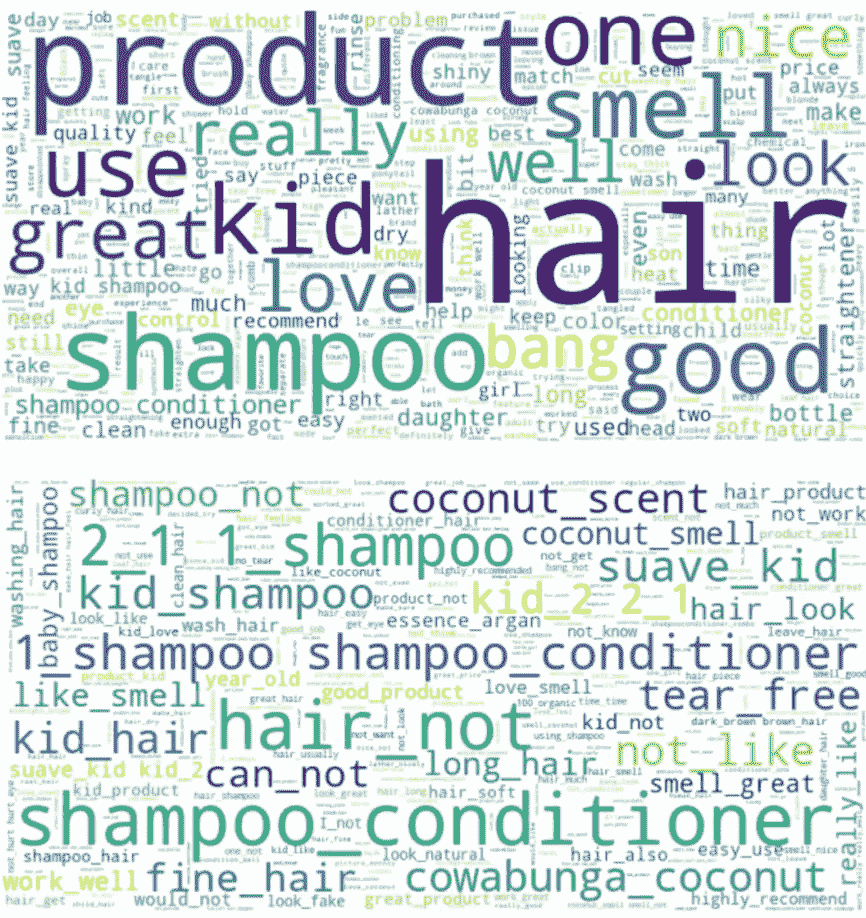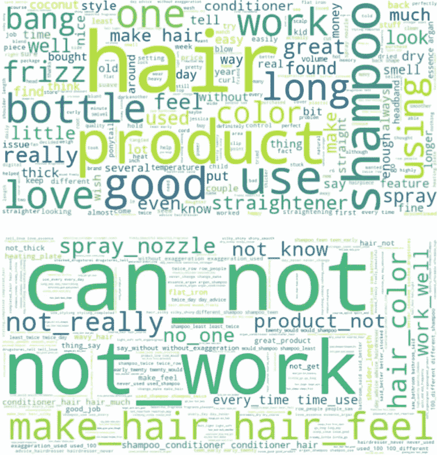

2014 word cloud(left) and 2021 word cloud(right)

## 建议:

对于护发类的亚马逊变质产品，

*   在 2021 年的评论中，像**不能、不起作用、真的不**这样的短语增加了
*   **洗发水护发素 2 合 1** 频繁出现，这可能是质量下降的原因
*   与**气味**相关的词如椰子气味出现在 2014 年评论中，而**老气味**出现在 2021 年。这可以进一步分析
*   喷嘴在 2021 年大量出现，2014 年不会出现，这可能是一种趋势
*   **无泪小山羊皮**在 2014 年出现的频率更高，这意味着到 2021 年成分可能会发生变化

## 化妆产品:

护肤品词云(单字和 2N 个字母)

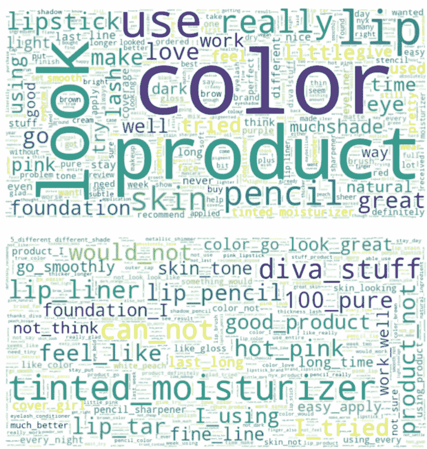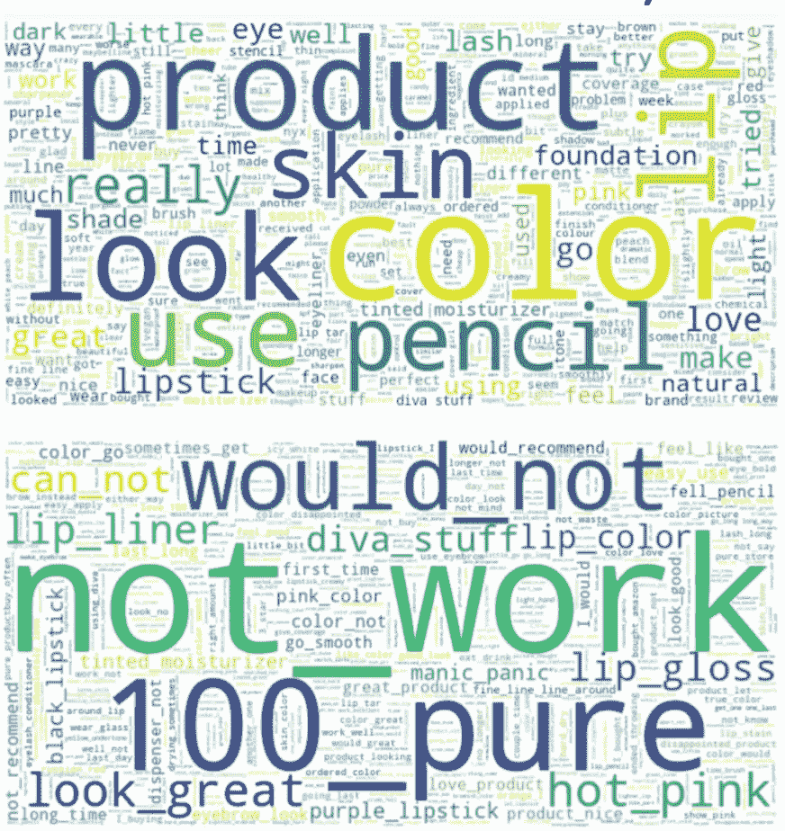

2014 word cloud(left) and 2021 word cloud(right)

## 建议:

*   这是 2021 年评论中出现最多的短语，暗示着受欢迎程度从 2014 年开始下降
*   围绕**颜色**这个词有很多讨论，比如 2021 年的**热粉色**、**紫色**口红、**黑色**口红，相比之下，2014 年的**粉色**暗示着**可能会改变口味**
*   **100%纯**在 2021 年被大量使用，这可能与产品中的**成分**有关

# 结论和未来工作

情感分析可以用于电子商务行业，了解趋势，提高品牌价值。在这个项目中，word cloud 用于分析变化趋势，并通过评论找出客户关注的问题。这项工作可以进一步扩展，为每种产品搜集更多的评论，研究不断变化的情绪和影响每种产品受欢迎程度下降的因素。