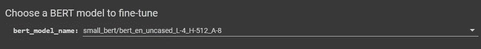
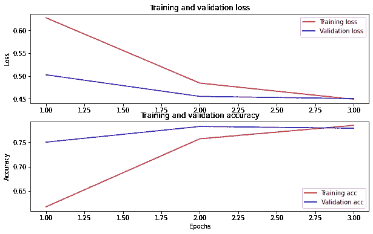

# 用谷歌的 BERT 对电影评论进行情感分析

> 原文：<https://medium.com/mlearning-ai/sentiment-analysis-of-movie-reviews-with-googles-bert-c2b97f4217f?source=collection_archive---------1----------------------->

## 通过利用变压器编码器架构(BERT)而不是传统的 LSTM 来执行 NLP 任务

Photo by [Aditya Vyas](https://unsplash.com/@aditya1702?utm_source=medium&utm_medium=referral) on [Unsplash](https://unsplash.com?utm_source=medium&utm_medium=referral)

谷歌目前正在使用 BERT 来优化对用户搜索查询的解释。BERT 擅长的几个功能使这成为可能，包括:

基于序列对序列的语言生成任务，例如:

*   问题回答
*   抽象概括
*   句子预测
*   会话响应生成

BERT 基于变压器编码器架构。重要的问题是，为什么需要变压器架构，它们如何优于传统的 LSTM RNN 的。

## *LSTM·RNN 的缺点*

*   LSTM 的计算量很大，因此速度很慢。
*   它们不是真正的双向的，即两个方向的学习是独立发生的。因此，真实的上下文稍微有些丢失。
*   由于数据是按顺序读取的，它们在倾向于并行处理的 GPU 上表现不佳。

## 救世主来了——变形金刚

《变形金刚》在以下几个方面比 LSTM 做得更好

*   它们能够同时处理单词，从而减少计算量，促进并行处理，因此对 GPU 友好。
*   他们倾向于更好地学习课文的上下文。

> 转换器包含两个模块——编码器和解码器模块

现在你可以在这里详细了解编码器和解码器的功能

下面我试着给你直觉。

E ncoder 同时接收输入，并将它们处理成单词嵌入。嵌入是具有单词真正含义的向量。

D ecoder 从编码器和之前学习的句子中获取输入，然后生成新单词。

当我们堆叠编码器时，我们得到 BERT——变压器的双向编码器表示。

在本文中，我们尝试使用 BERT 来预测移动评论情绪。

# 目录

1.  [关于数据集](#57e1)
2.  [数据导入](#ed75)
3.  [创建训练和验证集](#e1e5)
4.  [选择 Bert 和预处理模块](#e816)
5.  [将数据传递给预处理模块& Bert](#c5f4)
6.  [培训和评估](#f888)
7.  [保存并重新加载模型](#276b)
8.  [预测](#01b8)
9.  [总结](#d6f3)
10.  [参考文献](#c332)

# №1:关于数据集

这个笔记本训练了一个情感分析模型，根据评论的文本将电影评论分为正面或负面。

该数据集包含从 IMDB 电影数据库收集的超过 50，000 条电影评论。数据集可以从[这里](https://ai.stanford.edu/~amaas/data/sentiment/aclImdb_v1.tar.gz)下载

# №2:数据导入

为了处理文本信息，需要安装以下库

*   张量流
*   模型—用于访问 Bert

现在我们使用 Keras 实用程序下载数据集。然后，我们访问训练数据集并删除不需要的文件。

# №3:创建训练和验证集

现在，我们定义训练集、验证集和测试集。现在，在使用 Keras 预处理*_ text _ data _ from _ directory _*方法来定义训练集、验证集和测试集之前，有一些注意事项。我们定义训练集和验证集的方式非常标准，没有什么新奇的。

*警告* —评论应该在目标文件夹下。也就是说，如果有正面评价，它必须在 *pos* 文件夹下，同样负面评价必须在 *neg* 文件夹下

访问一些样本及其目标值

# №4:选择 Bert 和预处理模块

在 Bert 可用的不同变体中，您可以从下拉列表中选择所需的配置。

由于我们可用的计算有限，建议使用处理最少参数的模型，因此我使用以-2 结尾的模型。

还需要基于所选择的 Bert 模型来选择预处理模型。下面的实用程序有助于自动选择正确的预处理模型。预处理模型的重要性将在后续单元中解释。

注意，在上面的代码块中，文本看起来很小很乱，但是如果你在 google colab 中打开它，看起来会更好一些，就像这样

# №5:将数据传递给预处理模块& Bert

下面我们将一个样本文本传递给预处理模型。该模型接受 128 个长度的输入，因此预处理最多完成 128 个字。预处理模型将文本转换成 3 个键

*   input_mask —这里每个单词显示为 1，但您会注意到还有 2 个额外的 1。例如，hello world 中有 4 个 1，而不是每个单词一个 1。Bert 的工作方式是在开头放一个特殊的记号，在结尾放一个分隔符记号。因此，我们看到每个输入句子有 2 个额外的标记值。
*   输入类型标识—通常为零
*   input_work_ids —这表示每个单词的标记值。不是第一个单词，即特殊标记将始终是 101，分隔符标记最终将始终是 102。

使用伯特模型

Bert 输出被传递到神经网络，并计算输出概率。BERT 执行单词嵌入的任务，但在此之后，其余的活动由神经网络负责。

我们使用二进制交叉熵来计算 2 类分类模型的损失

# №6:培训和评估

我们为 3 个时期训练模型，并定义一些超参数。让我们不要去讨论这些参数的细节，保持本教程的简单

训练和验证损失似乎收敛得很好，因此我们的模型似乎没有过度拟合，这是一个好消息。

# №7:保存并重新加载模型

我们现在学习保存和重用保存的模型，这有助于我们节省所有的培训时间。为了保存模型，我们使用了*。保存*方法和重新加载模型我们用*。saved_model.load* 方法

您可以在下面看到，保存和重新加载的模型具有相同的预测，这证实了保存的模型正在按预期工作。

# №8:预测

我们在下面的样本上检查我们的预测

# №9:摘要

我们通过以下步骤使用 Bert 模型执行情感分类-

*   将数据集导入我们的环境。
*   我们使用 Keras 实用函数`tf.keras.preprocessing.text_dataset_from_directory`来创建训练和验证集
*   现在我们选择 BERT 模型和相应的预处理模型。
*   我们解析了预处理模型的输入数据，并理解了生成的各种密钥。
*   然后，我们将 bert 的输出传递给神经网络进行预测。
*   我们现在训练模型，并将超参数定义为默认值。
*   我们还学习了保存和重新加载同一个模型
*   最后，我们使用训练好的模型进行预测。

# 10 号:参考文献

*   [https://www . tensor flow . org/text/tutorials/classify _ text _ with _ Bert](https://www.tensorflow.org/text/tutorials/classify_text_with_bert)
*   笔记本链接—[https://jovian.ai/hargurjeet/movie-reviews-using-bert](https://jovian.ai/hargurjeet/movie-reviews-using-bert)

我希望你在阅读博客的时候过得愉快。如果你喜欢今天要学的东西，请随意给出👏。

请随时通过 LinkedIn 联系我

 [## Mlearning.ai 提交建议

### 如何成为 Mlearning.ai 上的作家

medium.com](/mlearning-ai/mlearning-ai-submission-suggestions-b51e2b130bfb)