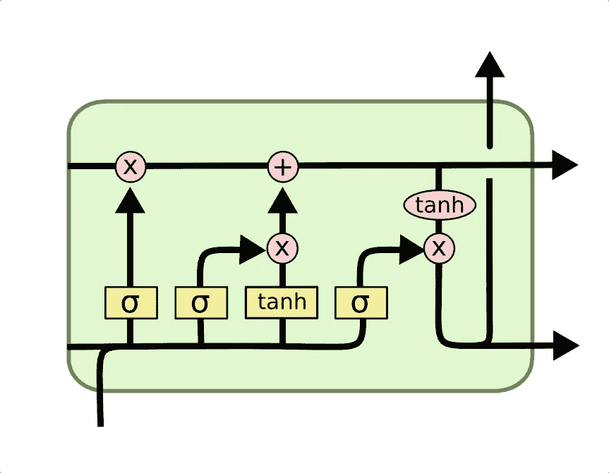
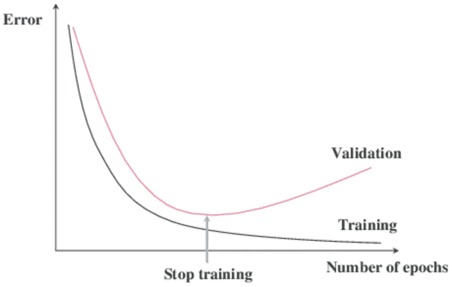
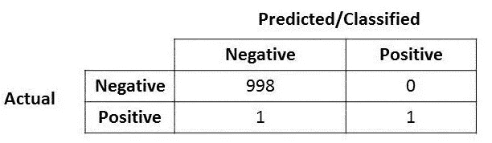
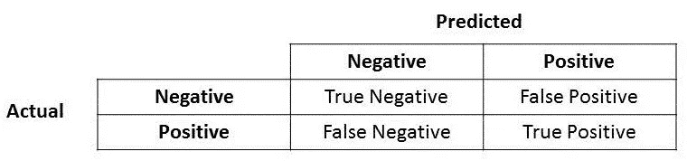
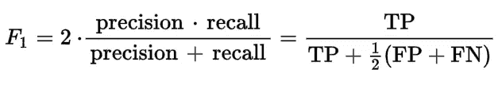
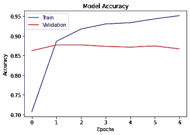
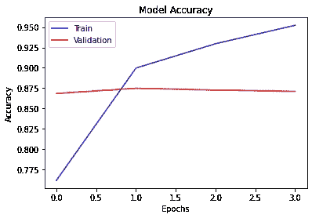
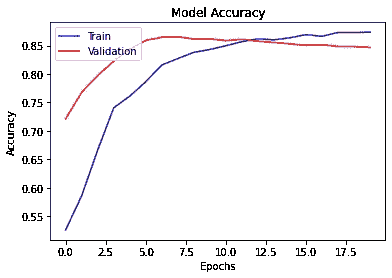
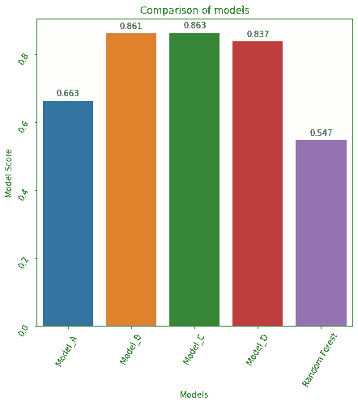

# 使用 LSTM 的情感分析

> 原文：<https://medium.com/mlearning-ai/sentiment-analysis-using-lstm-21767a130857?source=collection_archive---------0----------------------->

*   技术栈:Python，Scikit-Learn，Tensorflow，Keras
*   [笔记本网址](https://github.com/PSSABISHEK/sentiment_analysis_LSTM/blob/master/yeet_boi.ipynb)
*   [数据集 URL](https://www.kaggle.com/c/word2vec-nlp-tutorial/data)
*   [项目建议书](https://github.com/PSSABISHEK/sentiment_analysis_LSTM/raw/master/proposal.docx)
*   [演示网址](https://youtu.be/zbX7iU6bWQ0)
*   [特征草图](https://github.com/PSSABISHEK/sentiment_analysis_LSTM/tree/master/feature_screenshots)

在这个数据丰富的时代，企业开始利用这一机会实现指数级增长。今天的营销人员理所当然地痴迷于指标。但不要忘记，客户不仅仅是一个数据点。很容易忽略客户的感受和情绪，这可能很难量化。然而，在技术的帮助下，我们公司可以做到这一点。情绪本质上与感觉有关:态度、情绪和观点。情感分析是指应用自然语言处理和文本分析技术从一段文本中识别和提取主观信息的实践。借助我开发的这个情感分析工具，企业可以更好地了解他们的客户和目标受众，并在开发将在市场上大规模销售的产品时做出明智的决定。在了解到任何可持续发展企业的主要支柱是营销团队后，我觉得这个工具为他们增加了价值。

# **目标**

目标是在数据集上训练的长短期记忆(LSTM)模型的帮助下，预测用户对给定评论的情感。评论的情绪是二元的，这意味着 IMDB 评级< 5 results in a sentiment score of 0, and rating > =7 的情绪得分为 1。

# 数据区

*   id —每个审阅的唯一 id
*   情绪——评论的情绪；1 代表正面评价，0 代表负面评价
*   审阅—审阅的文本

*现在让我们了解一下构建这个应用程序所使用的技术。*

# 长短期记忆(LSTM):



LSTM Network

LSTM 的核心思想是细胞状态，它是各种各样的门。细胞状态就像一条传输高速公路，沿着序列链一路传输相关信息。你可以把它想象成网络的“记忆”。理论上，细胞状态可以在整个序列处理过程中携带相关信息。因此，即使是来自较早时间步骤的信息也可以传递到较晚的时间步骤，从而减少短期记忆的影响。当细胞状态继续它的旅程时，信息通过门被添加到细胞状态或从细胞状态移除。这些门是不同的神经网络，决定细胞状态允许哪些信息。盖茨夫妇可以在训练中了解哪些信息是应该保留或忘记的。

从技术上讲，LSTM 输入只能理解实数。将符号转换为数字的一种方法是根据出现的频率为每个符号分配一个唯一的整数。例如，在上面的文本中有 112 个独特的符号。清单 2 中的函数用以下条目构建了一个字典["，":0 ] [ "the" : 1 ]，…，[ "council" : 37 ]，…，[ "spoke" : 111 ]。还生成反向字典，因为它将用于解码 LSTM 的输出。

LSTM 主要用于 NLP 和时间序列预测。LSTM 真的很强大，用 RNN 取得的成果也可以用 LSTM 取得。

# 符号化:

> 标记化实质上是将一个短语、句子、段落或整个文本文档分割成更小的单元，如单个单词或术语。这些更小的单元中的每一个都被称为令牌。


Tokenization

在 python 中有多种方法来标记句子，下面是几个例子

*   拆分()
*   正则表达式
*   NLTK
*   宽大的
*   克拉斯

# 提前停止:

训练神经网络的一个问题是选择要使用的训练时期的数量。

太多的时期会导致训练数据集的过度拟合，而太少的时期会导致模型的欠拟合。早期停止是一种方法，允许您指定任意大量的训练时期，并在模型性能在等待验证数据集上停止改善时停止训练。

在多次试验后，早期停止的最佳准确度被设置为 95%。因此，每次在模型训练期间，当训练精度达到设定值时，它将保存权重并停止训练。

Keras 支持各种指标: *val_loss、val_acc、train_loss、train_acc* 以监控提前停车



Early stopping with Loss as metric

# 保存模型检查点:

经常会出现模型训练需要几个小时甚至几天的情况，在这种情况下，我们更愿意保存模型检查点。训练完神经网络后，您可能希望保存它以供将来使用并部署到生产中。那么，什么是保存的神经网络模型呢？它主要包含网络设计或图形以及我们训练过的网络参数值。Tensorflow 提供了两种保存和恢复进度的方法。

检查点捕获所有参数的精确值(tf。可变对象)由模型使用。**检查点不包含由模型**定义的计算的任何描述，因此通常只有当使用保存的参数值的源代码可用时才有用。

另一方面，SavedModel 格式**除了参数值(检查点)之外，还包括由模型**定义的计算的序列化描述。这种格式的模型是*独立于创建模型的源代码的*。因此，它们适合通过 TensorFlow Serving、TensorFlow Lite、TensorFlow.js 或其他编程语言(C、C++、Java、Go、Rust、C#等)的程序进行部署。).

# 准确性是验证模型的更好的指标吗？

答案是否定的。就拿这个例子来说吧。



很容易，你会注意到这个模型的准确率非常非常高，达到 99.9%！！哇！

但是…(你知道这是迟早的事，对吗？)如果我提到这里的阳性实际上是一个生病的人，他携带着一种可以快速传播的病毒，会怎么样？还是这里的阳性代表诈骗案？或者这里的阳性代表恐怖分子，模型说它不是恐怖分子？你明白了。在我提出的这三种情况下，错误分类的实际阳性(或假阴性)的成本非常高。

好了，现在您意识到在选择最佳模型时，准确性并不是最重要的模型指标……接下来呢？



F1 分数可以更好地显示模型的性能。

我用公式计算出来的



F1 Score

让我们从如何构建这个分类器开始。

> **1。导入必要的库**

```
import numpy as np
import pandas as pd
import re
import string
import osimport nltk
nltk.download('stopwords')
from nltk.corpus import stopwords
from wordcloud import WordCloud, STOPWORDS
stopwords = set(STOPWORDS)import matplotlib.pyplot as plt
import seaborn as sns
color = sns.color_palette()from sklearn.metrics import confusion_matriximport warnings
warnings.filterwarnings('ignore')
```

> **2。使用 pandas** 读取训练和测试文件

```
df_train = pd.read_csv("./labeledTrainData.tsv", header=0, delimiter="\t", quoting=3)
df_test=pd.read_csv("./testData.tsv", header=0, delimiter="\t", quoting=3)
```

> **3。数据预处理:**

对于任何 NLP 问题，在将原始数据输入模型之前，必须对其进行清理，并以所需的格式进行处理。在这里，我将数据转换成小写字母，并使用字符串库删除标点符号，这比我在参考资料中看到的更快。此外，使用 NLTK 库删除了停用词(如“the”、“a”、“an”、“in”)，因为这些词在索引时无关紧要。

```
def data_cleaning(raw_data):
    raw_data = raw_data.translate(str.maketrans('', '', string.punctuation + string.digits))
    words = raw_data.lower().split()
    stops = set(stopwords.words("english"))
    useful_words = [w for w in words if not w in stops]
    return( " ".join(useful_words))df_train['review']=df_train['review'].apply(data_cleaning)
df_test["review"]=df_test["review"].apply(data_cleaning)
```

> **4。现在，让我们使用 wordcloud 库来可视化数据集中的主要单词。**

```
def generate_wordcloud(data, title = None):
    wordcloud = WordCloud(
        stopwords=stopwords,
        max_words=100,
        max_font_size=40, 
        scale=4).generate(str(data))fig = plt.figure(1, figsize=(15, 15))
    plt.axis('off')
    plt.imshow(wordcloud)
    plt.show()generate_wordcloud(df_train["review"])
```


Wordcloud

> **5。从 Tensorflow 导入构建 LSTM 模型所需的 API**

```
import tensorflow as tf
# from tensorflow import kerasfrom tensorflow.keras.preprocessing.text import Tokenizer
from tensorflow.keras.preprocessing.sequence import pad_sequences
from tensorflow.keras.layers import Dense , Input , LSTM , Embedding, Dropout , Activation, Flatten
from tensorflow.keras.layers import Bidirectional, GlobalMaxPool1D, SpatialDropout1D
from tensorflow.keras.models import Model, Sequential
from tensorflow.keras import initializers, regularizers, constraints, optimizers, layers
```

> **6。分词**

```
y = df_train["sentiment"].values
train_reviews = df_train["review"]
test_reviews = df_test["review"]max_features = 6000
tokenizer = Tokenizer(num_words=max_features)
tokenizer.fit_on_texts(list(train_reviews))
list_tokenized_train = tokenizer.texts_to_sequences(train_reviews)
list_tokenized_test = tokenizer.texts_to_sequences(test_reviews)
```

> **7。现在让我们定义回调，这是执行早期停止和保存模型检查点所必需的。**

```
class myCallback(tf.keras.callbacks.Callback):
    def on_epoch_end(self, epochs, logs={}):
        if logs.get('accuracy') > 0.95:
            print('\n Stopped Training!\n')
            self.model.stop_training = Truedef train_model(model, model_name, n_epochs, batch_size, X_data, y_data, validation_split):    
    checkpoint_path = model_name+"_cp-{epoch:04d}.ckpt"
    checkpoint_dir = os.path.dirname(checkpoint_path)
    cp_callback = tf.keras.callbacks.ModelCheckpoint(filepath=checkpoint_path,  save_weights_only=True, verbose=1)
    callbacks = myCallback()
    history = model.fit(
        X_data,
        y_data,
        steps_per_epoch=batch_size,
        epochs=n_epochs,
        validation_split=validation_split,
        verbose=1,
        callbacks=[cp_callback]
    )
    return history
```

> 8。定义生成图形功能

为了保持代码的整洁，让我们创建一个函数来绘制图形，因为我们需要在每次实验后查看模型性能的变化。

```
def generate_graph(history):
    plt.plot(history.history['accuracy'], 'b')
    plt.plot(history.history['val_accuracy'], 'r')
    plt.title('Model Accuracy'),
    plt.xlabel('Epochs')
    plt.ylabel('Accuracy')
    plt.legend(['Train', 'Validation'], loc='upper left')
    plt.show()
```

> **9。定义预测函数**

此函数处理 F1 分数的计算。

```
def predict_func(model):
  prediction = model.predict(X_test)
  y_pred = (prediction > 0.5) df_test["sentiment"] = df_test["id"].map(lambda x: 1 if int(x.strip('"').split("_")[1]) >= 5 else 0)
  y_test = df_test["sentiment"] cf_matrix = confusion_matrix(y_pred, y_test)
  f1_score_calc = cf_matrix[0][0] / (cf_matrix[0][0] + 0.5 * (cf_matrix[0][1] + cf_matrix[1][0]))
  print('F1-score: %.3f' % f1_score_calc)
  print("Confusion Matrix : ", cf_matrix) return f1_score_calc
```

> **10。实验**

10.1 模型 A:这将是基础模型，它将被用来作为将来构建模型的基准。

```
class Model_A():
    def __new__(self):
        inp = Input(shape=(max_length, ))
        embed_size = 128
        x = Embedding(max_features, embed_size)(inp)
        x = LSTM(60, return_sequences=True, name='lstm_layer')(x)
        x = GlobalMaxPool1D()(x)
        x = Dropout(0.1)(x)
        x = Dense(50, activation="relu")(x)
        x = Dropout(0.1)(x)
        x = Dense(1, activation="sigmoid")(x)
        model = Model(inputs=inp, outputs=x)
        model.compile(loss='binary_crossentropy', optimizer='SGD', metrics=['accuracy'])

        return modelmodel_a = Model_A()
history_a = train_model(model_a, "model_a", 10, 64, X_train, y, 0.2)
model_a_score = predict_func(model_a)--Output--
F1-score: 0.663 
Confusion Matrix :  [[12106 11916]  [  394   584]]
```

模型摘要

```
Model: "model"
_________________________________________________________________
Layer (type)                 Output Shape              Param #   
=================================================================
input_1 (InputLayer)         [(None, 370)]             0         
_________________________________________________________________
embedding (Embedding)        (None, 370, 128)          768000    
_________________________________________________________________
lstm_layer (LSTM)            (None, 370, 60)           45360     
_________________________________________________________________
global_max_pooling1d (Global (None, 60)                0         
_________________________________________________________________
dropout (Dropout)            (None, 60)                0         
_________________________________________________________________
dense (Dense)                (None, 50)                3050      
_________________________________________________________________
dropout_1 (Dropout)          (None, 50)                0         
_________________________________________________________________
dense_1 (Dense)              (None, 1)                 51        
=================================================================
Total params: 816,461
Trainable params: 816,461
Non-trainable params: 0
_________________________________________________________________
None
```


Model A

10.2 模型 B:该模型的变化是我使用了 adam optimizer 和 SpatialDropout1D 图层，这两个图层的功能与 Dropout 相同，但是，它会删除整个 1D 要素地图，而不是单个元素。

```
class Model_B():
    def __new__(self):
        inp = Input(shape=(max_length, ))
        x = Embedding(max_features, 128)(inp)
        x = SpatialDropout1D(0.25)(x)
        x = LSTM(100, dropout=0.5)(x)
        x = Dropout(0.5)(x)
        x = Dense(1, activation='sigmoid')(x)
        model = Model(inputs=inp, outputs=x)
        model.compile(loss='binary_crossentropy',optimizer='adam', metrics=['accuracy'])
        return model

model_b = Model_B()
history_b = train_model(model_b, "model_b", 10, 64, X_train, y, 0.2)
model_b_score = predict_func(model_b)--Output--
F1-score: 0.861 
Confusion Matrix :  [[10974  2012]  [ 1526 10488]]
```



Model B

10.3 模型 C: 我在训练时使用了较小的批量，并增加了训练时期的数量，以检查模型长期运行的稳定性，假设早期停止将防止模型过度拟合。此外，我还使用了双向 LSTM，这有助于模型更好地运行，因为 LSTM 通常是单向的。

```
class Model_C():
  def __new__(self):
    embed_size = 128
    model = Sequential()
    model.add(Embedding(max_features, embed_size))
    model.add(Bidirectional(LSTM(75, return_sequences = True)))
    model.add(GlobalMaxPool1D())
    model.add(Dense(16, activation="relu"))
    model.add(Dropout(0.03))
    model.add(Dense(8, activation="relu"))
    model.add(Dropout(0.1))
    model.add(Dense(1, activation="sigmoid"))
    model.compile(loss='binary_crossentropy', optimizer='adam', metrics=['accuracy'])

    return model

model_c = Model_C()
history_c = train_model(model_c, "model_c", 10, 128, X_train, y, 0.2)
model_c_score = predict_func(model_c)--Output--
F1-score: 0.863 
Confusion Matrix :  [[10993  1993]  [ 1507 10507]]
```



Model C

10.4 模型 D: 定义一个不太复杂的模型以达到相同的精度。这在生产中非常方便，因为我们需要用更少的计算成本获得更高的模型吞吐量。

```
class Model_D():
  def __new__(self):
    embed_size = 64
    model = Sequential()
    model.add(Embedding(max_features, embed_size))
    model.add(LSTM(50, return_sequences = True))
    model.add(GlobalMaxPool1D())
    model.add(Dense(16, activation="relu"))
    model.add(Dropout(0.8))
    model.add(Dense(1, activation="sigmoid"))
    model.compile(loss='binary_crossentropy', optimizer='adam', metrics=['accuracy'])return modelmodel_d = Model_D()
history_d = train_model(model_d, "model_d", 20, 16, X_train, y, 0.2)--Output--
F1-score: 0.837 
Confusion Matrix :  [[10683  2335]  [ 1817 10165]]
```



Model D

10.5 随机森林分类器:我想了解在对如此庞大的数据集进行情感分析时，传统的机器学习模型落后了多远。结果它比我们的基本模型差多了。

```
from sklearn.ensemble import RandomForestClassifiermodel_random_forest = RandomForestClassifier(n_estimators = 150, random_state=45, bootstrap = "False", criterion="gini", min_samples_split = 10, min_samples_leaf = 1)
model_random_forest.fit(X_train, y)
random_forest_score = predict_func(model_random_forest)--Output--
F1-score: 0.547 
Confusion Matrix :  [[6995 6074]  [5505 6426]]
```

> **11。模型比较—可视化**

```
results_fine_tuned = {"Model_A " : model_a_score,
          "Model_B" : model_b_score,
          "Model_C" : model_c_score,
          "Model_D": model_d_score,
          "Random Forest": random_forest_score}

plt.figure(figsize=(7, 7))
plt.title('Comparison of models')
plt.xlabel('Models')
plt.ylabel('Model Score')
plt.xticks(rotation=60)
plt.yticks(rotation=60)
plots = sns.barplot([i for i in results_fine_tuned], [results_fine_tuned[i] for i in results_fine_tuned])
for p in plots.patches:
    plots.annotate(format(p.get_height(), '.3f'), 
                   (p.get_x() + p.get_width() / 2., p.get_height()), 
                   ha = 'center', va = 'center', 
                   xytext = (0, 9), 
                   textcoords = 'offset points')
plt.show()
```



**最佳车型——C 型 86.3%**

# 贡献

1.  借助我去年从 coursera 的 [Tensorflow in Practice](https://www.coursera.org/professional-certificates/tensorflow-in-practice) 认证中获得的知识，我能够使用 LSTM 实现并改进模型性能。
2.  自己通过生成混淆矩阵来计算 F1 分数的方法
3.  实现了模型提前停止技术，防止模型过拟合。
4.  在每个时期后保存模型检查点，允许我们稍后通过加载权重来重新训练模型。这使得能够在云上托管模型，以便在与 API 集成时进行预测。

# 结论和面临的挑战

在开始这个项目之前，我坐下来看看可以做些什么来建立一个良好的执行模型来预测给定文本的情感分析。回顾我以前的项目和任务，我明白传统的机器学习模型不能很好地处理如此大的数据集。因此我决定选择 LSTM 模特。

由于这一次我处理的是更大的数据集，所以训练时间更长，我会在训练时遇到错误。在模型检查点的帮助下，我能够从以前的检查点加载模型并恢复训练。

调整批量大小是改进模型的关键因素。保持模型简单和增加批量有助于获得更高的 F1 分数。这样模型也不会过拟合。

[](https://github.com/PSSABISHEK/sentiment_analysis_LSTM/blob/master/yeet_boi.ipynb) [## PSSABISHEK/情绪分析 _LSTM

### 通过在 GitHub 上创建一个帐户，为 PSSABISHEK/sensation _ analysis _ LSTM 的发展做出贡献。

github.com](https://github.com/PSSABISHEK/sentiment_analysis_LSTM/blob/master/yeet_boi.ipynb) 

# 参考

1.  [https://www . ka ggle . com/bhrt 97/steam-review-NLP-lstm-81-accuracy](https://www.kaggle.com/bhrt97/steam-review-nlp-lstm-81-accuracy)
2.  [https://medium . datadriveninvestor . com/deep-learning-lstm-for-sensation-analysis-in-tensor flow-with-keras-API-92e 62 CDE 7626](https://medium.datadriveninvestor.com/deep-learning-lstm-for-sentiment-analysis-in-tensorflow-with-keras-api-92e62cde7626)
3.  【https://www.tensorflow.org/tutorials/keras/save_and_load 
4.  [https://www . geeks forgeeks . org/how-to-annotate-bars-in-bar plot-with-matplotlib-in-python/](https://www.geeksforgeeks.org/how-to-annotate-bars-in-barplot-with-matplotlib-in-python/)
5.  [https://www . ka ggle . com/noi 031/带自我关注的情绪分析](https://www.kaggle.com/noi031/sentiment-analysis-with-self-attention)
6.  [https://cv-tricks . com/tensor flow-tutorial/save-restore-tensor flow-models-quick-complete-tutorial/](https://cv-tricks.com/tensorflow-tutorial/save-restore-tensorflow-models-quick-complete-tutorial/)
7.  [https://www.kaggle.com/ngyptr/lstm-sentiment-analysis-keras](https://www.kaggle.com/ngyptr/lstm-sentiment-analysis-keras)
8.  [https://machine learning mastery . com/how-to-stop-training-deep-neural-networks-at-the-right-time-using-early-stopping/](https://machinelearningmastery.com/how-to-stop-training-deep-neural-networks-at-the-right-time-using-early-stopping/)