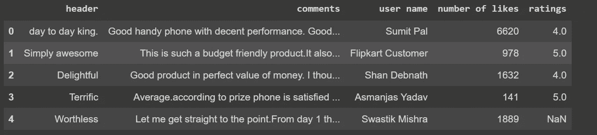
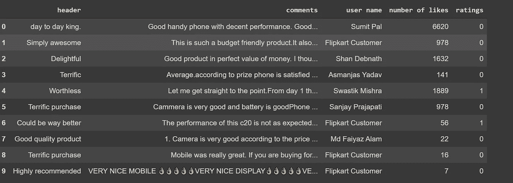
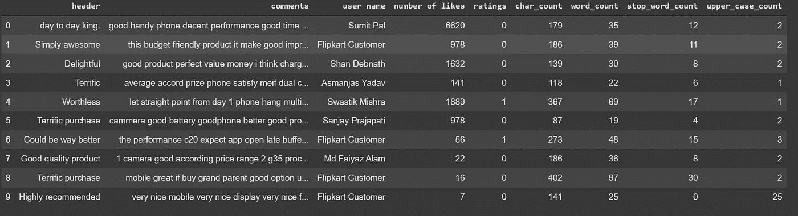
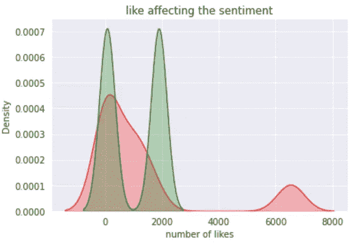
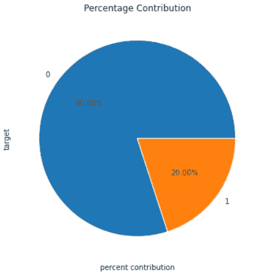
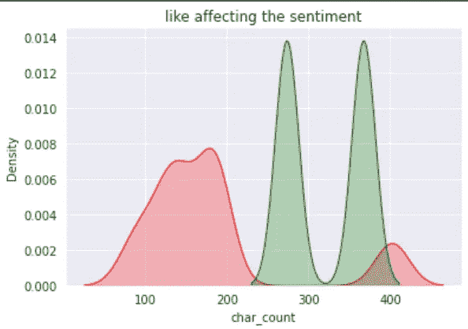
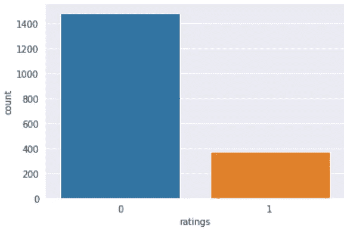
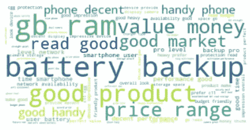
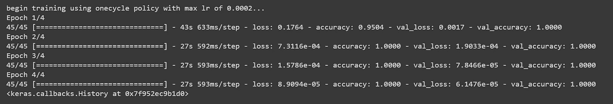
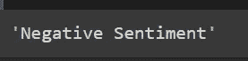

# 基于自定义数据集的提取 Bert 情感分类

> 原文：<https://medium.com/mlearning-ai/sentiment-classification-using-distil-bert-on-custom-dataset-7ecc73b5cb0?source=collection_archive---------1----------------------->


[Source](https://www.google.com/search?q=space&tbm=isch&ved=2ahUKEwinsrbo3tjyAhUnnEsFHT7KDrUQ2-cCegQIABAA&oq=space&gs_lcp=CgNpbWcQAzIECAAQQzIECAAQQzIHCAAQsQMQQzIHCAAQsQMQQzIICAAQgAQQsQMyCAgAEIAEELEDMggIABCABBCxAzIICAAQgAQQsQMyCAgAEIAEELEDMggIABCABBCxAzoHCCMQ7wMQJzoLCAAQgAQQsQMQgwE6CAgAELEDEIMBOgUIABCABFDKXlibaWDbbGgAcAB4AIABjAGIAZwFkgEDMC41mAEAoAEBqgELZ3dzLXdpei1pbWfAAQE&sclient=img&ei=Ls4sYadjp7iu2g--lLuoCw&bih=577&biw=1280&rlz=1C1CHBD_enIN956IN956#imgrc=H0wrkd5vAwHosM)

> **概述**

在这篇文章中，我们将学习端到端的 NLP 项目，从网站上提取数据，使用现代艺术技术进行情感分析。这还涉及文本清理、文本分析和文本的可视化表示和理解，然后将在云上部署该模型。在这篇文章的结尾，你将有足够的知识来处理几乎任何一种在嘈杂的数据集上的情感分类任务。

我一直在收集的数据集是对电子商务网站上任何特定产品的评论，然后将它们归类为不同的情绪，最后我们将发布测试数据，以检查我们的模型在检测情绪方面的效率。让我们开始吧

**步骤 1 :-构建定制数据集**

我们将从电子商务网站收集数据集，并将使用 beautiful soup 将所有数据集提取到我们的本地系统中。不用担心，我会向你展示使用美丽的汤提取数据的分步指南。


[Source](https://www.google.com/search?q=scrapping&rlz=1C1CHBD_enIN956IN956&sxsrf=AOaemvIAs8Efiqjjd3NLVrItKLDmzmnTKg:1630829663489&source=lnms&tbm=isch&sa=X&ved=2ahUKEwjgu5_2sefyAhVJyzgGHXG4CUcQ_AUoAnoECAIQBA&biw=1280&bih=577#imgrc=pmv17fMwt1sW7M)

> 导入必要的库

```
import requests
from bs4 import BeautifulSoup as bs
from urllib.request import urlopen as uReq
import numpy as np
import pandas as pd
```

`uReq`将要请求 url。`BeautifulSoup`帮助解析 html 标签中的数据。在这里，我将实现产品链接的自动化，您只需输入自己选择的产品名称，就会弹出该特定产品的评论。

```
print("Enter the product of your own chice")
product_name=input()
web_link='[https://www.flipkart.com/search?q=](https://www.flipkart.com/search?q=)'
url=web_link+product.replace(" ","")
url_clinet=uReq(url) #clinet requesting to access the url from servr
url=url_client.read()  #readng the url
url.close() #closing the conncetion
soup=bs(url,'html.parser')
```

现在是时候从列出的产品中去掉一个产品来取消他们的评论了。

```
data_class=soup.find_all('div',{"class":"_1AtVbE col-12-12"})
data=data_class[0] #it indicates we are taking first product from a 
                    complete given list present on UI
#list of things i am going to scrap from website
product_name=[] #name of product
comment_header=[] #comment_heading
comments=[] #full description of comment
ratings=[]  #rating of product
user_name=[] #person who has commented about product
likes=[] #people aggreng with the comments
dislikes=[] #people don't agree with comment
region=[] #location from where user has commented
```

现在，我们将采取我们自己选择的产品自动化，然后将从网站上的美丽的汤的帮助下需要字段。

```
import requests
from urllib.request import urlopen as uReq
from bs4 import BeautifulSoup
import pandas as pd
import numpy as np
search_product=input()
url="[https://www.flipkart.com/search?q=](https://www.flipkart.com/search?q=)"+search_product.replace(" ","")
uClient=uReq(url)   #opening the url
url=uClient.read() #reading the url
uClient.close()          #closing the connection this is must needed thing when we are doing scrapping
soup=BeautifulSoup(url,"html.parser") #parsing the html file for given product page
ratings=[]
headings=[]
user_comments=[]
names=[]
likes_count=[]
region=[]
n_data=soup.find_all("div",class_="_1AtVbE col-12-12")   #finding all the product present on requested page
data=n_data[2]
for page in range(1, 45):
    click_data = "[https://www.flipkart.com](https://www.flipkart.com)" + data.div.div.div.a["href"].format(page)  # clicking on that particular bject link
    req = requests.get(click_data)
    soup_next = BeautifulSoup(req.text, "html.parser")
    comment_boxes = soup_next.find_all("div", class_="col _2wzgFH")
    for comment in comment_boxes:
        rating = comment.find("div", {"class": "_3LWZlK _1BLPMq"})
        if rating is not None:  # if there will be some ratings
            ratings.append(float(rating.text))
        else:  # if the rating will be missing then will add null values
            ratings.append(np.nan)
        heading = comment.find("p", class_="_2-N8zT")
        if heading is not None:
            headings.append(heading.text)
        else:
            headings.append(np.nan)
        user_comment = comment.find("div", class_="t-ZTKy")
        if user_comment is not None:
            user_comments.append(user_comment.text)
        else:
            user_comments.append(np.nan)
        name = comment.find("p", class_="_2sc7ZR _2V5EHH")
        if name is not None:
            names.append(name.text)
        else:
            names.append(np.nan)
        like_count = comment.find("span", class_="_3c3Px5")
        if like_count is not None:
            likes_count.append(like_count.text)
        else:
            likes_count.append(np.nan)
        region=soup_updated.find_all('p',{"class":"_2mcZGG"})dict1={"header":headings,"comments":user_comments,"user name":names,"number of likes":likes_count,"ratings":ratings} #saving all these data into dictionary file
df=pd.DataFrame(dict1)
df.to_csv("final_result1.csv")
```

让我们创建字典，取出所有废弃的数据集，然后进一步将所有数据集转换为 csv 格式。

现在，我们已经成功构建了自己的自定义数据集。我们会将评级转换为 0 级或 1 级，其中 0 级为正常情绪(4 和 5 级开始评级)，1 级为负面情绪(1 和 2 星)，并将忽略中性评级，因为中性评级不会帮助企业改进产品，并且无论是在赞赏还是批评的情况下都不会那么有效。

**第二步:-让我们了解数据**

在 spacy，nltk，textblob 和 python 的帮助下，我制作了一个基本的实用程序文件来进行数据预处理。如果您有兴趣使用该文件，请单击此链接，通过简单的导入，您可以使用所有必要的预建预处理功能来清理和理解文本。

从数据集获取基本信息；

```
data=pd.read_csv('custom_data.csv')
data.head()
```



figure 1

```
data.shape #number of rows and column in dataset
[out]>> (1850, 5)
```

将评级 4 和 5 转换为正面评级，否则评级为负面。这可以使用应用功能来完成；

```
def rating_into_sentiment(x):
  if x>3:
    return 0
  else:
    return 1
data['ratings']=data['ratings'].apply(rating_into_sentiment)
data.head(10)
```



figure 2

让我们检查一下数据集中是否有空值，如果有，我们可能会删除该数据集。

```
data.isnull().values.any()[out]>> False
```

导入已经创建并存储在实用程序文件中的所有基本函数。

```
from utils import char_count
from utils import word_count
from utils import stop_word_count
from utils import email_removal
from utils import mention_count
from utils import numeric_digit_count
from utils import upper_case_count
from utils import lower_case_conversion
from utils import cont_to_exp
from utils import remove_mul_space,spelling_correction,remove_spec_char
from utils import remove_stop_words,remove_ac_char
from utils import base_root_form,remove_common_words,remove_rare_words
```

应用上述导入的函数来了解更多关于数据的信息。

```
data['cont_to_exp']=data['comments'].apply(cont_to_exp)
data['upper_case_count']=data['comments'].apply(upper_case_count)
data['stop_word_count']=data['comments'].apply(stop_word_count)
data['word_count']=data['comments'].apply(word_count)
data['char_count']=data['comments'].apply(char_count)
data['comments']=data['comments'].apply(remove_mul_space)
data['comments']=data['comments'].apply(remove_spec_char)
data['comments']=data['comments'].apply(remove_stop_words)
data['comments']=data['comments'].apply(remove_ac_char)
data['comments']=data['comments'].apply(base_root_form)
```



figure 3

在这里，我们可以看到我们能够从数据集中删除所有不需要的文本，现在我们的数据集已清理完毕，可以创建模型了，但在此之前，我们将进行一些探索性的数据分析，以了解文本的性质以及评论如何以及在何处影响评分。

**第三步:-探索性数据分析**

导入文本可视化所需的必要库。

```
import seaborn as sns
import matplotlib.pyplot as plt
from wordcloud import WordCloud
```

我们来看看评论中出现的赞数是如何影响情绪的。

```
sns.set_style('darkgrid')
sns.kdeplot(data[data['ratings']==0]['number of likes'],shade=True,color='red')
sns.kdeplot(data[data['ratings']==1]['number of likes'],shade=True,color='green')
plt.title("like affecting the sentiment")
plt.show()
```



figure 5

如果我们看到上面的数字，我们可以理解，更多的人点击喜欢那些有利于产品的评论。

```
plt.figure(figsize=(6,8))
sns.set_style("ticks")
data['ratings'].value_counts().plot.pie(autopct='%0.2f%%')
plt.title("Percentage Contribution")
plt.xlabel("percent contribution")
plt.ylabel("target")
plt.show()
```



figure 6

```
sns.set_style('darkgrid')
sns.kdeplot(data[data['ratings']==0]['char_count'],shade=True,color='red')
sns.kdeplot(data[data['ratings']==1]['char_count'],shade=True,color='green')
plt.title("like affecting the sentiment")
plt.show()
```



figure 7

评论的长度表明了评级的性质。评论越长，获得产品正面反馈的机会就越大。

```
sns.set_style('darkgrid')
sns.countplot(data['ratings'])
plt.show()
```



figure 8

数据集偏向于正面评价，这意味着更多的人对购买感到满意。

让我们对肯定句和否定句进行词云可视化，观察在肯定句和否定句中常见的词有哪些。



figure 8

显然，我已经对 realme 手机进行了评级，上面的单词云中的单词也显示了 ram、电池、备份等单词。

现在我们已经完成了清理和可视化，我们将准备在文本中应用 SOTA 模型，以获得更好的预测。

**第四步:-模型构建**

我们将使用 KTrain wrapper 构建 keras，使用 tensorflow 构建 SOTA 模型。我们将 80%的原始数据用于训练集，20%的数据用于验证集。

```
from sklearn.model_selection import train_test_split
data_train,data_test = 
              train_test_split(data,test_size=0.2,random_state=1)
```

让我们使用 KTrain 文本构建情感分类器模型。现在，我们将通过使用 distil bert 预处理来进行预处理或将文本嵌入到数值中。

```
(x_train,y_train),(x_test,y_test),preprocess=
      text.texts_from_df(data=data_train,text_column='comments',
                         label_columns='ratings',    
                        'preprocess_mode='distilbert')
```

让我们建立 KTrain 模型，第一步将是选择我们想要用于情感分析的模型。

```
train,test,preprocess=text.texts_from_df(data_train,text_column 
                      ='comments',label_columns='ratings' 
                       ,preprocess_mode='distilbert',maxlen=100)
```

现在，我们将根据我们的定制数据对 distil bert 模型进行微调，然后在我们微调的权重的帮助下，我们将预测购物网站上提供的评论的情绪。

```
model=text.text_classifier('distilbert',train_data=train,preproc 
                   =preprocess,verbose=1)
```

现在我们将借助`ktrain.learner` 对模型进行包装，并进一步用于模型的预测。

```
learner=ktrain.get_learner(model,train_data=train,val_data=test, 
                           batch_size=32)
learner.fit_onecycle(lr=2e-5,epochs=4)
```



figure 9

由于数据集很小，并且以良好的方式进行了预处理，所以我能够获得 100%的准确率，这在具有各种评论和未清理且杂乱数据的大型数据集的情况下是不可能的。

```
predictor=ktrain.get_predictor(learner.model,preprocess)
```

让我们将模型保存在 google drive 中，以便它可以进一步用于预测结果。

```
from google.colab import drive
drive.mount('/content/drive')
predictor.save('/content/drive/MyDrive/distilbert')
```

让我们获取一些文本数据，然后根据我们根据自己构建的定制数据调整的模型来预测评论的情绪。

```
data='''Let me get straight to the point.From day 1 this phone hangs.multitasking performance is very bad.. sometimes wifi gets disconnected automatically..apps like whatsapp take 15 seconds to open.and flipkart 20-25 seconds.In the time of usb type c,we are getting micro usb.charging takes a long time..and 2 gb ram is not sufficient to run apps..phone is good for just to make calls..and do light works.not meant for multi tasking'''
```

创建一个帮助函数来帮助我们预测结果。

```
def prediction(data):
    if predictor.predict([data])=='rating':
        return 'Positive Sentiment'
    else:
        return 'Negative Sentiment'
prediction(data)
```



figure 10

就像上面 flipkart 的一个 realme 产品的评论一样，用户给出了一个星级，这肯定意味着用户对产品不满意，并且给出了对产品不利的评论，是的，我们的模型能够正确预测结果。

**结论:-**

如果你对这个博客的改进有任何建议，这都是我的观点。感谢您抽出宝贵的时间阅读这篇博客。不断学习，不断探索………。