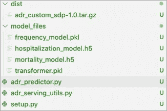
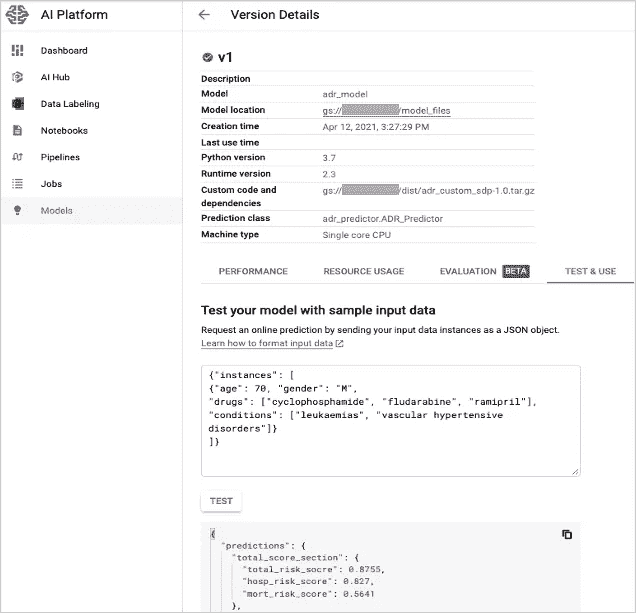
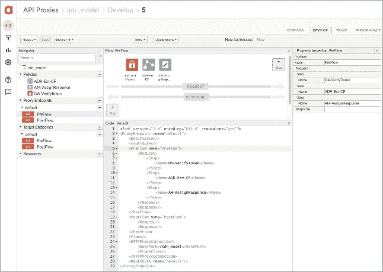
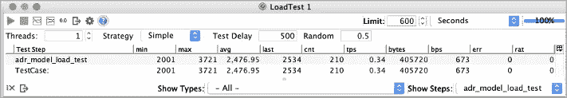
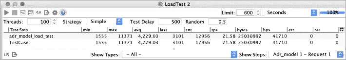
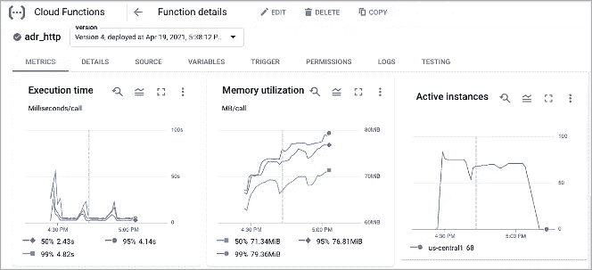

# 大规模无服务器预测:谷歌云人工智能平台上的定制模型部署

> 原文：<https://medium.com/mlearning-ai/serverless-prediction-at-scale-custom-model-deployment-on-google-cloud-ai-platform-d2d0807a0b8f?source=collection_archive---------1----------------------->

将真实世界的定制医疗保健模型部署到 Google Cloud AI 平台，将模型公开为安全的 REST API，并通过负载测试验证模型的可扩展性

模型部署是机器学习模型开发和操作(MLOps)生命周期的关键组成部分。在当今快速增长的云原生 IT 环境中，在将定制模型部署到生产环境时，公共云中的无服务器部署变得越来越流行。云中的无服务器部署提供了云计算的许多好处，例如简单性、成本效益、高可用性和可伸缩性。

在这篇文章中，我将分享一个使用 Google Cloud AI Platform(CAIP)[[1](https://cloud.google.com/ai-platform)]的真实定制模型部署体验。这个部署利用了 CAIP 的定制预测例程[ [2](https://cloud.google.com/ai-platform/prediction/docs/custom-prediction-routines) ]的能力，该例程可以自动将模型的工件打包并部署到 Kubernete 集群。部署后，模型通过云函数和 Apigee 代理经由 REST API 公开为预测服务。公开的模型 API 经过负载测试，证明具有高度的可伸缩性。作为比较，我还计划在不久的将来分享另一个 CAIP 海关集装箱方法[ [3](https://cloud.google.com/architecture/ai-platform-prediction-custom-container-concepts) ]的经验。

# 模型概述

我在这个实验中使用的定制模型是一个原型 ML 模型，用于预测多种药物中的药物不良反应(ADR)风险。这是一个真实世界的 ML 模型，其复杂程度通常是医疗保健问题建模所期望的。就本文的目的而言，理解模型是如何构建的，它是如何运行的，或者模型预测的准确性并不重要。它只是作为一个现实的例子来说明如何自定义模型可以部署在 CAIP 无服务器的方式，并提供大规模的在线预测。

对于对模型本身感兴趣的读者来说，这个 ADR 风险模型是基于 Valeanu 等人[4](https://www.nature.com/articles/s41598-020-66611-8#auth-Andrei-Valeanu)在最近的自然科学报告中发表的方法开发的。模型开发完成后，此 ADR 风险模型的工件由以下 3 个定制模型文件和 1 个特征转换文件组成:

*   frequency_model.pkl:以 Python pickle 格式序列化的统计 ADR 频率模型
*   住院 _model.h5:用 TensorFlow 构建的神经网络模型，保存为 h5 格式。该模型用于 ADR 住院风险的预测。
*   死亡率 _ 模型. h5:预测 ADR 死亡率风险的类似神经网络模型
*   transformer.pkl:用于对住院和死亡率模型的输入数据进行预处理和编码的特征转换文件

目标是将这些模型构件部署到 CAIP，将它们与实现白皮书[ [4](https://www.nature.com/articles/s41598-020-66611-8#auth-Andrei-Valeanu) ]中概述的特定业务逻辑的定制服务代码结合在一起，然后通过公共 REST API 将模型安全地公开为预测服务。模型 API 的输入数据包括:

*   患者的年龄和性别
*   患者医疗状况列表
*   患者正在服用的药物清单

示例:

模型 API 的输出是 3 个不同层级的 ADR 风险评分:

*   患者的住院、死亡率和总风险评分
*   每个 MedDRA 系统器官分类(SOC)级别的风险评分排名
*   每个独立 ADR 级别的风险评分排名

示例:

# 自定义例程预测器

谷歌 CAIP 提供了两种选择来在其平台上部署定制模型。一个是自定义预测例程，另一个是自定义容器。自定义预测例程是一种更简单的方法，只需最少的工作就可以在预测期间执行自定义服务代码。另一方面，自定义容器通过创建自己的 docker 容器，为模型部署提供了最大的灵活性。

自定义预测例程部署的第一步是创建自定义预测器类。这个类是自定义服务代码所在的地方。在预测器类中有两种方法要实现:

*   *from_path(cls，model_dir)* :加载模型工件的类方法
*   *predict(self，instances，**kwargs)* :由每个预测请求调用的实例方法。请求对象的有效负载在“实例”参数中传递给方法。

如果没有完全理解上面 *ADR_Predictor()* 类的 *predict()* 方法中的实现细节，也不用担心。这段代码是非常具体的 ADR 模型服务。它使用从一个单独的定制代码模块导入的几个助手函数。然而，重要的是要理解模型工件是从 CAIP 上运行的容器中的本地目录加载的。这些模型工件是从创建模型版本资源时指定的 Google Cloud Storage (GCS)位置复制的，如下一节所述。

我还建议在尝试部署到 CAIP 之前，在本地测试您的预测器类。在本地环境中调试和测试您的定制服务代码要比在 CAIP 容易得多。为这个预测器类创建一个本地测试器非常简单。

# 源分发包

在本地创建并测试了自定义预测器类之后，下一步是创建用于部署的源分发包。Google CAIP 提供了一个简单的安装工具来创建这个分发包。使用这个工具，我只需要指定包名、版本和所有需要的定制脚本(包括预测器和助手脚本文件)。

运行以下命令来执行安装脚本:

它创建了一个源代码分发子目录和一个 gzipped tarball 包。在这次执行之后，我的本地目录文件结构如下所示:

# CAIP 模型部署

在开始将您的模型部署到 CAIP 之前，请确保您已经在本地机器上安装了 Google 的 gcloud SDK，并使用您的用户帐户、GCP 项目和身份验证配置了 SDK。

在 CAIP 上的部署从创建 Google Cloud Storage (GCS) bucket 和上传模型工件和源代码分发包文件夹开始。对于我的 ADR 模型，我运行:

*< BUCKET_NAME >* 是我的 GCP 项目中的 GCS bucket 名称，用于托管模型工件和分发包。在确认这些文件夹已经成功上传到 GCS bucket 之后，我运行以下命令在 CAIP 上创建模型和版本资源:

在 GCP 控制台上，我导航到 CAIP 的模型面板，并验证模型和版本资源已经成功创建:

在 GCP 控制台上的模型版本的“Test & Use”选项卡中，我使用样本输入数据运行了一个快速测试，并验证了模型产生了预期的输出结果。注意，输入数据需要用“instances”元素包装，CAIP 要求该元素作为请求体的根元素。

我还使用下面的 gcloud 命令，通过创建相同输入数据的测试示例文件，从本地机器远程运行了一个测试。它产生的输出与从 GCP 控制台测试的输出相同:

# 模型服务的云功能

在 CAIP 部署后，ADR 风险模型可以通过带有 HTTP 端点[ [5](https://cloud.google.com/functions) ]的云功能作为预测服务公开。我在“cloud_function”子目录下的“main.py”文件中创建了一个名为“adr_http”的云函数，它调用模型的预测服务，然后使用 http 端点部署云函数:

为了保证“adr_http”云函数的调用安全，我在 GCP 项目上创建了一个服务帐户，为该服务帐户生成了一个密钥文件，然后将一个“云函数调用者”角色的服务帐户授予“adr_http”云函数。Apigee 代理将使用此服务帐户(在下一节中)来调用“adr_http”云函数:

以上命令中的 *<地区>* 和 *<项目 _ID >* 需要替换为实际的 GCP 地区和项目 ID。在这之后，我可以用下面的 gcloud 和 curl 命令测试云函数的 HTTP 端点:

注意，在上面的 curl 命令中，HTTP 授权是由 gcloud auth 激活的服务帐户的身份令牌提供的。模型输入数据需要由 HTTP 请求的 JSON 主体中的“instances”元素的数组包装。

# 模型 API 的 Apigee 代理

虽然 GCP 云函数本身可以作为公共 HTTP 端点公开，但最佳实践是保持云函数端点私有，并用 Apigee 代理包装它，以便将其作为公共 REST API[ [6](https://docs.apigee.com/) ]公开。Apigee 为公共 API 开发提供了许多内置的特性和策略，比如身份验证、日志记录、跟踪、spike arrest 等。

对于这个 ADR 风险模型，我创建了一个 Apigee 代理，将其公开为一个公共 REST API。Apigee 代理和云功能之间的集成是通过 Google 云功能扩展连接器实现的。首先，我需要使用上一步中生成的密钥文件中的服务帐户凭证创建一个 Apigee 扩展。然后，我创建了一个名为“adr_model”的 Apigee 代理，并在该代理的默认预流步骤中添加了以下 3 个策略:

*   OA-VerifyToken:用于 API 调用的 OAuth2.0 令牌验证策略
*   ADR-Ext-CF:使用 Google cloud 函数扩展的 ConnectorCallout 策略
*   AM-AssignResponse:从云函数响应中检索消息的分配消息策略

有了这个 Apigee 代理，我现在可以使用从我的 Apigee 客户端凭证生成的访问令牌安全地访问 ADR 风险模型 API。

# 模型 API 的负载测试

为了验证部署的 ADR 风险模型的 API 性能和可伸缩性，我在 SoapUI[ [7](https://www.soapui.org/) ]上配置了 2 个负载测试用例。一个是模拟单个用户(线程)进行 API 调用，另一个是模拟 100 个并发用户。两个测试用例都被配置为运行 10 分钟，每个请求之间有 500 毫秒的延迟。每个负载测试按顺序尝试 3 次。结果显示在下面的截图中。对于单个用户，API 的平均响应时间约为 2.5 秒，事务量非常低，为 0.34 个请求/秒。对于 100 个并发用户，API 的平均响应时间约为 4.2 秒，事务量约为 22 个请求/秒。结果显示，当事务量增加 65 倍时，API 响应时间仅降低了 1.7 秒，这清楚地表明了部署的模型 API 的高可伸缩性。

负载测试 1:单用户

负载测试 2: 100 个并发用户

下图显示了云函数的执行时间以及由 100 个并发用户的测试用例产生的活动云函数实例的数量。为了处理所有 100 个用户的并发请求，GCP 激活了大约 70 个云功能实例。大多数用户请求(95%)在不到 4.2 秒的时间内被执行，但是也应该注意到一些请求在每次测试开始时需要更长的时间来响应。这种初始时间延迟主要是由于:

*   新生成的云函数实例处理请求量所需的预热时间
*   CAIP Kubernete 集群后面的模型容器的自动缩放

# 结论

在这篇文章中，我分享了在谷歌云人工智能平台(CAIP)上部署真实世界医疗保健 ML 模型的经验。该模型被公开为一个安全的 REST API，并验证了它对于服务在线预测具有高度的可伸缩性。总的来说，我觉得谷歌 CAIP 的自定义预测例程为在 GCP 上无服务器部署自定义 ML 模型提供了一个非常简单方便的方法。

我从这次试验中学到的一个教训是，GCP 项目的 VPC 服务控制可能会对 CAIP 定制预测例程的可用性产生重大影响。为了完成 ADR 风险模型的部署，我不得不切换到 VPC 服务控制较少的另一个 GCP 项目。如果您遇到 CAIP 自定义预测例程的区域端点可用性的类似问题，请检查您的 GCP 项目的 VPC 服务控制。

# 承认

我感谢谷歌客户工程师布伦丹·杜汉和内森·霍德森在这次实验中的支持。

# 参考

[1]谷歌，【https://cloud.google.com/ai-platform 

[2]谷歌，[https://cloud . Google . com/ai-platform/prediction/docs/custom-prediction-routines](https://cloud.google.com/ai-platform/prediction/docs/custom-prediction-routines)

[3]谷歌，[https://cloud . Google . com/architecture/ai-platform-prediction-custom-container-concepts](https://cloud.google.com/architecture/ai-platform-prediction-custom-container-concepts)

[4] Valeanu，Andrei 等人，“[多药疗法中针对患者的药物不良反应预测评分和分级策略的开发](https://www.nature.com/articles/s41598-020-66611-8#auth-Andrei-Valeanu)”，《自然科学报告》第 10 卷，文章编号:9552 (2020)

[5]谷歌，[https://cloud.google.com/functions](https://cloud.google.com/functions)

【6】阿比奇，[https://docs.apigee.com/](https://docs.apigee.com/)

[7]索普伊，[https://www.soapui.org/](https://www.soapui.org/)