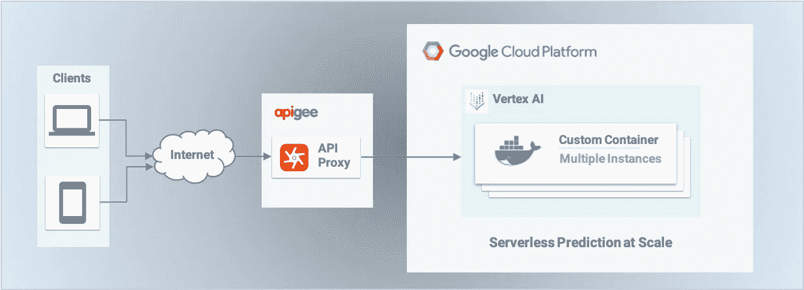
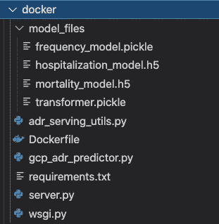
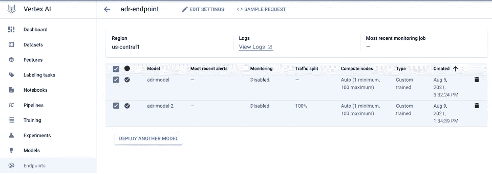
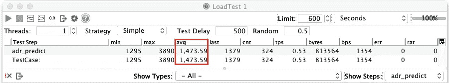
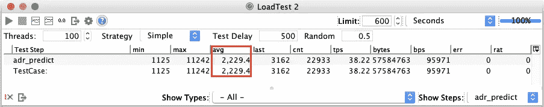
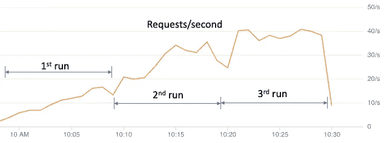
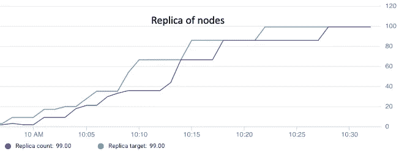
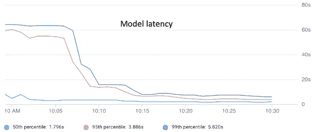
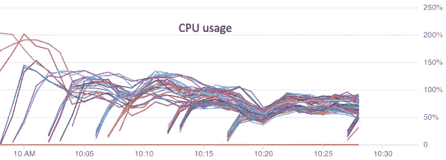
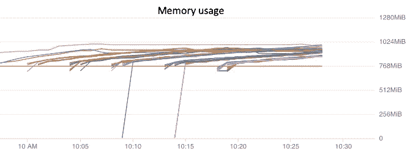

# 大规模无服务器预测，第 2 部分:Vertex AI 上的定制容器部署

> 原文：<https://medium.com/mlearning-ai/serverless-prediction-at-scale-part-2-custom-container-deployment-on-vertex-ai-103a43d0a290?source=collection_archive---------1----------------------->

关于 Google 云平台上定制模型的无服务器部署的 2 部分系列的第 2 部分。这一部分涵盖了 Vertex AI 上的定制容器部署。

Image by Author

在之前的帖子[ [1](/mlearning-ai/serverless-prediction-at-scale-custom-model-deployment-on-google-cloud-ai-platform-d2d0807a0b8f) ]中，我已经分享了一个使用 AI 平台上的自定义预测例程，将自定义构建的机器学习模型部署到 Google 云平台(GCP)的经验。定制预测例程部署是无服务器的，并且被证明是高度可扩展的。在这篇文章中，我将通过使用自定义容器方法[ [3](https://cloud.google.com/vertex-ai/docs/predictions/use-custom-container) ]来分享 GCP 新顶点 AI [ [2](https://cloud.google.com/vertex-ai) ]的另一个经验，从而继续这一讨论。

# 顶点人工智能

最近宣布的[ [4](https://cloud.google.com/blog/products/ai-machine-learning/google-cloud-launches-vertex-ai-unified-platform-for-mlops) ]，Vertex AI 是 GCP 上的一个统一机器学习平台，它提供了一套全面的工具和产品，用于在单一环境中构建和管理 ML 模型的生命周期。它整合了传统人工智能平台和 AutoML (Table/Vision/NLP)的许多先前产品，并补充了几个新的流行的 ML 产品和服务，如标记任务、管道、特征存储、实验、模型注册等。

从模型部署来看，Vertex AI 目前支持定制模型的两种部署类型:

*   预制集装箱
*   自定义容器

预构建的容器旨在用于从常用的 ML 框架(包括 Scikit-learn、XGBoost 和 Tensorflow)构建的模型。预测时，预建容器直接从指定框架的已保存模型工件中调用 *predict()* 方法。预构建容器不支持预测时的自定义服务代码，如预处理和后处理所需的自定义代码。然而，定制容器支持所有类型的 ML 框架和定制服务代码。它还支持部署在 Vertex AI 之外训练的自定义模型。这个选项的缺点是用户需要构建自己的定制 docker 容器来进行部署。

对于我们在上一篇文章[ [1](/mlearning-ai/serverless-prediction-at-scale-custom-model-deployment-on-google-cloud-ai-platform-d2d0807a0b8f) ]中试验过的药物不良反应(ADR)模型，我们无法在 Vertex AI 上使用预先构建的容器。我们将使用定制容器方法。

# 创建 Docker 容器映像

部署过程的第一步是为要部署的定制容器创建一个 docker 映像。就模型工件而言，Vertex AI 允许它们存储在云存储桶中，并在容器启动时加载到容器中。或者，模型人工产物也可以作为图像内容本身的一部分直接嵌入到 docker 图像中。在这个实验中，我们将使用嵌入选项。

我在工作目录中创建了一个 docker 文件夹，其中包含构建 docker 容器映像所需的所有内容:

*   *model_files* :一个子文件夹，包含与前一篇文章[ [1](/mlearning-ai/serverless-prediction-at-scale-custom-model-deployment-on-google-cloud-ai-platform-d2d0807a0b8f) ]中描述的相同的 4 个保存的模型工件文件
*   *gcp_adr_predictor.py* :与上一篇文章[ [1](/mlearning-ai/serverless-prediction-at-scale-custom-model-deployment-on-google-cloud-ai-platform-d2d0807a0b8f) ]中显示的相同的自定义服务预测器类
*   *adr_serving_utils.py* :与上一篇文章[ [1](/mlearning-ai/serverless-prediction-at-scale-custom-model-deployment-on-google-cloud-ai-platform-d2d0807a0b8f) ]中讨论的相同的自定义实用程序助手函数
*   *Dockerfile* : docker 构建文件
*   *requirement.txt* :所有必需的 Python 库依赖项
*   *server.py* :带有端点路由定义的 Flask 服务器代码
*   *wsgi.py* :一个简单的 Flask 服务器运行程序

对于模型预测器类，我重用了前一篇文章[ [1](/mlearning-ai/serverless-prediction-at-scale-custom-model-deployment-on-google-cloud-ai-platform-d2d0807a0b8f) ]中描述的相同的模型服务代码。docker 构建文件的内容和定制容器所需的 python 库如下:

这里，我使用 Gunicorn 和 Flask 作为 docker 容器的 HTTP web 服务器。端口 5050 从容器中公开，为传入的 HTTP 请求提供服务。然后，我通过运行以下命令构建 docker 映像:

这在我的本地机器上用指定的图像标记名创建了一个定制的 docker 图像。{PROEJCT_ID}和{REGION}是我的 GCP 项目 ID 和区域名称的占位符。{REPOSITORY}和{IMAGE}是定制容器的工件注册库和 docker 映像的名称。

# 本地测试自定义容器

在构建 docker 映像之后，我通过启动定制容器在本地对其进行了测试，以确保定制容器能够按照预期为 HTTP 预测请求提供服务:

在这里，我将容器的内部端口 5050 映射到本地机器的端口 5050，用于服务 HTTP 请求。然后，我通过以下方式测试容器:

" *sample_input.json* "是一个 json 文件，包含了前一篇文章[ [1](/mlearning-ai/serverless-prediction-at-scale-custom-model-deployment-on-google-cloud-ai-platform-d2d0807a0b8f) ]中使用的测试模型的输入数据示例:

请注意，所有的模型输入数据字段都需要由数组中的顶级元素“*实例*包装。在自定义容器实现中，顶点 AI 需要这种数据结构。

定制容器应该返回一个 HTTP 响应，其中的 JSON 内容与前一篇文章[ [1](/mlearning-ai/serverless-prediction-at-scale-custom-model-deployment-on-google-cloud-ai-platform-d2d0807a0b8f) ]中显示的预测值相同。这确认了 docker 映像构建正确，并且定制容器在本地环境中正常工作。

# 部署自定义容器到顶点人工智能

在本地测试之后，定制容器现在可以部署到 Vertex AI。首先，我在 GCP 上创建了一个工件注册库，并将 docker 映像推送到这个库中:

然后，我使用工件库中推送的 docker 映像在 Vertex AI 上导入了一个定制模型:

请注意，在上面的命令中，容器端口被指定为 5050，健康检查和预测路由也是基于它们在 Flask web 服务器代码中的定义来指定的。模型导入完成后，可以通过导航到 Vertex AI 控制台或运行以下命令进行确认:

最后，我创建了一个端点，并将定制模型部署到该端点以提供服务:

其中{ENDPOINT_ID}是端点创建后由顶点 AI 分配的端点 ID。在这里，我指定集群的每个节点使用标准的 2-vCPU 机器类型，最小节点数是 1，最大节点数是 100(在 1 到 100 之间自动调整)。到模型端点的所有流量都被路由到已部署模型的当前版本。Vertex AI 允许在端点模型部署绑定中进行流量百分比分割。如果需要新型号版本的逐步发布，可以使用这种流量划分来实施蓝绿色部署策略。

**Vertex AI Endpoint and ADR Model Bindings**

# 在 Vertex AI 上测试自定义容器

部署定制容器后，我运行了以下测试来确保端点正常工作:

*   a)使用 gcloud SDK 进行测试:

*   b)使用 HTTP 请求进行测试:

c)使用 Python 客户端进行测试:

# 模型 API 的负载测试

就像上一篇文章[ [1](/mlearning-ai/serverless-prediction-at-scale-custom-model-deployment-on-google-cloud-ai-platform-d2d0807a0b8f) ]中讨论的自定义预测例程一样，自定义容器提供的预测服务端点也可以通过 Apigee 代理作为 REST API 公开。我通过模拟 1 和 100 个并发在线用户，对定制容器的模型 API 进行了非常相似的负载测试。两个负载测试的服务响应时间如下所示:

负载测试 1:单用户

负载测试 2: 100 个并发用户

单用户测试用例的平均响应时间约为 1.47 秒，100 个并发用户测试用例的平均响应时间约为 2.23 秒。这个测试结果与我们在之前的帖子[ [1](/mlearning-ai/serverless-prediction-at-scale-custom-model-deployment-on-google-cloud-ai-platform-d2d0807a0b8f) ]中从自定义预测例程中观察到的结果非常一致，表明了在 Vertex AI 上部署的自定义模型的高可扩展性。

下面是我从 Vertex AI 上的端点监控控制台捕获的一些模型操作指标。这些指标对应于 100 个并发用户的第二个负载测试用例的连续 3 次运行(总共 30 分钟)。

# 摘要

在这篇文章中，我分享了另一个使用定制容器方法在 Vertex AI 上部署定制模型的经验。类似于上一篇文章[ [1](/mlearning-ai/serverless-prediction-at-scale-custom-model-deployment-on-google-cloud-ai-platform-d2d0807a0b8f) ]中讨论的定制预测例程，Vertex AI 上的定制容器部署被证明是非常灵活和高度可伸缩的。

在撰写本文时，Vertex AI 还不支持自定义预测例程。如果你更喜欢使用自定义预测例程，而不是创建自己的自定义 docker 容器，此时你将需要继续使用传统的 AI 平台。

# 承认

我感谢谷歌客户工程师布伦丹·杜汉和内森·霍德森在这次实验中的支持。

# 参考

1.  [https://medium . com/mlearning-ai/server less-prediction-at-scale-custom-model-deployment-on-Google-cloud-ai-platform-d2d 0807 a0b 8 f](/mlearning-ai/serverless-prediction-at-scale-custom-model-deployment-on-google-cloud-ai-platform-d2d0807a0b8f)

2.[https://cloud.google.com/vertex-a](https://cloud.google.com/vertex-ai#section-1)我

3.[https://cloud . Google . com/vertex-ai/docs/predictions/use-custom-container](https://cloud.google.com/vertex-ai/docs/predictions/use-custom-container)

4.[https://cloud . Google . com/blog/products/ai-machine-learning/Google-cloud-launches-vertex-ai-unified-platform-for-mlops](https://cloud.google.com/blog/products/ai-machine-learning/google-cloud-launches-vertex-ai-unified-platform-for-mlops)