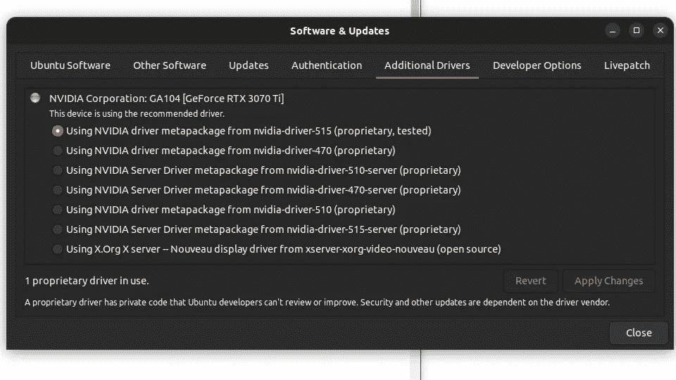
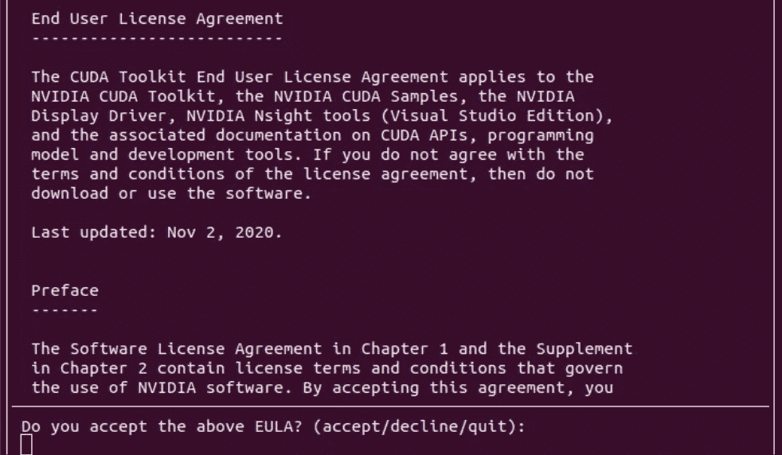
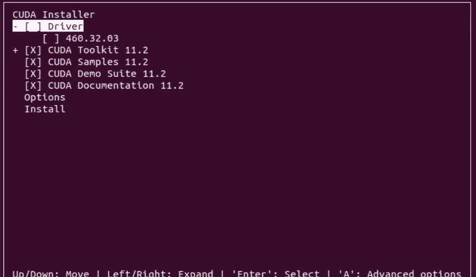
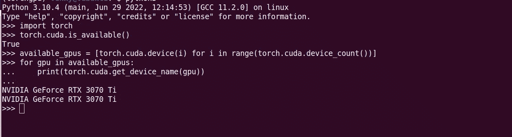
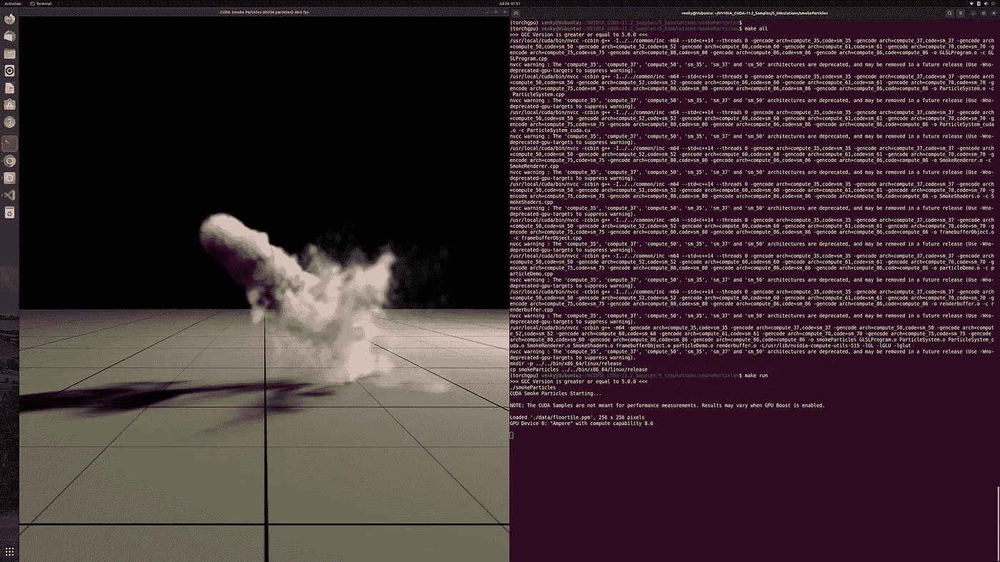
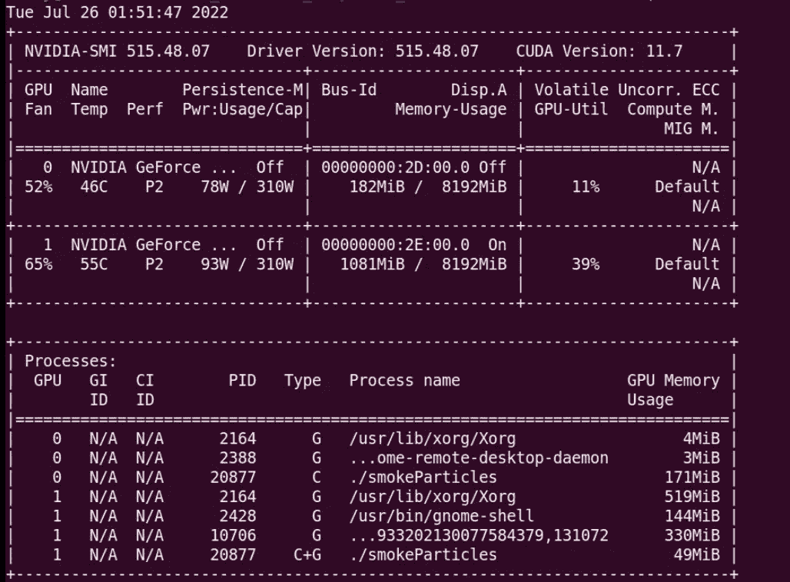

# 用 Ubuntu 22.04 设置深度学习工作站

> 原文：<https://medium.com/mlearning-ai/setup-deep-learning-environment-with-ubuntu-22-04-8ad40cb28f95?source=collection_archive---------0----------------------->


Photo by [Alex Knight](https://unsplash.com/@agk42?utm_source=medium&utm_medium=referral) on [Unsplash](https://unsplash.com?utm_source=medium&utm_medium=referral)

> 本文假设您熟悉初级/中级水平的 UNIX/Linux 工作经验，并确保您的机器中有支持 CUDA 的 GPU 设备，以成功完成设置并在设备上运行测试。

# 准备好您的系统更新

```
sudo apt update && sudo apt upgrade -ysudo apt install git curl vim build-essential gcc-9 g++-9 python-is-python3 python3-virtualenv
```

我们不需要在升级后重启 ubuntu，但建议这样做。

Ubuntu 22.04 自带对 NVIDIA 显卡的开箱即用驱动支持。所以，我们可以使用元包。转到“**软件&更新**，然后选择“**附加驱动程序**”选项卡。

它应该看起来如下:(总是选择*专有的、经过测试的*和最新的驱动程序号)



# 安装 CUDA:

```
# install dependencies
sudo apt install git curl vim build-essential gcc-9 g++-9 python-is-python3 python3-virtualenv# download cuda 11.2 packagewget https://developer.download.nvidia.com/compute/cuda/11.2.0/local_installers/cuda_11.2.0_460.27.04_linux.run# run the installer and follow instructions on screen 
sudo sh cuda_11.2.0_460.27.04_linux.run
```

如果安装程序没有通过任何 gcc 版本检查，那么运行下面的命令来找出所有可用的 gcc 版本:

```
dpkg --list | grep compiler
```

注意:确保您至少有一个低于 10 的 gcc 版本，以便 gcc <10 is compatible with the cuda 11.2

In my machine, I have gcc 9 installed, so set 9 as my preferred version:

```
# SET g++ compiler version
sudo update-alternatives --install /usr/bin/g++ g++ /usr/bin/g++-9 100
# SET gcc version; 100=priority
sudo update-alternatives --install /usr/bin/gcc gcc /usr/bin/gcc-9 100# RUN the installer again
sudo sh cuda_11.2.0_460.27.04_linux.run
```

You may want to read more about update-alternatives priority [在这里](https://manpages.ubuntu.com/manpages/jammy/en/man1/update-alternatives.1.html)。



**注意**:由于我们已经安装了驱动程序，请务必通过按“space”键取消选中驱动程序。

现在，更新环境变量，并将下面几行添加到`~/.bashrc or ~/.zshrc`

```
export PATH=/usr/local/cuda-11.2/bin${PATH:+:${PATH}}
export LD_LIBRARY_PATH=/usr/local/cuda-11.2/lib64${LD_LIBRARY_PATH:+:${LD_LIBRARY_PATH}}
export CUDA_HOME=/usr/local/cuda
export LD_LIBRARY_PATH=/usr/local/cuda/lib64:$LD_LIBRARY_PATH# source the config
source ~/.bashrc or source ~/.zshrc
```

# 测试 CUDA 安装

CUDA 安装附带了一些样例程序，它们存储在 HOME 中，所以让我们导航到样例程序并运行设备查询程序

```
cd ~/NVIDIA_CUDA-11.2_Samples/1_Utilities/deviceQuery
make all
make run 
```

如果安装成功，您应该会看到如下所示的输出:

**注意**:我安装了 2 个 GPU，所以我会在输出中看到它们，如果你有 1 个设备，你只会看到一个或任何可用的设备。


# 安装 CUDNN

您必须向 nvidia 注册一个帐户，并验证您用于注册的电子邮件，然后您必须在安装时下载与 cuda-11.2 版本兼容的 8.1.1 cudnn 存档。(如果您稍后尝试此设置，您可能需要查看兼容性列表，以获得适用于您的 cuda 版本的正确存档版本。)

[](https://developer.nvidia.com/rdp/cudnn-archive#a-collapse811-111) [## cuDNN 档案

### 探索和下载 cuDNN GPU 加速的深度神经网络原语库的过去版本，为您的…

developer.nvidia.com](https://developer.nvidia.com/rdp/cudnn-archive#a-collapse811-111) 

下载并准备好正确的归档文件后，导航到存储归档文件的目录，并运行以下命令继续安装:

```
tar -zvxf cudnn-11.2-linux-x64-v8.1.1.33.tgz
sudo cp -P cuda/include/cudnn.h /usr/local/cuda-11.2/include
sudo cp -P cuda/lib64/libcudnn* /usr/local/cuda-11.2/lib64/
sudo chmod a+r /usr/local/cuda-11.2/lib64/libcudnn*
```

**验证 cudnn 安装:**

```
# check for nvidia cuda compiler (nvcc) version
nvcc -V# you should see similar output
nvcc: NVIDIA (R) Cuda compiler driver
Copyright (c) 2005-2020 NVIDIA Corporation
Built on Mon_Nov_30_19:08:53_PST_2020
Cuda compilation tools, release 11.2, V11.2.67
Build cuda_11.2.r11.2/compiler.29373293_0
```

设置依赖关系:

```
sudo apt install build-essential pkg-config cmake cmake-qt-gui ninja-build valgrindsudo apt install python3 python3-wheel python3-pip python3-venv python3-dev python3-setuptools# create virtual env for gpu specific
python3 -m venv ~/venv/torchgpu# activate venv
source venv/torchgpu/bin/activatepip install torch torchvision torchaudio --extra-index-url [https://download.pytorch.org/whl/cu113](https://download.pytorch.org/whl/cu113)pip install ipykernelpython -m ipykernel install --user --name TORCH-GPU --display-name "PyTorch GPU"# if you see any warning/error w.r.t openGL and glut during make all/run of any sample program run 
sudo apt-get install freeglut3 freeglut3-dev
```

# 快速 PyTorch 试验:



# 测试一个将利用我们 GPU 的示例模拟程序:

```
# navigate to sample program
cd $HOME/NVIDIA_CUDA-11.2_Samples/5_Simulations/smokeParticlesmake all
make run# you should see a simulation window appear with 60 fps or something
```



运行模拟时，打开一个新的终端会话，查看机器中每个 GPU 发生了什么:

```
# run this command
nvidia-smi# you should see output similar to what is in snapshot below
```



我们可以看到，我们的样本程序，烟雾粒子是运行在 GPU 设备。

这个帖子到此为止。

谢谢你的检查，请在评论中告诉我你的设置如何:-)。

[](/mlearning-ai/mlearning-ai-submission-suggestions-b51e2b130bfb) [## Mlearning.ai 提交建议

### 如何成为 Mlearning.ai 上的作家

medium.com](/mlearning-ai/mlearning-ai-submission-suggestions-b51e2b130bfb)