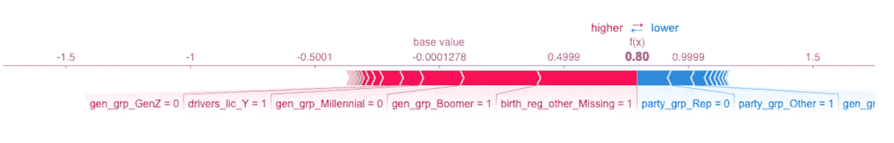
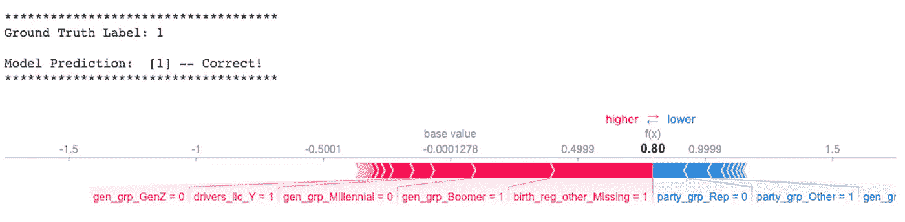
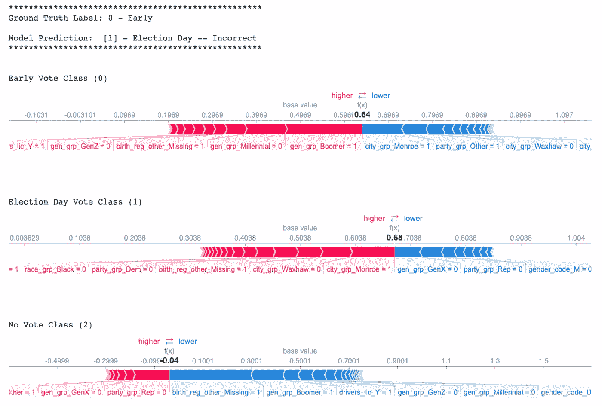

# 用于分类的 SHAP 力图

> 原文：<https://medium.com/mlearning-ai/shap-force-plots-for-classification-d30be430e195?source=collection_archive---------0----------------------->

## 如何将 SHAP 力图函数化用于二元和多类分类

在这篇文章中，我将介绍两个函数:一个用于绘制二元分类问题的 SHAP 力图，另一个用于多类分类问题。

此时你可能会想“好吧，但是已经有一个`shap.force_plot()`函数了，那么我们在这里做什么呢？”是的，从技术上讲你是正确的。**但是**我见过的几乎所有 SHAP 力图的例子都是针对连续或二元目标的。你实际上可以为多类目标制作力场图，只需要一点额外的挖掘。我的目标是帮助您进行挖掘，以便您得到一个额外可解释的输出。毕竟，这就是 SHAP 的全部:[让复杂的“黑盒”模型更容易理解](/@gabrieltseng/interpreting-complex-models-with-shap-values-1c187db6ec83)。

Photo by [Emily Morter](https://unsplash.com/@emilymorter?utm_source=unsplash&utm_medium=referral&utm_content=creditCopyText) on [Unsplash](https://unsplash.com/s/photos/why?utm_source=unsplash&utm_medium=referral&utm_content=creditCopyText)

我不打算花太多时间来谈论或解释什么是 SHAP(SHapley Additive explaints ),因为有很多很棒的资源已经这样做了。如果你想了解更多关于 Shapley values 和 SHAP 的信息，我强烈推荐从这里开始。这击中了亮点，你会看到你可以用 [SHAP Python 库](https://github.com/slundberg/shap)制作的各种各样的酷情节，锤打一个日志的故事是一个奇怪但有效的视觉理解 Shapley 值试图告诉我们什么。

总结 ***非常*** 简单来说，Shapley 值给了我们一个评估一个预测因子相对于其他预测因子重要性的度量。本质上，这些值考虑了损失函数(模型误差)如何受到已知和未知预测特征的影响。这些值还指示预测特征和目标变量之间关系的方向(正或负)。

SHAP 库为计算和可视化这些值提供了简单易用的工具。要启动并运行库`pip install shap`，那么:

一旦你成功地导入了 SHAP，你可以生成的可视化效果之一就是力图。如下图所示，力图可让您了解要素如何影响特定观测的模型预测。这非常适合向某人解释你的模型是如何得出它对特定观察的预测的。

我在这篇文章中举的例子来自我参与的一个项目，该项目预测一名注册选民是否会在 2020 年大选中投票。二元目标是“是”,他们投了票(投票= 1 ),或者“否”,他们没有投(没有投票= 0)。在上面的图中，粗体的 **0.80** 是模型在这次观察中的得分。较高的分数导致模型预测 1，而较低的分数导致模型预测 0。对本次观察进行预测很重要的要素以红色和蓝色显示，红色表示将模型得分推高的要素，蓝色表示将得分推低的要素。对分数影响较大的要素位于红色和蓝色之间的分界线附近，影响的大小由条形的大小表示。

因此，这个特定的人最终被归类为 Vote (1)，因为他们被红色显示的所有因素推得更高(他们的注册记录中缺少出生地区信息，他们是婴儿潮一代，等等。).

然而，这个图是使用`shap.force_plot()`得到的唯一输出。它没有告诉你模型的预测输出，也没有告诉你这个具体观察的地面真相标签。能够一次看到所有信息输出不是很有帮助吗？这是我们第一个函数的目的。

# 二元分类的力图

在我们使用这个函数之前，让我们确保所有的东西都是以一种易于使用的方式来设置的。预处理和分割数据，以便训练模型。确保存储与预处理数据相对应的特征名称！你需要这些来让情节变得更有意义。如果您的预处理管道涉及到创建新列(比如当一个热编码分类变量时)，您可以从管道中正确步骤的`.get_feature_names`属性中获得新的特性名称。例如，我设置这一切的代码如下:

如果您得到的不仅仅是分类变量，您需要确保从它们的步骤中获取这些特性名称，然后按照它们在预处理管道中被处理的顺序，将所有特性名称放入一个列表**中。**

一旦您训练和调整了您的模型，将拟合的分类器和增强器分别分配给一个变量(我在这个项目中使用了 XGBoost 分类器——如果您使用其他方法，这些函数应该很容易适应其他基于树的算法)。我们希望能够在接下来的步骤中轻松地调用它们，并将其作为函数中的参数。当我们存储有用的东西时，让我们把预处理过的`X_train_tf`数组转换成使用`feature_names`作为列名的数据帧。

接下来，我们需要实际获取我们训练好的模型的 SHAP 值。因为我使用了基于树的分类器，所以我使用 SHAP 的`TreeExplainer()`来做这件事。这个解释器然后用于计算 SHAP 值，如下所示。

**重要提示:**我见过一些生成可视化效果的函数，其中包括 SHAP 值的计算。我不建议这样做。根据数据集的大小，计算可能需要相当长的时间，没有理由每次都要为同一个模型生成一个图。

现在我们已经准备好编写和调用我们的第一个函数，它将产生如下所示的更具信息性的输出:

下面是如何编写这个`shap_force()`函数:

您可以调整 f 字符串中包含的信息，以您想要的方式格式化输出。也许你想变得超级严肃，去掉那个庆祝你的模型预测正确的感叹号。也许您希望映射标签来报告实际的类名，而不是一个数字，这样便于您跟踪。

# 用于多类分类的力图

再次预处理您的数据，存储预处理后的特征名称，这次不要忘记对您的目标进行 [**标签编码**](https://scikit-learn.org/stable/modules/generated/sklearn.preprocessing.LabelEncoder.html) 。稍后您将需要访问这些标签编码的类！

最后一行返回我的多类模型的以下输出:

`array(['Early', 'Election Day', 'No Vote], dtype=object)`

因为我的模型的多类版本将在选举中投票的人根据他们选择投票的时间分为两类。因此，它们分别被编码为 0、1 和 2。

接下来，训练和调整您的模型，存储您的最佳估计器和与二进制模型相同的增强器，并确保您已经将预处理的 X 训练集转换为数据帧，并使用适当的功能名称作为列名。然后使用助推器得到你的树解释器，并计算 SHAP 值。

如果你试图像我们在二元函数中那样使用`shap.force_plot()`，它会抛出一个错误:

`TypeError: list indices must be integers or slices, not tuple`。

这是因为，当您计算多类目标的 SHAP 值时，您会得到一个包含 SHAP 值的 n 个数组的列表。这里 n 是组成你的目标的类的总数。因此，由于我的模型有 3 个目标变量类，我应该发现我的列表中有 3 个数组。您可以用下面的代码来确认这些事情:

我们可以用一种类似的方式来考虑 SHAP 值的每个数组，就像当我们有一个二进制目标时，我们得到的 SHAP 值的单个数组一样。在这种二元情况下，SHAP 值将模型推向投票(1)或不投票(0)的分类。现在有了我们的 3 个类，每个数组都将每个类作为自己的二进制目标进行评估。所以提前投票(1)对不提前投票(0)，选举日投票(1)对非选举日投票(0)，无投票(1)对非无投票(0)。

你的头有点晕吗？跟着我。可视化会有所帮助。

这是我们希望从函数中得到的输出:

三个力图，每个目标阶级一个，模型预测得分最高的阶级——选举日(假设它几乎不是最高的)。下面是如何编写一个函数来获得这种类型的输出:

一旦您花了一分钟时间来检查每个函数的功能(我认为我已经提供了足够的上下文和注释，但是请随意给我添加注释)，您可能会想“这很好，但是您已经硬编码了您的目标类。可能会更好。”

我的回答是“这很公平。现在，您已经清楚地了解了这个函数在我们的特定示例中是如何工作的，下面是您如何重写它以应用于您的特定问题，无论您有 3 个还是 333 个目标类。”

您只需提供一个额外的参数(标签编码的`classes_`属性),这样函数就可以遍历这些参数来创建您的标签字典。我还改变了默认显示`'all'`为只显示`'both'`，以防你有 333 个类在目标变量中。

# 概括一下

[SHAP 图书馆](https://github.com/slundberg/shap)为评估某些“黑盒”算法的特征重要性提供了有用的工具，这些算法以不易解释而闻名。它还提供了可视化要素如何影响模型预测的方法。

SHAP 力图显示了哪些要素对单次观测的模型预测影响最大。这本身就很有趣，但如果你发现自己必须解释一些事情，比如为什么你的模型决定你应该拒绝一个特定的人向你的老板申请贷款，这就特别有用。

您可以在较大函数的一部分中使用这些图，为二元和多类分类问题生成更多信息输出。具体来说，能够看到以下内容非常有用:

1.  观察的基本事实标签，
2.  模型对相同观察的预测，
3.  为您进行比较并告诉您您的模型是否正确预测了这一观察结果的语句，以及
4.  解释该观察的模型输出的力图。

我希望这能对你有所帮助，并能把你学到的东西应用到你自己的工作中去！