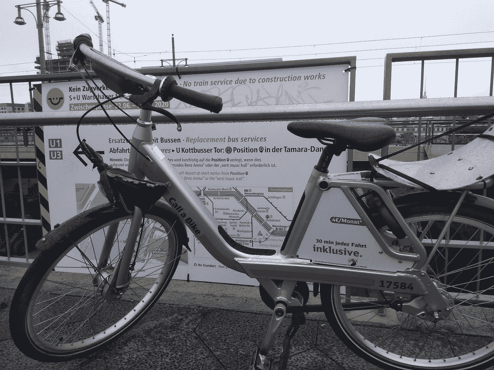
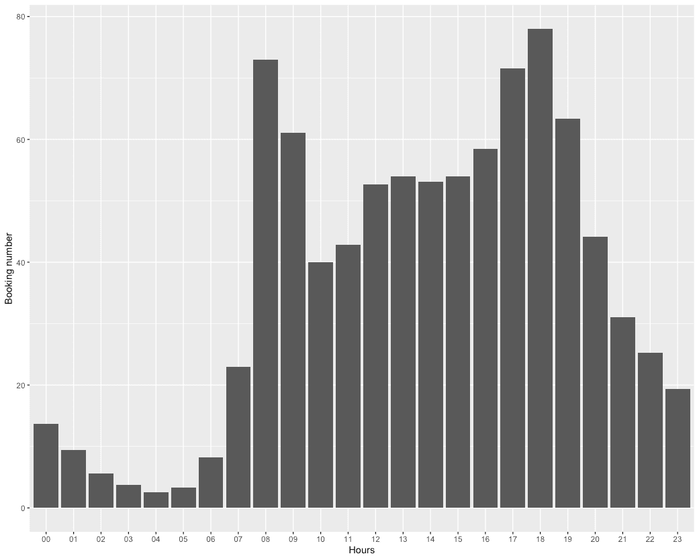
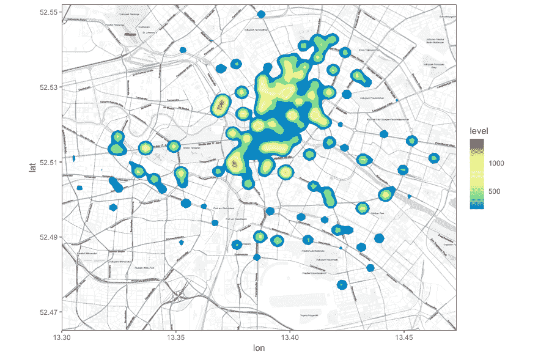
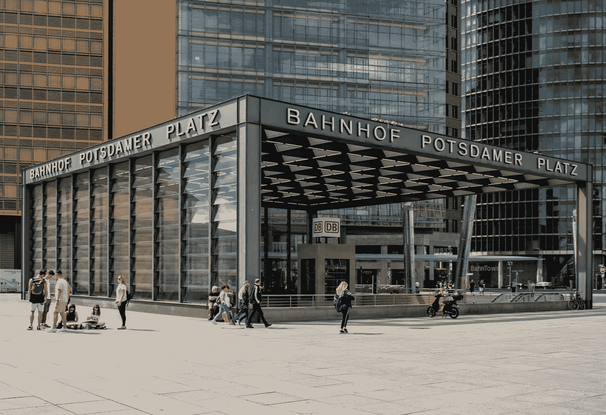
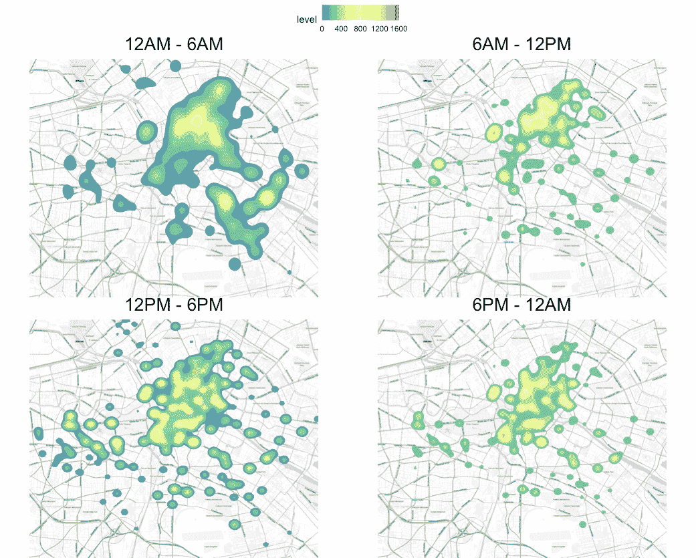
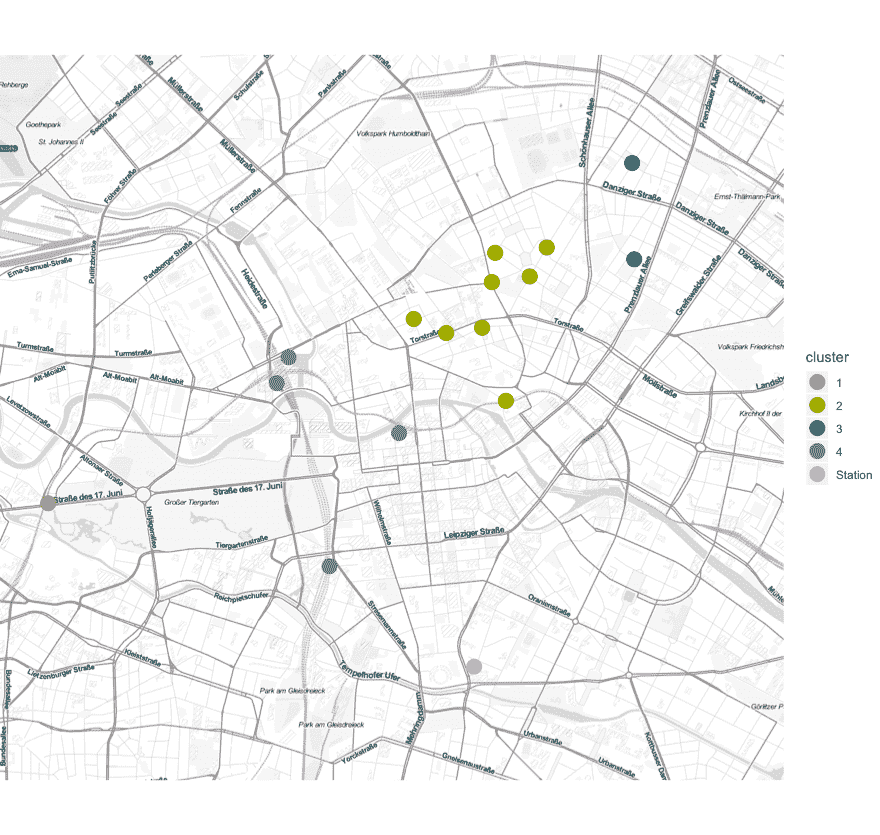
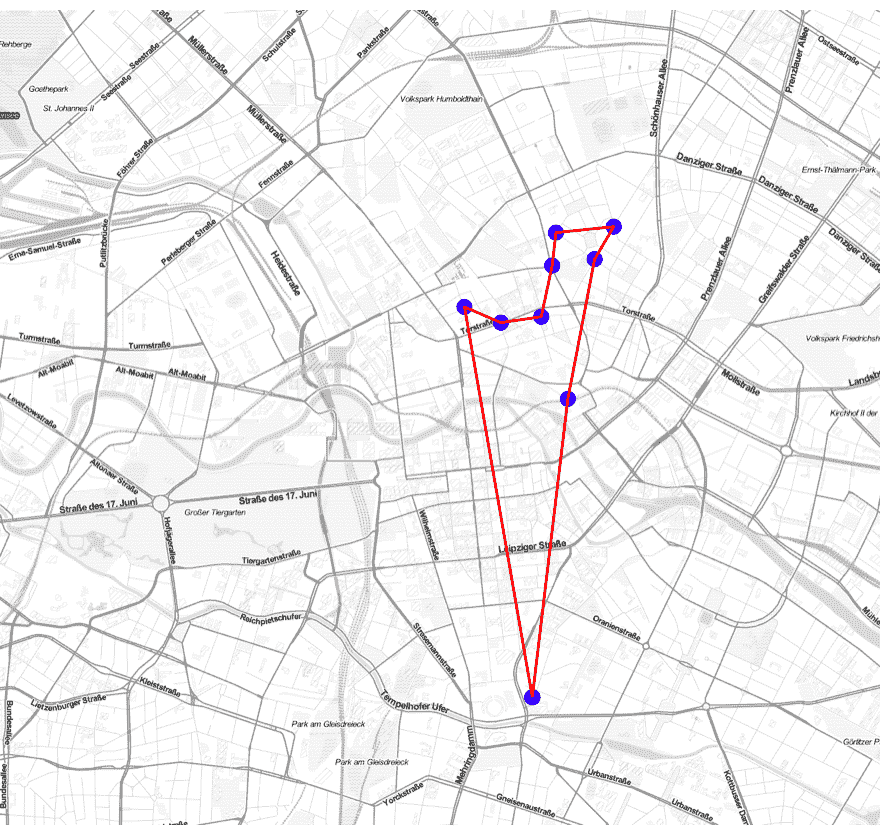
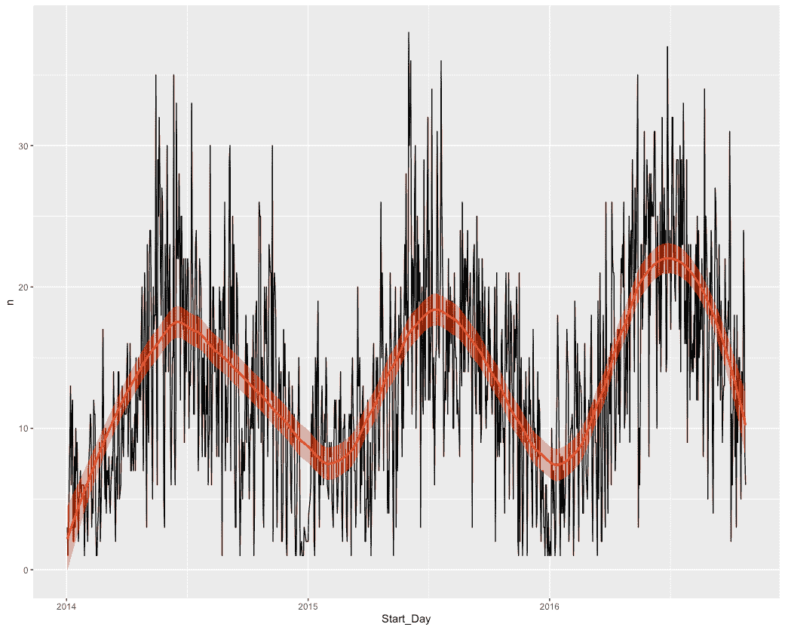
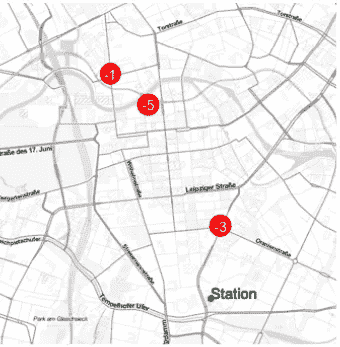
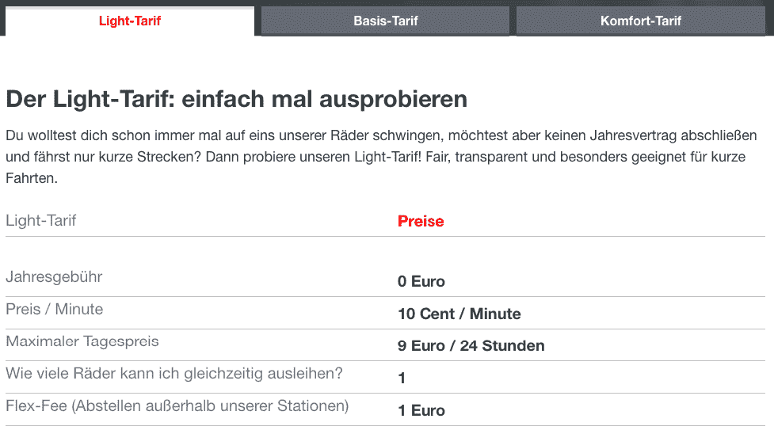

# 共享自行车夜间再平衡— DB 呼叫自行车

> 原文：<https://medium.com/mlearning-ai/share-bike-overnight-rebalancing-db-call-a-bike-43a11ab7c401?source=collection_archive---------4----------------------->

Call a bike in Berlin S-bahn Warschauer str.

# 介绍

共享单车使用一整天后，全市单车数量分布不均衡。让我们假设每天晚上有 60 辆自行车运输回柏林的车站，并准备第二天早上重新分配到新的地点。每辆卡车一次最多可以装 15 辆自行车，我们如何找到每天早上放自行车的最佳位置？

# 数据源

这些数据来自德国铁路公司的自行车开放数据库

 [## 呼叫自行车-开放-数据-门户-德国铁路数据 Bahn 门户

### 报道一个叫自行车的人。Konrad Kassel 和 Stadtrad Hamburg，exkl。Daten weiterer 合作伙伴…

data.deutschebahn.com](https://data.deutschebahn.com/dataset/data-call-a-bike) 

数据集来自整个德国，在这个用例中，我们只关注柏林。我们得到的数据

1.  2014 年 1 月至 2017 年 2 月的预订信息。这包括预订时间戳、开始租赁区域、结束租赁区域、租赁时间、距离…
2.  每个租赁区域的地理位置(纬度/经度)。

# 探索性分析

1.  繁忙时间:一天中不同时间点自行车的平均使用量

通过这个直方图，我们可以看到两个峰值:**早上 8-9 点和晚上 6-7 点。**很有意思！！！合理的猜测是，自行车是用来工作的，也许是在地铁站和办公室之间。这也意味着，我们的目标群体不是游客，而是上班族。

2.位置热图:

又很有意思！我们发现，不管什么时候，有两个地区非常受欢迎，显示在地图上。猜猜在哪里？柏林总站和波茨坦广场！有道理，附近有很多公司和观光点！

HBF BERLIN ([https://commons.wikimedia.org/](https://commons.wikimedia.org/))

Potsdamer platz (from wikipedia)

如果我们看不同的时间，我们可以发现热点在一天中的不同时间有很大的不同。

# 重新平衡自行车号码—解决方案 1

解决方案 1 非常简单。我们假设 4 辆卡车将在上午 8 点前一起离开车站，以便为第一个高峰准备自行车。那么我的解决方案如下

1.  在上午 8 点到 9 点这段时间内找到最热的 15 个地点
2.  使用 kmean 对 4 个集群的地理位置进行聚类
3.  优化 4 辆单独卡车的路线
4.  每辆卡车有 15 辆自行车，并根据不同地点的历史自行车数量比例分配这 15 辆自行车

**The most popular 15 location between 8–9 AM**

优化路线:以第二辆卡车为例，我们通过蛮力利用[哈密尔顿路径优化路线。](https://en.wikipedia.org/wiki/Hamiltonian_path_problem)

**但是！！！**

我们可以看到卡车 1 只有一个位置，这意味着 15 辆自行车将被丢弃在一个位置，这是不公平的。有一些潜在改进。

1.  优化位置的数量，可以超过 15 个位置，例如:每辆车至少需要去 4 个位置
2.  使用行驶距离而不是实际距离
3.  每个车站的自行车号码
4.  使用返回信息

*   我只使用了开始租赁的数量作为排名的受欢迎程度
*   #Start — #End >0:需要更多自行车
*   #Start — #End <0 : still some bikes available
*   #Start — #End =0 : balance

# Rebalancing bike number — Solution 2

Compare to solution 1, solution 2 is more model-based. I use time-spato model to predict the “Balance number” for each location. The figure below is the time series plot for one location, y-axis is the booking number.

We can see the obvious seasonal trend in general. The booking number in winter are fewer than in summer! If we look deeply, we can also see the weekly trend. The weekends are different than weekdays.

Based on the time and geographic information, we can “predict” the number for everyday. The solution 2 is as below

1.  Using time-spato model to predict the balance value for each location each day
2.  Calculate the difference from real value and expect value
3.  Cluster the neighborhood, to find the most demand area
4.  Optimize the route

For example, we can predict the expected bike numbers at Friday 28, August, 2020 in each location. Then we check the real bike number at 7 AM at that day and calculate the difference (-1, -5, +3…..as below). Based on the demand, we plan different route everyday.

The difference between expect bike numbers and real bike numbers

**但是！！！**

这对司机来说可能真的很困惑…每天都有不同的路线。有一些潜在改进。

1.  频繁地改变路线，不需要每天，而是每个月
2.  使用额外信息(天气、BVG 罢工……)
3.  不同的预测统计模型

泊松回归(【https://github.com/dssg/bikeshare】T2)

地理随机森林([https://www . tandfonline . com/doi/full/10.1080/10106049 . 2019 . 1595177](https://www.tandfonline.com/doi/full/10.1080/10106049.2019.1595177))

深度学习模型([https://arxiv.org/pdf/1906.04928.pdf](https://arxiv.org/pdf/1906.04928.pdf)):CNN/Graph CNN/LSTM

# 额外的想法

如果我真的要做这个项目，我会把价格信息作为考虑因素。利润最大化是每个公司的最终目标！！

自行车租赁有三种商业模式，([https://www.callabike.de/de/tarife](https://www.callabike.de/de/tarife))不幸的是，这并不在公开数据中。

# 结论

真的很酷的数据和可以预见的大量分析可以做！为了处理移动性数据，一个人需要拥有来自所有不同领域的各种知识(时间序列、地理信息、路线优化……)，这肯定是未来的热门话题之一！

 [## Mlearning.ai 提交建议

### 如何成为 Mlearning.ai 上的作家

medium.com](/mlearning-ai/mlearning-ai-submission-suggestions-b51e2b130bfb)