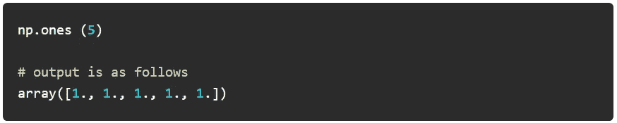
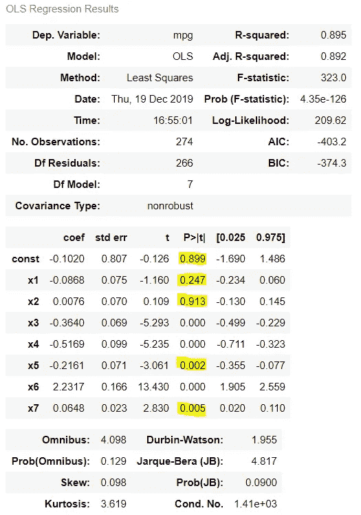
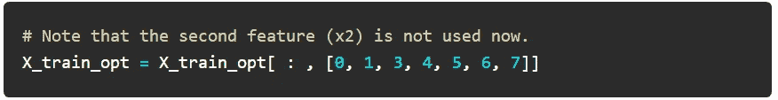
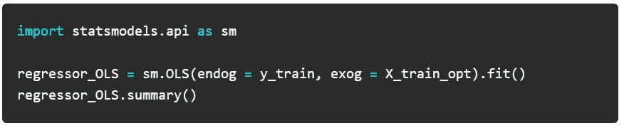
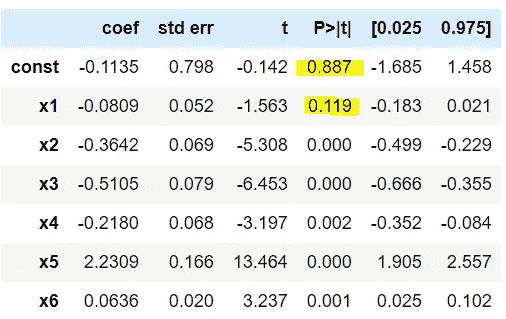
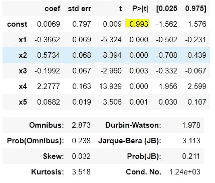
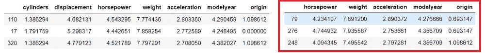
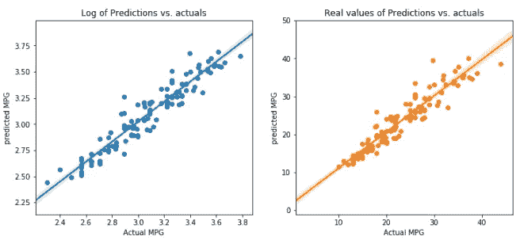

# 用于反向消除的简短 Python 代码，并附有详细解释

> 原文：<https://medium.com/mlearning-ai/short-python-code-for-backward-elimination-with-detailed-explanation-52894a9a7880?source=collection_archive---------0----------------------->

向后消除是一种高级的特征选择技术，用于选择最佳数量的特征。有时，使用所有功能可能会导致机器学习模型变慢或出现其他性能问题。

# 机器学习中的反向消去法简介

如果您的模型有几个特征，可能不是所有的特征都同样重要。一些特征实际上可以从其他特征中导出。因此，为了提高性能或准确性，您可以忽略一些特性。

有时，您必须亲自决定是保留衍生特征还是丢弃它们。例如，你的房子的总土地面积是从你的总土地的长度和宽度导出的字段。那么，我们能安全地从机器学习算法中移除总土地面积特征来预测房价吗？

这么想吧。你喜欢正面比正面小但在巷子深处的房子更宽的房子吗？因此，在这种情况下，我们必须保留两个冗余特征(长度或宽度)中的至少一个，以及总陆地面积特征。


为了确保您拥有最佳数量的特征，您必须遵循一些降维技术，如 lasso reduction(收缩较大的回归系数以减少过度拟合)、主成分分析(PCA)或[向后消除](https://fivestepguide.com/technology/machine-learning/backward-elimination-code-in-python-0321/)。

要开始使用 Python 中的[反向消除代码，首先需要准备好数据。第一步是添加一个由 1 组成的](https://fivestepguide.com/technology/machine-learning/backward-elimination-code-in-python-0321/)[数组](https://numpy.org/doc/stable/reference/generated/numpy.ones.html)(该数组的所有元素都是“1”)以使该回归算法工作——由 1 组成的数组表示分配给独立变量 X 的第一维的常数，通常称为 x0。



这里显示的代码可以作为[汽车里程预测文章](https://fivestepguide.com/technology/machine-learning/machine-learning-model-predict-car-mileage/)中编写的代码之后的代码步骤**。换句话说，向后消除的 python 代码是汽车里程预测文章的第 2 部分。**

**反向消除 python 代码**的步骤简述如下:


[https://fivestepguide.com/technology/machine-learning/backward-elimination-code-in-python-0321/](https://fivestepguide.com/technology/machine-learning/backward-elimination-code-in-python-0321/)

# 1.选择一个 P 值级别

通常，P 值的 5% [显著性水平对于正常情况是完美的。所以保持 P 值= 0.05](https://towardsdatascience.com/null-hypothesis-and-the-p-value-fdc129db6502)

# 2.用所有特征拟合模型

现在，让你的机器学习模型具备所有特性。如果您有 50 个特征，请将所有这些特征与测试数据集上的模型相匹配。

```
import statsmodels.api as sm X_train_opt = np.append(arr = np.ones((274,1)).astype(int), values = X_train, axis = 1) X_train_opt = X_train_opt[:,[0, 1, 2, 3, 4, 5, 6, 7]] regressor_OLS = sm.OLS(endog = y_train, exog = X_train_opt).fit()
regressor_OLS.summary()
```

输出是一个大的统计结果表。请注意，我们只对 P 值结果感兴趣(用黄色突出显示)。



# 3.哪个要素的 P 值最高？

记录所有特征的 P 值。此后，我们将搜索具有[最高 P 值](https://fivestepguide.com/technology/machine-learning/backward-elimination-code-in-python-0321/#predictor-with-highest-P-value)的特征。仅当其 P 值大于所选的显著性水平(如 0.05)时，才继续。否则，请将此视为最终的功能列表。

根据上面的截图，x1 和 x2 的 P 值大于显著性水平，x2 的值较高。

# 4.移除 P 值最高的要素

修改特征集，使其包含除上一步中确定的特征之外的所有特征。在我们的例子中，它是 x2。



# 5.再次拟合模型(步骤 2)，如果所有特征的 p 值都大于显著性水平，则停止拟合

现在使用 statsmodels.api 库对 python 代码的倒数第二步使用 OLS 函数进行向后消除。

现在拟合没有 x2 的模型。



现在，x1 的 P 值大于显著性水平。

如前所述，在 Python 中重复反向消除代码，直到我们移除 p 值高于显著性级别(即 0.05)的所有要素。

## 6.现在，移除 x1 并再次拟合模型

```
# Note that now the model is run without 1st and 2nd features
X_train_opt = np.append(arr = np.ones((274,1)).astype(int), values = X_train, axis = 1) X_train_opt = X_train_opt[:,[0,3, 4, 5, 6, 7]] regressor_OLS = sm.O#### LS(endog = y_train, exog = X_train_opt).fit() 
regressor_OLS.summary()
```



现在，您可以看到所有要素的 P 值都小于显著性级别。

# 用缩减的特征集测试 ML 模型性能

现在我们知道，我们的算法所需的最佳特征集只是特征号 3 到 7。因此，我们创建了另一个 X_train 和 X_test，仅具有特征号 3 到 7(在红色边框中)。

```
X_train2 = X_train.iloc[:,[2,3, 4, 5, 6]]
```



# 在减少的特征上尝试随机森林机器学习

现在，我们尝试使用随机森林模型来检查性能。

```
rf = RandomForestRegressor(n_estimators = 10)
rf.fit(X_train2,y_train)
y_pred = rf.predict(X_test2)import matplotlib.gridspec as gridspecfig = plt.figure(figsize=(12,5))
grid = gridspec.GridSpec(ncols=2, nrows=1, figure=fig)ax1 = fig.add_subplot(grid[0, 0])
ax2 = fig.add_subplot(grid[0, 1])sns.scatterplot(x = y_test['mpg'], y = y_pred, ax=ax1)
sns.regplot(x = y_test['mpg'], y=y_pred, ax=ax1)ax1.set_title("Log of Predictions vs. actuals")
ax1.set_xlabel('Actual MPG')
ax1.set_ylabel('predicted MPG')sns.scatterplot(x = np.exp(y_test['mpg']), y = np.exp(y_pred), ax=ax2,)
sns.regplot(x = np.exp(y_test['mpg']), y=np.exp(y_pred), ax=ax2)ax2.set_title("Real values of Predictions vs. actuals")
ax2.set_xlabel('Actual MPG')
ax2.set_ylabel('predicted MPG')
```



```
print(‘MAE:’, metrics.mean_absolute_error(y_test, y_pred))
print(‘MSE:’, metrics.mean_squared_error(y_test, y_pred))
print(‘RMSE:’, np.sqrt(metrics.mean_squared_error(y_test, y_pred)))Output →
MAE: 0.07700061119950408
MSE: 0.010134333336198278
RMSE: 0.1006694260249768
```

对于包含大量要素的大型数据集，您会发现 MAE 等方面存在明显差异。在特征完整和特征减少的随机森林之间。然而，这是一个具有很少特征的数据集，因此我们看不出预测的性能或准确性有多大差异。

感谢您阅读这篇文章。我在[机器学习主题](https://fivestepguide.com/technology/machine-learning/)下写过几篇这样的文章，拥有广泛的知识，尤其是关于机器学习基础的知识。你可能会喜欢点击“[数据科学](https://fivestepguide.com/technology/machine-learning/)”类别并阅读那些文章。

# 常见问题:特征选择有哪些不同的方法？

有几种维度减少或特征选择技术:
–套索减少:收缩大的回归系数以减少过度拟合
–主成分分析(PCA)
–丢弃相关变量以创建减少特征数据集
–丢弃衍生特征。这是一个判断性的决定。
–在使用随机森林
后，通过绘制独立变量的图表来消除识别后的特征–使用线性回归来选择基于‘p’值的特征
–向前选择，
–向后选择
–逐步选择

# 常见问题解答:什么是“维数灾难”？

它表示基础数据集的要素比可能需要的要多。
此外，如果你的特征多于观察值，你就有过度拟合的风险。观察值可能变得更加难以聚类。因为如果你有太多的维度，它会导致每个观察值看起来都很接近。
PCA 是最流行的降维技术。