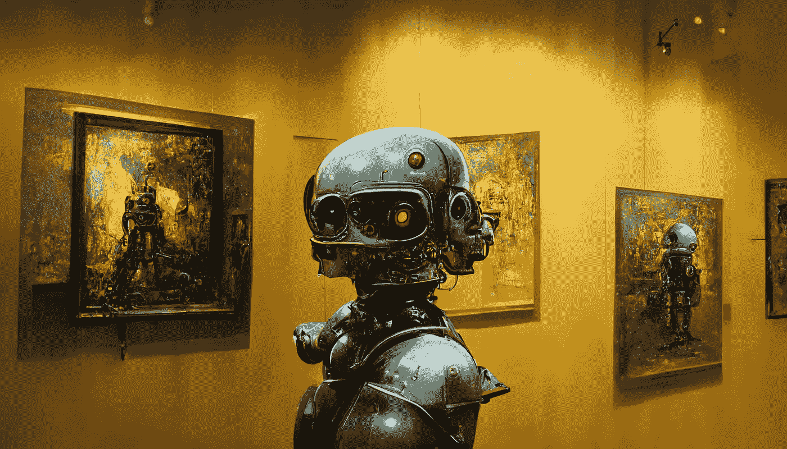

# AI 艺术应该算艺术吗？

> 原文：<https://medium.com/mlearning-ai/should-ai-art-be-considered-art-c09091c17e79?source=collection_archive---------3----------------------->

© A robot observing artwork at a gallery, made on Midjourney

我对艺术的最初记忆始于我在幼儿园拿起蜡笔的时候，我的老师告诉我的父母我有艺术天赋。

在我的学校生活中，我一直在画画、涂墨水和画画，并在高中毕业班被评为第二名最有艺术天赋的学生。我继续在纽约市*视觉艺术学校*学习艺术，并获得了美术学位。