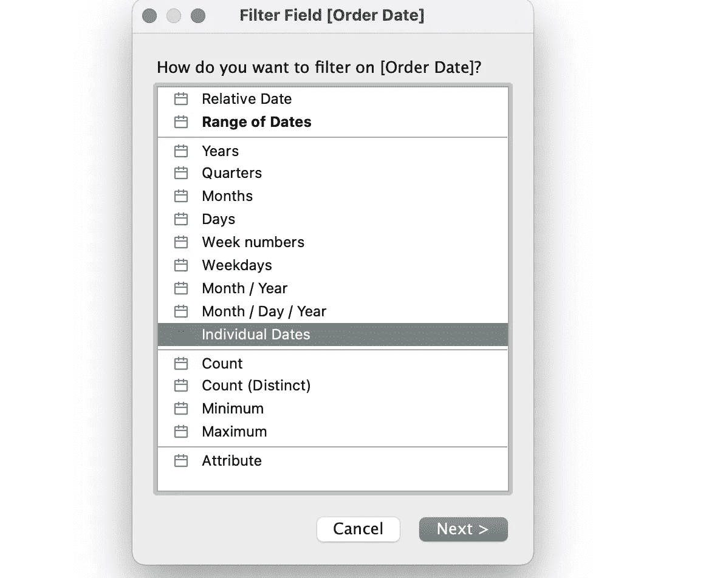
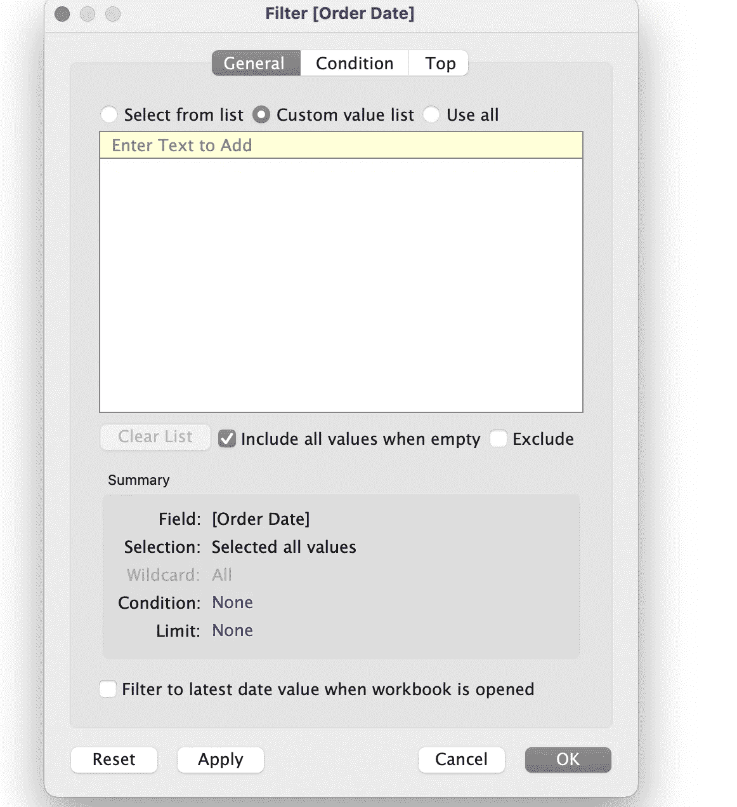
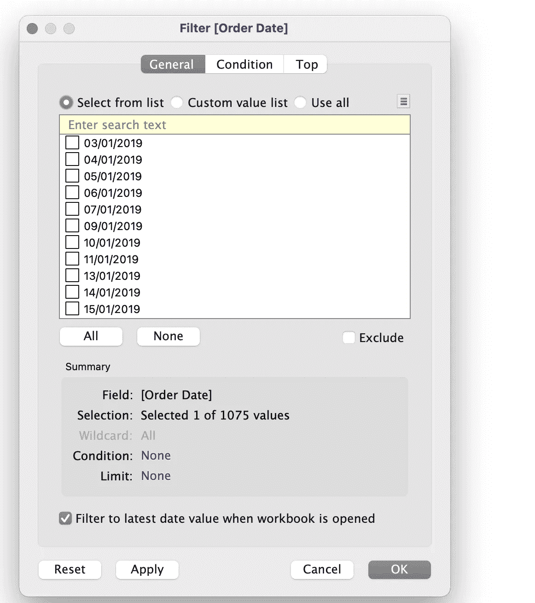
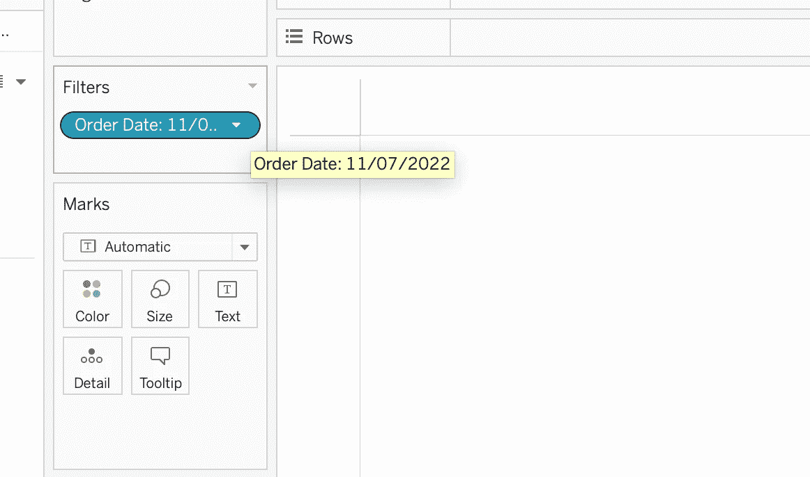
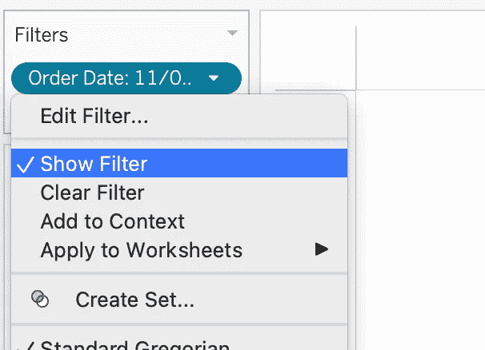
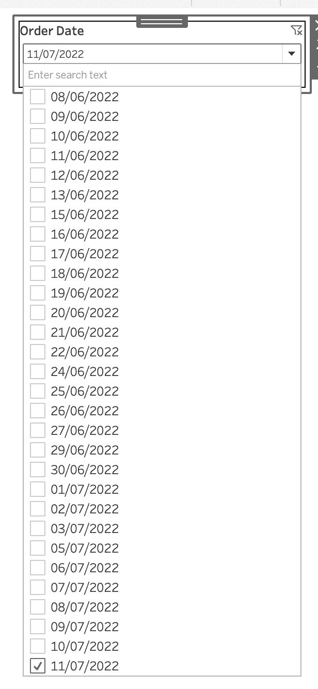

# 打开仪表板时在表格中显示最新数据

> 原文：<https://medium.com/mlearning-ai/show-latest-data-in-tableau-while-opening-a-dashboard-b1650dbb94fb?source=collection_archive---------3----------------------->

日期在大多数仪表板中起着至关重要的作用。无论是在文本表中、图形中还是在过滤器/参数中，它都成为了最重要的一列。

在本博客中，我们将讨论以下场景:

> **作为用户，无论何时打开仪表盘，都应该过滤掉，只显示最近日期的数据。也应该有选项来过滤任何过去的日期。**

让我们从步骤开始。

1.  连接到数据源以获取所有必需字段。
2.  根据要求，将所需的列拖到行、列和其他架子上。
3.  将订单日期拖至**过滤卡**并选择**单个日期**并选择**下一个**。

下一个屏幕将如下图所示:

4.从顶部转到 S **从列表**中选择选项卡，您将看到默认情况下所有日期都已被选择。

在该过滤窗口的底部有一个选项选择"**打开工作簿时过滤到最新的日期值**"。

5.现在选择上面的复选框选项，Tableau 将只选择数据集中可用的最新/最大日期。

正如您所看到的，它在 1075 个日期中只选择了一个值。

6.选择**应用**和**确定**关闭过滤窗口。

通过将鼠标悬停在过滤器卡中的日期过滤器上，我们可以看到它已过滤到工作表中的最新日期。

7.现在选择“显示过滤器”选项。

一切都结束了。

在这里，一旦仪表板打开，将选择最大/最晚日期。如果需要，用户也可以将日期更改为任何过去的日期。

我希望这篇文章对你有所帮助。谢谢你的阅读。

如果你喜欢这篇文章，那么不要忘了鼓掌并分享以获得更好的效果。

 [## Mlearning.ai 提交建议

### 如何成为移动人工智能的作者

medium.com](/mlearning-ai/mlearning-ai-submission-suggestions-b51e2b130bfb)