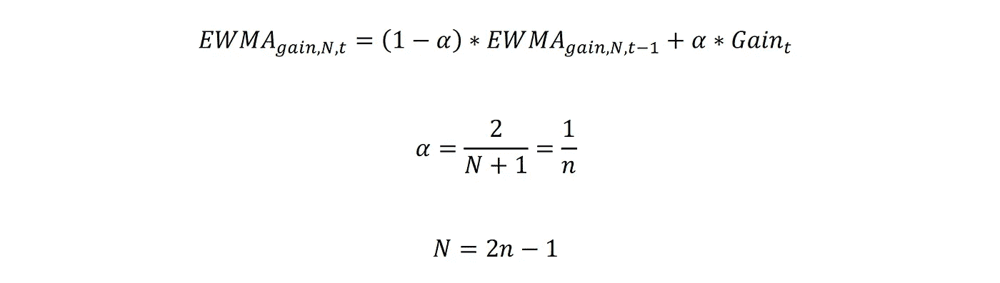
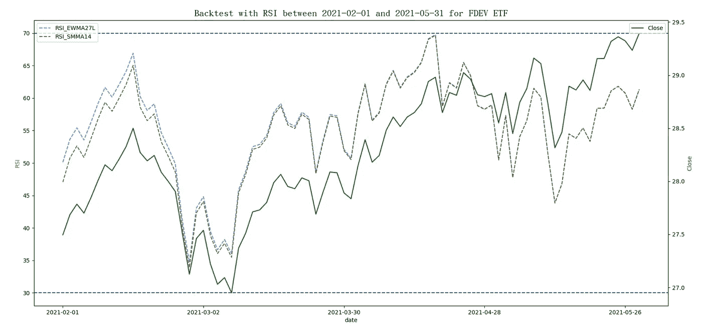
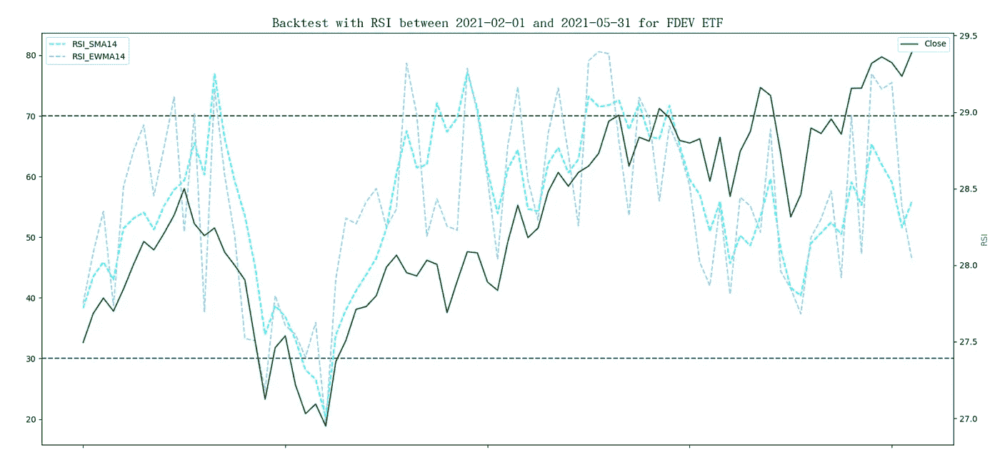
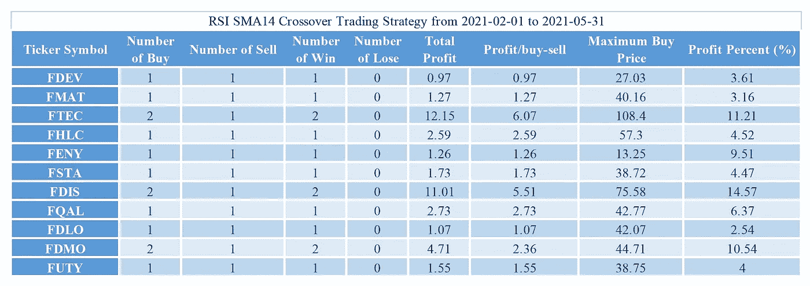
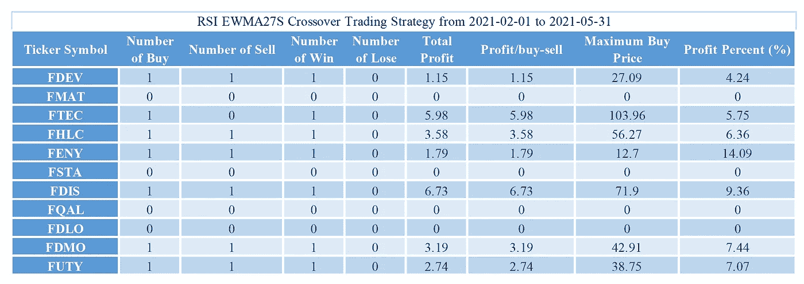
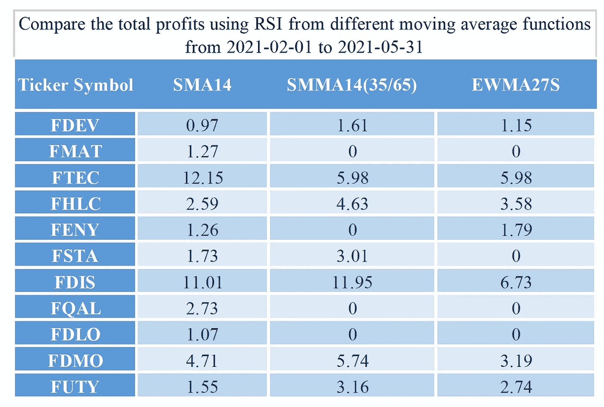

# 移动平均函数对 RSI 交叉策略回测结果的显著影响

> 原文：<https://medium.com/mlearning-ai/significant-influence-of-the-moving-average-function-on-the-backtest-results-of-the-rsi-crossover-efbabb07904d?source=collection_archive---------2----------------------->

在我之前的文章中，“[哇！回测 RSI 交叉策略在 Elasticsearch](/geekculture/wow-backtest-rsi-crossover-strategy-in-elasticsearch-1cdf837a72a1) 中，我们介绍了如何使用 Elasticsearch 实现相对强弱指标(RSI)指标来获得回测结果。本文中 RSI 的计算使用简单移动平均线(SMA)函数。然而，RSI 的原始作者 J. Welles Wilder 使用了他自己的平滑方法，这是指数平均的一种不同形式。在本文中，我们将使用不同的移动平均函数进行深入研究，并考察哪一个可以获得更好的回测结果。建议读者快速浏览一下我之前的文章，对 RSI 和使用 Elasticsearch 的实现细节有一个基本的了解。
RSI 指标发表在 1978 年怀尔德的《技术交易系统新概念》一书中。这本书还介绍了其他众所周知的指标，包括抛物线转向指标，平均真实范围(ATR)，和概念定向运动(ADX)。RSI 是一个动量指标，它的等式可以写成这样，其中 MA *增益，n* 和 MA *损失，n* 分别是近期收益的移动平均线和近期损失的移动平均线。默认情况下，周期 n 为 14。


RSI 交叉策略定义了 RSI 在指定值的交叉，以指示超买(> 70)和超卖(< 30) signals. For other RSI values, just wait for the signal. Now, using different types of moving average functions will produce different RSI values and have a significant impact on the backtest results. Wilder’s smoothing method for the recent gain (Gain *t* )在时间 *t* 可以写成如下，其中变量 *t* 代表时间 *t* 的时间戳。


根据维基百科中的[移动平均文档，怀尔德的平滑平均属于修正移动平均(MMA)、运行移动平均(RMA)、或平滑移动平均(SMMA)的类型。当 *n* =14 时，SMMA 的第一个有效值是前 14 个周期增益的平均值。此后，在时间戳 *t* 的 SMMA 将等于当前增益的 1/14 加上前一个时间戳的 SMMA 的 13/14。](https://en.wikipedia.org/wiki/Moving_average#Exponential_moving_average)


根据文章，EWMA 可以这样写，其中 *N* 是 EWMA 时期， *n* 是 SMMA 时期。



所以 n 期 SMMA 相当于 2 *n* -1 指数移动平均线(EWMA)。由于 *n* =14 是 RSI 的默认值，所以在使用 EWMA 时， *N* 应该是27、 *α* =0.071428571。在本文中，我们试图说明移动平均线函数对 RSI 指标的影响是显著的。用图表来观察数值的变化要容易得多。在本文中，我们尝试将回溯测试应用于免佣金的交易所交易基金(ETF ),并将重点放在作为分析工具的弹性搜索上。下面的例子随机选择“富达国际多因子 ETF”。它的股票代码是 FDEV。将运行另外 10 只随机选择的 ETF，稍后将显示最终结果。数据选自投资者交易所 IEX 提供的 2021 年 2 月 1 日至 2021 年 5 月 31 日的时间范围。在下面的两个图表中，不同类型的移动平均线函数的 RSI 与每日收盘价一起绘制。第一个图表显示了 SMMA14 和 EWMA27L 的 RSI，其中 27L 表示计算使用了更长的移动窗口，大约 110 个数据点，用于 Elasticsearch 的 EWMA 函数。基本上，根据上述等式，当前的 EWMA 计算包括所有先前的数据点。RSI_EWMA27L 和 RSI_SMMA14 两条线一开始有一点空隙，后来在 2021–03–30 左右重叠。读者应注意使用足够数量的数据点来计算第一个有效的 RSI 值。但是，RSI_SMMA14 不敏感，不会产生任何高于 70 或低于 30 的值。



第二张图显示了 SMA14 和 EWMA27S 的 RSI，其中 27 表示计算使用更短的移动窗口，27 个数据点，用于 Elasticsearch 的 EWMA 函数。EWMA27S 的 RSI 似乎过于敏感，会产生大量信号，而 SMA14 的 RSI 只能接受。



让我们描述一下使用 Elasticsearch 的实现。假设有一个用数据填充的 Elasticsearch 索引，其使用的数据映射与上一篇论文中描述的相同。以下步骤演示了 REST API 请求体的代码。

> 通过搜索操作收集所有相关文件

使用带有“must”子句的“bool”查询来收集符号为 FDEV 且日期在 2021–02–01 和 2021–05–31 之间的文档。由于移动平均的计算，额外数据调整为 1.5 个月(从 2020 年 12 月 15 日到 2021 年 1 月 31 日)。

```
{
    "query": {
        "bool": {
            "must": [
                {"range": {"date": {"gte": "2020-12-15", "lte": "2021-05-31"}}},
                {"term": {"symbol": "FDEV"}}
            ]
        }
   },
```

> 从交易日中选择凭证

使用名为 Backtest_RSIs 的“date_histogram”聚合，参数“field”为“date ”,参数“interval”为“1d ”,提取基金每天的价格。然后是一个名为 SDaily 的“bucket_selector”聚合，通过选择文档数大于 0 的存储桶来过滤空存储桶(非交易日)。

```
 "aggs": {
        "Backtest_RSIs": {
            "date_histogram": {
                "field": "date",
                "interval": "1d",
                "format": "yyyy-MM-dd"
            },
             "SDaily": {
                 "bucket_selector": {
                     "buckets_path": {"count":"_count"},
                         "script": "params.count > 0"
                }
            },
```

> 提取收盘价

一个名为 Close 的“平均”聚合，用于检索收盘价，因为后续的管道聚合不能直接使用文档字段。

```
 "aggs": {
                "Close": {
                    "avg": {"field": "close"}
                },
```

> 计算连续两个交易日的收盘价之差

使用名为 DClose 的“衍生”聚合，并使用参数“buckets_path”指定每日收盘值，以计算与前一个值的差异。

```
 "DClose": {
                    "derivative": {"buckets_path": "Close"}
                },
```

> 消除没有 DClose 值的文档

使用名为 SDClose 的“bucket_selector”聚合来筛选出没有 DClose 值的存储桶。

```
 "DClose": {
                    "derivative": {"buckets_path": "Close"}
                },
```

> 确定每日值相对于之前的数据是盈利还是亏损

使用两个名为 Gain 和 Loss 的“bucket_script”聚合，并使用参数“buckets_path”指定 DClose 聚合的结果来确定值。两个值都必须是正值或零值。

```
 "Gain": {
                    "bucket_script": {
                        "buckets_path": {DClose": "DClose"},
                        "script": "(params.DClose > 0) ? params.DClose : 0"
                    }
                }, 
                "Loss": {
                    "bucket_script": {
                        "buckets_path": {"DClose": "DClose"}, 
                        "script": "(params.DClose < 0) ? -params.DClose : 0"
                    }
                },
```

> 计算盈亏的 14 天简单移动平均线

使用两个“移动 _fn”聚合，命名为 GainSMA14 和 LossSMA14，参数 window 为 14，参数“buckets_path”分别为增益和损耗。参数“shift”设置为 1，以包括当天和过去 13 个交易日的数据。SMA 是使用未加权平均函数(MovingFunctions.unweightedAvg)计算的。

```
 "GainSMA14": {
                    "moving_fn": {
                        "script": "MovingFunctions.unweightedAvg(values)", 
                        "window": 14, "buckets_path": "Gain", "shift":1
                    }
                },
                "LossSMA14": {
                    "moving_fn": {
                        "script": "MovingFunctions.unweightedAvg(values)", 
                        "window": 14, "buckets_path": "Loss", "shift":1
                    }
                },
```

> 计算收益和损失的 27 天指数移动平均线

使用四个名为 GainEWMA27S、LossEWMA27S、GainEWMA27L 和 LossEWMA27L 的“移动 _fn”聚合，对于较短的移动窗口，参数 window 为 27，对于较长的移动窗口，参数 window 为 110。参数“buckets_path”分别作为增益和损耗。参数“shift”设置为 1，以包括当天和过去交易日的数据。EWMA 通过使用α值等于 0.071428571 的指数移动平均函数(MovingFunctions.ewma)来计算。

```
 "GainEWMA27S": {
                    "moving_fn": {
                        "script": "MovingFunctions.ewma(values, 0.071428571)", 
                        "window": 27, "buckets_path": "Gain", "shift":1
                    }
                },
                "LossEWMA27S": {
                    "moving_fn": {
                        "script": "MovingFunctions.ewma(values, , 0.071428571)", 
                        "window": 27, "buckets_path": "Loss", "shift":1
                    }
               },
               "GainEWMA27L": {
                   "moving_fn": {
                       "script": "MovingFunctions.ewma(values, 0.071428571)", 
                       "window": 110, "buckets_path": "Gain", "shift":1
                   }
               },
               "LossEWMA27L": {
                   "moving_fn": {
                       "script": "MovingFunctions.ewma(values, , 0.071428571)", 
                       "window": 110, "buckets_path": "Loss", "shift":1
                   }
               },
```

> 计算 RSI

使用三个名为 RSISMA14、RSIEWMA27S 和 RSIEWMA27L 的“bucket_script”聚合，并使用参数“buckets _ path”来指定它们的 GainSMA 和 LossSMA 的结果。然后根据脚本中它们的方程计算出相应的 RSI 指标。

```
 "RSISMA14": {
                    "bucket_script": {
                        "buckets_path": {"GainSMA14": "GainSMA14", "LossSMA14": "LossSMA14"}, 
                        "script": "100 - 100/(1+params.GainSMA14/params.LossSMA14)"
                    }
                },                 
                "RSIEWMA27S": {
                    "bucket_script": {
                        "buckets_path": {"GainEWMA27S": "GainEWMA27S", "LossEWMA27S": "LossEWMA27S"}, 
                        "script": "100 - 100/(1+params.GainEWMA27S/params.LossEWMA27S)"
                    }
                }, 
                "RSIEWMA27L": {
                    "bucket_script": {
                        "buckets_path": {"GainEWMA27L": "GainEWMA27L", "LossEWMA27L": "LossEWMA27L"}, 
                        "script": "100 - 100/(1+params.GainEWMA27L/params.LossEWMA27L)"
                    }
                },
```

> 由于 SMMA14 的定义涉及到它之前的值，所以在 Elasticsearch 中没有办法指定这样的公式。如果读者知道怎么做，请发表评论贡献你的作品。SMMA14 和交叉交易策略的计算将在 Python 程序中完成。该计划包括四个部分。

◆使用 JSON 格式读取包含 Elasticsearch REST API 请求体的开始日期、结束日期、符号标记和文件名的命令行参数。
◆根据参数从 Elasticsearch 服务器获取数据。
◆解析响应数据，处理买卖交易。
◆报告每个 RSI 的回溯测试统计数据。
主要功能如下所示:

```
def main(argv):
    input_file, start_date, end_date, symbol = get_opt(argv)
    resp = get_data(input_file, start_date, end_date, symbol)
    transactions = parse_data(resp, start_date)
    report(transactions, 'RSISMA14')
    report(transactions, 'RSIEWMA27S')
    report(transactions, 'RSISMMA14')
```

在本文中，只显示了 SMMA 的代码段和买入或卖出信号的确定。读者可以进一步参考 GitHub 上的开源项目 [Backtest_RSIs](https://github.com/wtwong316/Backtest_RSIs) 。parse_data 函数如下所示。最后，事务数组将包含有效信号。由于 RSIEWMA27L 的 RSI 相当于 RSISMMA14 的 RSI，所以跳过 RSIEWMA27L 的交易。

```
# parse the response data and refine the buy/sell signal
def parse_data(resp, start_date):
    result = json.loads(resp)
    if "status" in result:
        print("Return status: %s, error: %s" % (result['status'], result['error']))
        sys.exit(-1)
    aggregations = result['aggregations']
    if aggregations and 'Backtest_RSIs' in aggregations:
        Backtest_RSI = aggregations['Backtest_RSIs']
        transactions = []
        initGain = 0
        initLoss = 0
        wsGain = 0
        wsLoss = 0
        count = 0
        if Backtest_RSI and 'buckets' in Backtest_RSI:
            for bucket in Backtest_RSI['buckets']:
                transaction = {}
                transaction['date'] = bucket['key_as_string']
                transaction['Close'] = bucket['Close']['value']
                transaction['RSISMA14'] = "hold" if 'RSISMA14' not in bucket else ("buy" if bucket['RSISMA14']['value'] < 30 else   ("sell" if bucket['RSISMA14']['value'] > 70 else "hold"))
                transaction['RSIEWMA27S'] = "hold" if 'RSIEWMA27S' not in bucket else ("buy" if bucket['RSIEWMA27S']['value'] < 30 else                        ("sell" if bucket['RSIEWMA27S']['value'] > 70 else "hold")) count += 1
                if count <= 14:
                    initGain += bucket['Gain']['value']
                    initLoss += bucket['Loss']['value']
                    wsGain = initGain/count
                    wsLoss = initLoss/count
                else:
                    wsGain = (13 * wsGain + bucket['Gain']['value'])/14
                    wsLoss = (13 * wsLoss + bucket['Loss']['value'])/14
                    wsRSI = 100 - 100/(1+wsGain/wsLoss)
                    transaction['RSISMMA14'] = "buy" if wsRSI < 30 else ("sell" if wsRSI > 70 else "hold") if transaction['date'] >= start_date:
                    transactions.append(transaction)
```

为了确保一次买入并持有一股，在持有的股票卖出之前不发生交易，我们使用布尔变量“hold”来确保交易满足以下条件。
◆A 买入信号在持有标志为假时生效
◆A 卖出信号在持有标志为真时生效
读者可以进一步参考开源项目中的交易策略报告功能。python 程序提供交易策略的统计数据，包括整个买卖交易的“赢”和“输”，如下所示:

```
$ ./backtest_rsis.sh -i backtest_rsis.json -s FDEV -b 2021-02-01 -e 2021-05-31
input_file 'backtest_rsis.json', start_date '2021-02-01', end_Date '2021-05-31', symbol 'FDEV'
--------------------------------------------------------------------
RSISMA14
number of buy:             1
number of sell:            1
number of win:             1
number of lose:            0
total profit:           0.97
profit/transaction:     0.97
maximum buy price:     27.03
profit percent:         3.61%
--------------------------------------------------------------------
RSIEWMA27S
number of buy:             1
number of sell:            1
number of win:             1
number of lose:            0
total profit:           0.83
profit/transaction:     0.83
maximum buy price:     27.12
profit percent:         3.05%
--------------------------------------------------------------------
RSISMMA14
number of buy:             0
number of sell:            0
number of win:             0
number of lose:            0
total profit:           0.00
maximum buy price:      0.00 
--------------------------------------------------------------------
```

以下三个表格收集了从 2021 年 2 月 1 日到 2021 年 5 月 31 日使用 RSISMA14 和 RSIEWMA27S 随机挑选的 11 只 ETF 的所有统计数据，用于 RSI 交叉交易策略。使用 SMMA14 时未生成有效交易。从观察的角度来看，RSISMA14 可以提供更好的交易结果。使用 RSIEWMA27S 时，11 只基金中有 4 只没有有效的交易信号。



如果在 SMMA14 的情况下考虑降低交叉值的标准，比如下限是 35，上限是 65，那么可以获得更好的交易结果。下表显示 11 个交易中有 7 个交易有效。


如果在交易中只考虑这 7 只基金，那么使用 35 和 65 作为两个边界的 SMMA14 的总回报略好于 SMA14。EWMA27S 的总回报比另外两个少。简而言之，如题，均线函数对 RSI 交叉策略的回测结果影响显著。



备注:
一、感谢 IEX(投资者交易所)提供 ETF 数据，GitHub 提供开源项目存储。
二。本文基于一种技术思路，不构成任何投资建议。读者在使用时必须承担自己的责任。
三。文章可能还有错误，恳请读者指正。
四。感兴趣的读者可以参考作者撰写的《弹性搜索的基本技巧》一书。《高级弹性搜索 7.0》，2019 年 8 月，Packt，ISBN: 9781789957754。