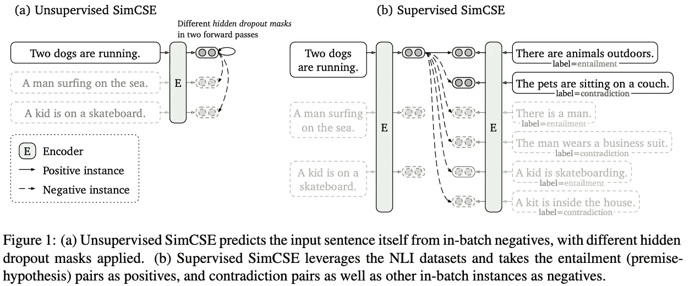
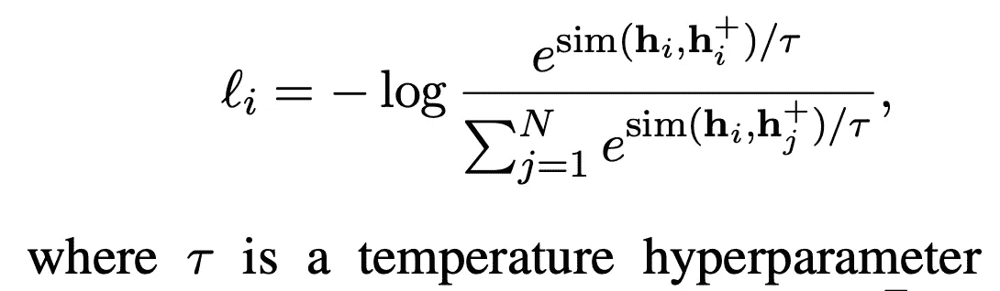
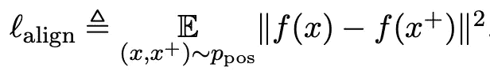
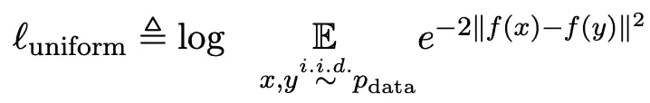
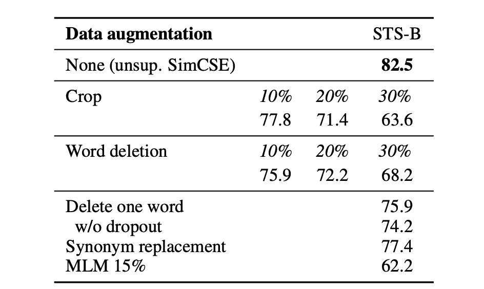
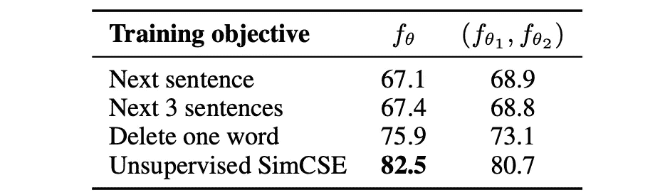
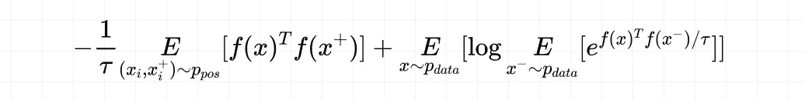
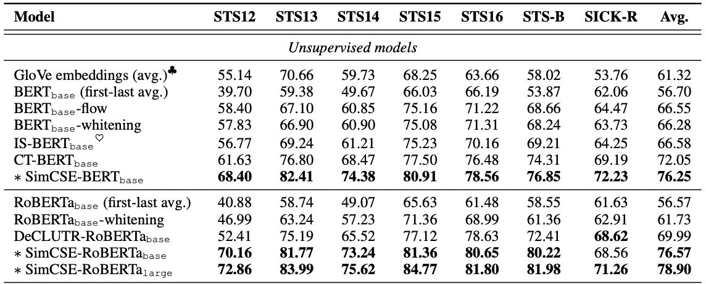

# SimCSE:句子嵌入的简单对比学习

> 原文：<https://medium.com/mlearning-ai/simcse-simple-contrastive-learning-of-sentence-embeddings-54e90a99cc2c?source=collection_archive---------1----------------------->

Photo by [Geoff Pinkney](https://unsplash.com/@geoffpinkney?utm_source=unsplash&utm_medium=referral&utm_content=creditCopyText) on [Unsplash](https://unsplash.com/s/photos/two-trees?utm_source=unsplash&utm_medium=referral&utm_content=creditCopyText)

句子级表示一直是自然语言处理中的一个热门话题。在 BERT 之前，我们使用 word2vec 模型对句子中的单词嵌入进行平均。在 BERT 时代，我们通过使用 CLS 令牌来获得句子级表示，从而利用大型语言模型。

本文介绍了 SimCSE(简单对比句嵌入框架)，一篇在 EMNLP2021 上被接受的论文。[纸张](https://arxiv.org/abs/2104.08821)和[代码](https://github.com/princeton-nlp/SimCSE)。

From paper. We will only discuss the left part.

我将分四个部分介绍这篇论文:对比学习背景、无监督模拟、各向异性和实验结果。请注意，本文还讨论了监督版本，但这不是本文的重点。

## 对比学习背景

对比学习的目标是聚类相似的数据点，并在嵌入空间中“推开”不相似的数据点。输入是一组成对的例子，其中两个数据点在语义上是相关的。那么训练目标如下所示，其中 h 是从 BERT 模型嵌入的句子。

From paper. Performance is the highest when \tau is 0.05

通常，我们必须在小批量中构建配对。在 CV 任务中，我们可以简单地旋转或翻转图片，以获得高质量的“语义”相关的图片。但是在 NLP 任务中，对句子的一个简单的修改，甚至一个简单的转换都可能彻底改变抽象的意思。

本文的主要贡献是使用标准的 dropout 运算来生成高质量的训练对。它是可扩展的，在 NLP 任务中使用的常规数据扩充中更好。

我们如何衡量对比学习的质量？答案是对齐和统一。比对用于计算配对之间距离的期望值，而一致性用于测量嵌入的展开程度。(假设嵌入在潜在空间中形成了一个超球面)详细的分析，请查看[的论文](http://proceedings.mlr.press/v119/wang20k/wang20k.pdf)“通过超球面上的对齐和一致理解对比表征学习”。

Alignment formula

Uniformity formula

## 无监督 SimCSE

给定一组句子，我们使用同一个句子两次作为输入，由于 BERT 模型中的丢失操作，将得到两个不同的嵌入。然后我们使用这两个作为训练目标的正对。这在概念上非常有用和简单:即使从一开始对于同一个句子，嵌入也不会相同，因此最小的数据扩充自然也是如此。

在下图中，作者比较了标准删除和其他增强技术的性能，如裁剪、单词删除、同义词替换或屏蔽语言模型。

From paper. Comparison of data augmentations on STS-B development set (Spearman’s correlation)

此外，本文还表明，无监督 SimCSE 的训练目标优于传统的下一句预测和两个分离的编码器。

根据实验，当辍学率为 **0.1** 时，性能最佳。

## 各向异性问题

它指的是学习到的嵌入在向量空间中占据一个狭窄的锥，这严重限制了它们的表达能力。这自然与一致性有关，两者都说嵌入应该均匀地分布在潜在空间中。

以前解决这个问题的两种方法是:

*   后处理:消除主要主成分或将嵌入映射到各向同性分布。查看这篇[论文](https://arxiv.org/pdf/2103.15316.pdf)“白化句子表示以获得更好的语义和更快的检索”了解更多信息。
*   训练时添加正则化:查看这篇[论文](https://openreview.net/forum?id=ByxY8CNtvr)“用频谱控制改进神经语言生成”关于频谱控制。

本文中对比学习的训练目标可以用下面的等式来表达，其中第一项保持正例相似，第二项将负例分开:

## STS 基准测试任务的结果

> 2012 年至 2016 年的语义文本相似性(STS)基准测试任务(STS12，STS13，STS14，STS15，STS16，STS-B)基于两种表示的余弦相似性来测量两个句子的相关度。评价标准是皮尔逊相关。
> 
> 病态相关度(SICK-R)任务训练一个线性模型，以输出从 1 到 5 的分数，指示两个句子的相关度。对于同一个数据集(SICK-E)，可以使用蕴涵标签(类是“蕴涵”、“矛盾”和“中性”)将它视为三类分类问题。SICK-R 的评估度量是 SICK-E 的皮尔逊相关性和分类准确度。

SimCSE 的 SOTA 结果如下所示:

Here I only show the unsupervised result.

## 参考

*   [https://arxiv.org/abs/2104.08821](https://arxiv.org/abs/2104.08821)
*   [https://github.com/princeton-nlp/SimCSE](https://github.com/princeton-nlp/SimCSE)
*   苏建林，曹家润，，欧。
    2021。用于 bet-
    ter 语义和更快检索的白化句子表示。arXiv 预印本
    arXiv:2103.15316。[https://arxiv.org/pdf/2103.15316.pdf](https://arxiv.org/pdf/2103.15316.pdf)
*   王、、、胡、、、顾。2020.利用频谱控制改善神经语言生成。在 ICLR 召开的国际学术会议上。【https://openreview.net/forum?id=ByxY8CNtvr 
*   王彤宙和菲利普·伊索拉。2020.通过超球面上的对齐和一致来理解对比表征学习。Inter
    机器学习全国会议(ICML)
    第 9929–9939 页。[http://proceedings.mlr.press/v119/wang20k/wang20k.pdf](http://proceedings.mlr.press/v119/wang20k/wang20k.pdf)
*   [http://NLP progress . com/English/semantic _ textual _ similarity . html](http://nlpprogress.com/english/semantic_textual_similarity.html)

 [## Mlearning.ai 提交建议

### 如何成为 Mlearning.ai 上的作家

medium.com](/mlearning-ai/mlearning-ai-submission-suggestions-b51e2b130bfb)