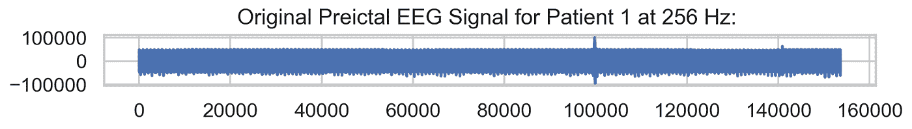
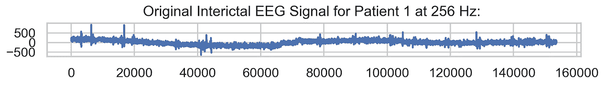
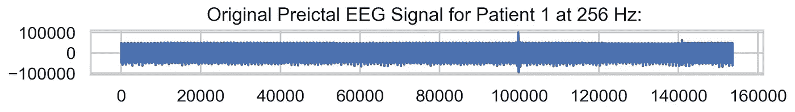
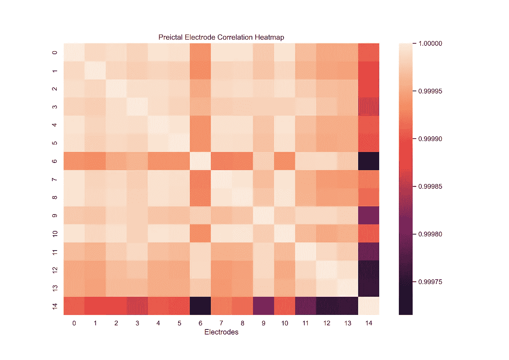
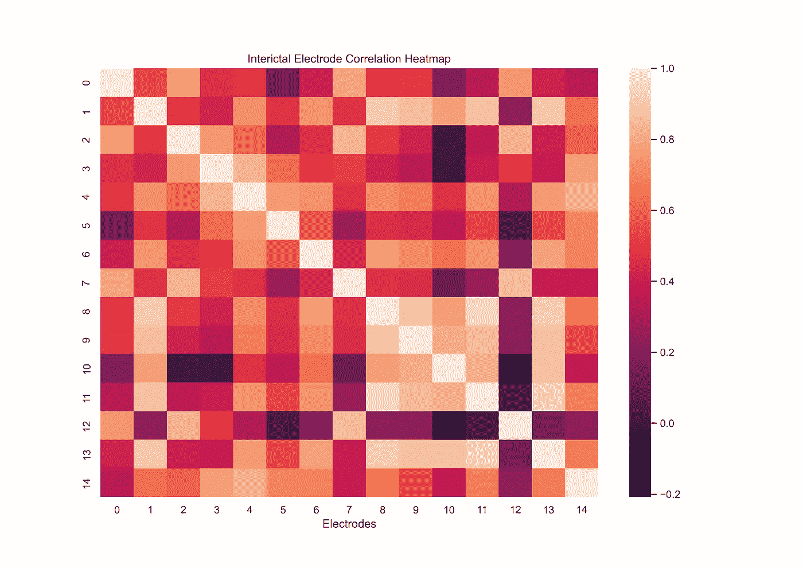
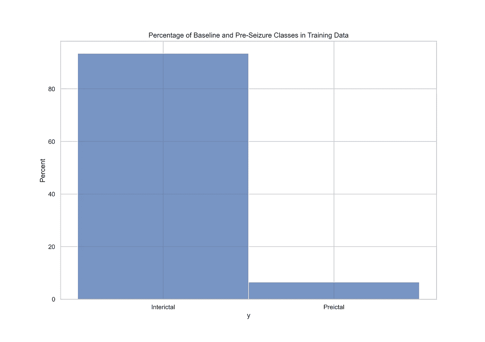
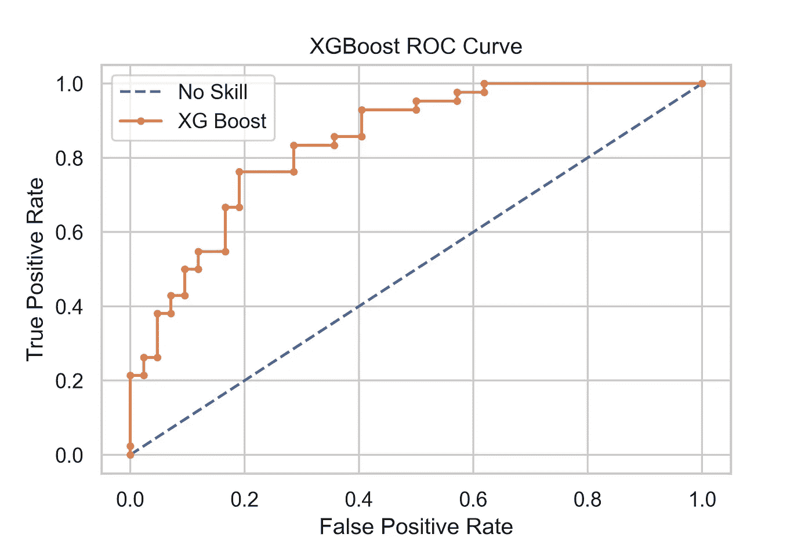

# 小波特征工程在脑电发作预测中的应用

> 原文：<https://medium.com/mlearning-ai/simple-feature-engineering-for-eeg-seizure-prediction-42a7e0ba579?source=collection_archive---------2----------------------->

## 基于小波分解的脑电活动癫痫发作前状态分类

Photo by [Moritz Kindler](https://unsplash.com/@moritz_photography?utm_source=medium&utm_medium=referral) on [Unsplash](https://unsplash.com?utm_source=medium&utm_medium=referral)

首先:你如何预测癫痫发作？如果你曾经看过 Tiktok 上那些流行的视频，视频中的狗提醒它们的主人即将到来的癫痫发作，那么你知道这些狗肯定察觉到了一些事情:它们可以用它们的超级感官能力察觉到一些变化。

这个项目的目标是利用注意到这种变化的能力。使用测量大脑中电活动的脑电图(EEG)信号来识别即将发作活动(发作前)和基线大脑活动(发作间期)之间的差异。

Photo by [Richard Brutyo](https://unsplash.com/@richardbrutyo?utm_source=medium&utm_medium=referral) on [Unsplash](https://unsplash.com?utm_source=medium&utm_medium=referral)

这个想法是，如果狗能做到，我们也应该能做到。

这样做的原因不仅仅是求知欲或与我们的犬类同伴的友好竞争:如果我们能够可靠地预测何时癫痫即将发作，我们就可以创造出可穿戴技术，在癫痫患者失去认知或运动控制之前向他们发出警报*。*

这将是一项改变生活的服务，不仅是对癫痫患者，也是对与他们分享生活的朋友、家人和爱人。患有癫痫症的人可以获得一个安全的空间来应对即将到来的癫痫发作，而患有癫痫症的儿童的父母可以更好地准备支持他们的孩子，而不会措手不及。

这项技术不能治愈，但它是一个有用的工具，可以让癫痫患者的生活变得更容易管理。

对于肉眼来说，当与发作前(发作前)状态相比时，来自基线(发作间期，或“发作间期”)期间的 EEG 信号看起来不同。癫痫发作前的脑电图数据看起来更紧，更紧，并且具有密集的波形；相比之下，基线数据看起来更松散，差别更大。但真正的问题是，我们能否训练一种算法，利用从这些信号中得出的数学特征，在数千个信号中看出这种差异。

image by author

image by author

虽然您可以从数据中获得数百个特征来分类您的模型正在查看的信号是基线还是发作前，但我发现仅 21 个特征的组合就可以在分类模型上为您提供. 841 的 AUC 分数，并显著减少计算时间(1 小时处理超过 45gb 的记录文件！).

数据来自 Kaggle 上的[美国癫痫协会癫痫发作预测挑战，由分别在 400 和 5000 mHz 下记录的 5 只犬和 2 名癫痫患者的数千个 10 分钟 EEG 读数组成。我使用 ROC AUC 作为衡量我的模型功效的指标，因为我对以下现象感兴趣:*真实阳性率*，或我可以肯定识别为癫痫发作前的信号的百分比。](https://www.kaggle.com/c/seizure-prediction/overview)

image by author

image by author

小波变换包括将信号分解成一组小波，或类似波的振荡。我们基本上是在计算信号中有多少某种类型的小波或形状。

虽然傅立叶变换是信号分解的传统方法，但小波变换可能在时间是一个因素的领域中证明是有用的，例如癫痫发作之前的时间段。其原因是傅立叶变换受时间限制:使用傅立叶方法，我们可以知道精确的频率分量，但不知道它发生在哪个时间点。

通过小波变换，我们可以得到两者，尽管精度稍低:每个小波分解层都可以提供信号的频率成分和时间范围的信息。

这种分解方法为波变换的每个级别生成一个数组，加上一个近似系数，它基本上是原始信号的低通或“粗糙”表示。

为了分解 10 分钟的脑电图记录，我使用了用于 Python 的[py wavelet 开源包](https://pywavelets.readthedocs.io/en/latest/)。 [Daubechies 3 小波](http://wavelets.pybytes.com/wavelet/db3/)被证明可以产生最好的分类结果，我用它将每个记录的单个通道读数转换为 6 级小波分解。在分解之前，每 10 分钟的片段被下采样到 256 mHz，以便在变换之前在所有记录中具有相同的分辨率。

如果你想更详细地了解小波变换，请点击查看这篇来自《走向数据科学》[的精彩且内容丰富的文章。](https://towardsdatascience.com/the-wavelet-transform-e9cfa85d7b34)

然后，我计算了六个分解层次中每一层次产生的能量，加上剩余的近似系数中的能量。这是我的 7 个能量特征。

之后，我生成了第一个电极与信号中其他 15 个电极的相关系数，并移除了该电极与其自身的相关性(为 1.0)。这是我的 14 个相关特征。

因为这些功能相对简单，数量也很少，我可以在不到一个小时的时间内分析并生成超过 45gb 的数据，这比我最初几次尝试建模节省了大量时间。我(不)深情地记得在墨西哥度假时，让我的 MacBook Pro 运行了 16 个多小时，生成了数百个功能。

最后，我必须解决数据集中的类不平衡问题。即使在使用手头的近 4000 个脑电图记录为我的模型生成训练和测试集时，训练集中仍然只有 256 个发作前或癫痫发作前信号。这意味着在 3，983 份记录中，6%为癫痫发作前，94%为基线。这是一个巨大的阶级不平衡。

image by author

如果保持原样，与癫痫发作前的信号相比，我的模型会看到 15 倍多的基线信号，并且会倾向于将*所有事物*标记为基线，因为这样做已经产生了高准确度分数(约 94%)。一个非常好的统计模型，但对于实际应用来说却是一个非常无用的模型。我感兴趣的是识别那些罕见的癫痫发作前信号，并有足够的时间警告用户，而不是寻找一种数学策略来获得高准确度分数。

为了解决这个问题，我选择随机对我的数据进行欠采样，或者使用训练集中的所有癫痫发作前信号，同时随机选择相同数量的基线信号进行匹配。这样，我的模型期望看到相同数量的基线和癫痫发作前信号，并密切关注它们之间的差异。

image by author

训练和验证阶段显示，XGBoost 分类器对训练数据集的效果最好，与 Logistic 回归相比，ROC 得分为 0 . 859。627，勉强击败了 Random Forest 得分 0 . 851。

最后一步是组合训练和验证数据，并在看不见的数据上测试 XGBoost。最终模型可根据未见过的数据正确识别基线和癫痫发作前信号之间的差异，所有患者的 ROC 评分为 0.841，无超参数调整。只是简单的搭配。

这意味着在未见过的 EEG 数据中的所有癫痫发作前信号中，我的模型可以正确识别出 84.1%为癫痫发作前。

一个小时的工作还不错。

你可以在我的 [Github](https://github.com/CeliaSagas/EEG-Classification) 上查看这个项目的完整代码，而 2014 年的数据集和原创比赛可以在 Kaggle [上找到。](https://www.kaggle.com/c/seizure-prediction/overview)

*原为发表于*[*https://celiasagastume.com*](https://celiasagastume.com/myproject/elementor-691/)*。*

 [## Mlearning.ai 提交建议

### 如何成为移动人工智能的作者

medium.com](/mlearning-ai/mlearning-ai-submission-suggestions-b51e2b130bfb)