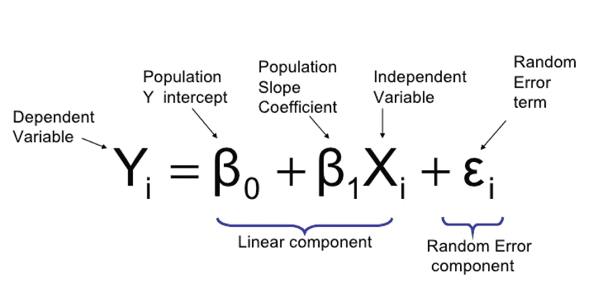
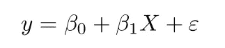
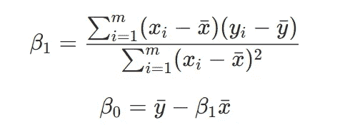

# Python 中的简单线性回归基础和建模

> 原文：<https://medium.com/mlearning-ai/simple-linear-regression-fundamentals-and-modeling-in-python-ff9d60aac48?source=collection_archive---------3----------------------->

在这篇博文中，我将首先尝试解释简单线性回归的基础知识。然后，我们将通过 Python 使用数据集构建模型。最后，我们将通过计算均方差来评估模型。让我们一步一步开始吧。

Resource: [https://en.wikipedia.org/wiki/Linear_regression](https://en.wikipedia.org/wiki/Linear_regression)

# **什么是简单线性回归？**

简单线性回归是一种统计方法，可以帮助我们描述和分析两个变量(一个因变量和一个自变量)之间的关系。在另一个来源中，它被定义如下:

> **简单线性回归**用于估计两个定量变量之间的关系。当您想知道以下内容时，可以使用简单的线性回归:
> 
> -两个变量之间的关系有多强。
> 
> -自变量的某一值处因变量的值。

从定义中可以看出，如果我们想进行简单的线性回归计算，我们必须有一个因变量和一个自变量。

例如，篮球运动员的工资是因变量。同一篮球运动员的投篮成功率是自变量。球员的工资可能会根据赛季期间的投篮成功率而有所增减。我们可以这样描述从属和独立的概念。

简单线性回归的主要目的是找到表达因变量和自变量之间关系的线性函数。所以通过找到这个线性函数，我们对变量之间的关系进行建模。建模意味着用数学方法表达各种概念之间的关系。

Resource: [https://towardsdatascience.com/how-are-logistic-regression-ordinary-least-squares-regression-related-1deab32d79f5?gi=a006f2d79fb4](https://towardsdatascience.com/how-are-logistic-regression-ordinary-least-squares-regression-related-1deab32d79f5?gi=a006f2d79fb4)

> 一个表示为 *x* 的变量被视为**预测变量**、**解释变量**或**独立变量**。
> 
> 另一个变量表示为 *y* ，被视为**响应**、**结果**或**依赖**变量。

简单线性回归对数据做出一些假设。这些是:

*   **方差齐性(homscedastacy):**我们预测的误差大小在自变量的值之间没有显著变化。
*   **观察值的独立性:**数据集中的观察值是使用统计上有效的抽样方法收集的，观察值之间没有隐藏的关系。
*   **正态性:**数据服从正态分布。

线性回归做了一个额外的假设:

*   **自变量和因变量之间的关系是线性的:**通过数据点的最佳拟合线是直线(而不是曲线或某种分组因子)。

现在让我们试着理解简单线性回归的数学。

# **简单线性回归模型**

我们知道 Y 是因变量，X 是自变量。因此，简单线性回归模型的数学表达式如下。

Simple Linear Regression Formula

*   y →指预测值。
*   Xi →指自变量。
*   β0 →是要在数据集中找到的参数。是指简单线性回归线与 Y 轴相交的点。
*   β1 →是要在数据集中找到的参数。表示简单线性回归线的斜率。
*   ϵ →指误差项。

β0 和β1 的系数必须是最佳值，这样我们创建的模型才能给出最合适的结果。我们建立的这个模型的方程，表达了坐标平面中属于这个模型的直线。β0 和β1 在公式中表示如下。

Formulas of β0 and β1

公式β1 是通过一些简单的导数运算计算出来的。如果想了解公式是如何计算的，可以回顾下面的文章。

[http://users.stat.ufl.edu/~winner/qmb3250/notespart2.pdf](http://users.stat.ufl.edu/~winner/qmb3250/notespart2.pdf)

因此，我们的目标是最小化误差项。现在让我们用 Python 对一个数据创建一个简单的线性回归模型。

# 用 Python 建模

现在让我们在一个样本数据集上建立一个`Simple Linear Regression`模型。然后让我们计算模型的平方根，这将给出模型误差。

首先，让我们导入必要的库。

然后，我们将样本数据集从本地存储区读入一个`DataFrame`。数据集的第一列中有不正确的索引数据。我们用`iloc`函数从`DataFrame`中排除了这一点。

让我们检查数据框中的数据。

因为我们用简单的线性回归建模，我们需要一个独立变量。为此，我们选择“电视”变量。

我们选择销售额作为因变量。

我们将 slreg 对象定义为能够建立简单的线性回归模型。然后我们通过拟合 slreg 对象来建立模型。

我们建立了模型。参数β0 和β1 在简单线性回归中很重要。我们求出β0 的系数如下。

我们发现β1 参数如下。

现在我们需要计算模型的误差。因此，我们将有一个有意义的结果。使用 Predict，我们预测实际存在于模型中的 X 值。我们将其保存为 y_pred。稍后，如果您愿意，还可以看到前 5 个预测观测值。

结果，我们来计算一下均方差。

我们拥有的数据集非常简单，适合理解这个主题。因此，我们的误差值也很低。

**数据集**

https://www.kaggle.com/ashydv/advertising-dataset

# 最后

首先，我们在这篇博文中研究了什么是简单线性回归。然后我们讲了简单线性回归的假设。数学上，我们检查了这个算法的模型。最后，我们通过在 Python 中建立简单的线性回归模型来计算误差值。

# 资源

1.  [https://www . scribbr . com/statistics/simple-linear-regression/#:~:text = What % 20 is % 20 simple % 20 linear % 20 regression，既% 20 variables % 20 should % 20 be % 20 quantitative](https://www.scribbr.com/statistics/simple-linear-regression/#:~:text=What%20is%20simple%20linear%20regression,Both%20variables%20should%20be%20quantitative)。
2.  [https://online.stat.psu.edu/stat462/node/91/](https://online.stat.psu.edu/stat462/node/91/)
3.  [https://book down . org/ugurdar/dograsusregression/basit-do % C4 % 9 rusal-regression . html](https://bookdown.org/ugurdar/dogrusalregresyon/basit-do%C4%9Frusal-regresyon.html)