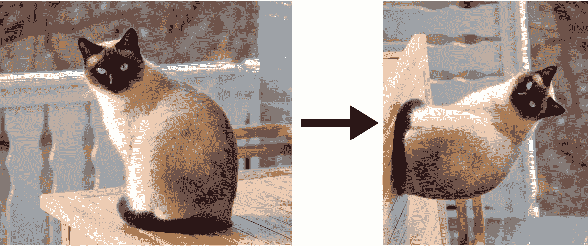
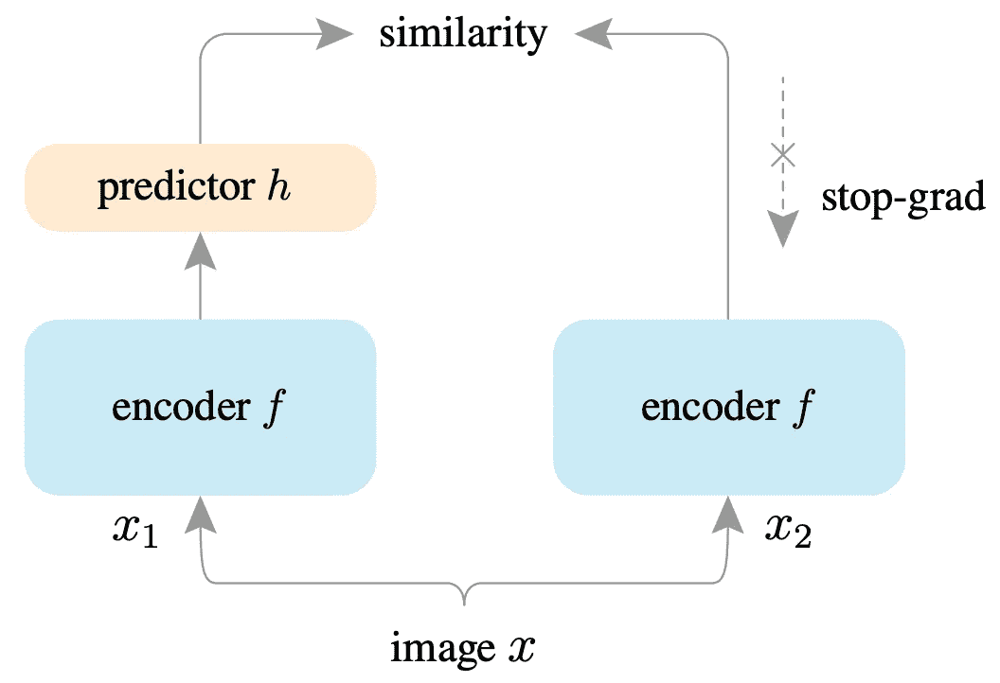
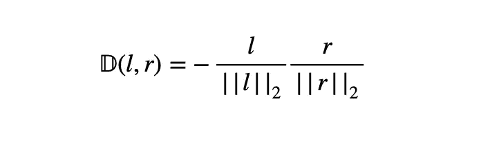
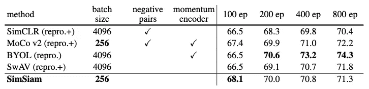

# SimSiam:不变特征的首选表示学习模型

> 原文：<https://medium.com/mlearning-ai/simsiam-your-go-to-representation-learning-model-for-invariance-features-74b907106d6?source=collection_archive---------2----------------------->

**外卖:**

*   暹罗模型是一种自我监督的表示学习模型。
*   [简单的连体网络](https://arxiv.org/pdf/2011.10566.pdf)(公平地说)可以学习有意义的表示，而不需要使用:负样本对、大批量或动量编码器。
*   根据经验，停止梯度操作有助于防止崩溃。

表征学习是对事物进行编码。我们希望利用丰富的未标记数据来进行预训练，然后执行下游任务。暹罗网络对输入数据(通常是图像)进行编码，方法是在给定原始数据的不同扩充的情况下，强制模型识别相同的对象。

## 感应偏差

对于那些不熟悉机器学习中的偏差的人来说，它是模型无法完全捕捉观察到的数据的模式。这里有一个著名的偏差-方差权衡，我们无法同时实现低偏差和低方差。

归纳偏差是我们基于领域知识引入的，以更好地将我们的模型推广到看不见的数据。

## 不变性

这种不变性与偏差-方差权衡无关。在分类任务中，当一个模型可以将一个对象识别为一个对象时，我们说它具有不变的结构，即使当外观以某种方式变化时。我们以猫 vs 狗的分类器为例。

A cat rotated is still a cat. [Link](https://www.animalshq.com/are-siamese-cats-friendly/)

我们希望任何分类模型都能识别物体，尽管猫在照片中可能有各种姿势。

普通的 CNN 模特是如此的“愚蠢”,如果他们只看到了左边的猫，他们就认不出右边的猫。我们通过对原始图片进行数据扩充来解决这个问题，即充分旋转或翻转原始图片(尽管非常昂贵)来教会我们的模型标签“猫”的意思。

## 暹罗网络

连体网络是比较实体的通用模型。它们的应用包括签名和人脸验证、跟踪、一次性学习等。最重要的是，暹罗网络可以自然地为建模不变性引入归纳偏差。(惊喜！)

我看过脸书人工智能研究所(FAIR)的研究人员最近完成的一篇论文，他们在论文中提供了一个更简单的版本，称为 SimSiam，并反驳了相关工作中一些不必要的模块。这里我只介绍暹罗建筑。

SimSiam architecture. [Link](https://arxiv.org/pdf/2011.10566.pdf)

给定一幅图像，我们创建两个增强视图，并用相同的编码器网络(主干加投影 MLP)处理这两个版本。预测器是另一个 MLP，并且在另一侧应用停止梯度操作。最后我们将相似性最大化。

这里的主干模型是 ResNet-50。预测器中的 MLP 维数低于编码器中的 MLP 维数。因此，它同时充当“匹配器”和瓶颈。

我们最小化负余弦相似性以优化参数:

l is the output of the left encoder, while r is the output of the right encoder.

为了提高精度，作者引入了对称损失。但总的来说，整个模型就是这样。暹罗网络有许多变体，其比较如下所示。

Comparisons on ImageNet linear classification. All are based on ResNet-50 pre-trained with two 224×224 views. Evaluation is on a single crop. [Link](https://arxiv.org/pdf/2011.10566.pdf)

它只需要每批 256 个，并在 100 个时期达到最佳结果。本文阐述了该 SimSiam 架构下可能的优化过程，并提供了概念验证。请随意查看这里的。

## 杂念

我的想法仅仅是未经证实的理解和猜测。在 [SimCLR](https://arxiv.org/pdf/2002.05709.pdf) 架构中，相似性和不相似性的度量更加直观，也称为对比学习。但是这有点落入旧的陷阱，你必须定义事物来告诉模型什么是不同的，什么不是。(而且是被辛暹打败的)

SimSiam 能够以简单的 MLP 可以定位(通过映射)增强对象的方式来约束潜在空间编码。在论文中，预编码器增强是随机的(官方[报告](https://github.com/facebookresearch/simsiam)待读)。在我看来，等方差的约束是消除相异度量的关键。

## 参考资料:

 [## 探索简单的连体表示学习

### 暹罗网络已经成为各种无监督视觉表示模型的常见结构…

arxiv.org](https://arxiv.org/abs/2011.10566)  [## 视觉表征对比学习的简单框架

### 本文介绍了 SimCLR:一个简单的视觉表征对比学习框架。我们最近简化了…

arxiv.org](https://arxiv.org/abs/2002.05709)