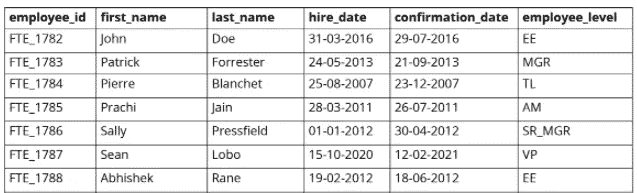
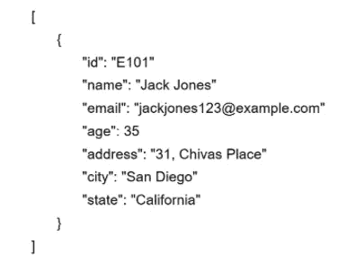
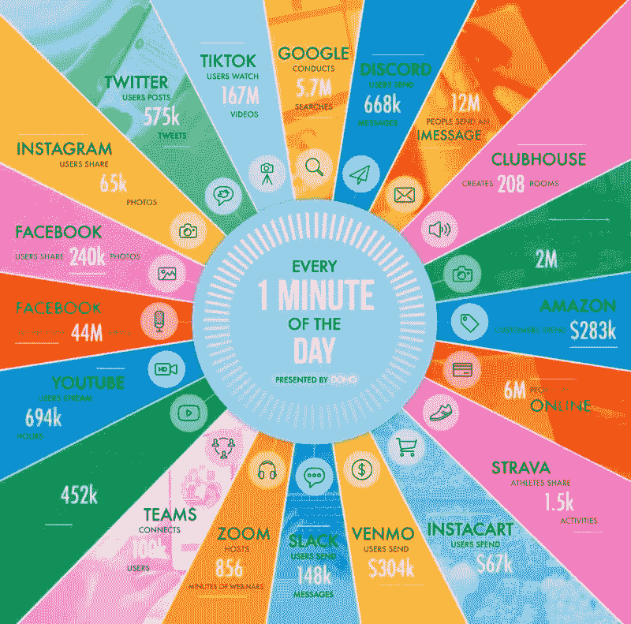
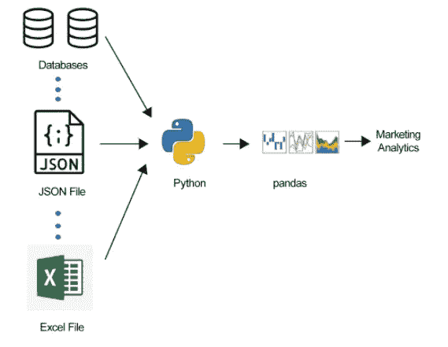
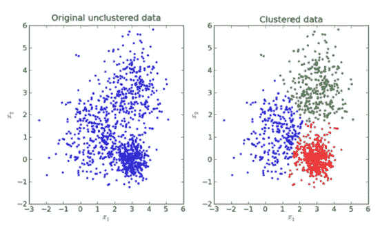
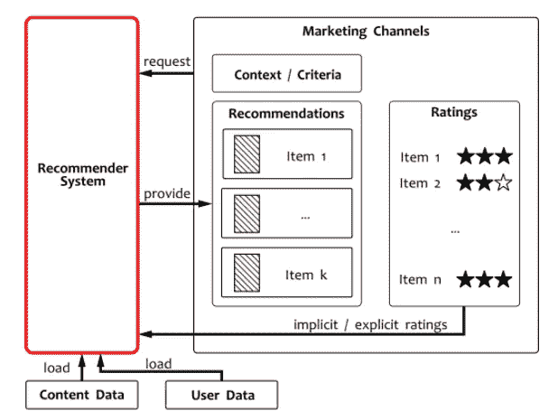
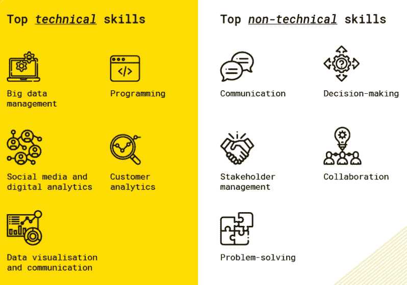

# “既然你喜欢这个艺术家，你也会喜欢他们的新专辑”

> 原文：<https://medium.com/mlearning-ai/since-you-liked-this-artist-youll-also-like-their-new-album-f9effebade7a?source=collection_archive---------5----------------------->

## 释放数据的力量，实现您的营销目标

Photo by [Abderrahmane Meftah](https://unsplash.com/@abderrahmanemeftah?utm_source=unsplash&utm_medium=referral&utm_content=creditCopyText) on [Unsplash](https://unsplash.com/s/photos/old-fashion?utm_source=unsplash&utm_medium=referral&utm_content=creditCopyText)

> **“你附近的 1000 人也点了这个东西。”**

每天，像这样的推荐都会影响顾客的购物决定，帮助他们发现新产品。

由于数据科学技术可以利用数据创建复杂的模型，执行复杂的任务，并非常精确地获得有价值的客户见解，因此这些建议是可能的。

在本文中，我们将介绍一些营销概念，并向您展示如何使用数据科学进行营销分析。

## **营销理念**

美国营销协会(AMA)对营销的定义是创造、沟通、交付和交换对顾客、客户、合作伙伴和整个社会有价值的产品的活动、机构和过程。

根据 AMA，有 10 种类型的营销:

*   *影响者营销*专注于利用对潜在买家有影响力的个人([影响者](https://marketing-dictionary.org/b/buying-roles#influencer))，围绕这些个人开展营销活动，将品牌信息推向更大的市场。
*   *关系营销*利用[数据库营销](https://marketing-dictionary.org/d/database-marketing/)、[行为广告](https://marketing-dictionary.org/b/behavioral-targeting/)和[分析](https://marketing-dictionary.org/m/marketing-analytics/)来精确定位消费者并创建忠诚度计划。
*   *病毒式营销*是一种促进和鼓励人们传递营销信息的营销现象。
*   *绿色营销*是指开发和营销被认为对环境安全的[产品](https://marketing-dictionary.org/product)(旨在最大限度地减少对自然环境的负面影响或提高其质量)。
*   *关键词营销*包括根据用户使用的特定[关键词和短语](https://marketing-dictionary.org/keyword)在 [u](https://marketing-dictionary.org/unique-visitor) 用户前面放置营销信息。
*   *游击营销*描述了一种非传统的和创造性的 [m](https://marketing-dictionary.org/marketing) 营销策略，旨在用最少的资源获得最大的效果。
*   *外向营销*通过电视、广播和数字显示广告等方式与客户建立联系。
*   *集客营销*是一种营销方式，在这种方式中，客户主动与营销人员联系，以回应用来吸引他们注意力的各种方法。这些方法包括电子邮件营销，事件营销，内容营销和网页设计。
*   *搜索引擎优化(SEO)* 是开发一个 [m](https://marketing-dictionary.org/marketing) 营销/技术计划的过程，以提高在一个或多个[搜索引擎](https://marketing-dictionary.org/search-engine)中的可见性。
*   *内容营销*是一种创造和分发*有价值的*、*相关的*和一致的内容以吸引和获得明确定义的[受众](https://marketing-dictionary.org/audience)的技术——目的是推动有利可图的[客户](https://marketing-dictionary.org/customer)行动。

## 数据模型

当您构建一个分析解决方案时，您需要做的第一件事是构建一个数据模型。

数据模型概述了您将使用的数据源、它们与其他数据源的关系、从特定数据源获取数据的确切位置以及获取的形式:Excel 文件、数据库或来自 internet 源的 JSON。

数据模型可以包含以下三种类型的数据:

*   *结构化数据:*数据以平面表格的形式排列，正确的值对应于正确的属性。数据可以存储在关系数据库中，如 MySQL、Amazon Redshift 等。

Structured data in a database table

*   *半结构化数据*:数据没有一个固定的层次结构来映射唯一的列和预期格式的行，但是你可以找到你需要的信息。半结构化数据的一个例子是可以存储在 NoSQL 数据库中的 JSON 文件。

Semi-structured data in a JSON file

*   *非结构化数据*:可能不是表格化的，即使是表格化的，每个观察的属性或列数也可能是完全任意的。非结构化数据可以存储为文本文件、图像和音频剪辑。看看下面一分钟互联网发生了什么。

2021 ‘[Data Never Sleeps](https://www.domo.com/learn/article/data-never-sleeps-9)’ chart from Domo

## 营销数据模型

传统上，营销数据包括上述所有三种数据类型。

大多数数据点来自不同的数据源，这导致了不同的含义，例如，一个字段的值可能具有不同的长度，由于不同的字段名称，一个字段的值可能与其他字段的值不匹配，以及某些行的某些字段可能缺少值。

下图说明了如何通过 Python 脚本并借助 Python 编写的名为 Pandas 的软件库将不同类型的数据转换为结构化格式:

Marketing data model ( Image from Data Science for Marketing Analytics)

## 数据科学在市场营销中的应用

数据科学主要应用于分析、搜索引擎优化、客户参与、响应和实时营销活动等营销领域。

*   **客户细分**

客户细分是根据客户特征中特定标准的一致性将客户分组的过程。
有两种最常用的重要细分类型。这些是:

*   基于接触点参与度的细分
*   基于购买模式的细分

Customer segmentation in clusters

*   **实时分析**

事实证明，实时分析可以立即将营销洞察引入营销活动，并提供机会:

*   获取关于客户的更多详细信息
*   找到高效的平台
*   提供独特的客户体验
*   运行实时测试
*   确定最佳工作实践
*   立即做出反应和回应。
*   **预测分析**

预测分析是统计和机器学习算法的应用，以高概率预测未来。在营销中应用预测分析有很多机会:

*   通过顾客的行为来预测未来的购买趋势
*   确定销售线索的资格和优先顺序，使您的营销工作更加有效
*   就应该向市场提供什么产品或服务做出正确的决定
*   **推荐引擎**

推荐引擎是为顾客提供个性化体验和高满意度的强大工具。推荐引擎的关键思想是将客户的偏好与他或她可能喜欢的产品特性相匹配。

Recommender System ( Image from Introduction to Algorithmic Marketing)

*   **购物篮分析**

购物篮分析是指数据挖掘技术，旨在了解购买模式并揭示购买之间的共现关系。应用这些技术可以预测未来的购买决策。

*   **营销活动的优化**

营销活动的优化包括智能算法和模型的应用，从而提高效率。优化过程包括几个同样重要且需要注意的步骤:选择正确的工具、度量指标并得出结论。

*   **情感分析**

情绪分析允许大规模收集数据，以帮助您与客户产生共鸣。它可以监控他们对收到的信息的反应和信念，并向您提供关于内容和人们如何参与您的活动的反馈。

## 营销分析职业者的顶级技能

下图展示了职业营销分析的最高技能:

Top skills for a carrer in marketing analytics ( Image from [https://studyonline.unsw.edu.au/blog/future-marketing-analytics](https://studyonline.unsw.edu.au/blog/future-marketing-analytics) )

本文到此为止，感谢阅读！您可以使用以下链接在 LinkedIn 上与我联系:

*   [https://www.linkedin.com/in/fernando-oliveira-2a42b51a4/](https://www.linkedin.com/in/fernando-oliveira-2a42b51a4/)

**参考文献**

*   美国营销协会(AMA)，[https://www . ama . org/the-definition-of-Marketing-what-is-Marketing/](https://www.ama.org/the-definition-of-marketing-what-is-marketing/)
*   数据不眠 9.0，[https://www.domo.com/learn/article/data-never-sleeps-9](https://www.domo.com/learn/article/data-never-sleeps-9)
*   贝格先生；戈文丹 g；施里马利河；营销分析数据科学，Packt 出版社，第二版，2021 年
*   熊猫-Python 数据分析库，[https://pandas.pydata.org/](https://pandas.pydata.org/)
*   营销中的 8 大数据科学用例，[https://www . kdnugges . com/2019/11/top-8-Data-Science-Use-Cases-Marketing . html](https://www.kdnuggets.com/2019/11/top-8-data-science-use-cases-marketing.html)
*   卡佐夫岛；算法营销导论，网格动态，2018
*   营销分析的未来，新南威尔士大学(UNSW)，[https://study online . UNSW . edu . au/blog/Future-Marketing-Analytics](https://studyonline.unsw.edu.au/blog/future-marketing-analytics)

 [## Mlearning.ai 提交建议

### 如何成为 Mlearning.ai 上的作家

medium.com](/mlearning-ai/mlearning-ai-submission-suggestions-b51e2b130bfb)