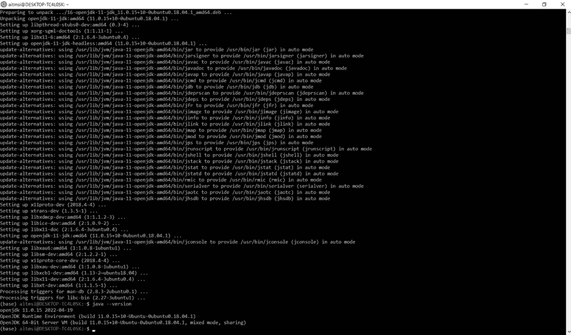
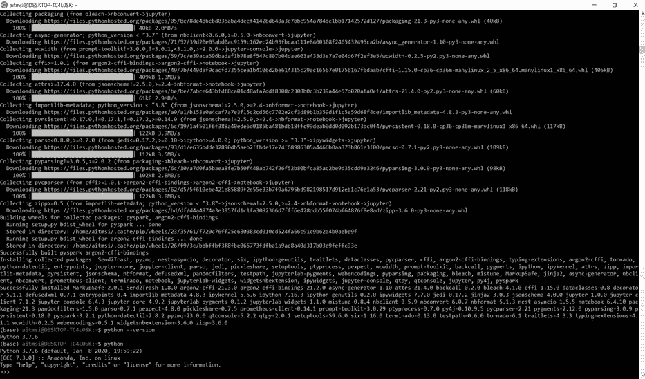
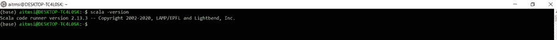
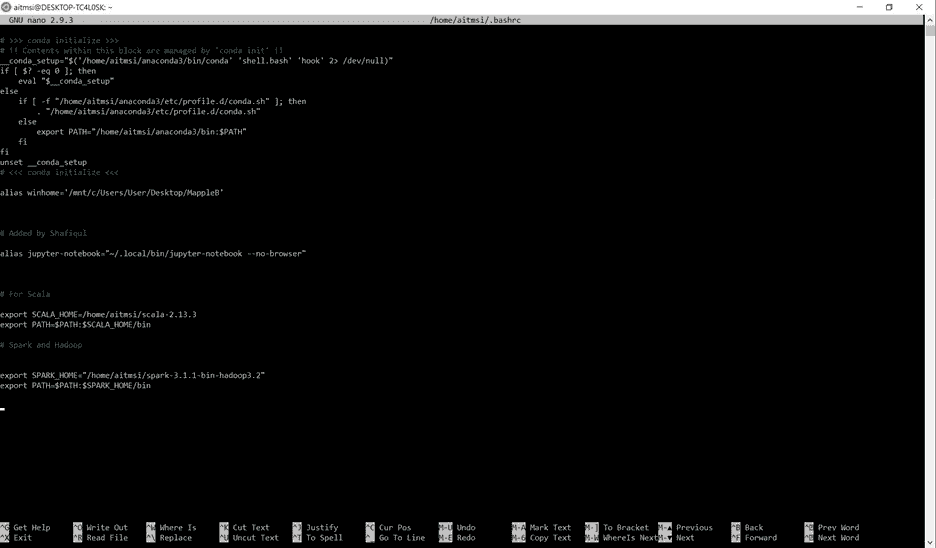
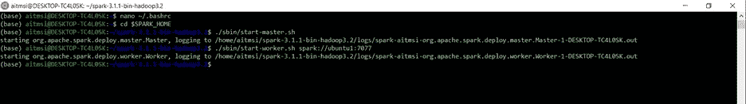
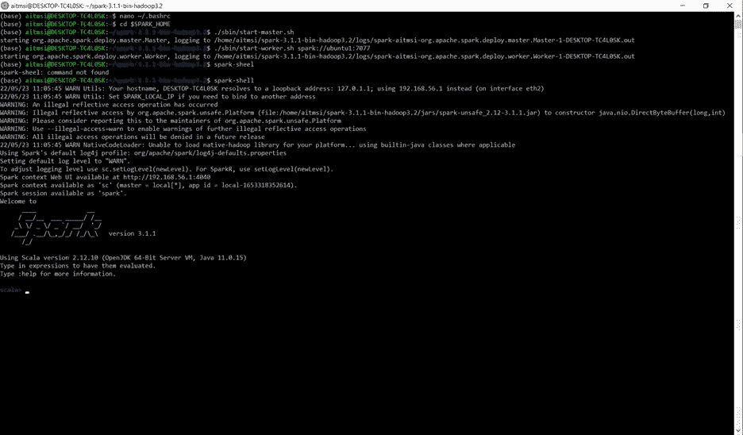
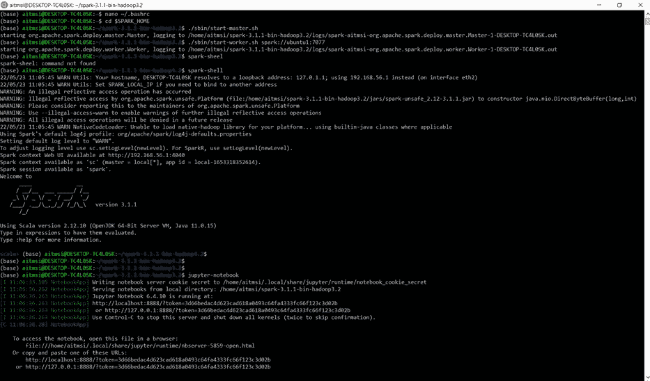
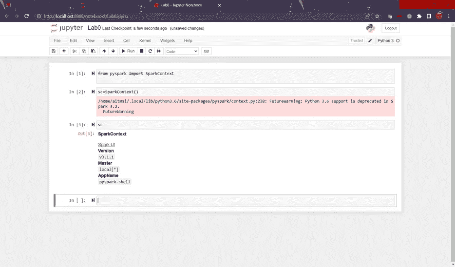

# 用于 Linux 的 Windows 子系统上的单节点 Spark/PySpark 集群(WSL2)

> 原文：<https://medium.com/mlearning-ai/single-node-spark-pyspark-cluster-on-windows-subsystem-for-linux-wsl2-22860888a98d?source=collection_archive---------0----------------------->

This image has been taken from [here](https://www.google.com/url?sa=i&url=https%3A%2F%2Fwww.datanami.com%2F2015%2F02%2F25%2Fapache-spark-ecosystem-continues-to-build%2F&psig=AOvVaw0TfSztH85fVQwye-Nr29SD&ust=1653797344917000&source=images&cd=vfe&ved=0CAwQjRxqFwoTCPCGxK2pgfgCFQAAAAAdAAAAABAD)

本文是为希望使用 PC/笔记本电脑，尤其是 Windows 10 或 11 用户的 Windows 子系统 for Linux 2 (WSL2)来练习大数据技能的有抱负的数据科学家撰写的。

如果您不知道什么是 WSL2 以及如何安装它，您可以访问以下两篇文章:

[如何在 Windows 10 和 Windows 11 上安装 Linux wsl 2](https://www.windowscentral.com/how-install-wsl2-windows-10)

[如何在 Windows 10 上安装 WSL 2(更新)](https://www.omgubuntu.co.uk/how-to-install-wsl2-on-windows-10)

一旦安装了 WSL2，就可以创建单节点 Spark/PySpark 集群了。事实上，它应该可以在任何 Ubuntu 机器上运行。

以下是关键组件:

**1.0*安装 Java***

***2.0 安装 Python3***

***3.0 安装 Scala***

***4.0 用 Hadoop 安装 Spark***

***5.0 激活火花***

***6.0 测试火花***

***7.0 阻止你集群***

# 1.0 安装 Java:

以下命令将安装运行 Spark Cluster 所需的 JAVA JDK:

> *$* *sudo apt 更新& &升级*
> 
> *$sudo apt-get 安装 openjdk-11-jre*
> 
> *$ sudo apt-get 安装 openjdk-11-jdk*

检查您的 Java 版本:

> *$java 版本*

# 2.0 安装 Python3:

以下命令将为 Python3 安装必要的依赖项和包

> *$sudo apt 更新& &升级*
> 
> *$sudo 安装 python3 python3-pip ipython3*
> 
> *$sudo 安装 python3-pip*
> 
> *$pip3 安装 jupyter py4j pyspark*

为 Jupyter 笔记本设置别名:

使用 nano 或 vi 打开 bashrc 文件:

> *$纳米~/。巴沙尔*

将这些行添加到 bashrc 文件的末尾或您的首选位置:

> *别名 jupyter-notebook="~/。local/bin/jupyter-notebook —无浏览器"*

> *$来源~/。巴沙尔*

# 3.0 安装 Scala:

下载 Scale 并解压 Scala:

> *$ wget*[*https://downloads . light bend . com/Scala/2 . 13 . 3/Scala-2 . 13 . 3 . tgz*](https://downloads.lightbend.com/scala/2.13.3/scala-2.13.3.tgz)
> 
> *$ tar xvf Scala-2 . 13 . 3 . tgz*

在 bashrc 上添加 Scala

> *$nano ~/。巴沙尔*

请在 bashrc 文件的末尾添加这些行:

> *导出 SCALA _ HOME =/HOME/aitmsi/SCALA-2 . 13 . 3*
> 
> *导出路径=$PATH:$SCALA_HOME/bin*

(在 WSL2 Ubuntu 中使用您的根用户名替换 aitmsi)

请保存、关闭并获取该文件

> *$source ~/。巴沙尔*

检查 Scala 版本:

> *$ Scala-版本*

# 4.0 用 Hadoop 安装 Spark

使用以下步骤安装 Spark 和 Hadoop:

使用 Hadoop 下载并解压缩 Spark:

> *$ wget*[*https://archive . Apache . org/dist/spark/spark-3 . 1 . 1/spark-3 . 1 . 1-bin-Hadoop 3.2 . tgz*](https://archive.apache.org/dist/spark/spark-3.1.1/spark-3.1.1-bin-hadoop3.2.tgz)
> 
> *$ tar xvf spark-3 . 1 . 1-bin-Hadoop 3.2 . tgz*

打开 bashrc:

> *$nano ~/。bashrc*

在 bashrc 文件中添加以下行

> *导出 SPARK _ HOME = "/HOME/aitmsi/SPARK-3 . 1 . 1-bin-Hadoop 3.2 "*
> 
> *导出路径=$PATH:$SPARK_HOME/bin*

(在 WSL2 Ubuntu 中使用您的根用户名替换 aitmsi)

保存、关闭并获取文件

> *$source ~/。bashrc*

# 5.0 激活火花

运行以下命令来激活集群

> *$cd $SPARK_HOME*
> 
> *$。/sbin/start-master.sh*
> 
> *$。/sbin/start-worker . sh spark://Ubuntu 1:7077*

# 6.0 测试火花

使用以下命令检查外壳上的火花:

> *$火花壳*

你可以用 Jupyter 笔记本测试你的 PySpark。在您的课堂上，学生将使用 Jupyter 笔记本进行各种练习

> *$ jupyter-笔记本*

# 7.0 停止你的集群

停止你的集群是非常重要的，否则你将像往常一样被收费，这将非常非常沉重。

> *$。/sbin/stop-master.sh*
> 
> *$。/sbin/stop-worker.sh*

# 8.结论

这将有助于为您提供一个实践各种大数据分析概念的环境。练习愉快！

非常感谢您的评论和订阅！！

 [## Mlearning.ai 提交建议

### 如何成为 Mlearning.ai 上的作家

medium.com](/mlearning-ai/mlearning-ai-submission-suggestions-b51e2b130bfb)