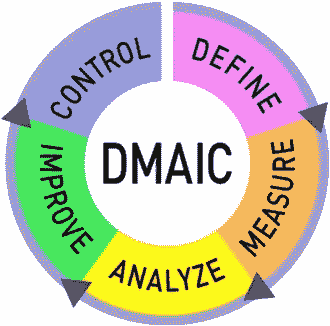

# 数据项目的六个适马

> 原文：<https://medium.com/mlearning-ai/six-sigma-for-data-projects-a80bcaa09c53?source=collection_archive---------8----------------------->

六西格玛是一种工具，企业可以利用它来提高其业务流程的能力。在任何数据项目中，过程的改进都是重要的。在本文中，我们将深入探讨六西格玛以及它对数据项目的重要性。

**什么是六适马？**

如前所述，六西格玛是一种工具，企业可以利用它来提高其业务流程的能力。现在我们进入如何做到这一点。六适马有五大原则:

1.  牢记利益相关者。基于涉众的需求，尽早定义清晰的质量标准。
2.  与利益相关者一起定义业务领域中的问题。关注这个具体问题。
3.  规划流程找出流程中可以快速消除的瓶颈。
4.  沟通和培训流程中的所有相关人员。确保没有人不知道要完成的任务。此外，确保他们训练有素，能够完成任务。
5.  要知道你必须灵活应变。任何过程中的变更管理都是具有挑战性的，然而，利大于弊。

所以我们知道原则，我们如何把它付诸行动。六西格玛使用一个框架，简称为 DMAIC。我们将穿过 DMAIC。

[https://blog.kainexus.com/improvement-disciplines/six-sigma/dmaic/a-quick-guide-to-dmaic-for-beginners](https://blog.kainexus.com/improvement-disciplines/six-sigma/dmaic/a-quick-guide-to-dmaic-for-beginners)

1.  **D-DEFINE**DMAIC 的第一部分是 DEFINE。第一步是与利益相关者坐在一起，了解他们希望改进的业务流程中的问题。这可以通过采访影响流程和调查的各方来完成。这一部分对于收集一个全面问题的事实并对其进行定义是很重要的。
2.  **M-MEASURE**DMAIC 的第二部分是 MEASURE。此时，应该收集数据，以便我们更好地理解流程和流程中的问题。这应该在仪表板中显示，以便与项目干系人讨论需要纠正的问题以及如何对项目进行度量(即关键绩效指标 KPI)。此外，流程图是当前状态的关键。
3.  **A-分析**DMAIC 的第三部分是分析。在流程的这个阶段，完善你的问题陈述。进行根本原因分析。一些有用的根本原因分析工具是 5 个为什么，排列图和鱼骨图。一旦能够确定根本原因，设计实验来改进过程。
4.  **I-提高**第四部分 DMAIC 的提高。开始研究解决方案，并定义这些解决方案的好处。改进和开发未来状态流程图。就如何对这些解决方案采取行动与利益相关方进行沟通并获得他们的确认。
5.  DMAIC 的最后一部分是控制。流程的这一部分提醒我们，仅仅因为我们改进了一个流程，我们还没有完成。我们必须监控这些解决方案，看看它们是否真正符合我们所寻求的利益。此外，没有一个改进过程是完美的，因此，为了将来的利益，要明确所吸取的教训并与利益相关者分享。

**在数据项目中使用六个适马**

现在对六西格玛有了一个核心的理解，接下来必须讨论它，必须讨论如何将它添加到数据项目中。核心的数据项目必须始终遵循六西格玛原则。它总是需要利益相关者对问题的定义，专注于该项目的意图，消除过程中的瓶颈，并确保在变更管理过程中保持沟通。此外，DMAIC 是所有形式的数据项目的通用过程或变体。

这些概念看起来像是常识，但是就像任何参与数据项目的人一样，如果这没有在早期定义并且没有保持在焦点的核心，您将会看到项目质量低下或者失败。

 [## Mlearning.ai 提交建议

### 如何成为 Mlearning.ai 上的作家

medium.com](/mlearning-ai/mlearning-ai-submission-suggestions-b51e2b130bfb)