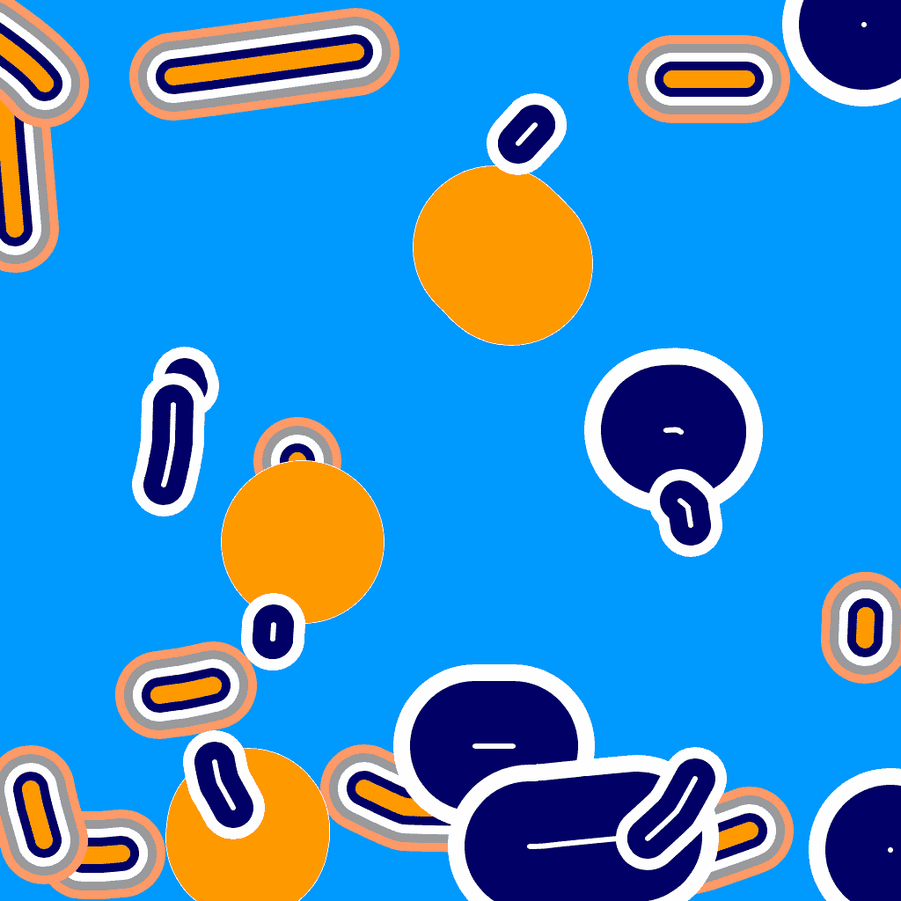

# 素描机

> 原文：<https://medium.com/mlearning-ai/sketch-machine-94c24e34ae77?source=collection_archive---------5----------------------->

## [ML 艺术](https://mlearning.substack.com) 2023

## 最小的数字艺术品。[自己试试](#6e91)。

[Free Demo, NO CODE](https://open.substack.com/pub/evartology/p/step-into-a-world-of-limitless-possibility?r=9hp4d&utm_campaign=post&utm_medium=web)

有些人认为，最终，所有的艺术都将是由机器创造的[，因此不再需要任何数字艺术。](/mlearning-ai/all-art-is-a-machine-and-all-machines-are-art-e787a38fcd97)

> “有时候你需要站起来把手弄脏，”