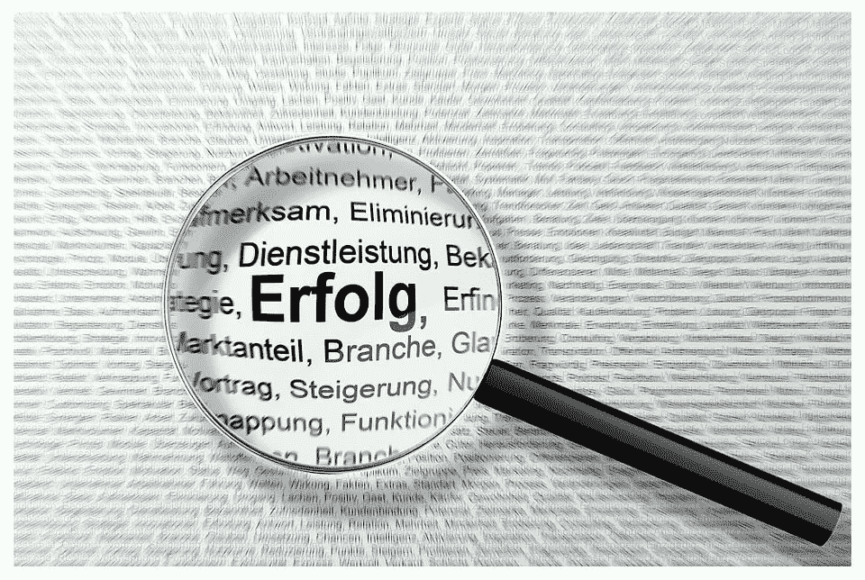
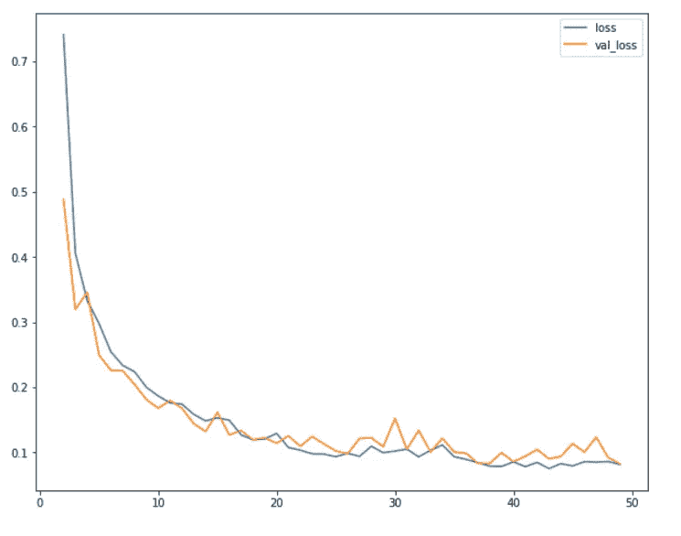
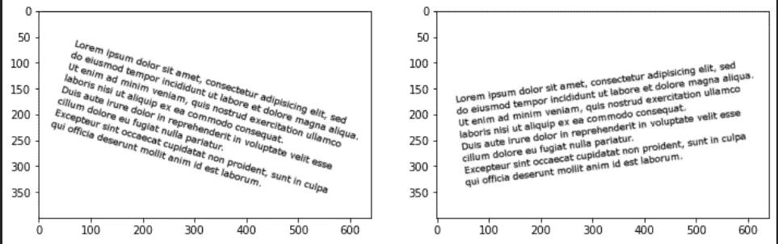
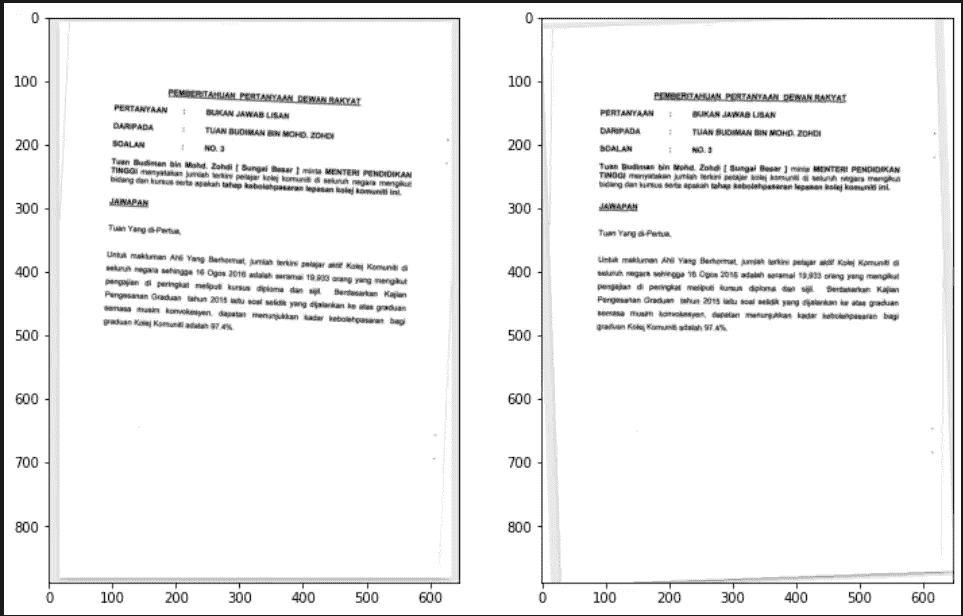
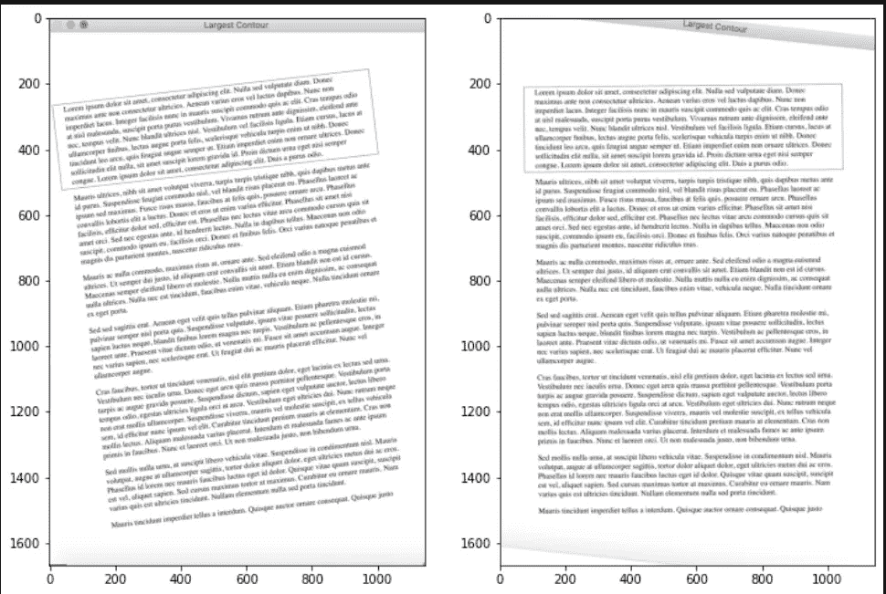
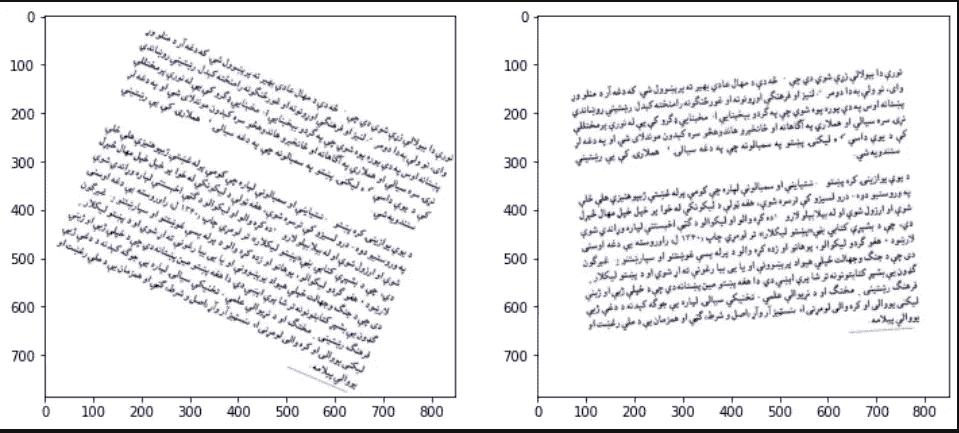
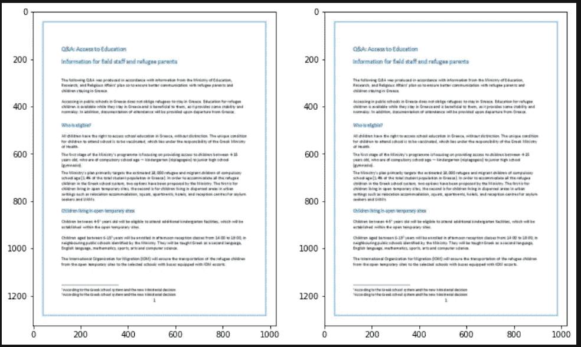
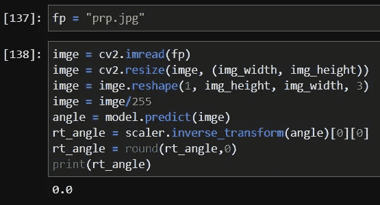

# 使用深度学习校正文档中的倾斜。

> 原文：<https://medium.com/mlearning-ai/skew-correction-in-documents-using-deep-learning-8e19609107b6?source=collection_archive---------3----------------------->

我们都会遇到这样一个问题:我们拥有的文档会错位、歪斜，还可能会扭曲。很多图像扫描仪会要求我们自己旋转图像，或者要求我们选择四个点来修改透视。事实上，我必须感谢我的 Twitter 好友 Kavin Sharath，他提出了文档中的偏斜问题，并推动我使用机器学习来寻找解决方案。我们还采取了不同的方法，如霍夫线变换，二值化，只找到文本区域及其轮廓，轮廓检测等，但他们中的大多数不能在大多数情况下推广。我们意识到，这些图像处理技术中有很多都工作得很好，其中一种最好的偏度恢复方法是使用投射体轮廓法。

# 抛射体轮廓

[PP](http://www.cvc.uab.es/~bagdanov/pubs/ijdar98.pdf) 是一种技术，我们将在一个范围内以不同角度旋转给定图像，并计算该图像在每个角度的像素直方图峰值之间的最大差异。我们得到最大差值的角度之间的差值就是我们用于歪斜校正的旋转角度。

**优点:**

*   不需要模型培训/构建
*   适用于大多数真实场景，文档具有轻微的偏斜度
*   可以轻松集成到任何应用程序中

**缺点:**

*   如果我们增加角度范围，那么处理将需要很长时间才能完成
*   没有广义的角度范围，因为每个图像可能需要一组不同的范围。

# **机器学习:**

我试图在这里建立一个基于 CNN 的回归模型来生成需要纠正偏斜的角度。

**数据准备:**

对于这样的问题，我们可能有网上可用的数据，但我们可以尝试为这项任务建立我们自己的数据。首先，使用 [bing-image-downloader](https://pypi.org/project/bing-image-downloader/) 下载一组文档图像，然后使用下面的代码片段迭代您的图像。

在上面的代码片段中，实际发生的情况是:

*   我们正在从随机选择的不同角度迭代一组图像。
*   角度范围为[-45，45]
*   旋转后的图像填充白色，以确保与真实场景相似的一致性。
*   灰度图像以适当的命名保存，并带有迭代和角度值。

**模型构建:**

我在这里使用一个简单的 CNN 模型来训练回归器，在构建模型之前，我们需要以一种 CNN 模型可以优化学习的方式来处理数据。下面是我实现的预处理图像的步骤。

我没有使用其他的增强步骤，如裁剪、旋转等，因为那会破坏这个解决方案的意图，所以我只根据需要缩放了角度和图像。请随意尝试其他不会破坏方向和空间特征的增强方法。

接下来是定义模型，我建立了一个相对较浅的模型，因为直觉上我们的输出是连续值，我们不适合学习复杂的特征，如文本是否是倾斜的字符，它们是否有线条，甚至它们是否是手写的等等。下面是模型总结。

请确保您的最后一层没有 relu 作为激活函数，因为我们也有负值作为输出，使用全局最大池的优势是我们可以更快地训练模型，权重将更小。这个模型是 9 MB 的大小，我们也可以做得比我这里得到的好得多。就这样，定义其他训练参数，如 batch_size、epochs、tensorboard logging、early stopping 等，并训练模型。我附上了我的模型的训练结果。我选择的参数在我附在最后的笔记本里。

*   另外，你可以找到如下的一些结果。

从上面我们可以看到结果相当令人满意，从这里您可以尝试使用不同的数据，如手写文档进行训练，您也可以尝试多任务模型，首先是分类，无论您必须顺时针或逆时针旋转，其次是旋转多少。这个模型的另一个缺点是，如果给定的文档中没有偏斜，它可能不会很好地执行，同样，您可以尝试一个多任务模型，其中第三个任务是 skew/no_skew，或者只是一个单任务学习者，将 0 作为无偏斜输入的输出值。你也可以看看最后提供的笔记本

*   *用手写文本试验非英语语言(我相信是阿拉伯语，如果我错了，抱歉)。*

*   *在非倾斜图像上*

为了记录在案，我不是在上面的场景虚张声势。模型给出了 0 作为我们想要的输出。

尽管该模型似乎在不同的场景下表现良好，但它很可能是一个例外，为了安全起见，最好用各种各样的充足数据来建立一个模型。但我会尝试用更多的数据来验证这个模型，并提供我的回购指标。

好了，伙计们，我希望这是有用的，对你们都有帮助。我将继续尽我所能做出贡献。在那之前，再见，保重。如需更多信息，请随意查看以下内容

*   卡格尔笔记本:[https://www.kaggle.com/vishnunkumar/skew-detection](https://www.kaggle.com/vishnunkumar/skew-detection)
*   Github 简介:【https://github.com/Vishnunkumar 

感谢所有花费宝贵时间阅读本文的人。保重伙计们。再见，下次见

 [## Mlearning.ai 提交建议

### 如何成为 Mlearning.ai 上的作家

medium.com](/mlearning-ai/mlearning-ai-submission-suggestions-b51e2b130bfb)