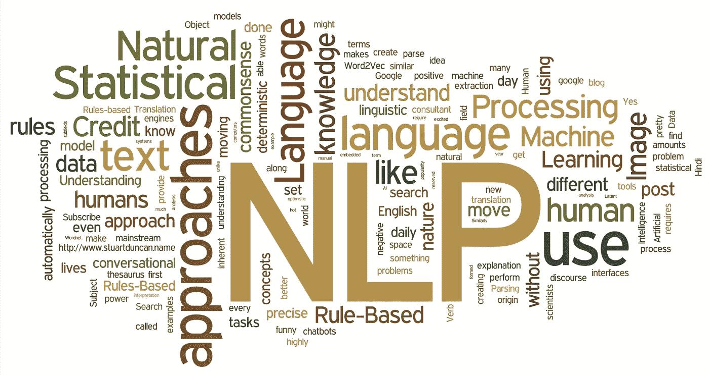
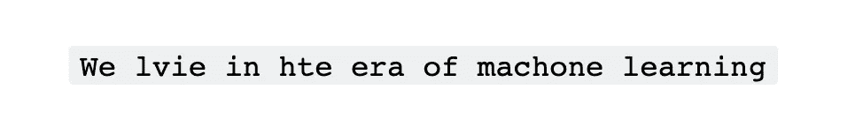
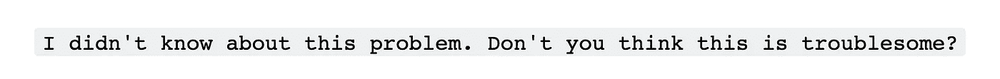
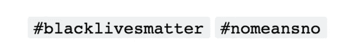
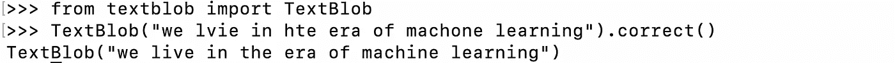
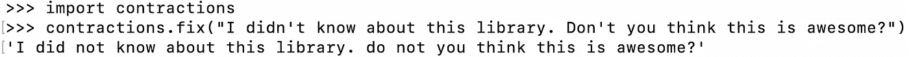
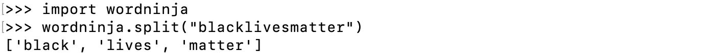

# 文本预处理:聪明的方法

> 原文：<https://medium.com/mlearning-ai/smart-text-pre-processing-c098afd97d65?source=collection_archive---------2----------------------->



# 概观

在这篇文章中，我们将讨论一些快速而简单的技巧，它们非常有效和强大，可以为你节省大量的时间。

# 文本预处理中的问题

从文本数据中获取意义是一项棘手的工作，肮脏的文本会让它变得更加麻烦。我们所有人都遇到过与文本相关的问题陈述，并意识到清理文本数据比清理数字数据要困难得多(这是我所相信的)。

当我说清理文本数据时，我到底在说什么:
(1)拼写错误
(2)文本缩写
(3)连接单词

我不会谈论标记化、词干化、词汇化和其他预处理技术的重要性。

让我们一个一个地击倒他们。

## 拼写错误



大多数收集的数据都有这种人为插入的拼写错误。虽然我们有一些先进的 NLP 建模技术，但我更喜欢纠正这些术语，使它们更有意义。

## 文本缩写



作为人类，我们有惊人的能力来解释复杂的单词和句子，但机器是愚蠢的，我们需要用勺子喂它们。文本缩写就是这样一个问题。我在情绪理解问题上看到了它的有效性，其中否定词在预处理中没有被忽略。

## 连接词



趋势由标签表示，标签决定趋势。在推文分类、极性分析、趋势分析等问题中非常重要。分离单词会带来更多关于主题的深刻信息。

# 传统方法

我见过有人用穷举列表来表示缩写。类似这样的东西

```
contractions = { 
"ain't": "am not / are not / is not / has not / have not",
"aren't": "are not / am not",
"can't": "cannot",
"can't've": "cannot have",
"'cause": "because",
"could've": "could have",
"couldn't": "could not",
"couldn't've": "could not have",
"didn't": "did not",
"doesn't": "does not",
"don't": "do not",
"hadn't": "had not",
"hadn't've": "had not have",
"hasn't": "has not",
"haven't": "have not",
"he'd": "he had / he would",
"he'd've": "he would have",
"he'll": "he shall / he will",
"he'll've": "he shall have / he will have",
"he's": "he has / he is",
"how'd": "how did",
"how'd'y": "how do you",
"how'll": "how will",
"how's": "how has / how is / how does",
"I'd": "I had / I would",
"I'd've": "I would have",
"I'll": "I shall / I will",
"I'll've": "I shall have / I will have",
"I'm": "I am",
"I've": "I have",
"isn't": "is not",
"it'd": "it had / it would",
"it'd've": "it would have",
"it'll": "it shall / it will",
"it'll've": "it shall have / it will have",
"it's": "it has / it is",
"let's": "let us",
"ma'am": "madam",
"mayn't": "may not",
"might've": "might have",
"mightn't": "might not",
"mightn't've": "might not have",
"must've": "must have",
"mustn't": "must not",
"mustn't've": "must not have",
"needn't": "need not",
"needn't've": "need not have",
"o'clock": "of the clock",
"oughtn't": "ought not",
"oughtn't've": "ought not have",
"shan't": "shall not",
"sha'n't": "shall not",
"shan't've": "shall not have",
"she'd": "she had / she would",
"she'd've": "she would have",
"she'll": "she shall / she will",
"she'll've": "she shall have / she will have",
"she's": "she has / she is",
"should've": "should have",
"shouldn't": "should not",
"shouldn't've": "should not have",
"so've": "so have",
"so's": "so as / so is",
"that'd": "that would / that had",
"that'd've": "that would have",
"that's": "that has / that is",
"there'd": "there had / there would",
"there'd've": "there would have",
"there's": "there has / there is",
"they'd": "they had / they would",
"they'd've": "they would have",
"they'll": "they shall / they will",
"they'll've": "they shall have / they will have",
"they're": "they are",
"they've": "they have",
"to've": "to have",
"wasn't": "was not",
"we'd": "we had / we would",
"we'd've": "we would have",
"we'll": "we will",
"we'll've": "we will have",
"we're": "we are",
"we've": "we have",
"weren't": "were not",
"what'll": "what shall / what will",
"what'll've": "what shall have / what will have",
"what're": "what are",
"what's": "what has / what is",
"what've": "what have",
"when's": "when has / when is",
"when've": "when have",
"where'd": "where did",
"where's": "where has / where is",
"where've": "where have",
"who'll": "who shall / who will",
"who'll've": "who shall have / who will have",
"who's": "who has / who is",
"who've": "who have",
"why's": "why has / why is",
"why've": "why have",
"will've": "will have",
"won't": "will not",
"won't've": "will not have",
"would've": "would have",
"wouldn't": "would not",
"wouldn't've": "would not have",
"y'all": "you all",
"y'all'd": "you all would",
"y'all'd've": "you all would have",
"y'all're": "you all are",
"y'all've": "you all have",
"you'd": "you had / you would",
"you'd've": "you would have",
"you'll": "you shall / you will",
"you'll've": "you shall have / you will have",
"you're": "you are",
"you've": "you have"
}
```

它看起来不漂亮。

对于缩写，人们也准备了类似的详尽的列表和我们通常忽略的拼写错误。

# 一个聪明的方法

我发现了一些有用的 python 库，它们可以在一行中完成这个困难的单词。

我们可以使用 Textblob 来重新训练你自己的拼写检查。



搞定了。

## 复合词算法里面有什么？

一个好的第一近似值是假设所有单词都是独立分布的。那么你只需要知道所有单词的相对频率。有理由假设它们遵循 Zipf 定律，即单词列表中排名为 *n* 的单词的概率大致为 1/( *n* log *N* )其中 *N* 是字典中的单词数。

一旦确定了模型，就可以使用动态编程来推断空间的位置。最有可能的句子是最大化每个单词的概率乘积的句子，用动态编程很容易计算出来。我们不直接使用概率，而是使用定义为概率倒数的对数的成本来避免溢出。