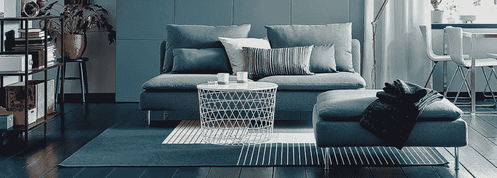
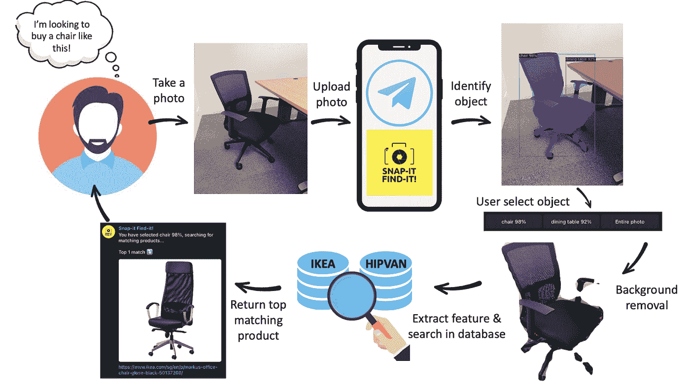
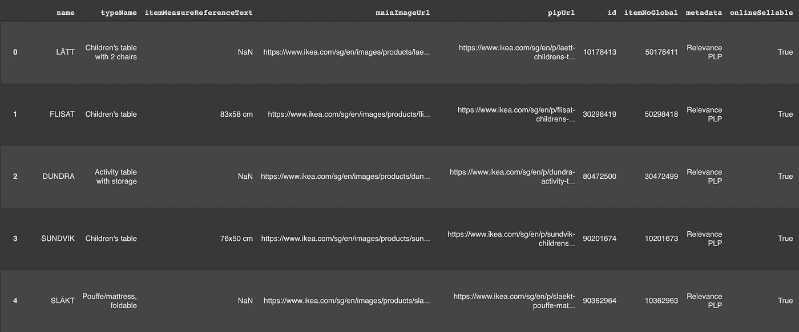
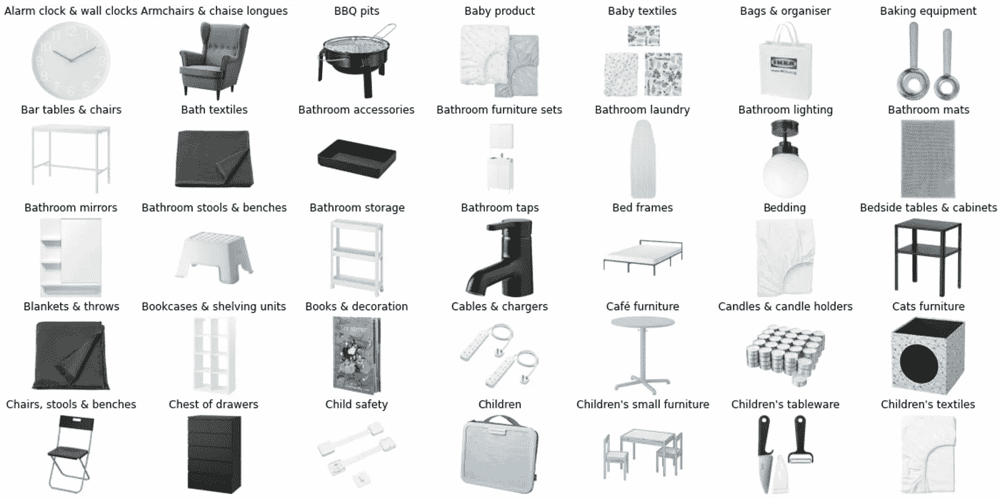
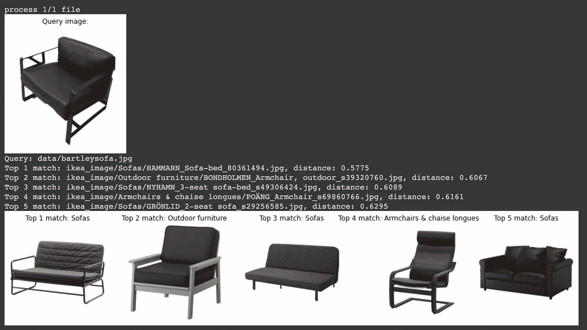

# Snap-It Find-It:您的购物伴侣机器人

> 原文：<https://medium.com/mlearning-ai/snap-it-find-it-your-shopping-companion-bot-8101494545a8?source=collection_archive---------6----------------------->

## 采用新型计算机视觉技术的图像检索应用

寻找家具是一个令人惊讶的耗时且平凡的过程。宜家和 HipVan 等多家家具零售商的产品目录中有大量家具。通常，人们会花几个小时浏览目录，试图找到他们喜欢的东西，或者花几个小时逛实体店，试图找到符合他们新公寓主题的东西。通常，人们可能会在意外发现一件漂亮的家具时获得灵感，并决定拥有一件类似的家具。问题陈述浮出水面: ***哪里可以找到类似这件家具的东西？宜家或者 HipVan 有类似的吗？***

这是团队试图解决的问题陈述。给定某些家居物品或家具的输入 RGB 图像，开发一个计算机视觉系统，从宜家和 HipVan 目录返回类似物品或家具的图像。计算机视觉系统将包括一个对象检测器模块和一个图像相似性模块，它们被巧妙地打包到一个电报机器人中作为用户界面。该系统可以帮助用户快速缩小用户应该访问的主要家具供应商的范围，并有助于使整个家具搜索过程更加高效。

> 我们的团队有答案:我们制作了一个电报机器人，帮助你从宜家和 Hipvan 搜索匹配的产品！

We created a Telegram bot to help you search for furniture and household products @ [https://t.me/SnapitFindit_bot](https://t.me/SnapitFindit_bot)

这是一系列由 4 名新加坡国立大学硕士研究生(理学硕士。工业 4.0 中)谁在拿 ISY5004 智能传感系统。以下是我们将要分享的内容的快照:

*   [Web 报废、使用 CNN 的特征提取和图像搜索。(本帖)](https://jensen-wong.medium.com/snap-it-find-it-your-shopping-companion-bot-8101494545a8)
*   [使用 YOLOv3 进行物体检测。](/@renxiang91/object-detection-using-yolov3-51baa2bbac94)
*   [使用 Detectron2 进行对象检测和背景去除。](https://jzys-low.medium.com/object-detection-and-background-removal-with-detectron2-2242a863cc51)
*   [使用各种 CNN 模型的进一步改进。](https://haomingkoo.medium.com/helping-machines-visualize-our-world-f1c489bb2da9)
*   [电报机器人和云托管。](https://jensen-wong.medium.com/a-telegram-bot-with-the-power-of-computer-vision-f415fd2efae8)

> 那么，首先，我们如何获得数据？让我们从宜家和 Hipvan 那里刮数据吧！

让我们从了解宜家网站的 HTML 页面开始，我们需要获得所有产品类别的链接。为此，我使用 BeautifulSoup 提取我需要的链接:

现在，如果您熟悉使用 Google Chrome 开发工具，您可以公开 API 来查询包含产品 id、价格、产品名称、图片 URL(这是我们正在寻找的)的产品目录！下面先睹为快的代码…

all_data 数据帧包含以下信息:

现在，我们可以轻松下载所有产品图片:

这是我们收集到的图片的快照:

现在，让我们准备数据集，并将其分为训练集和测试集，以便进行特征提取和性能指标测量:

为了提取所有下载图像的特征，我们可以利用迁移学习方法，该方法使用来自 *imagenet 的权重。*我们使用 VGG16 CNN 模型从 FC2 层获得输出，并将训练和测试特征保存到 an 中。npy 文件。

为了测量我们的模型有多好，然后我们定义函数来测量准确度和精度，以及通过使用欧几里德距离来测量来自两个图像的两个特征集的矢量距离:

现在，我们可以使用以下代码来测量准确度和精度:

这是结果，你可以看到精度和准确性不是很好，但是，我们的团队做了很多进一步的工作来改进这个直接开箱即用的基准，所以，请继续关注，直到这一系列帖子的结尾！

尽管如此，让我们通过搜索沙发来想象一下结果…

没那么糟吧。这个沙发是样本外的数据，意味着它不存在于我们的数据库或提取特征，算法给我们前 5 名最匹配的家具！

然而，在现实生活中，任何相机拍摄的照片都由背景组成，并且可能有多个对象，在下面的帖子中，我们将分享如何使用不同的计算机视觉对象检测方法来识别对象并在进行搜索之前移除背景…敬请期待！

*在第二部分(下面的链接)，我们将分享如何在搜索类似的产品之前首先使用 YOLOv3 作为物体检测模型！*

 [## 使用 YOLOv3 的对象检测

### 这是一系列由 4 名新加坡国立大学硕士研究生(理学硕士。在工业 4.0 中)谁在服用 is 5004…

medium.com](/@renxiang91/object-detection-using-yolov3-51baa2bbac94)