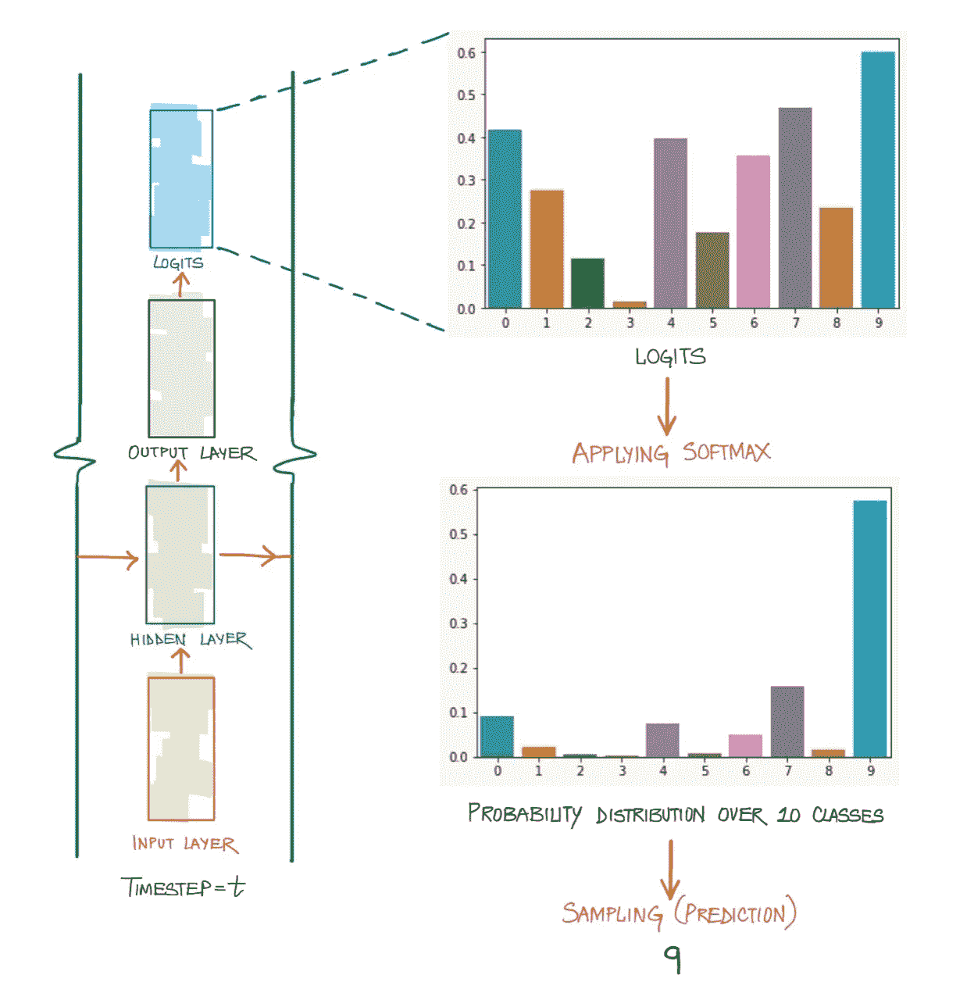
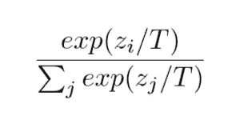
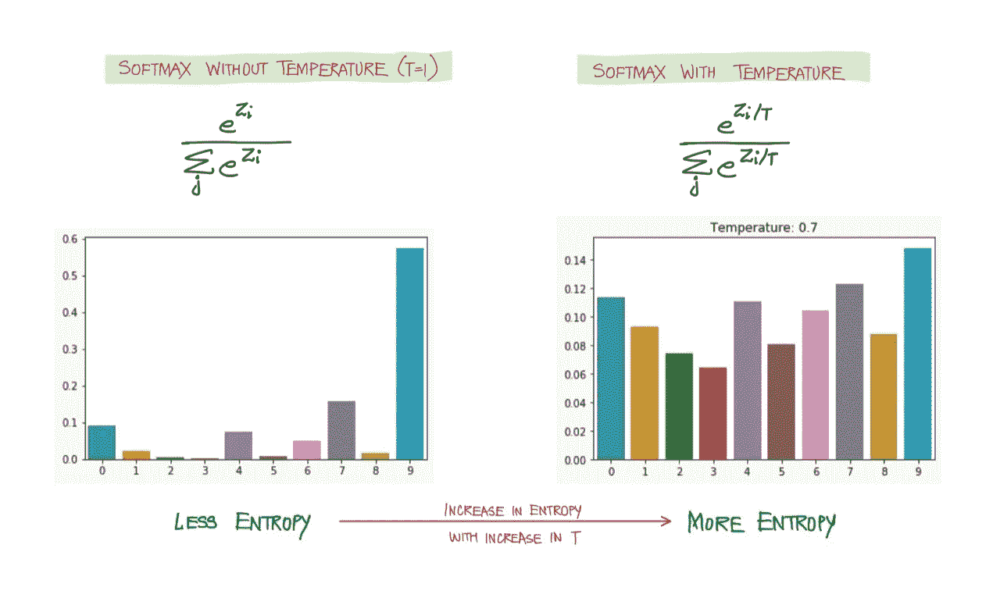
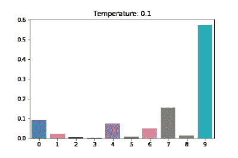

# Softmax 温度

> 原文：<https://medium.com/mlearning-ai/softmax-temperature-5492e4007f71?source=collection_archive---------0----------------------->

**温度**是 LSTMs(以及一般的神经网络)的超参数，用于在应用 softmax 之前通过缩放逻辑来控制预测的随机性。温度缩放已被广泛用于提高利用 Softmax 决策层的 NLP 任务的性能。

为了解释它的效用，我们将考虑自然语言生成的情况，其中我们需要通过从语言模型中抽取新的序列来生成文本(使用 seq-to-seq 架构的解码器部分)。在解码阶段的每个时间步，我们需要预测一个令牌，这是通过使用一种采样技术从 softmax 分布(在词汇表上)中采样来完成的。简而言之，一旦获得 logits，预测的质量和多样性由 softmax 分布和应用于其上的采样技术控制。这篇文章是关于调整 softmax 分布来控制预测的多样性和新颖性。后者将在以后的文章中讨论。

图 1 是如何在解码阶段的中间时间步长之一进行预测的快照。

Fig 1: Logits transformation by Softmax

**但是这里的问题是什么？**

生成的序列将具有可预测的通用结构。原因是 softmax 分布中的**熵**或**随机性**，在某种意义上，特定单词(对应于上面示例中的索引 9)被选中的可能性远远高于其他单词。只要目标是得到真实的序列，一个可预测的序列是没有问题的。但是如果目标是生成一个从未见过的新文本或图像，随机性就是圣杯。

**解决方法？**

**增加随机性**。这正是温度标度的作用。它表征了用于采样的概率分布的熵，换句话说，它控制了下一个词将有多令人惊讶或可预测。通过将 logit 向量除以值 T(表示温度)来进行缩放，然后应用 softmax。

Fig 2: Temperature Scaling

这种缩放的效果可以在图 3 中看到:

Fig 3: Visualizing the Effects of Temperature Scaling. Each word gets equal probability as the Temperature increases

上面的分布接近均匀分布，使每个单词被抽样的概率相等，从而使生成的序列看起来更有创造性。太多的创造力也不好。在极端情况下，生成的文本可能毫无意义。因此，像所有其他超参数一样，这也需要调整。

**结论:**
温度的尺度控制着产量分配的平滑度。因此，它增加了对低概率候选者的敏感性。随着 T → ∞，分布变得更加均匀，从而增加了不确定性。相反，当 T → 0 时，分布坍缩为点质量。

如前所述，温度标度的范围不仅限于 NLG。它还用于在训练和强化学习时校准深度学习模型。另一个更广泛的概念是**知识蒸馏。**以下是关于这些主题的链接，以供进一步探索。

**参考文献:**

1.  [语言建模中的语境温度](https://openreview.net/pdf?id=H1x9004YPr)
2.  [提取神经网络中的知识](https://arxiv.org/pdf/1503.02531.pdf)
3.  [关于现代神经网络的校准](https://arxiv.org/pdf/1706.04599.pdf)

 [## Mlearning.ai 提交建议

### 如何成为 Mlearning.ai 上的作家

medium.com](/mlearning-ai/mlearning-ai-submission-suggestions-b51e2b130bfb)