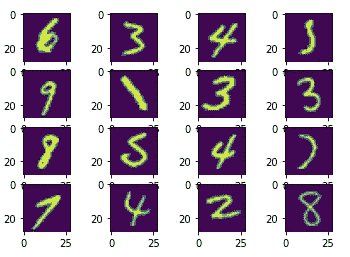
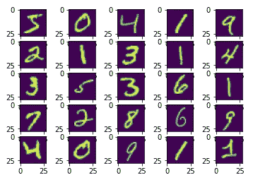
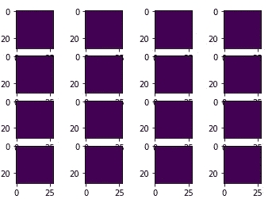
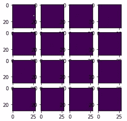
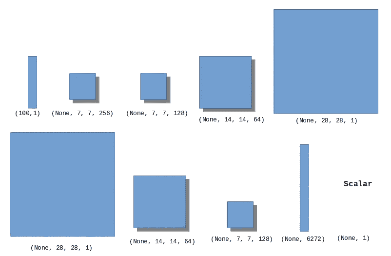
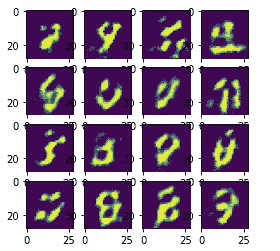
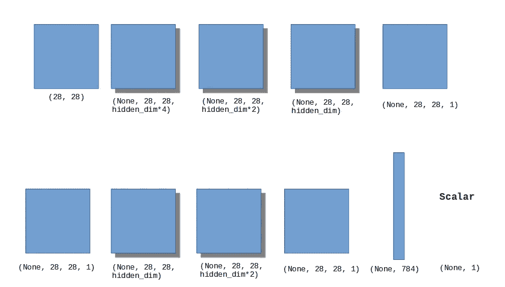
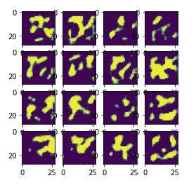
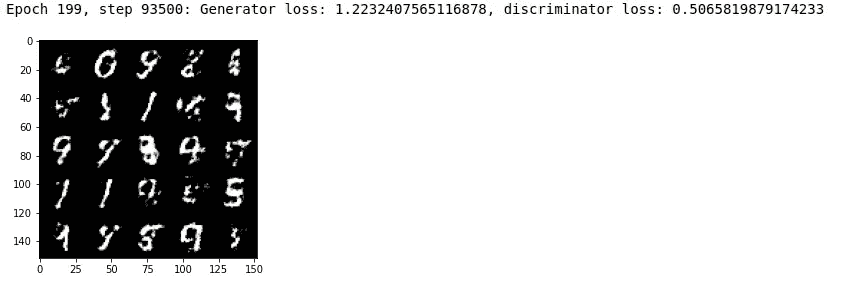

# 求解 GANs:神经网络架构与反馈

> 原文：<https://medium.com/mlearning-ai/solving-gans-nn-architecture-feedback-5f7ef6a8a5eb?source=collection_archive---------3----------------------->

过去几周，我在库塞拉上完了一堂很棒的基础甘斯课。在课堂上和网上的很多地方都使用 PyTorch 软件；我很少看到 GANs 在 Tensorflow Keras 上实现。在这篇文章中，我使用 Tensorflow Keras 练习执行一个基本的 GANs。我使用了 MINST 数字数据集，为每张图片生成一个数字。

我了解到，使用 Keras，您必须运行许多时期(3000+时期)的模型，在获得复制原始数字的结果之前，获得许多时期的深蓝色图像。下面是我处理这个问题的方法，集中在不同的模型架构和反馈方法上。使用梯度磁带反馈的解码器-编码器模型获得了最好的结果。梯度带反馈程序在 Tensorflow 网站上的教程中给出。

*   **鉴别器&生成器架构:** 1)神经网络，2)深度卷积生成对抗网络(DCGANs)，3)解码器-编码器，
*   **鉴别器&发生器反馈:** 1)通过 GradientTape 使用损耗更新鉴别器&发生器的成本函数梯度，2)将鉴别器&发生器模型组合成单个模型，使得发生器接收反馈，3)使用监督标签向发生器和鉴别器给出反馈。

# 子功能

# 加载数据

Original images

下面是使用 tf 执行 GANs。GradientTape、Tensorflow 在 https://www.tensorflow.org/tutorials/generative/dcgan[的网站上给出了教程。我发现只有 tf。GANs 作品的 GradientTape 执行！Tf。GradientTape 使用鉴别器和发生器损耗更新梯度。](https://www.tensorflow.org/tutorials/generative/dcgan)

然而，以下反馈方法不起作用:1)将发生器和鉴别器放入相同的模型中不能给出正确的结果，2)将来自鉴别器的预测的标签信息馈送到发生器，同时混合鉴别器的真实和伪造样本，仅给出数字的印象，而不能创建数字的图像。在这两种情况下，人们只获得背景图像，如下所示:

After 2000 epochs using the two feedback approaches mentioned above

下面是我使用 tf.GradientTape 成功生成数字的主要代码。

# 神经网络结构和使用 tf 的结果。梯度胶带

我使用了一种经典的神经网络方法，将图像拉平，然后输入到几个密集的层中；模型细节见上面的代码。GANs 的这种方法可以使用 PyTorch，但我无法让它在 Tensorflow 中生成数字。下面是 1000 个纪元后的结果。

1000 epochs

# 使用 tf 的 DCGANs 架构和结果。梯度胶带

令人高兴的是，1000 个纪元后，我开始看到数字用这种架构形成；如果我再运行 2000 或 3000 个周期，我想我会得到完美的数字。

1000 epochs

# 使用 tf 的编码器-解码器架构和结果。梯度胶带

使用编码器-解码器架构，我开始获得看起来像 1000 个历元的数字的斑点。

1000 epochs

# 结论:什么可行，什么不可行

工程:CNN(包括 DCGANs 和编码器-解码器)使用 tf。梯度胶带

不起作用:神经网络结构，以及使用不改变关于损失的梯度的反馈方法。我必须阅读更多的资料，看看损失是如何被用来改变梯度的，但它似乎改变了足够的权重，以至于它开始模仿正确的输出。

有趣的是，PyTorch 使用少得多的时间获得了工作结果。我必须做更多的阅读，但可能 PyTorch 中的成本函数实现可能与 Tensorflow 略有不同。因此，对于某些问题，使用 PyTorch 可能比 Tensorflow 更好地解决它们，反之亦然。因此，如果您无法使用一种建模软件获得成功的模型，那么尝试使用其他几种类型的软件，如 scikit-learn、Tensorflow 和 PyTorch，似乎是一个不错的主意。

在 PyTorch 中，使用相同的神经网络模型，在 199 个时期后，我获得了下面一代数。

 [## Mlearning.ai 提交建议

### 如何成为 Mlearning.ai 上的作家

medium.com](/mlearning-ai/mlearning-ai-submission-suggestions-b51e2b130bfb)