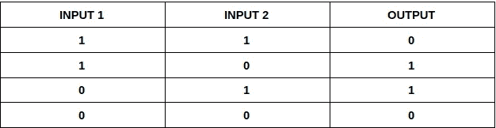
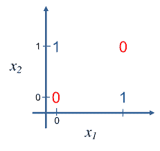
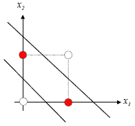
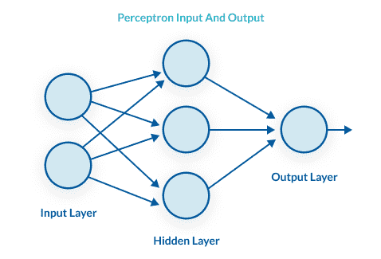

# 用 MLP 解决异或问题

> 原文：<https://medium.com/mlearning-ai/solving-the-xor-problem-using-mlp-83e35a22c96f?source=collection_archive---------0----------------------->

在这篇博文中，我们将介绍什么是异或问题的基础知识，以及我们如何使用 **MLP** 来解决这个问题。

**什么是异或？**

“异或”是一种逻辑运算，当输入不同时输出真。

对于异或门，真值表如下

XOR truth table

XOR 是一个分类问题，因为它呈现二进制不同的输出。如果我们绘制异或门的输入与输出，它看起来会像这样

该图绘出了对应于其输出的两个输入。可视化该图，我们可以看到不可能使用线性方程来分离不同的输出(1 和 0)。

要使用线性方程分离两个输出，我们需要画两条分离的线，如下所示

Image courtesy: [https://tex.stackexchange.com/](https://tex.stackexchange.com/)

上图完美地展示了为什么这些输出不能用一个线性方程来分离。这是最初感知器(单层方法)的一个主要问题。

# **什么是异或问题？**

正如我们在上面看到的，仅仅使用一个线性方程是不可能分离 XOR 输出的。这是一个主要问题，因为在机器训练期间，为了优化输出，机器被期望自己形成数学方程。

对于类似于 XOR 输出的问题，机器不可能建立一个良好输出的等式。这导致了在人工神经网络中广泛使用的隐藏层概念的诞生。

让我们称输出为 Y，所以

Y = A1X1 + A2X2 + A3X3 + …。+ B

这里 B 是偏差，A1，A2，A3 是权重。**权重用于控制连接的信号(连接强度)。**

**Y 也可称为加权和。**

感知器内部的信息流是前馈型的，这意味着信号从输入层到输出层是单向流动的。所有的输入层都是相互独立的。

权重变量的变化控制输入值到输出值的转换过程。

单层架构(感知器)的主要限制是它使用一条线来分隔数据点。这在类似于 XOR 问题的问题中有缺点，因为数据点是线性不可分的。

# **异或问题是怎么解决的？**

XOR 问题的解决方案在于多维分析。我们在不同层次的解释和处理中插入大量的输入，以产生最佳的输出。

对输入进行更深层次处理的内层称为隐藏层。隐藏层不依赖于任何其他层。这种架构被称为多层感知器(MLP)。

The layers in a perceptron

MLP 的层数是不固定的，因此可以有任意数量的隐藏层进行处理。在 MLP 的情况下，为每个隐藏层定义权重，隐藏层将信号传递到下一个前进层。

使用 MLP 方法让我们可以深入到两个以上的维度，这反过来让我们可以使用多维方程来分离 XOR 的输出。

每个隐藏单元调用一个激活函数，将它们的输出值降低到 0 或 1。

MLP 方法也属于前馈人工神经网络类，因此只能单向通信。MLP 通过多维可视化数据点有效地解决了异或问题，从而构建了一个 n 变量方程来拟合输出值。

在这篇博客中，我们了解了流行的异或问题，以及如何使用多层感知器来解决这个问题。这些问题给人一种理解深度神经网络如何解决复杂问题的感觉。

## 参考

 [## 异或问题-主页

### 让我们想象具有如下属性的神经元:-它们被设置在一层中-它们中的每一个都有自己的极性…

home.agh.edu.pl](http://home.agh.edu.pl/~vlsi/AI/xor_t/en/main.htm)