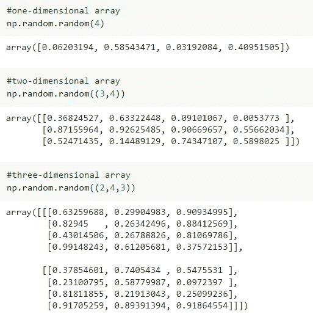
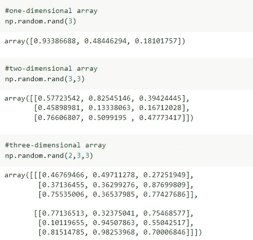
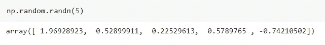
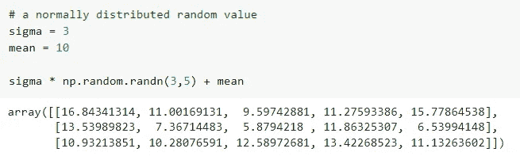
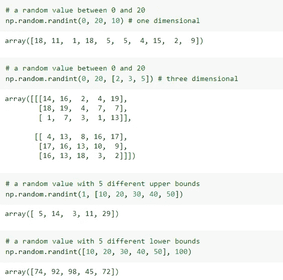
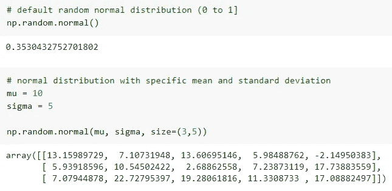
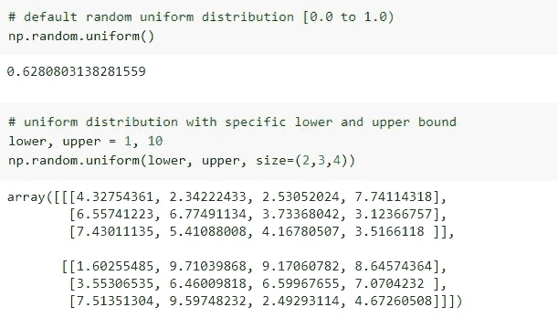
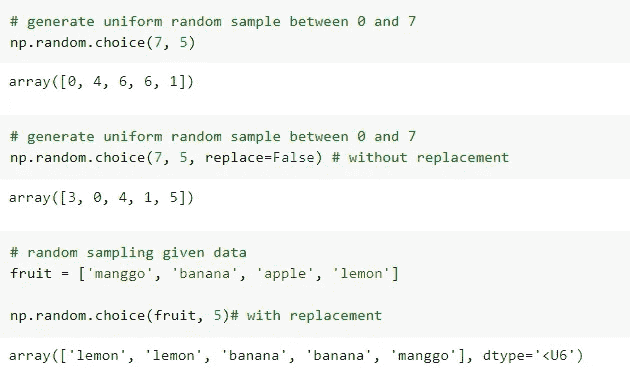

# NumPy 中产生随机数的几个重要函数

> 原文：<https://medium.com/mlearning-ai/some-important-random-functions-in-numpy-module-64003994f67f?source=collection_archive---------8----------------------->

## 创建虚拟数据集时，有时需要使用随机数，但如何使用 NumPy 来实现呢？


Photo by Jonathan Petersson from [Pexels](https://www.pexels.com/photo/photo-of-two-red-dices-965879/)

数据科学是一门需要数据的学科。当您刚刚开始学习数据科学时，使用真实世界的数据集可能会很困难。创建虚拟数据集是解决这个问题的方法。如果我们使用随机数，虚拟数据集更容易制作。

当创建随机数时，有时我们会设置特定的标准作为数字的范围。使用 NumPy 库创建随机数更容易。NumPy 提供了几个函数，可以根据我们想要的标准生成随机数。

在本文中，我们将讨论 NumPy 中可以用作随机数生成器的一些基本函数。

# 随机的

当你想生成半开区间[0.0 到 1.0]的随机数时，那么你可以使用`np.random.random()`。它返回一个介于 0 和 1 之间的数字。

```
**np.random.random**(*size=None)*
```

这个函数只需要一个参数作为要生成的随机数的个数。您可以通过将随机数写在括号中来指定要生成的随机数的数量。



Image by Author

# np.random.rand()

接下来是`np.random.rand()`函数，可以用来生成均匀分布的随机数【0.0 到 1.0】。

```
**np.random.rand**(*size=None)*
```

就像前面的函数一样，这个函数也只需要一个参数，即要生成的随机数的个数的大小。



Image by Author

# 随机的

当您想要创建正态分布的随机数时，可以使用`np.random.randn()`函数。

```
**np.random.randn**(*size=None)*
```

就像前面的函数一样，这个函数也只需要一个参数，即要生成的随机数的个数的大小。该函数将返回平均值为 0、标准差为 1 的正态分布浮点值。



Image by Author

我们可以根据需要修改平均值和标准偏差值。要修改它，您必须将标准偏差值乘以随机值，然后将结果与随机值相加(`sigma * np.random.randn() + mu`)。



Image by Author

在上面的例子中，我们创建了一个均值为 10、标准差为 3 的正态分布随机值。

# np.random.randint()

当你想创建一个有上限和下限的整数随机值时，使用`np.random.randint()`。这个函数有几个参数，包括下限(包含)、上限(不包含)、大小和特定的数据类型。

```
**np.random.randint**(*low, high=None, size=None, dtype=int*)
```

此函数将从指定的限制返回一个随机整数值(离散均匀分布)。



Image by Author

在大多数情况下，这种随机函数通常用于创建虚拟数据集。

# np.random.normal()

创建正态分布的随机数可以用(`sigma * np.random.randn() + mu`)来完成。但是，NumPy 通过使用`np.random.normal()`功能可以很容易地做到这一点。

```
**np.random.normal**(*loc=0.0, scale=1.0, size=None*)
```

该函数有 3 个参数，包括平均(中心)值 loc、标准差(扩展)值 scale 和大小。



Image by Author

# np.random.uniform()

然后，使用`np.random.uniform()`函数创建均匀分布的随机值。该函数有三个参数，包括下限、上限和大小。

```
**np.random.uniform**(*low=0.0, high=1.0, size=None*)
```

默认情况下，该函数将返回在半开区间内均匀分布的值[低，高](包括低，但不包括高)。



Image by Author

# np.random.choice()

最后，可以使用`np.random.choice()`功能从给定的一维阵列生成随机样本。该函数有四个参数，包括一维数组、大小、替换(`True` 或`False`)以及与给定一维数组中每个条目相关联的概率。

```
**np.random.choice**(1-D array, *size=None*, *replace=True*, *p=None*)
```

该函数也可用于随机采样或具有预定概率。



Image by Author

# 结论

NumPy 提供了许多可以用来生成随机数的函数。然而，在这些功能中，只有少数几个是经常使用的。没有必要理解所有这些，但是理解其中一些是如何工作的就足够了。更多详情，请阅读官方 NumPy 文档。

# 参考文献:

[1] *传统随机生成 NumPy v1.23 手动*。Numpy.org。(2022).检索自 2022 年 10 月 14 日，https://numpy.org/doc/1.23/reference/random/legacy.html.

[](/mlearning-ai/mlearning-ai-submission-suggestions-b51e2b130bfb) [## Mlearning.ai 提交建议

### 如何成为移动人工智能的作者

medium.com](/mlearning-ai/mlearning-ai-submission-suggestions-b51e2b130bfb)