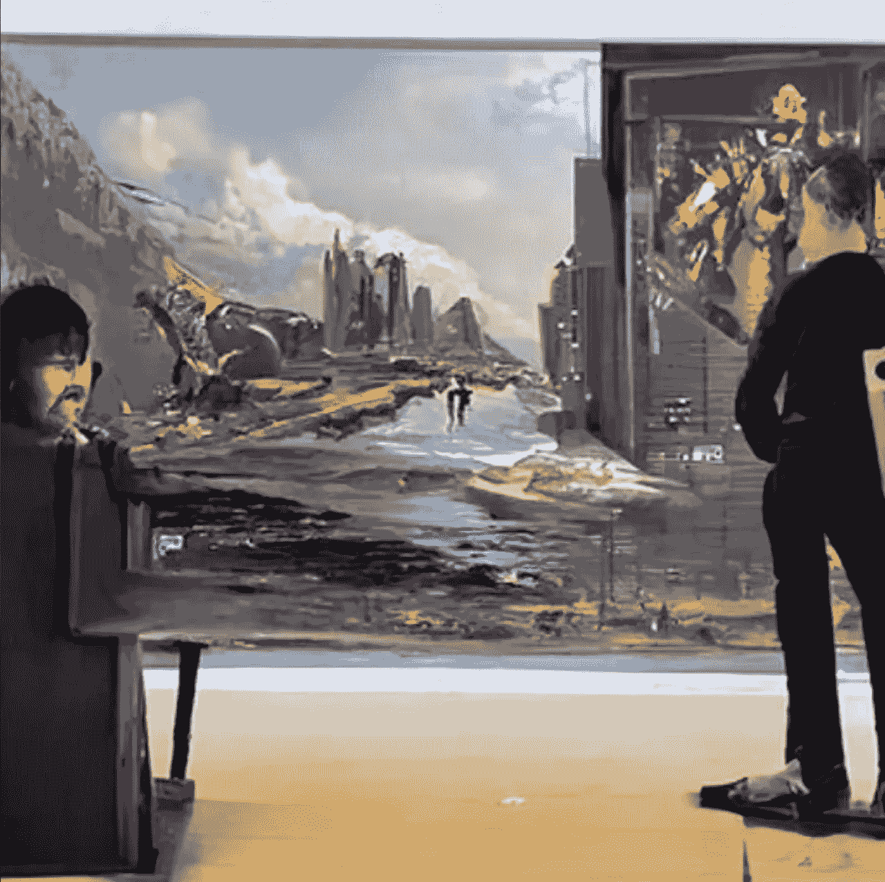

# 抱歉，创造人工智能艺术并不能让你成为艺术家

> 原文：<https://medium.com/mlearning-ai/sorry-generating-ai-art-does-not-make-you-an-artist-108fe16d4de7?source=collection_archive---------1----------------------->

Prompt: Man pretending to be an artist hunched over a computer with a dystopian art gallery in the background. Not exactly. Made via [Night Café](https://creator.nightcafe.studio)

***免责声明:*** *这不是要贬低人工智能艺术或那些创造它的人，尽管有些人可能会误认为是那个老家伙在抱怨这些自以为是的家伙需要“离开我的草坪”这是关于质疑和理解艺术思维(是什么造就了一个艺术家)以及将人工智能释放到世界上的后果，尽管它很酷(不仅仅是在艺术领域)。这是关于如何诚实的人工智能艺术是* …