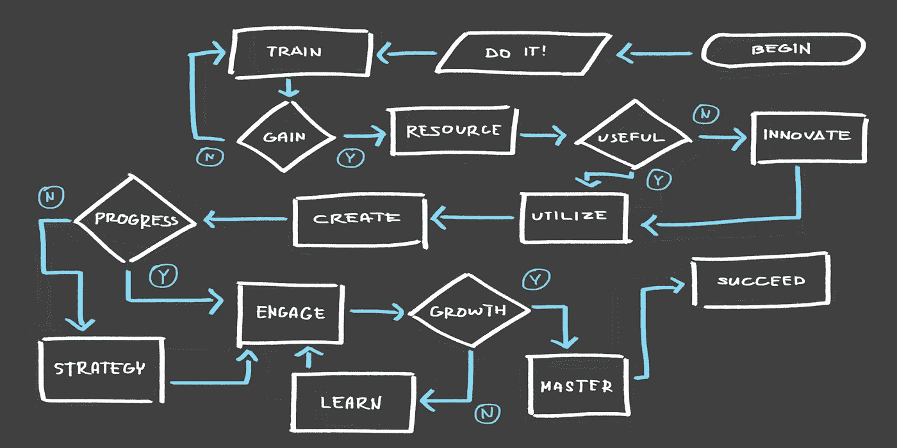
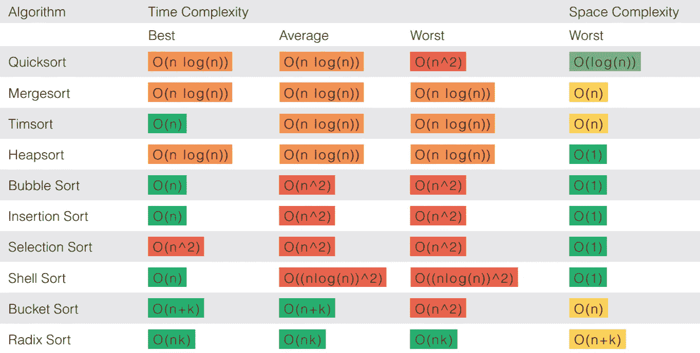

# 排序算法

> 原文：<https://medium.com/mlearning-ai/sorting-algos-4aef653e6fee?source=collection_archive---------4----------------------->

排序算法是一组指令，它接受一个数组作为输入，对该数组(也称为列表)执行指定的操作，并返回一个已排序的数组。排序算法经常在计算机科学教室的早期教授，因为它们提供了一种简单的方法来教授其他重要的概念，如 Big-O 符号、分治过程以及二叉树和堆等数据结构。选择排序算法时，需要考虑几个因素。

# 它们是什么？

换句话说，有序数组是按照一定顺序排列的数组。排序算法接受一个数组作为输入，并返回该数组的排序排列。整数排序和比较排序是两种主要的排序算法，我将在下面解释

**比较排序**

在算法的每个阶段，比较对比较项进行排序，以决定一个元素应该在另一个元素的左边还是右边。

比较排序通常比整数排序更容易构建，但是比较排序具有 O(n log n)的下限，这意味着它们平均不能比 O(n log n)快(n log n)。特定任务的最佳可能方法的最坏情况运行时间被称为算法的下限。“平均”部分是至关重要的:如果提供的列表已经排序或具有一些不寻常(但不可能)的特征，许多算法在相对较短的时间内执行。因为一个列表只有一个排序排列，但是 n！潜在列表，输入已经排序的几率很小，列表平均来说会是未排序的。

**整数排序**

计数排序是整数排序的另一个名称(尽管有一个特定的整数排序算法叫做计数排序)。因为整型不进行比较，所以不受ω(n log n)的约束。整数排序确定每个元素 x 中有多少项小于 x。如果有 14 项的值小于 x，x 将被分配到第 15 个位置。这些数据被用来立即将每个元素插入到适当的槽中，消除了重新组织列表的需要。

# 排序算法属性

所有排序算法的目标都是产生一个排序列表，尽管每个算法的实现方式可能不同。当使用任何算法时，了解它的运行速度和占用的空间非常重要，换句话说，就是它的时间和空间复杂度。基于比较的排序算法的时间复杂度为(nlogn)，这意味着它们不能比 n log n 快，如前一节所述。但是算法的运行时间一般用大 O 而不是ω来表示。如果一个算法在最坏情况下的运行时间为 O(nlogn)，那么保证它永远不会比 O(nlogn)慢，如果它在平均情况下的运行时间为 O(n2)，那么它永远不会比 O(n2)慢。

一个算法的运行时间表明它在完成之前必须做多少次运算。算法的空间复杂度表示必须分配多少内存来运行它。如果一个算法接受一个大小为 n 的列表，由于某种原因，为 n 中的每个成员创建一个新的大小为 n 的列表，这个过程将使用 n^2 空间。

当涉及到排序算法时，知道排序算法是否稳定也是有用的。

# 选择算法

在为某个问题选择排序算法时，要考虑运行时间、空间复杂性和所需的输入列表结构。

选择排序算法时，请考虑这些标准。例如，快速排序是一种很难实现的快速算法；另一方面，冒泡排序是一种构建简单的缓慢算法。冒泡排序可能是对少量数据进行排序的更好选择，因为它可以快速执行，但快速排序的加速可能值得为更大的数据集构建算法的困难。