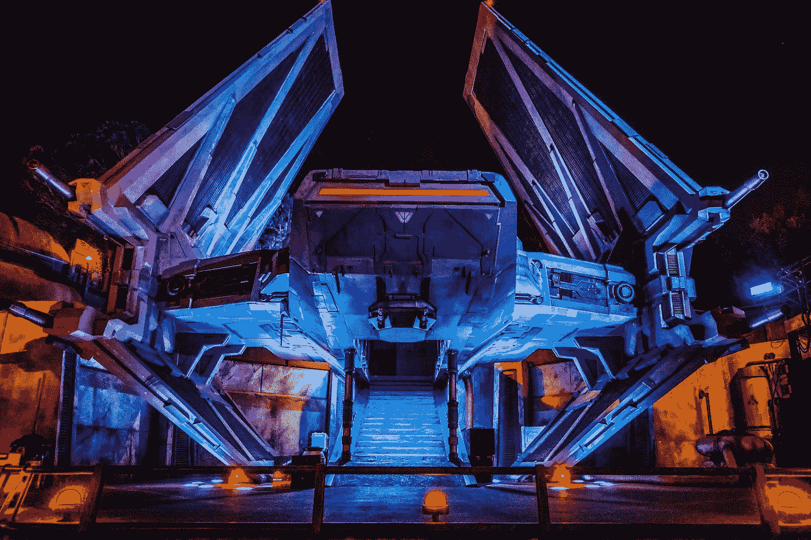

# 泰坦尼克号宇宙飞船:普通老式泰坦尼克号数据集的替代品

> 原文：<https://medium.com/mlearning-ai/spaceship-titanic-an-alternative-to-the-plain-old-titanic-dataset-aa98924c606c?source=collection_archive---------0----------------------->

## 探索 Kaggle 关于熊猫和海牛的新数据集

Photo by [Rod Long](https://unsplash.com/@rodlong?utm_source=medium&utm_medium=referral) on [Unsplash](https://unsplash.com?utm_source=medium&utm_medium=referral)

> 这是 2912 年，宇宙飞船泰坦尼克号，一艘星际客轮，正在进行它的处女航，船上有将近 13，000 名乘客。宇宙飞船泰坦尼克号在运送移民离开我们的太阳系到三个新的可居住的外行星时，与一个…