# 垃圾邮件检测:快速简单

> 原文：<https://medium.com/mlearning-ai/spam-detection-quick-and-easy-7e8b3ba0cf11?source=collection_archive---------4----------------------->

机器学习帮助谷歌能够将垃圾信息与非垃圾信息区分开来。有人可能会认为快速建造一个是一项艰巨的任务。在这篇文章中，我将试图向你展示这是一个非常简单的过程。正如我过去一直做的那样，我将使用机器学习工作流来解释它，可以在下图中看到。

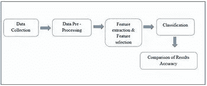

在开始之前，让我们导入相关的库

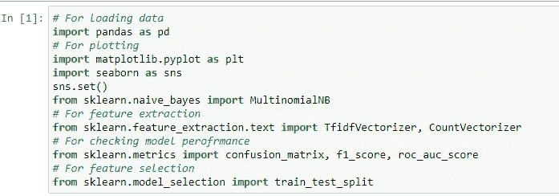

## **数据收集**

本项目中使用的数据集来自 kaggle.com。在这个项目中使用的所有资源将在下面的资源部分。数据集包含文本及其对应的类，即“垃圾邮件”或“垃圾邮件”。使用 pandas 库加载数据集。

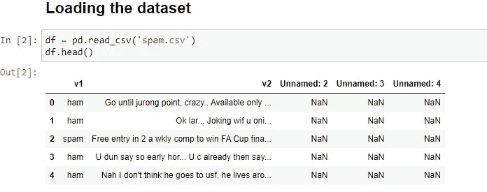

> NB:正如我们已经看到的，数据需要清理，这让我们进入下一个阶段。

## 数据清理和预处理

寻找和数据集。我们有 3 个不相关的列，列名不够详细。所以用熊猫，正如你在下面看到的，两者都被解决了。

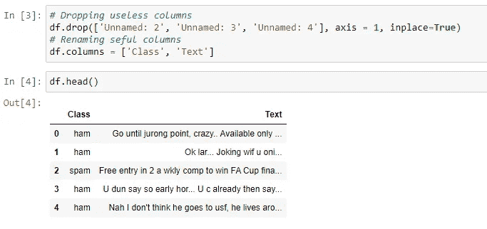

在继续之前，让我们检查呼叫不平衡。

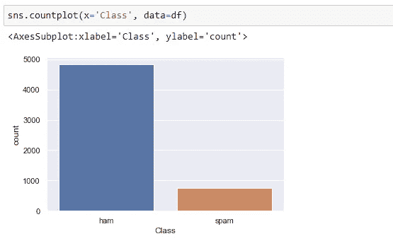

正如我们所看到的，类之间存在巨大的不平衡，在评估我们模型的性能时必须注意到这一点。

## 特征提取和特征选择

机器学习算法只处理数字，而我们的数据集包含文本。由于我们的“Class”列只包含“spam”和“ham ”,一个简单的映射应该就可以了。

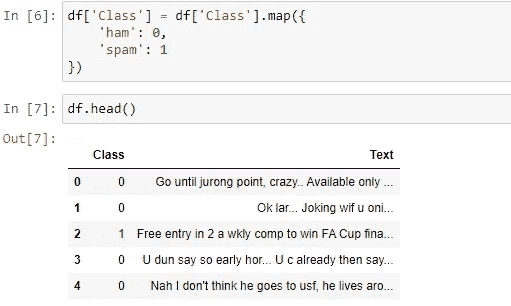

接下来，我们决定将数据集分成因变量和自变量。然后分成训练集和测试集。顾名思义，训练集将用于训练我们的模型，测试集将用于测试我们的模型的性能。

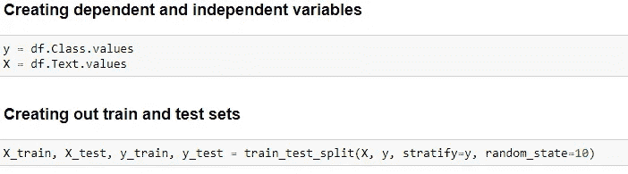

> 注意:在这一点上,“文本”列仍然包含文本而不是数字。

现在，我们使用 sklearn 中的计数矢量器类将“文本”列转换成数字。如果你不知道计数矢量器类是如何工作的，我会在下面的链接和文章中很好地解释这一点。

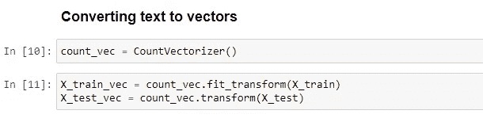

现在是最简单的部分。

## 分类模型

NB:重要的部分来了。在 sklearn 的朴素贝叶斯模块中，有三种常用的分类器，分别是 MultinomialNB、GaussianNB 和 BernoulliNB。

> BernoulliNB 最适合二进制数据，多项式 iNB 最适合分类数据，这就是我们使用它的原因，而 GaussianNB 最适合连续数据。

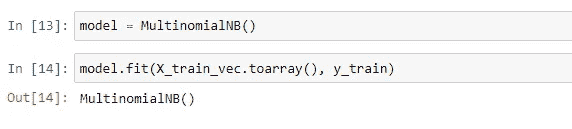

现在到最后一个阶段。

## 检查模型的性能

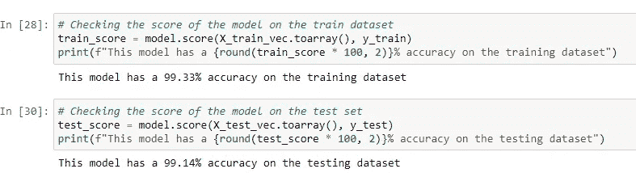

现在我们可以看到，训练集和测试集都有 99%的准确率。但是不要被这个骗了。我们正在处理的数据集是不平衡的，即使模型预测所有的类都是“ham ”,准确性也会很高。为了更好地了解准确性，我们需要使用混淆矩阵。这里，我们决定创建一个可视化混淆矩阵的函数。

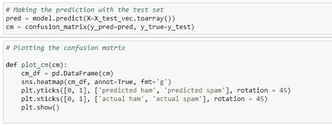

使用函数来可视化我们的混淆矩阵

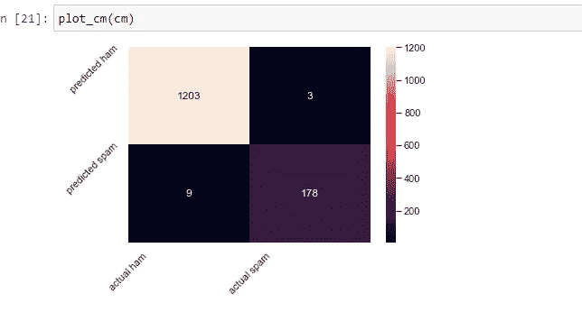

通过这种可视化，我们可以看到，该模型仅将 3 封垃圾邮件误分类为 ham，并将 9 封 ham 邮件误分类为垃圾邮件。

## 额外的

只是为了好玩，我们已经决定使用 word cloud 来绘制垃圾邮件和火腿消息。

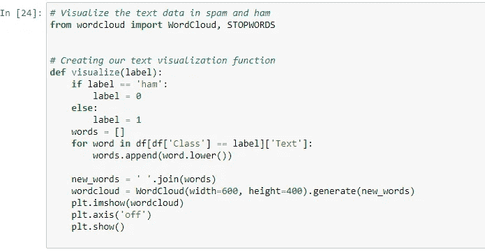

对于垃圾邮件:

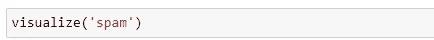

对于火腿:

## 资源:

计数矢量器:"[https://towards data science . com/basics-of-count 矢量器-e26677900f9c](https://towardsdatascience.com/basics-of-countvectorizer-e26677900f9c) "

GitHub:【github.com】oluwatomsin/Spam _ Detection:这包含了一个垃圾邮件检测模型的代码

 [## Mlearning.ai 提交建议

### 如何成为 Mlearning.ai 上的作家

medium.com](/mlearning-ai/mlearning-ai-submission-suggestions-b51e2b130bfb)