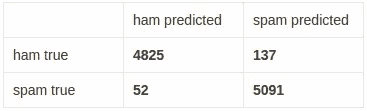
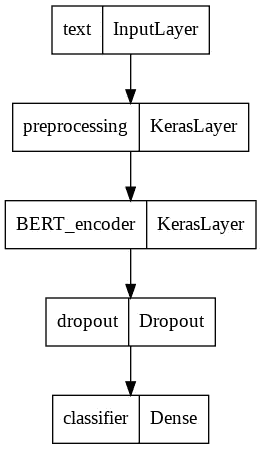
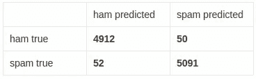
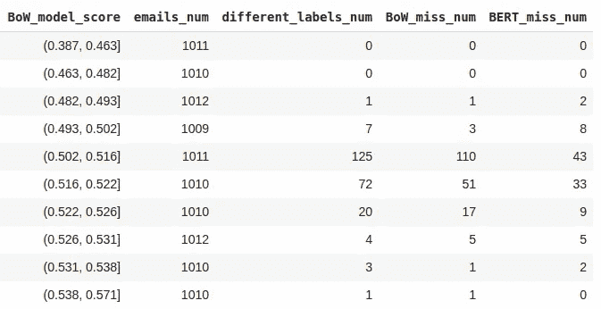
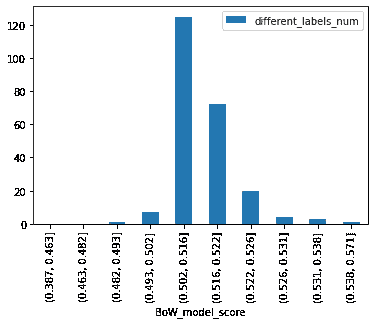
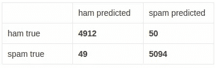
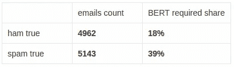

# 使用漏斗方法的垃圾邮件过滤器:单词袋+变形金刚

> 原文：<https://medium.com/mlearning-ai/spam-filter-with-funnel-approach-bag-of-words-transformers-c3751be32548?source=collection_archive---------7----------------------->

假设我们有一个开发垃圾邮件过滤器的任务。让我们将它作为一个现实生活中的项目来对待，并考虑到它未来的部署和维护。

# 目标和要求

开发一个可靠有效的解决方案的第一步是确定我们的**目标**(我们到底想要得到什么？)和**需求**(哪些质量度量是必不可少的？我们的任务存在哪些速度和内存限制？)从一开始就将约束考虑在内是非常重要的，因为它们会严重影响我们关于可以使用哪些算法、数据需要如何预处理等的决策。

让我们定义任务的目标和要求:

1.  我们需要开发一个垃圾邮件过滤器:一个能够以相当好的质量区分垃圾邮件和正常邮件的模型。例如，对于这个二元分类任务，我们的目标是 99%的精确度和 99%的召回率
2.  我们的系统需要相对快速地处理大量的消息。例如，每 1000 条消息 1 秒的推断时间是可以接受的，但是每 1000 条消息 5 秒就太慢了
3.  这项任务不是一次性的快速实验。相反，假设开发的模型应该几乎可以投入生产。这也意味着所有的实验都需要是可重复的，代码应该易于维护和更新

最后一个需求对这个项目的结构有很大的影响。以下几点可能相对耗时，但对于希望有多个参与者并多次维护和更新的项目来说，它们是必不可少的:

*   重现解决方案所需的所有代码都应该以 python 包的形式构建，并通过代码库进行维护。Colab 和 Jupyter 笔记本是探索和实验的优秀工具，但它们不能存储生产就绪代码
*   代码和数据应该分开存储。对于这项任务，数据存储在 Google drive 中，关键代码以 python 包的形式存在于 github 库[中。Google drive 和 github 的软件包都可以安装在 Colab 笔记本环境中使用](https://github.com/NataliaTarasovaNatoshir/spam_detector)

# 资料组

[**安然**预处理数据集](http://nlp.cs.aueb.gr/software_and_datasets/Enron-Spam/index.html)用于此任务。六个文件夹中的每一个都有一个包含垃圾邮件的“垃圾邮件”文件夹和一个包含非垃圾邮件的“ham”文件夹。每条消息都存储在单独的。txt 文件。

让我们把这些文件提取出来，分别进行训练和测试: [Dataset_building.ipynb](https://github.com/NataliaTarasovaNatoshir/spam_detector/blob/f762ebcb9c26f1d00f9c42515e5178d4af5a9cb4/Colab%20Notebooks/Dataset_building.ipynb)

每个文件夹都被解压缩，ham 和 spam 文件被随机分成训练和测试部分。它确保测试和训练部分具有来自 6 个初始文件夹的类似文件分布，以防文件夹与文件夹之间的消息在性质上不同。

结果统计:
文件总数= 33708。列车:23599，测试:10109 (30%)
列车。火腿:11583，垃圾邮件:12016 (51%)
测试。火腿:4962，垃圾邮件:5147 (51%)

为了加速模型开发和测试过程，我们对。txt 文件并将结果存储在。csv 格式:[Basic _ preprocessing . ipynb](https://github.com/NataliaTarasovaNatoshir/spam_detector/blob/f762ebcb9c26f1d00f9c42515e5178d4af5a9cb4/Colab%20Notebooks/Basic_preprocessing.ipynb)

# 测试管道

在开发任何解决方案之前建立一个测试管道*是一个很好的实践。它提供了比较不同模型的可靠基础，并确保所有解决方案都有相似的界面。有了类似的界面，为将来的部署准备模型就更容易了。*

我们在测试管道中测量的性能指标应该与初始需求联系起来。在我们的任务中，我们将评估以下模型的特征:

*   **ROC-AUC 得分**作为二元分类器的一般质量度量(如果得分而不是类别标签由模型预测)
*   **精度**在选定的召回水平为 99%
*   **推断时间**

让我们在一个“虚拟”模型上开发和测试我们的测试管道:[Quality _ assessment . ipynb](https://github.com/NataliaTarasovaNatoshir/spam_detector/blob/f762ebcb9c26f1d00f9c42515e5178d4af5a9cb4/Colab%20Notebooks/Quality_assessment.ipynb)

# 词汇袋方法

文本格式的数据不能直接用于机器学习算法。它首先需要被转换成向量或张量。最快最简单的方法是**单词袋**法:

1.  每个文档都被分成标记—单词、字符、单词的一部分等。为了获取更多的信息，还可以使用文本(2 元语法)或 n 元语法中的成对标记。
2.  来自训练数据集的所有记号构成词汇 V
3.  每个文档都用一个|V|-size 向量来描述，其中为每个标记计算一个值——只是这个标记在文档中出现的次数或 TF/IDF 值等。
4.  产生的空间矩阵用于训练 ML 算法，通常是线性正则化模型

让我们在垃圾邮件过滤任务中尝试这种方法:[Bag _ of _ words _ approach . ipynb](https://github.com/NataliaTarasovaNatoshir/spam_detector/blob/master/Colab%20Notebooks/Bag_of_words_approach.ipynb)

该解决方案具有不错的质量指标:

*   roc-auc 评分: **0.9965**
*   召回时的精度 0.99: **0.9738**
*   混淆矩阵:

但它的主要优势是速度:

*   总推断时间: **0:00:04.023293**
*   每 1000 个条目的推理时间: **0:00:00.398149**

# 语境嵌入

就质量而言，我们能做得比一袋文字更好吗？是的。现在，我们从一个文本中独立地查看所有的记号，与它们的位置无关。这意味着我们从原始信息中丢失了很多信息。为了补救，我们可以使用上下文嵌入。

其中一个算法就是 [BERT](https://en.wikipedia.org/wiki/BERT_(language_model)) 。它是一种基于 [transformer](https://en.wikipedia.org/wiki/Transformer_(machine_learning_model)) 的机器学习技术，用于自然语言处理。BERT 已经在庞大的文本语料库上进行了预训练，可以进行微调以解决文本分类等任务。

让我们试试 BERT 来完成我们的垃圾邮件过滤任务:[Transformers _ approach . ipynb](https://github.com/NataliaTarasovaNatoshir/spam_detector/blob/master/Colab%20Notebooks/Transformers_approach.ipynb)

我们可以下载一个小型的 BERT 版本——预处理层和编码器，添加一个用于正则化的丢弃层和一个用于二进制分类的带有一个神经元的全连接层:

该解决方案在质量指标方面更胜一筹，误报数量降低了 2.74 倍:

*   roc-auc 评分: **0.9987**
*   召回时的精度 0.99: **0.9903**
*   混淆矩阵:

但是，不幸的是，它慢了 19 倍:

*   总推断时间: **0:01:15.980648**
*   每 1000 个条目的推断时间: **0:00:07.519114**

# 漏斗方法:结合两种模型

有没有一种方法可以达到相似的质量，但不牺牲这么多的速度？在许多情况下，使用漏斗方法是有帮助的。首先，对所有对象应用简单但快速的模型，然后对对象的特定子集应用更复杂但较慢的模型。

让我们试着为我们的任务找到一个成功的组合: [Funnel_approach.ipynb](https://github.com/NataliaTarasovaNatoshir/spam_detector/blob/f762ebcb9c26f1d00f9c42515e5178d4af5a9cb4/Colab%20Notebooks/Funnel_approach.ipynb)

我们可以从分析测试数据集中由“单词袋”模型和“bert”模型预测的标签不同的情况开始。

如果我们按照“单词袋”模型预测的分数(列“BoW_model_score”)对所有对象进行分组，我们可以看到:

*   “bert”模型几乎总是比“单词袋”模型更精确——“BERT _ miss _ num”

*   标注的差异(“different_labels_num”)集中在对象的子集中，其中“单词包”模型预测得分在 0.502 和 0.526 之间

这意味着我们可以在一个两级漏斗中结合两个模型:

1.  应用快速单词袋模型
2.  对于得分为 0.502–0.526 的对象—应用较慢的 BERT 模型
3.  使用单词包和 BERT 各自的阈值来标记它们的对象

> *请注意，来自两个不同模型的预测分数并不完全可比，因此我们使用标签而不是分数来计算性能指标。*

漏斗模型提供了与变压器方法相似的质量:

*   召回时的精度 0.99: **0.9903**
*   混淆矩阵:

并且只比单词包方法慢 5.5 倍:

*   总推断时间: **0:00:22.277667**
*   每 1000 个条目的推理时间: **0:00:02.204618**

虽然这种速度上的提高仍然不够，但在实际应用中会更有效。为什么会这样呢？

这个数据集中的两个类是平衡的，以便于更容易的训练。实际上，它们是极度不平衡的——大部分邮件是“垃圾邮件”，只有一小部分是“垃圾邮件”。对于垃圾邮件和垃圾邮件类别，需要较慢的 BERT 方法的电子邮件的百分比是不同的。事实上，对于垃圾消息，需要的 BERT 方法是对于业余消息的两倍:

> 这意味着，在实践中，对于大多数消息，将只使用快速单词袋模型，这使得漏斗方法在速度和精度方面更加有效。

# 警告和可能的改进

1.  相同的数据集用于测量漏斗模型质量并定义其超参数(应应用“bert”模型的“单词袋”模型的分数)。以这种方式计算，质量度量比我们对全新数据的预期更加乐观。在以前没有使用过的单独数据集上测试漏斗模型会更准确
2.  几乎没有超参数选择用于 BERT 模型微调。例如，可以改变退出率或时期数以获得最佳质量
3.  在将最终模型部署到生产环境之前，最好使用所有可用的数据来训练模型。上面我们还没有利用分离出来的数据进行测试

# 结论

我们对质量和推理速度的严格要求使我们寻找质量-效率的平衡，这可能很棘手:快速算法不能提供足够的精度，而那些提供精度的算法又太慢。幸运的是，我们可以使用两步漏斗方法来实现这种平衡:首先在所有地方应用快速但“较弱”的模型，然后仅在第一个模型容易出错的地方应用“较强”但较慢的模型。

 [## Mlearning.ai 提交建议

### 如何成为 Mlearning.ai 上的作家

medium.com](/mlearning-ai/mlearning-ai-submission-suggestions-b51e2b130bfb)