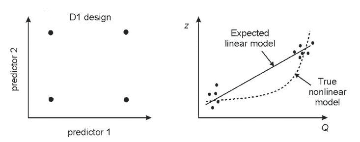
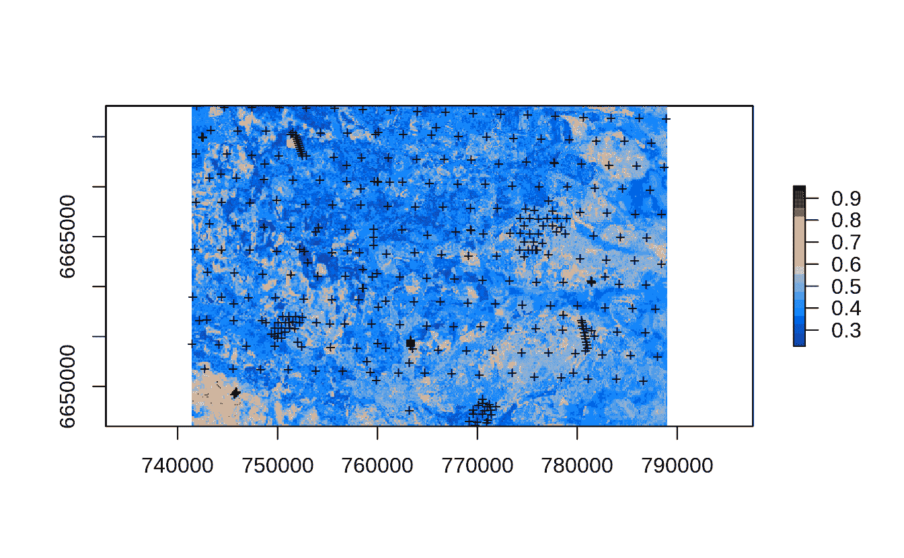
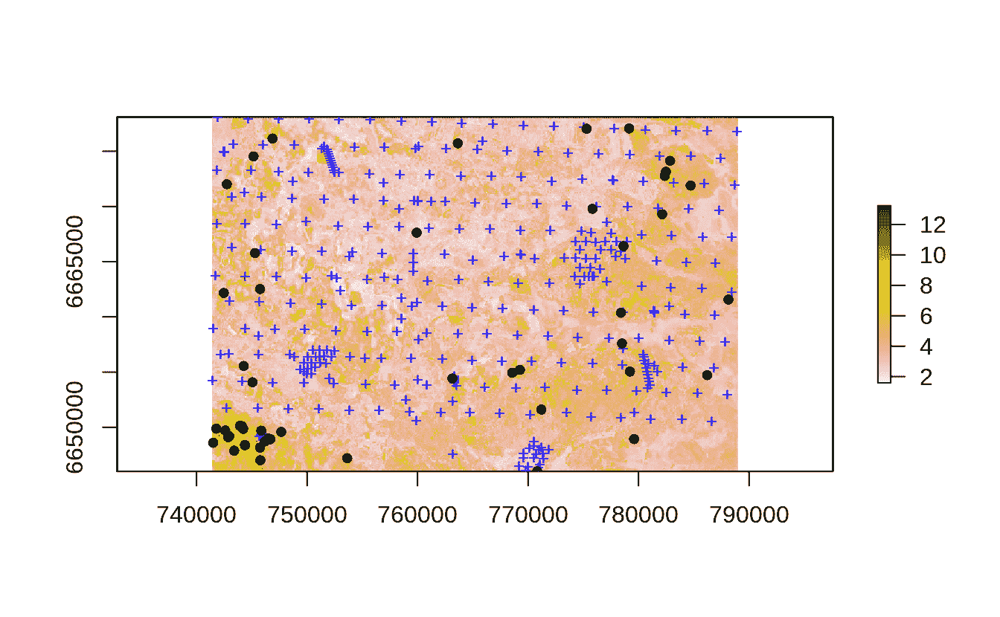

# 空间采样和重采样与机器学习:R 教程

> 原文：<https://medium.com/mlearning-ai/spatial-sampling-and-resampling-for-predictive-mapping-with-machine-learning-a-tutorial-in-r-99f71555bc43?source=collection_archive---------1----------------------->

*编写人:Tom Hengl (OpenGeoHub)、Leandro Parente (OpenGeoHub)和 Ichsani Wheeler (OpenGeoHub)*

> 从土壤、植被科学、生态学、地质学中收集的样本可用于构建预测制图模型和制作预测图，即地图。越来越多的机器学习方法，如随机森林和类似的方法，被用来训练模型，制作地图和估计人口参数。但是，如何为机器学习模型设计采样计划，如果你的采样是基于主观分配的点，你应该担心吗？应该担心点的外推和空间聚类吗？如何确保使用给定点数据拟合的 ML 模型具有代表性/无偏性？

# 空间采样

统计中的抽样是为了估计总体参数和/或检验实验。如果观察和测量(O&M)是在空间中收集的，并使用例如 GPS，这被称为**空间采样**，并且通常被具体化为**一个点地图**，其中的点代表计划或实施的位置& M。准备空间采样计划是实验的一种**设计，因此正确地做它以避免任何潜在的偏差是很重要的。**

空间取样或产生和实施取样设计在包括自然地理学、土壤学、地质学、植被科学、生态学等各种领域中是常见的。想象一个潜在的重金属土壤污染问题的地区。如果我们收集了足够的样本，我们可以叠加点*与*协变量层，然后训练空间插值/空间预测模型，并生成目标变量的预测 map。例如，为了绘制重金属或土壤有机碳储量的土壤污染图，我们可以在几百个预定位置收集土壤样本，然后将样本带到实验室，测量单个值，然后对其进行插值以绘制浓度图。这是**地质统计学**中最常见的方法之一，例如使用各种克里金法来预测目标变量(参见 [Bivand 等人，2014](https://asdar-book.org/) )。

有许多采样设计算法可用于生成空间采样位置。原则上，所有空间采样方法都可以根据以下四个方面进行分组:

1.  *有多客观？*这里存在两组:(1)客观抽样设计，或者是**概率抽样，或者是来自空间统计的一些实验设计；(2)主观或 [**便利抽样**](https://methods.sagepub.com/reference/encyclopedia-of-survey-research-methods/n105.xml) ，这意味着包含概率是未知的，并且通常基于便利性，例如到道路的距离/可达性；**
2.  ***多少同分布*？这里至少存在三组:(1)[**【IID】**](https://xzhu0027.gitbook.io/blog/ml-system/sys-ml-index/learning-from-non-iid-data)独立同分布抽样设计，(2)整群抽样即非等概率抽样，以及(3)截尾抽样，**
3.  ***是基于地理还是特征空间？*这里至少存在三组:(1)地理采样，即仅考虑地理维度+时间；(2) **特征空间采样**，即仅考虑特征空间中点的分布；(3)混合抽样，即同时考虑特征和地理空间；**
4.  ***优化程度如何？*这里至少存在两组:(1) **优化采样**使得目标优化标准达到最小值/最大值，即可以证明其被优化，(2) *【非优化】*采样，当优化标准不能被测试或未知时，**

**使用客观抽样设计进行抽样是很重要的，因为它允许我们检验假设，并对总体参数或类似参数进行无偏估计。许多空间统计学家认为，只有事先准备好的、严格遵循的随机概率抽样才能用于提供空间预测准确性的无偏估计 [(Brus，2021)](https://github.com/DickBrus/SpatialSamplingwithR) 。在概率抽样的情况下，总体参数的计算是数学推导的，即估计过程是无偏的，并且独立于目标变量的空间属性(例如，空间相关结构和/或统计分布)。例如，如果我们使用**简单随机抽样(SRS)** 生成抽样位置，该抽样设计具有以下特性:**

1.  **它是每个空间位置具有完全相同的**包含概率**的 IID，**
2.  **它在地理空间上是对称的，这意味着在研究区域的每个象限中可以找到大约相同数量的点，**
3.  **它可以用于导出总体参数(例如平均值),并且这些测量根据定义是无偏的，**
4.  **SRS 的任何随机子集也是 SRS，**

**原则上，SRS 是客观采样和 IID 采样，只要提供一些表示研究区域的多边形地图，就可以轻松生成 SRS。具有与 SRS 相似属性的另外两种稍微复杂一些的采样算法例如是不同版本的镶嵌采样。例如，**广义随机镶嵌分层(GRTS)设计**在美国被用于为地球化学制图目的产生采样位置( [Smith 等人，2013](https://pubs.usgs.gov/ds/801/))；采用**多阶段分层随机抽样**设计产生 [LUCAS 土壤监测点网络](https://esdac.jrc.ec.europa.eu/projects/lucas) ( [Tóth et al .，2014](https://esdac.jrc.ec.europa.eu/ESDB_Archive/eusoils_docs/other/EUR26102EN.pdf) )。**

# **回归建模的空间采样**

**通过使用例如机器学习算法拟合回归和分类模型，然后应用这些模型来预测所有像素的值，可以使用表示原位观察和/或测量的大型点数据集来生成地图。这被称为 [**预测映射**](https://soilmapper.org) 。事实上，我们在机器学习中用于预测映射的许多点数据集并不具有理想的属性，即既不是 IID，也不是包含概率。许多事实上是有目的的，[方便取样](https://methods.sagepub.com/reference/encyclopedia-of-survey-research-methods/n105.xml)，因此可能过度代表某些地理特征，可能被审查，并可能导致估计中的重大偏差。**

**如果建模的目标是建立回归模型(将目标变量与代表例如土壤形成因素的多个空间层相关联)，那么我们正在研究统计学中被称为 [**响应面实验设计**](https://en.wikipedia.org/wiki/Response_surface_methodology) 的问题。考虑以下一个目标变量( *Y* )和一个协变量( *X* )的情况。假设两者线性相关(即 *Y = b0 + b1 * X* ，可以很容易地证明最优实验设计是(a)确定 *X* 的最小值和最大值，然后将一半的点放在 Xmin，另一半放在 Xmax ( [Hengl 等人，2004](https://dx.doi.org/10.1071/SR03005) )。这个设计被称为 [D1 最优设计](https://en.wikipedia.org/wiki/Optimal_design#D-optimality)，实际上它看起来实现起来相对简单。问题是，只有当 Y 和 X 之间的关系是完全线性的，它才是最优设计。如果该关系可能接近二次，则 D1 设计比例如 D2 设计差得多(一半点在特征空间的中间，一半点在特征空间的边缘)。**

****

***Example of D1 design: (left) D1 design in 2D feature space, (right) D1 design is optimal only for linear model, if the model is curvilinear, it is in fact the worse design than simple random sampling. Image source:* [*Hengl et al. (2004)*](https://dx.doi.org/10.1071/SR03005)*.***

**实际上，我们可能不知道 *Y* 和 *X* 之间的关系是什么性质，也就是说，我们不希望冒险并产生有偏差的估计。因此，我们可以假设它可能是一个曲线关系，所以我们需要在特征空间均匀采样。统计学中一个众所周知的抽样设计是 [**拉丁超立方体抽样**](https://en.wikipedia.org/wiki/Latin_hypercube_sampling) 。简单来说，LHS 采样是基于将**累积密度函数** (CDF)划分为 *n* 个相等的分区，然后在每个分区中选择一个随机数据点。*“超立方体”*表示有许多协变量( *X)* 形成一个超立方体。**

**从 ML 的角度来看，预测映射特别感兴趣的是使用基于特征空间采样优化的采样设计。因此，在下文中，我们将关注以下四种空间采样算法:**

1.  **主观或方便的采样(此处仅用于说明)，**
2.  ****简单随机抽样** (SRS)，**
3.  ****拉丁超立方体采样** (LHS)、**
4.  ****特征空间覆盖采样** (FSCS)、**

**原则上，SRS 和 LHS 都是独立的同分布(IID)抽样设计，这意味着样本中的所有项目都来自相同的概率分布+它们都是独立的(意味着:所有样本项目都是独立的事件，彼此之间没有任何联系)。FSCS 更加复杂，因为点是基于要素空间中的聚类选择的，并且假设研究区域具有高度多样化的区域(高和低地形多样性),因此很难预测最终 FSCS 样本的外观。关于空间采样技术的完整概述，请参考 [Brus (2021)](https://github.com/DickBrus/SpatialSamplingwithR) 。**

**下图显示了上述采样算法在地理空间和特征空间的差异。在这种情况下:实际采样明显缺少特征空间中的整个聚类，而似乎在特征空间中显示出最高的分布，并且被许多作者认为是预测映射的最有利的采样设计(【马】等，2020 )。这样的采样诊断/比较地理*与*特征空间帮助我们在开始运行 ML 之前检测任何可能的问题。**

****

**[Comparing sampling designs](https://opengeohub.github.io/spatial-sampling-ml/): convenience sampling (actual), Simple Random Sample (SRS), Latin Hypercube Sampling (LHS), and Feature Space Coverage Sampling (FSCS). Points shown in geographical (above) and feature space (below; with first 2 principal components as x, y coordinates).**

# **ML 需要概率抽样来生成可用的地图吗？**

**原则上，机器学习可以从任何训练数据中生成模型和预测:从技术上讲这不是问题。然而，取样中的任何偏差都可能传播到我们从分析中得出的任何结论。最终，产生有偏差或过于乐观的估计会降低用户对您的空间分析的信心。幸运的是，R 中有大量的诊断工具(例如，多亏了 [spatstat](https://cran.r-project.org/web/packages/spatstat/spatstat.pdf) 和 [maxlike](https://cran.r-project.org/web/packages/maxlike/maxlike.pdf) 包)来帮助你检查训练点的代表性，潜在的外推区域在哪里？抽样设计对模型参数的估计有多大影响？在 [Rmarkdown 教程](https://opengeohub.github.io/spatial-sampling-ml/)中，我们专门指导您解决真实数据集数据科学问题，并演示如何解决此类问题。原则上，我们建议三种主要策略来减少采样偏差对预测作图的影响:**

1.  **对未知抽样设计进行分组，使其尽可能匹配某个概率抽样设计，**
2.  **使用具有分块的数据重采样来测试机器学习的准确性性能，**
3.  **使用具有线性(简单)和非线性模型的组合的集成机器学习来避免过度拟合和外推失误，**

**这些步骤在[本教程](https://opengeohub.github.io/spatial-sampling-ml/)中有详细解释。估计任何外推问题的另一个有用的事情是产生:(a)预测误差的**图**，和/或(b)拟合的 ML 模型的[图**适用区域**](https://cran.r-project.org/web/packages/CAST/vignettes/AOA-tutorial.html)([Meyer&Pebesma，2021](https://doi.org/10.1111/2041-210X.13650) )。预测误差图显示了预测特别差的地方，有助于限制决策。用户有权知道与他们使用的预测/地图相关的风险。**

****

**Map or prediction errors (log-soil organic carbon content for topsoil) produced using Ensemble ML. Prediction error maps highlight areas where the models perform poorly; high predictions errors often match the extrapolation areas. Where prediction errors exceed some critical threshold, map is of little use or should not be used for decision-making at all.**

# **新区域的空间采样:使用哪种采样算法？**

**想象你第一次去一个地方。你基本上对该区域一无所知，也绝对没有初始点数据，但你有各种各样的地球观测图像、DTM 导数和类似的 GIS 图层，你想用它们来绘制空间中某些要素的分布图。为了准备抽样计划，我们建议使用 LHS 或 FSCS 抽样。你不必花费所有的预算来收集大量的积分。你可以从几百个样本开始，使用例如 FSCS 算法，然后拟合初始最大似然模型并测试产生的预测和预测误差图。**

**[准备取样计划的建议步骤](https://opengeohub.github.io/spatial-sampling-ml/generating-spatial-sampling.html#feature-space-coverage-sampling)包括:**

1.  **准备您计划用于拟合预测制图模型的所有协变量图层(栅格)；将它们导入 R；**
2.  **使用 [landmap::spc](https://rdrr.io/cran/landmap/man/spc.html) 函数将协变量层转换为主成分；**
3.  **使用 [h2o.kmeans](https://docs.h2o.ai/h2o/latest-stable/h2o-docs/data-science/k-means.html) 函数对特征空间进行聚类；对于较小数量的样本，使用与采样位置数量相等的聚类数量；**
4.  **生成一个采样设计，并将点导出为 [GPX 格式](https://nl.wikipedia.org/wiki/GPS_Exchange_Format)，以便导入手持 GPS 或类似设备。对于野外工作，我们建议使用 [ViewRanger 应用程序](https://play.google.com/store/apps/details?id=com.augmentra.viewranger.android&hl=en&gl=US)，它具有用于野外工作的有用功能，包括规划最佳路线。**

**如果你正在收集超过几百个点，那么 FSCS 可能会变得很麻烦，因此我们建议使用 LHS 采样。该采样算法在特征空间中对称地分布点，并确保外推(在特征空间中)最小化。**

# **对现有点样本进行重采样**

**假设您正在使用现有的点数据集(即之前使用 O&M 数据进行的调查)，那么可能有助于您进行进一步分析的技术称为*“重采样”*，意思是:为了建立地理或特征空间或类似空间的更平衡的表示，对现有的点进行子设置。重采样与采样一样重要，因为它有助于防止:**

*   ***过度拟合*即生产有偏差和/或过于乐观的模型；**
*   ***遗漏重要的协变量*，但由于过度拟合而被过度选择的协变量可能*遮蔽*；**
*   ***产生不良外推*，即在预测中产生伪像或失误；**
*   ***高估/低估映射精度*，即产生模型性能的有偏估计；**

****重采样方法在[哈斯蒂等人(2009)](https://hastie.su.domains/ElemStatLearn/printings/ESLII_print10.pdf) 、[库恩&约翰逊(2013)](https://link.springer.com/book/10.1007/978-1-4614-6849-3) 和[罗伯兹等人(2017)](https://doi.org/10.1111/ecog.02881) 中有详细讨论。重采样通常也在许多统计和机器学习包中实现，如[脱字符号](https://topepo.github.io/caret/)或 [mlr](https://mlr3.mlr-org.com/) 。****

****[Rmarkdown 教程](https://opengeohub.github.io/spatial-sampling-ml/)解释了如何使用重采样方法结合整体机器学习来帮助一次性解决过拟合和外推的多个问题。****

# ****初始模型后的空间采样:第二轮和第三轮采样****

****在我们拟合初始模型后，提高预测的合理做法是收集额外的样本，然后重新运行分析(所谓的*“重新分析建模”*)，即在现有的点上添加新的点，然后重新拟合模型并重新进行预测。这里看起来最符合逻辑的一个原则是按比例分配样本以映射不确定性，即与预测误差超过某个所需精度水平的概率成比例。 [Stumpf et al. (2017)](https://doi.org/10.1016/j.catena.2017.01.033) 将此称为*“不确定性导向”*采样。只有 50 个额外点的第二轮抽样示例如下所示:****

********

****Example of a 2nd round sampling: locations of initial (+) and 2nd round points (dots) produced using the prediction error map from the initial model.****

****通过将额外的采样点按比例定位到我们经历高预测误差的地方，在我们添加新点并重新调整模型之后，第二轮采样很有可能会显著帮助提高映射精度。实际上，我们无法预测精度会提高多少——这只能通过额外的实地工作来实现！****

# ****总结要点****

****我们回顾了一些常见的空间采样技术，这些技术对于使用机器学习进行预测制图很有意义。选择正确的采样和重采样方法对于防止过度拟合或遗漏某些重要关系非常重要，但最重要的是，正确的采样和重采样有助于避免预测偏差(高估或低估)。现在有许多诊断工具可用于估计潜在的外推区域，使用空间分块拟合模型以防止过度拟合和在外推空间中产生错误。我们认为，具有空间分块的集成机器学习特别适合于预测映射，因为它结合了严格的重采样，并减少了一些 ML 算法的过拟合属性。****

****此外，我们在[Rmarkdown 教程](https://opengeohub.github.io/spatial-sampling-ml/)中展示了如何使用初始机器学习模型来准备额外的采样计划，以收集预测最差/最有问题的点。假设这种第二轮和第三轮采样点将通过重新分析帮助提高整体精度，机器学习可以被视为连续的迭代映射过程，每次迭代最终映射变得越来越可靠。当然，如果我们也可以通过节省调查成本来做到这一点，那么这可能是产生高质量预测的最佳途径。****

****你有使用 R 进行采样和建模的经验吗？或者你刚刚开始使用这些工具？[联系我们](https://envirometrix.nl/)告诉我们你的经历和计划。****

# ****引用的参考文献****

1.  ****比万德，r .，佩贝斯马，e .，，卢比奥，V. (2014 年)。应用空间数据分析。，第 401 页)。海德堡:斯普林格。【https://asdar-book.org/ ****
2.  ****布鲁斯法学博士(2021)。[带 R 的空间采样](https://github.com/DickBrus/SpatialSamplingwithR)。(第 544 页)。伦敦:泰勒弗朗西斯。****
3.  ****Hastie，T. J .，Tibshirani，R. J .，& Friedman，J. J. H. (2009 年)。[统计学习的要素:数据挖掘、推理和预测](https://hastie.su.domains/ElemStatLearn/printings/ESLII_print10.pdf)。纽约斯普林格出版社。****
4.  ****t .亨格尔、娜斯鲍姆、m .赖特、M. N .赫韦林克、G. B. M .、格勒和 B. (2018 年)。[随机森林作为空间和时空变量预测建模的通用框架](https://doi.org/10.7717/peerj.5518)。 *PeerJ* ， *6* ，e5518。doi:10.7717/peerj.5518****
5.  ****t .亨格尔、罗斯特、D. G .、斯坦和 A. (2004 年)。[通过与辅助地图相关进行空间预测的土壤取样策略](https://doi.org/10.1071/SR03005)。*澳大利亚土壤研究杂志*， *41* (8)，1403–1422。doi:10.1071/SR03005****
6.  ****m .库恩和 k .约翰逊(2013 年)。应用预测模型(第 810 卷，第 595 页)。斯普林格。****
7.  ****马，李，，朱，张，，唐(2020)。[条件拉丁超立方体和特征空间覆盖取样的比较，用于使用土壤图模拟预测土壤类别](https://doi.org/10.1016/j.geoderma.2020.114366)。*地皮瘤*， *370* ，114366。doi:10.1016/j . geoderma . 20016 . 13636363636****
8.  ****Meyer 和 e . Pebesma(2021 年)。[预测进入未知空间？估计空间预测模型的适用范围](https://doi.org/10.1111/2041-210X.13650)。*生态与进化中的方法*， *12* (9)，1620–1633。doi:10.1111/2041–210 x . 13650****
9.  ****Roberts，D. R .，Bahn，v .，Ciuti，s .，Boyce，M. S .，Elith，j .，Guillera-Arroita，g .，… Thuiller，W. (2017)。[针对具有时间、空间、层次或系统发育结构的数据的交叉验证策略](https://doi.org/10.1111/ecog.02881)。生态地理学，40(8)，913–929。doi:10.1111****
10.  ****Smith，D.B .，Cannon，W.F .，Woodruff，L.G .，Solano，Federico，Kilburn，J.E .，和 Fey，d . l .(2013 年)。美国本土土壤的地球化学和矿物学数据:美国地质调查局数据系列 801，19 页，[https://pubs.usgs.gov/ds/801/](https://pubs.usgs.gov/ds/801/)。****
11.  ****斯坦普夫，f .，施米特，k .，戈贝斯，p .，伯伦斯，t .，舍恩布罗特-施蒂特，s .，瓦杜，a .，…斯霍尔滕，T. (2017)。[不确定性引导取样，以改善数字土壤图](https://doi.org/10.1016/j.catena.2017.01.033)。*连锁*， *153* ，30–38。doi:10.1016/j . catena . 2017 . 01 . 033****
12.  ****托特、g、琼斯、a、蒙塔纳雷拉(编辑。) 2013.[卢卡斯表土调查。方法、数据和结果](https://esdac.jrc.ec.europa.eu/ESDB_Archive/eusoils_docs/other/EUR26102EN.pdf)。JRC 技术报告。卢森堡。欧盟出版物办公室，EUR26102 科学和技术研究系列-ISSN 1831–9424(在线)；ISBN 978–92–79–32542–7；doi:10.2788/97922****

**** [## Mlearning.ai 提交建议

### 如何成为 Mlearning.ai 上的作家

medium.com](/mlearning-ai/mlearning-ai-submission-suggestions-b51e2b130bfb)****