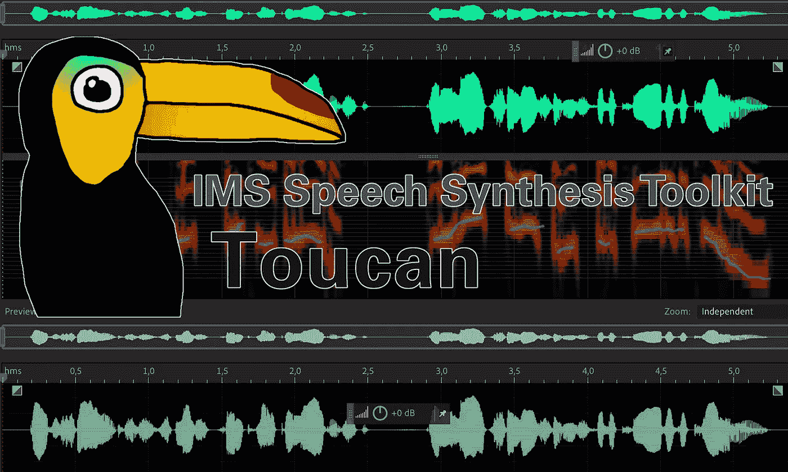

# 语音克隆

> 原文：<https://medium.com/mlearning-ai/speech-cloning-3b1e3ba6c30?source=collection_archive---------2----------------------->

## [机器学习艺术](https://mlearning.substack.com/)

## SOTA 语音合成模型

[https://mlearning.substack.com/](https://mlearning.substack.com/)

我将向您展示使用 [**巨嘴鸟工具包**](#6109) 创建最先进的语音合成模型是多么容易。您将看到所有内容都是基于纯 Python 和 PyTorch 的，尽可能保持简单和初学者友好。