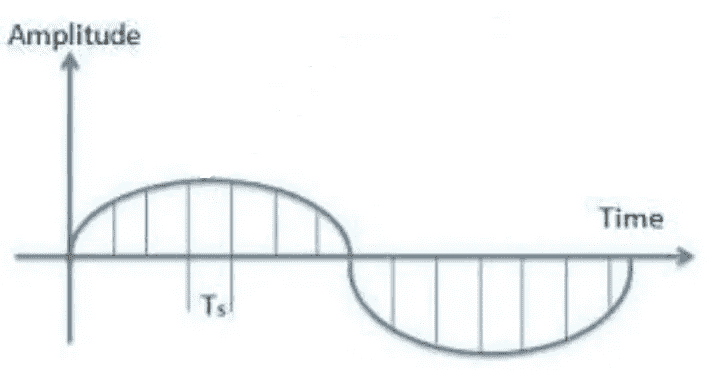
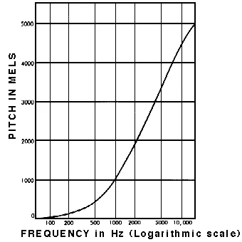
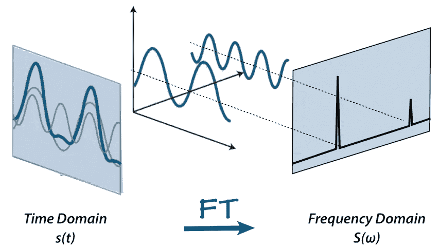
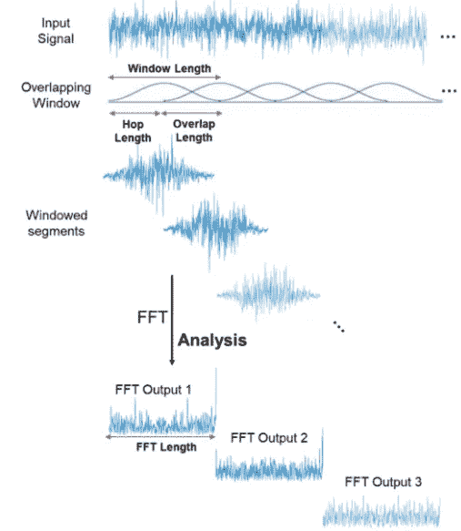
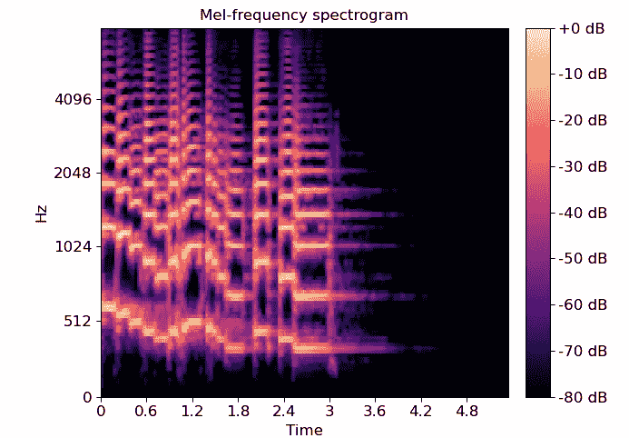
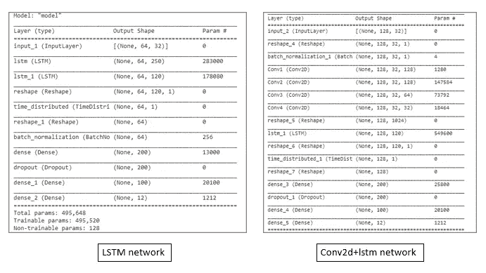
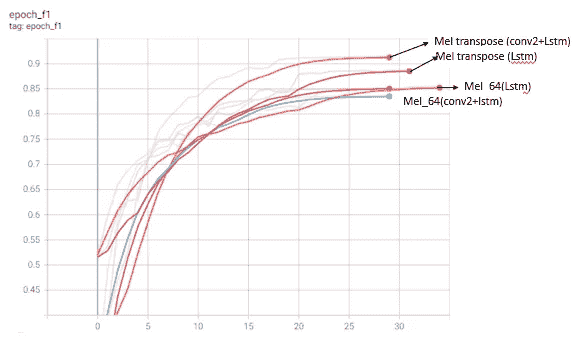

# 使用深度学习的语音识别

> 原文：<https://medium.com/mlearning-ai/speech-recognition-by-using-deep-learning-56455dae3d74?source=collection_archive---------5----------------------->

语音识别指的是机器将口头语言转换成可读文本的能力。在这篇博客中，我将提到由谷歌大脑组织的一场 kaggle 比赛- **TensorFlow 语音识别挑战赛(**[)https://www . ka ggle . com/c/tensor flow-Speech-Recognition-Challenge](https://www.kaggle.com/c/tensorflow-speech-recognition-challenge)**)**。这些数据包含了 65，000 个由 30 个短词组成的一秒钟长的话语，由数千个不同的人完成。

在这篇博客中，我处理了

1.  创建有用的功能
2.  模型架构

我们手头的第一项任务是将语音转换成一种数学形式，以便在此基础上建立进一步的机器学习模型。音频文件具有音频波形，该波形包含每一时刻的波的振幅(模拟)。为了进行计算，我们需要将其离散化，或者换句话说，我们需要决定在所有时刻(间隔)输出音频波形(数字)。



我们需要提供采样率来获得这种离散化。例如，如果音频文件为 1 秒，采样率为 16000，那么在这种情况下将提取 16000 个点。**数据点数=采样率*时间**

因此，我们有了一个音频文件的数字解释，但我们想进一步提取一些有用的特征。声音主要有三个特征**响度、音高和音色**。现在，这些特征必须用数学方法提取出来进行计算。

**响度** -响度与振幅直接相关。如上所述，该信息已经存在于文件中

**音高-** 音高与频率有关。这种关系是由熔融标度确定



Relation between Frequency vs Pitch in mels

更多关于熔化规模的细节可以从 https://www.sfu.ca/sonic-studio-webdav/handbook/Mel.html 的[研究。我们将使用傅立叶变换来获得频率。](https://www.sfu.ca/sonic-studio-webdav/handbook/Mel.html)

**音色——**音色取决于波形。音色是声音的质量，有助于区分不同的声音。

如上所述，我们需要频率，但我们得到的是每个时刻的幅度，因此我们需要将时域信号转换为频域信号。谢天谢地，这可以通过傅立叶变换来实现。



Fourier Transform

如果有人想了解傅立叶变换背后的数学，那么我推荐这个 Youtube 频道-[【https://www.youtube.com/watch?v=iCwMQJnKk2c】T21&list = PL-watfeyamnqiee 7 ch 3 q 1 BH 4 qjfaaeven 0](https://www.youtube.com/watch?v=iCwMQJnKk2c&list=PL-wATfeyAMNqIee7cH3q1bh4QJFAaeNv0)

但是通过傅立叶变换，所有关于时间序列的信息都丢失了。为此，使用频谱图，该频谱图将整个时间分成多个窗口，并对每个窗口执行傅立叶变换。([https://medium . com/analytics-vid hya/understanding-the-Mel-spectrogram-fc a2 AFA 2 ce 53](/analytics-vidhya/understanding-the-mel-spectrogram-fca2afa2ce53))



image from https://www.mathworks.com/help/dsp/ref/dsp.stft.html

现在我们已经具备了开始准备模型的所有特性。让我们看看如何用 python 实现这些东西

```
samples, sample_rate = librosa.load('path', sr=16000)
spectrum = librosa.feature.melspectrogram(y=samples, sr=16000, n_mels=128)
samples = librosa.power_to_db(S=spectrum, ref=np.max)
```

n_mels 是指 mel 数，它决定了需要对哪些频率进行傅立叶变换计算。

另一个参数是 hop_length，它是每个时间窗口需要有多少数据点。默认值为 512，因此，如果音频文件的长度为 1 秒，选择的 n_mels 为 64，采样率为 16000，则在这种情况下，频谱图的输出将为(n_mels，(时间*采样率)/hop_length)，即(64，(16000*1)/512)=(64，32)



Mel spectogram Example

# **模型建筑**

如上所述，mel 频谱图的输出是(n_mels，t ),因此需要做出的一个重要决定是，我们应该原样使用它，还是应用转置并使其成为(t，n_mels)。我建立了不同的模型来检查哪个更好。

为了建立模型，我从 conv2d 开始参考这个网址【https://www.tensorflow.org/tutorials/audio/simple_audio 但是因为这是时间序列数据，我想用 lstm，然后我看到了这个博客

[https://towards data science . com/tensor flow-speech-recognition-challenge-solution-outline-9 c 42 DBD 219 c 9](https://towardsdatascience.com/tensorflow-speech-recognition-challenge-solution-outline-9c42dbd219c9)其中 conv2d 和 lstm 都用了。这是一个非常好的想法，因为这是作为图像处理和识别其中的模式，还利用了 mel 光谱图的时间序列功能。这听起来比只使用 lstm 或 conv2d 要好。现在所有这些都需要付诸试验。

为了检查，我做了 4 个模型

1.  带有 conv2d 和 lstm 的 Mel (n_mels，t)
2.  只有 lstm 的 Mel (n_mels，t)
3.  带有 conv2d 和 lstm 的 Mel (t，n_mels)
4.  只有 lstm 的 Mel (t，n_mels)

我使用以下网络作为基本模型来尝试这些迭代



# **结果**



这表明转置 mel 谱图与 conv2d+lstm 网络一起使用效果更好。