# Sports Analytics: NBA Fan Engagement Analysis with R Programming

> 原文：<https://medium.com/mlearning-ai/sports-analytics-nba-fan-engagement-analysis-with-r-programming-e2cadf757c44?source=collection_archive---------1----------------------->

With the objective to track NBA fan engagement on Twitter to optimize participation and enhance gameplay. The Source of the Study we used for this project is data of 2020 NBA Final Game 5 (9/25/2020)- Miami Heat vs Boston Celtics. The final game result was Celtics won 121–108 being down as much as 12 points in the first quarter.

For complete codes please refer to [https://github.com/rachelsung/Sports-Analytics-Sentiment-Analysis](https://github.com/rachelsung/Sports-Analytics-Sentiment-Analysis)

## Objective

Nowadays, fans can engage in sports in a multitude of ways such as attending games, watching games through their league related TV subscriptions, enrolling in loyalty programs, or posting online real-time reactions. With so many different avenues of fan interaction, it’s becoming tougher for teams to track fan engagement and optimize their interaction with the fan.

This is especially true with online fan engagement. With an ever-growing number of social media platforms being built on newer technologies, teams not only have to produce content on these platforms, but make sure that the content is engaging, unique, and interactive for the fan. Luckily, the analytical space has grown alongside social media, and it has become attainable to track and optimize online fan engagement.

In this project, our goal is to perform an exploratory analysis of fan engagement via Twitter during Game 5 of the NBA Eastern Conference Finals between the Miami Heat and the Boston Celtics on September 25th, 2020 where the Celtics won 121–108\. The Miami Heat were 1 win away from advancing to the NBA Finals but were not able to hold on after the Celtics made their run in the 3rd Quarter. By conducting sentiment analysis and statistical modeling, we can identify trends and provide recommendations to the two teams to help them maximize their fan engagement on Twitter as well as the NBA to enhance the overall game experience for the fans.

## Data Preparation

In collecting data for Game 5 for the Eastern Conference Finals between the Miami Heat and the Boston Celtics on September 25th, we looked to extract as many relevant & real-time tweets as possible by focusing on specific team and NBA related hashtags. We then massaged the data within Excel and created new variables that would allow us to better gather insights in R.

**A. Data Scraping**

The data was collected via web scraping in Python in which we repurposed code used in a previous class and tailored it to fit our needs. We were able to extract real-time tweets by connecting to Twitter’s API via keys and tokens and specified which variables we wanted to extract. We limited our scope by searching for specific hashtags and extracted the data into an excel file.

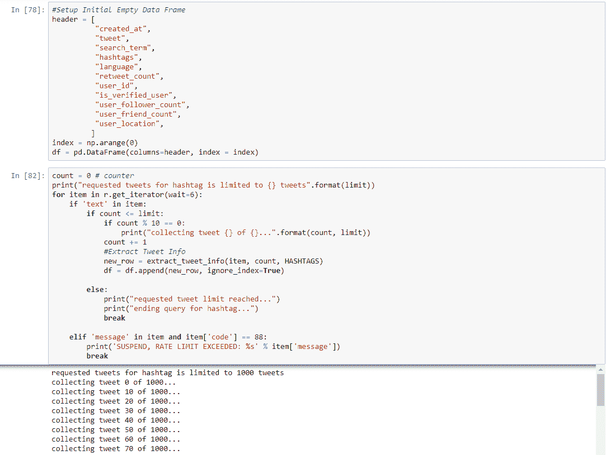

在确定过滤哪些标签时，我们研究了每个球队常用的标签，以及 NBA 球迷在季后赛中使用的标签。我们希望我们的数据能够捕捉迈阿密热火队球迷、波士顿凯尔特人队球迷和普通 NBA 球迷，并得出每个细分市场的标签分布情况:

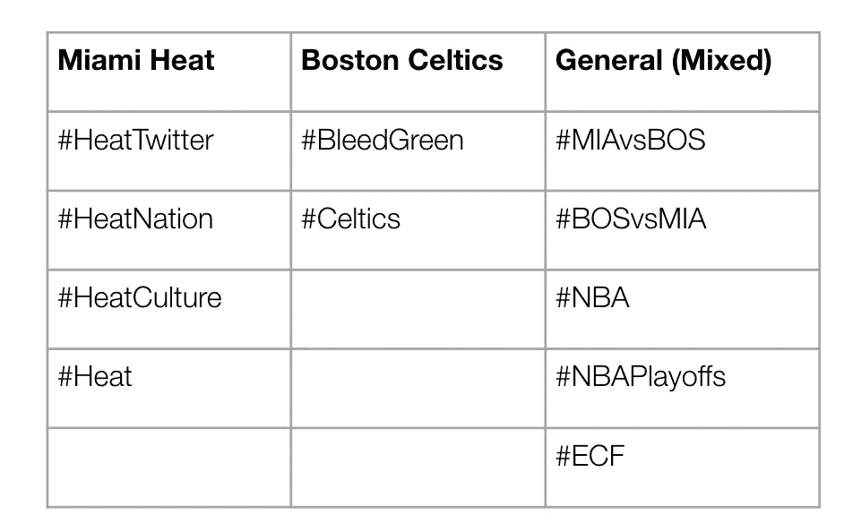

但是在获取数据时，Twitter API 在容量和频率方面确实有一些限制。当我们选择一次提取超过 1000 条推文，或者在一个小窗口中多次运行协议时，我们似乎遇到了错误。因此，我们将每次抓取提取的 tweets 数量限制在 1000，并在抓取之间留出足够的时间。我们在整个游戏过程中运行了多次，包括赛前、Q1 第四季度和赛后，最终收集了 12，145 条独特的推文和转发。

我们的数据收集方法并不完美，因为它确实有一定的局限性。如果包含媒体、照片、视频和 gif，Twitter API 似乎会删除某些推文，并用超链接替换剩余的字符。此外，一些标签没有过滤到推文中，尽管如果表情符号直接包含在标签之后，我们能够在标签栏中捕捉到它。下面是一个例子。

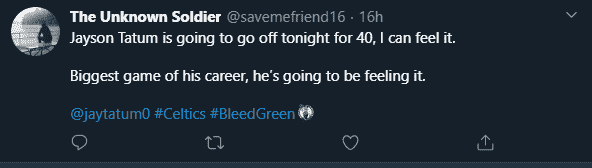

这使得对每条推文的忠诚度进行分类变得更加困难，这也是我们未来想要解决的问题。

**B .数据启动**

为了在 R 中为分析准备数据，我们在 Excel 中执行了 4 个步骤。

*第一步:*删除了重复的推文，因为数据收集过程有一些重叠

*第二步:*删除 9 月 24 日之前发布的推文，因为这些更有可能与第四场比赛有关。

*步骤 3:* 通过分析每条推文使用的标签，给推文贴上各自的效忠标签。如果球迷只使用迈阿密热火相关的标签，如上表所示，我们将该推文归类为迈阿密热火推文。我们为波士顿凯尔特人队和普通 NBA 球迷做了同样的事情。然而，如果在同一条推文中使用了迈阿密热火队和波士顿凯尔特人队标签的任何组合，那么我们将这条推文归类为一般。

*第四步:*最后，我们将推文直接映射到游戏的玩法。我们整合了一个 play by play 数据集，能够确定哪些 tweets 发生在哪个季度，并显示其相应的分数。

**C .变量创建**

然后，我们试图创造更多的变量，大多数是分类变量，但也有一些是数字变量，以便更好地解释数据。添加的变量有:

***日期***——从组合的日期&时间字段中分离出来，这样我们可以更好地理解每天的推文

***时间***——从组合日期&时间字段中分离出来，这样我们可以更好地理解游戏中按小时或时间的推文

***语言***——我们有一条推文使用的每种语言的缩写，但没有全称。例如:En =英语

***Tweet 或 Retweet*** —将每条记录归类为一条 Tweet 或 Retweet

***转发*** —如果记录已被转发，则分类

***类别*** —根据团队偏好标记每条推文并转发。例如:迈阿密热火，波士顿凯尔特人，或通用(混合)

***时间框架*** —每条推文发生在什么时间点。例如:赛前，Q1，Q2，半场，Q3，Q4，&赛后

**例如:太平洋标准时间下午 7:40 分**

***超时 vs 即时重播 vs 非超时*** —识别超时或重播期间发生的推文和转发

***被推荐人引用的推文*** —确定了特别提到被推荐人的推文和转发

## 数据描述

清理完数据后，我们得到了 12，145 条记录和 22 个特征。在我们进行下一步之前，我们检查了数据质量，查看了每一列，以了解数据的分布并执行初步分析。

*推文类别*

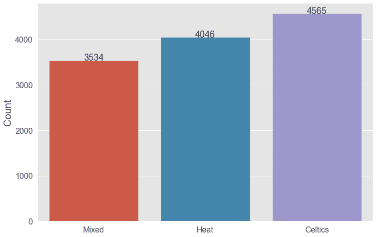

*语言*

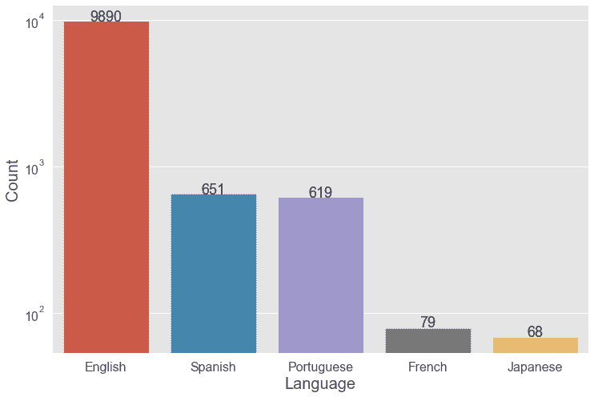

*转发次数分布:*

转发次数至少一次且不超过 1，000 次的推文的分布

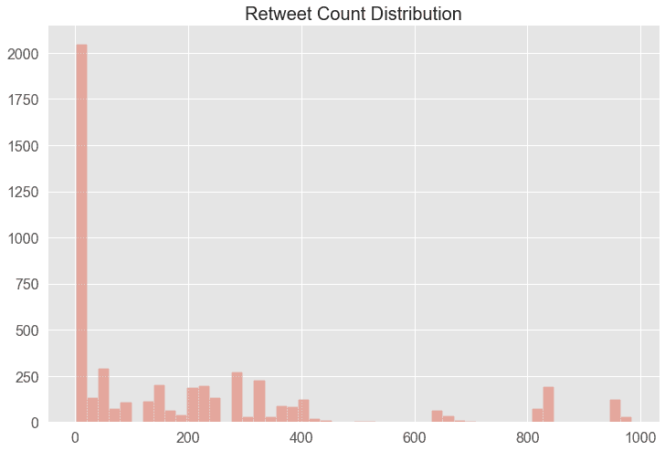

*七个时间段:*

赛前，Q1/Q2/Q3/Q4 期间，赛后，中场休息

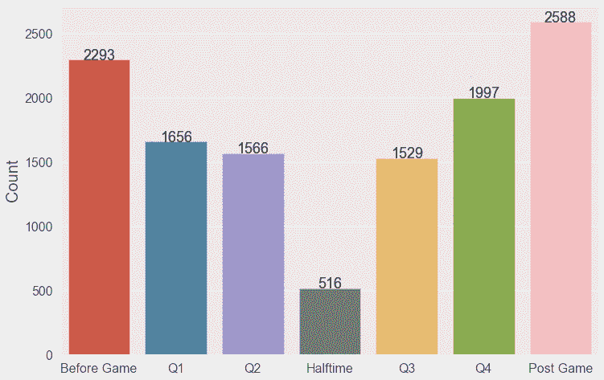

## 情感分析

利用从 Twitter 上搜集的数据，我们的小组希望进行情绪分析，以更好地了解比赛过程中球迷的情绪。通过识别趋势，我们可以提供一些可以提高粉丝参与度的建议。

在这项分析中，我们使用了一个名为“sentimentr”的软件包，该软件包旨在考虑像放大器和否定器这样的变价器，从而产生更准确的情感得分。这个库不仅将每条推文分为正面或负面，还为每条推文生成一个数值。情绪值越高，帖子中的正面情绪越强。

我们按类别(凯尔特人，热火，混合)分离数据，进行情感分析，发现每个类别的推文中最常见的情绪。以下是我们的结果:

*   波士顿凯尔特人队

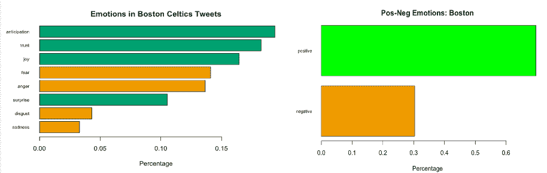

从上面的条形图中，我们可以看到最常见的三种情绪是“期待”、“信任”和“喜悦”，而这三种情绪恰好都是积极的。此外，我们可以看到波士顿的正面推文是负面推文的两倍多。

*   迈阿密热火队

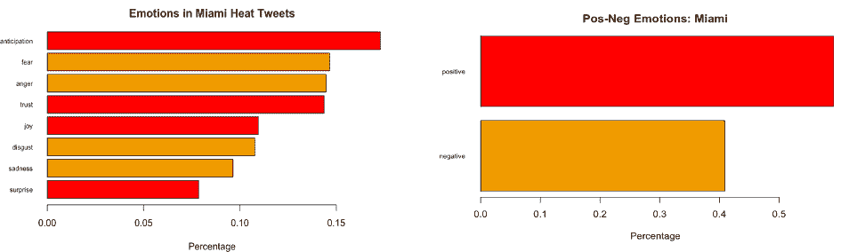

对于热火队来说，最常见的三种情绪是“期待”、“恐惧”和“愤怒”，这是有道理的，因为他们距离 NBA 总决赛只有一场胜利，但却失去了领先优势，输掉了比赛。虽然我们看到热火球迷在他们的推文中表现出了更积极的态度，但他们的负面推文比例明显高于波士顿的同行。

*   混合的

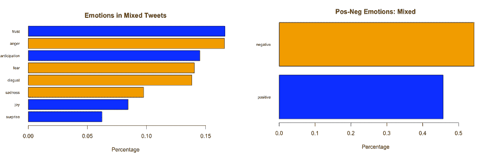

最后，对于混合粉丝这一类别，我们看到他们最流露出“信任”、“愤怒”和“期待”。然而，令人惊讶的是，对于一个看似中立的人群来说，这些负面情绪超过了正面情绪。

我们的下一组分析是为了更好地理解球迷的情绪如何在高风险的季后赛中变化。因此，对于波士顿凯尔特人队和迈阿密热火队，我们分析了不同时间段的情绪变化，包括:比赛前，第一季度，第二季度，半场，第三季度，第四季度和赛后。

*   波士顿凯尔特人队

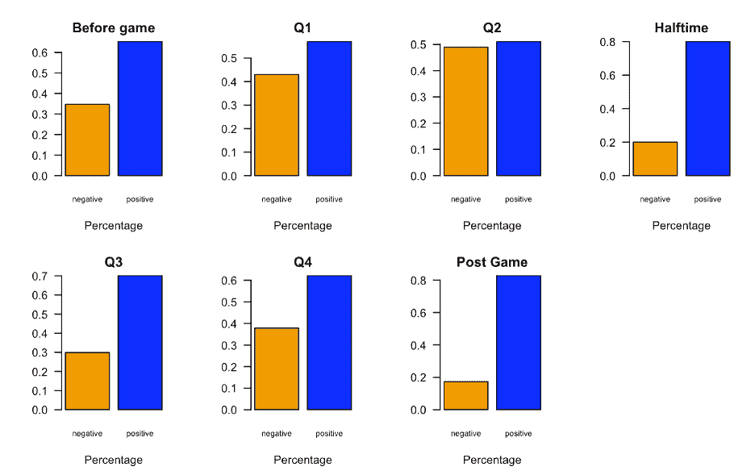

对于波士顿凯尔特人队，我们发现球迷们从未让负面情绪超过正面情绪，并在每个时间段内表现出韧性。第二节是凯尔特人球迷沮丧的顶峰。但是在中场休息时，情绪发生了很大的变化，在球队在第三节取得领先后，凯尔特人的球迷在比赛的剩余时间里一直很开心。同样有趣的是，从第四季度到赛后，负面反应下降了多少，这可能表明凯尔特人球迷更加乐观，可以克服 3-2 的差距，以进入 NBA 总决赛。

*   迈阿密热火队

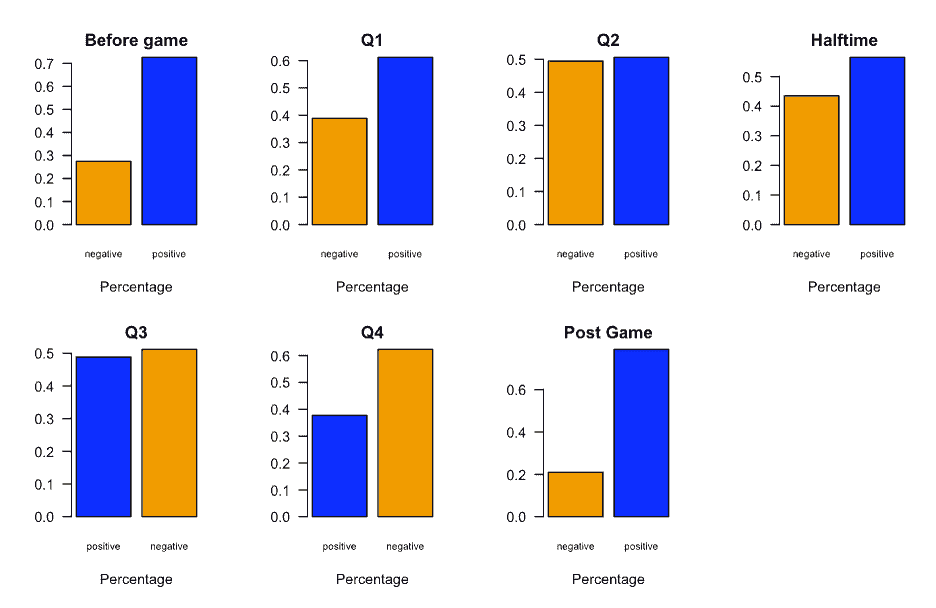

对于热火来说，在第二节凯尔特人重新回到比赛中，情绪发生了巨大的转变。乐观情绪在中场休息时增加了，然而，随着比赛在第三节和第四节的进行，球迷们变得越来越消极。有趣的是，赛后情绪水平恢复到赛前水平，表明热火球迷仍然认为他们有最好的机会晋级决赛。

我们的第三次也是最后一次情绪分析着眼于情绪与时间框架之外的其他因素。我们很想知道暂停和即时重播是如何影响球迷情绪的。此外，我们想看看当一条推文提到裁判时，人们的情绪是否会发生显著变化。

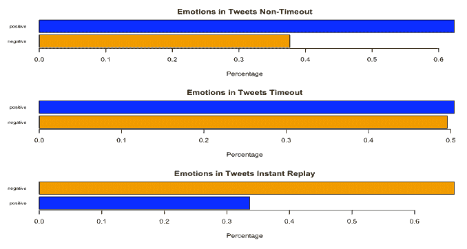

在比较游戏性与超时的情绪得分时，粉丝发布或转发更多负面推文并不奇怪。暂停可以作为一个发泄的时间框架，球迷可以在这里发泄他们的想法和沮丧，而不必错过任何篮球比赛。然而，在即时回放中，粉丝变得非常消极。这可能是由于重播的性质，它极大地减慢了比赛的速度。然而，这个特性是一个较新的特性，并且在关键的游戏中显示了价值。

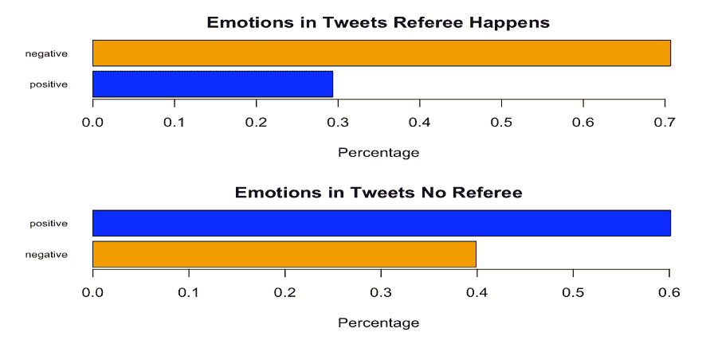

在这项分析中，我们查看了专门提到裁判的推文和转发。我们最初认为会有一些对裁判的负面看法，然而，当提到裁判时，我们没有预料到负面的程度。虽然与裁判相关的推文数量相对于推文总数来说很低，但当球迷提到裁判时，这对于情绪来说不是好兆头。

## 转发分析的统计建模

随着社交媒体对企业变得越来越重要，Twitter 尤其可以帮助企业发展更强大的追随者，因为它提供了与更广泛受众的更紧密联系。Twitter 最重要的方面之一是转发。转发的力量非常有影响力，因为当一个企业被转发时，它可以表明:

*   转发表明有人欣赏它的内容；
*   转发传播了内容，并增加了它成为病毒的可能性；
*   转发向转发者的追随者传达品牌。所以，商家不仅仅是把作品推广给它的追随者，而是推广给他们的追随者。
*   转发增加了企业的影响力。

因为转发允许内容更快地传播给更多的人，我们想进一步分析哪些因素会影响一条推文不被转发。因此，我们进行了线性回归和逻辑回归模型，以便从统计角度有更深入的了解。

**A .线性回归模型**

线性回归是一种常用的统计数据分析技术。它用于确定因变量(x)和一个或多个自变量(y)之间的线性关系的程度。线性回归有两种类型，简单线性回归和多元线性回归。在简单线性回归中，单个自变量用于预测因变量的值。在多元线性回归中，使用两个或多个自变量来预测因变量的值。

我们建立了多个回归模型，以了解哪些变量对转发有统计意义。自变量是数字变量，包括标签的计数、用户是否被验证的二进制值、用户的关注者计数、用户的朋友计数、指示推文是否包括正面/负面情绪的情绪得分以及团队得分的差异。因变量是转发次数。我们还建立了单独的模型来观察每个球队(波士顿凯尔特人队、迈阿密热火队或混合队)的表现。

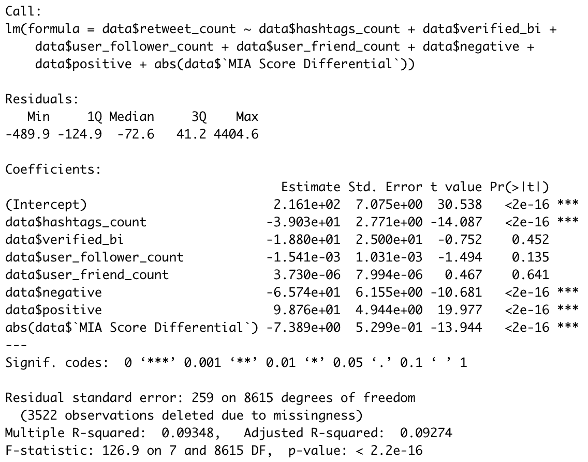

四个变量具有统计学意义:

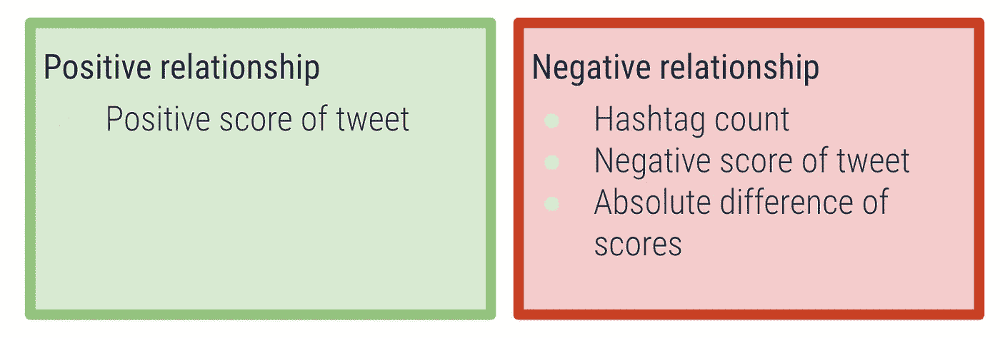

**B .逻辑回归模型**

像线性回归一样，逻辑回归是一种预测分析。逻辑回归估计逻辑模型的参数。二元逻辑模型有一个依赖值，它有两个可能的值，这两个值分别标记为“0”和“1”。它用于描述数据，并解释一个因变量和一个或多个变量之间的关系。

我们建立了逻辑模型来观察哪些变量对转发有统计意义。自变量是数字变量，包括标签的计数、用户是否被验证的二进制值、用户的关注者计数、用户的朋友计数、指示推文是否包括正面/负面情绪的情绪得分以及团队得分的差异。因变量是 retweets 的二进制值(即 1 表示被 retweets，0 表示不被 retweets)。我们还建立了单独的模型来观察每个球队(波士顿凯尔特人队、迈阿密热火队或混合队)的表现。

四个变量具有统计学意义:

与线性回归结果类似，一般来说，有 4 个变量对被转发的推文具有统计意义:标签数、负面推文数、正面推文数和得分差异。当涉及到标签的使用，正面推文的力量，以及游戏在多大程度上导致用户转发更多时，我们可以做出同样的推论。

**C .其他令人惊讶的发现**

*   验证用户、用户关注者数量和用户朋友数量不会影响转发
*   对于迈阿密热火的球迷来说:比分的绝对差距是正相关的

## 结论

**答.结果**

**关于我们的情感分析，我们发现:**

***凯尔特人球迷:***

*   积极情绪明显多于消极情绪
*   表现出弹性，因为积极的情绪永远不会压倒消极的情绪，即使在团队落后的时候

***复赛风扇:***

*   总体情绪是积极的，但消极情绪比凯尔特人球迷更多
*   当凯尔特人队超过热火队时，消极情绪在比赛的下半场占了主导地位
*   赛后的乐观水平恢复到了赛前的水平，即使是在输球之后

***混合类别:***

*   对于一个看似中立的人群来说，看到负面情绪超过正面情绪是令人惊讶的
*   情绪得分在暂停期间下降，在即时重播期间下降得更厉害
*   提到裁判的推文和转发引发了更多的负面情绪

**关于我们的转发分析，我们发现:**

a.对于多元线性回归模型和逻辑回归模型，有四个变量是重要的:

*   标签数
*   负面推文
*   正面推文
*   分数差异

b.更少的标签使用可能不会导致更高的转发量

c.负面的推文会导致更少的转发，而正面的推文会导致更多的转发

## 推荐

根据我们的分析，我们可以为每个组织提供一些建议:

***凯尔特人***

*   发布更多积极的推文，表明乐观和希望，更有可能被转发，转发次数也更高
*   当得分差异较低时，发布更多推文，因为推文更有可能被转发
*   继续使用 1 个标签，#BleedGreen，但在所有推文中包括标签，因为比赛期间大多数凯尔特人的推文不包括任何标签

***热度***

*   发布更多积极的推文，表明乐观和希望，更有可能被转发，转发次数也更高
*   当得分差异较低时，发布更多推文，因为推文更有可能被转发
*   将使用的标签数量从 4 个合并到 1 个，重点关注最受欢迎的标签#HeatTwitter

***NBA***

超时设定

*   减少超时时间，直到它对玩家的健康风险产生不利影响
*   用独家内容取代传统广告，在整个游戏中展示更多的游戏内广告，以弥补收入损失
*   独家内容可以包括球员采访，精彩片段，专家分析，球员麦克风
*   在比赛中，广告会在犯规和罚球时更频繁地出现
*   切换到无广告模式，用户只需支付少量费用就可以换取无广告
*   代替广告，粉丝可以探索不同的摄像机和角度

挑战/即时回放

*   情绪变化如此严重，NBA 应该关注
*   可以分析挑战的时间长度上限
*   将超时和挑战结合起来
*   只有在游戏的最后几分钟才会出现挑战，或者完全取消挑战

裁判

*   提供更多培训，减少错误呼叫
*   了解哪些电话会引起最消极的情绪，并进行适当的调整，以提高游戏的流畅度

通过对一场 NBA 比赛的分析，我们能够深入了解网上球迷的行为。我们可以确定某些趋势，并推荐可行的项目，让球队最大限度地提高球迷的参与度，让联盟做出适当的调整，以提高游戏的流畅度。