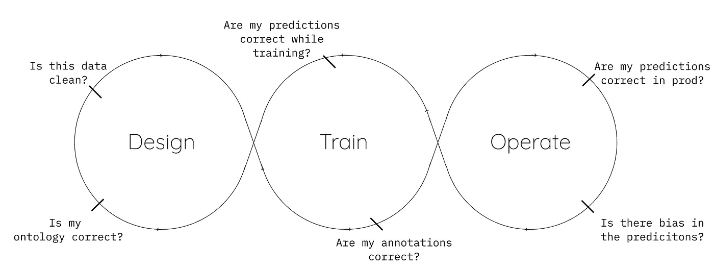
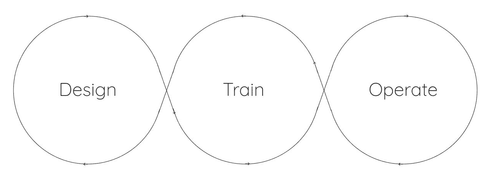
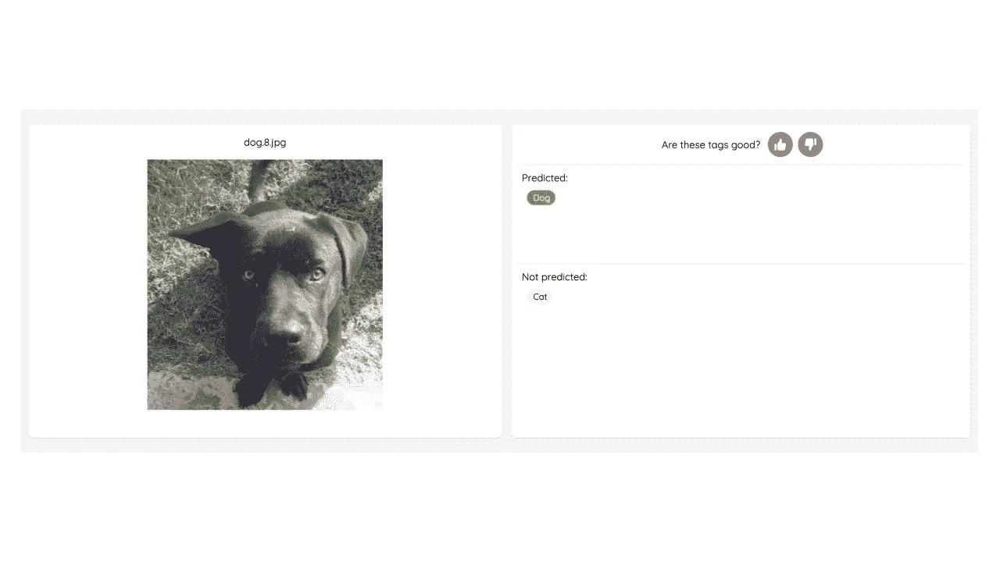

# 抽查:一项重要的 MLOps 活动

> 原文：<https://medium.com/mlearning-ai/spot-checking-a-critical-ml-ops-activity-2b3ac44a22d6?source=collection_archive---------5----------------------->

## 一旦您的模型被部署，在您的 ML 生命周期中对数据的随机检查将帮助您尽早发现模型中的缺陷并快速迭代。

我很喜欢 MLOps 领域，它将机器学习与最佳实践、流程和工具相结合，以帮助数据科学团队更快地部署模型，并提高成功的机会，在过去几年中真正成为主流。定义 ML Ops 的一个关键范例是，一旦您部署了您的 ML 模型，您就可以迭代地逐步提高数据质量和模型性能。由于一个实施良好的 ML Ops 管道中的大多数过程都是自动化的(例如，自动化 ETL、数据注释、培训和部署)，很可能您不能足够早地发现缺陷以解决它们，或者不能足够快地基于实际使用识别潜在的改进。

Example questions in your ML Ops lifecycle that spot-checking can answer.

对模型性能和数据质量进行目视检查对于纠正缺陷或更改模型以覆盖缺失的边缘情况至关重要。本文讨论了“抽查”，这是一种您应该执行的活动，以观察数据在 ML 生命周期中发生了什么，从而帮助您确定下一步应该做什么。抽查您的 ML 生命周期有助于您回答以下问题:

*   这些预测对于我们正在解决的业务案例来说是正确的吗？
*   为下一次迭代存储的数据是否干净？
*   我的模型定义或者本体需要改变吗？
*   贴标机返回的注释是否正确(针对现有和更新的说明)？
*   数据中有个人身份信息吗？
*   我的数据有偏差吗？

抽查还允许您将领域专家、ML 专家和其他利益相关者纳入循环，以确保您将精力集中在产生最大影响的任务上。

# ML Ops:快速介绍

The three stages in an incremental and iterative ML Ops lifecycle

在它的核心，ML Ops 是一个模型开发的迭代和增量过程，包括三个阶段:

*   设计——收集系统需求，确定用例，并定义模型的输入、输出和业务目标。
*   训练-为模型训练准备数据，并使用机器学习来训练模型、评估模型并为生产做好准备。
*   操作-在生产中部署模型并进行预测。这也包括您的 CI/CD 管道和监控框架。

为了实现这一点，数据科学团队将数据的使用、机器学习、辅助流程(例如，人在回路、注释项目管理)、工具(数据注释工具、实验跟踪)和框架(容器、CI/CD 管道等)结合起来。).如果您在构建模型时没有遵循 ML Ops 最佳实践(如[这些](https://ml-ops.org/content/mlops-principles)、[这些](https://towardsdatascience.com/mlops-practices-for-data-scientists-dbb01be45dd8)和[这些](/coriers/mlops-best-practices-59c0348e7125))，您应该遵循。

当一个人开始将模型部署到产品中时(包括容器化、CI/CD 管道、循环 ETL 管道、自动化培训、实时模型服务监控等所有的功能)。)，人们不禁要问——接下来我们要做什么来提高模型性能？让我们在下一部分讨论这个问题。

# 下面是模型部署后发生的情况

我们的故事从你的模型在生产中开始预测并做出一些现实世界的决定开始。首先，恭喜你！🎉你完成了一项不可思议的壮举，并展示了只有 10%的模特才能做到的东西。但是，甚至在兴奋消退之前，你的业务利益相关者就来找你，告诉你这个模型并没有做它应该做的事情——它在大多数情况下都是有效的，但是也有一些情况是无效的。所以现在你开始尝试通过看一些例子来弄清楚发生了什么。希望您能找到问题所在——如果是一个 bug，您修复模型/代码并重新部署，如果是一些边缘情况或意外数据(模型在训练时没有遇到),您将开始一个新的项目，逐步将模型升级到 1.1 版

您意识到这将需要一些时间，并且希望您在构建 1.0 版时已经计划好 ML Ops 周期的迭代部分。以下是您可能考虑实施的一些事情:

*   人在回路中的回顾:由于预测正在影响现实世界，您需要确保不正确的模型预测不会影响业务决策。要做到这一点，您需要采用人在回路的方法来检查模型预测。通常情况下，您只查看一小部分数据，在模型可信度较低的情况下使用一个聪明的技巧(如查看预测),或者两者结合使用。
*   从预测中获取数据:为了改进模型，您需要记录数据和预测。这可以通过在预测之后使用异步函数来完成，该函数使用消息队列将数据和预测发送到服务，该服务将数据和预测存储在相对廉价的对象存储中(例如 S3)。
*   标记新数据:接下来，您将标记捕获的数据，并为下一次训练运行做准备。理想情况下，您希望使用所有数据，但通常您只使用重要的部分(例如，使用主动学习技术)或评审者指出有问题的部分。
*   重新训练模型:有希望的是，一旦您将带标签的数据放入带标签的数据存储中，您的自动化模型训练管道就可以开始并重新训练模型，确保模型性能现在得到提高，并且如果性能比以前的版本更好，就自动部署模型。

所有这些都很棒，但是本着自动化大多数 ML 过程的精神，您现在已经删除了一个关键部分——检查迭代是否按计划进行。这就是为什么您需要在上述生命周期的不同部分“抽查”数据。

# 抽查您的数据和模型性能

“抽查”是指对你的数据进行随机抽样，进行突击检查。通过直观检查数据，您可以确保模型按预期运行，并保证数据质量。通过在 MLOps 生命周期的不同部分进行抽查，您可以发现对数据质量和模型性能的不同见解，让我们看看抽查在哪些方面有所帮助。让我们从生产中的模型预测开始，直到部署下一个迭代。

## 审查生产中的预测

如上所述，由生产中的模型做出的预测的随机样本可以被发送给人类，以确认模型如预期那样执行。我们也可以根据预测置信度，聪明地选择数据，而不是随机选择数据。这里有一个警告，这个模型可以有很高的可信度，但却是错误的。这将意味着我们错过了关键的例子。为了避免这种情况，我们混合使用随机和基于置信度的方法来保存预测。潜在地，人们也可以使用嵌入来检测“新的”或“有趣的”数据并保存它。

## 检查捕获的数据是否正常

捕获和存储的数据将用于提高模型性能。不过，在这样做之前，您的 ML Ops 管道可能会使用代码来清理或预处理数据。由于这一步是自动化的，我们希望抽查新数据，看代码是否如预期的那样运行，新数据是否有任何遗漏(例如，基于正则表达式的清理规则可能不适用于新数据)。如果需要，您可以在预处理步骤中更新或添加新代码。根据您的使用情况，您可能会问的其他问题有:我的数据中有个人身份信息(PII)吗？合成数据或扩充数据代表真实世界的案例吗？等等。

## 专家反馈

你也可以从领域专家或 ML 专家审查数据和预测中受益。领域专家知道什么是边缘情况，并且能够向数据科学家解释数据的本质。这可能意味着数据科学家发现需要收集更多数据来解决该用例。这也可能意味着您需要更新您的模型本体和定义。

也可以咨询 ML 专家。专家数据科学家可能会对模型的缺点提供额外的见解。也许，对于新的情况，您可能需要改变模型架构，或者使用更适合该情况的更新的最新模型。

还可以咨询业务用户，以确保模型确实如预期那样工作。

## 查看新注释

如果您正在使用数据标注平台，您可能有一个内部标注团队，或者将标注外包给一家数据标注公司。由于这一过程可能会在您的 ML Ops 管道中实现自动化，因此您需要确保注释团队返回的数据是高质量的，以便您使用一致的标签训练模型。您可能还需要确保注释捕获了您可能已经发现的任何新案例——如果您对注释器的指令已经改变，那么贴标签机是否已经开始用新指令进行注释了？新标注的数据是否忽略了之前的一些指令？等等。

## 根据新数据评估更新的模型性能

一旦模型在部署之前根据新数据进行了重新训练，您就可以直观地确认模型在新数据和新案例上运行正常。这一点很重要，因为虽然您的 F1 模型指标可能仍然需要改进才能做出部署决策，但在某些被标记为重要的情况下，它的表现可能会更差。该模型可能对最近添加到训练集中的数据拟合不足，或者可能已经开始忘记旧的数据和案例。

## 检测数据和预测中的偏差

随着数据科学的成熟，我们开始越来越意识到它的一些缺点——对于不良数据，您可能会创建一些功能，在您的模型中引入偏见，从而抑制或伤害边缘化群体。虽然在许多情况下，这是由训练数据本身的偏差引起的，但我们可能需要一个**数据健康冠军**来例行检查模型正在做出的预测或数据标签，以确保您的模型在使用 PII 或衍生数据(如种族相关、年龄相关等)时做了正确的事情并且合法合规。)进行预测，并确保数据中的偏差不会扩散到预测中。

## 风险与合规

在行业中，部署的 ML 模型很少不涉及法律或数据隐私利益相关者。除了上面讨论的 PII 信息外，确保模型遵循当地法律也很重要(例如，在金融、法律和保险部门)。从商业角度来看，对所做预测的风险评估也很重要。抽查有助于将利益相关者带入循环中，从他们那里获得反馈。

## 利益相关者联盟

最后，抽查是让所有利益相关者达成一致的好方法。目前，人们在会议上讨论模型的性能——他们展示模型正在做什么的例子，讨论下一步，等等。然而，这种方法是非常有趣的，并且倾向于手工挑选的例子，而不是模型性能中的真正错误。允许您的涉众在需要的时候进行抽查有助于他们确保模型做了他们期望的事情。例如，工程副总裁可能会不时地检查预测是否有所改进，我们是否遗漏了任何潜在的法律责任。

您可能还想向团队反馈他们的工作如何帮助训练模型——我发现如果数据注释项目经理对不良注释可能导致的问题有第一手的了解(他们不需要知道技术细节，只需要了解不良数据如何影响模型),这是很有用的。)

# 模型和数据的改进

虽然抽查有助于您发现缺陷并获得关于改进的反馈，但一个清晰的优先级策略将有助于您将精力集中在最能产生影响的方面。以下是您可能需要执行以提高模型性能的一些常见任务:

*   收集更多数据-如果您已经确定了模型应该处理的边缘案例或新案例，您需要收集更多示例(或在日志中筛选类似数据)来生成模型可以学习的足够多的示例。或者，您可以创建一些试探法来检测这种情况，并将它上报给循环中的操作员。
*   改变模型本体或指令——大多数 ML 模型学会根据数据区分本体中的类。如果定义了一个类，但是数据实际上观察到了多个子类的情况，那么最好将本体分割成多个类，这样模型就可以更好地进行区分。您也可以更改数据注释指令。
*   改变模型架构——有了设计良好的预测 API，就不需要局限于一种模型架构。例如，在第二次迭代中，对于不同的情况，架构可能会改变为使用两个模型，而不是一个。只要你的 API 保持不变，模型的改变不会影响实际的使用(比如用户体验)。
*   改变流程——在某些情况下，改变 ML 生命周期的运营方面可能是有益的。例如，如果您发现生产中的预测审阅者没有正确识别细微差别或感到困惑，您可能需要包括一个升级过程，以获得高级专家的纠正。

根据您的调查结果和现场检查的见解，您可能会采取其他行动。此外，可以使用如下所示的简单用户界面从评审领域专家、ML 专家或涉众那里获得反馈。

As an example, a simple UI for the spot-check review can confirm if model predictions are correct.

# 结论

随着 MLOps 流水线变得更加自动化，在生命周期的不同地方检查模型变得极其重要。在 ML 生命周期中对数据进行随机检查将有助于您尽早发现模型中的缺陷并快速迭代。它有助于利益相关方保持一致，并确保您专注于为最终用户带来最大影响的工作。

我希望这篇文章能引起你的共鸣——我很想和[聊聊](http://calendly.com/ai-hero),听听你的经历以及你认为这项活动可能有所帮助的问题。祝你的 ML 行动之旅好运！

我的公司 AI Hero 最近也推出了一个名为 Spotcheck 的工具，它将这些原则捆绑成一个易于集成的工具，帮助你从领域专家、ML 专家、产品所有者和其他利益相关者那里获得快速反馈。试试这里的！

***本文由 Rahul Parundekar 为 AI 英雄撰写。***

[*Rahul*](https://www.linkedin.com/in/rparundekar/) *是一名人工智能专家，在设计和构建人工智能产品、工程、研究和领导方面拥有 13 年以上的经验，热衷于通过人工智能改善人类体验*。他喜欢了解如何使用 ML 练习，并以他的经验帮助 ML 练习者。跟他谈 [*这里*](http://calendly.com/ai-hero) *！*

[*AI 英雄*](https://aihero.studio/) *是一个无代码平台，帮助你分分钟从* ***零到 ML*** *。您可以从我们不断增加的自动化列表中进行选择，以标记文本、推荐产品、标记图像、检测客户情绪和其他任务，所有这些都通过一个简单的、无代码的自助式平台完成。*

 [## Mlearning.ai 提交建议

### 如何成为 Mlearning.ai 上的作家

medium.com](/mlearning-ai/mlearning-ai-submission-suggestions-b51e2b130bfb)