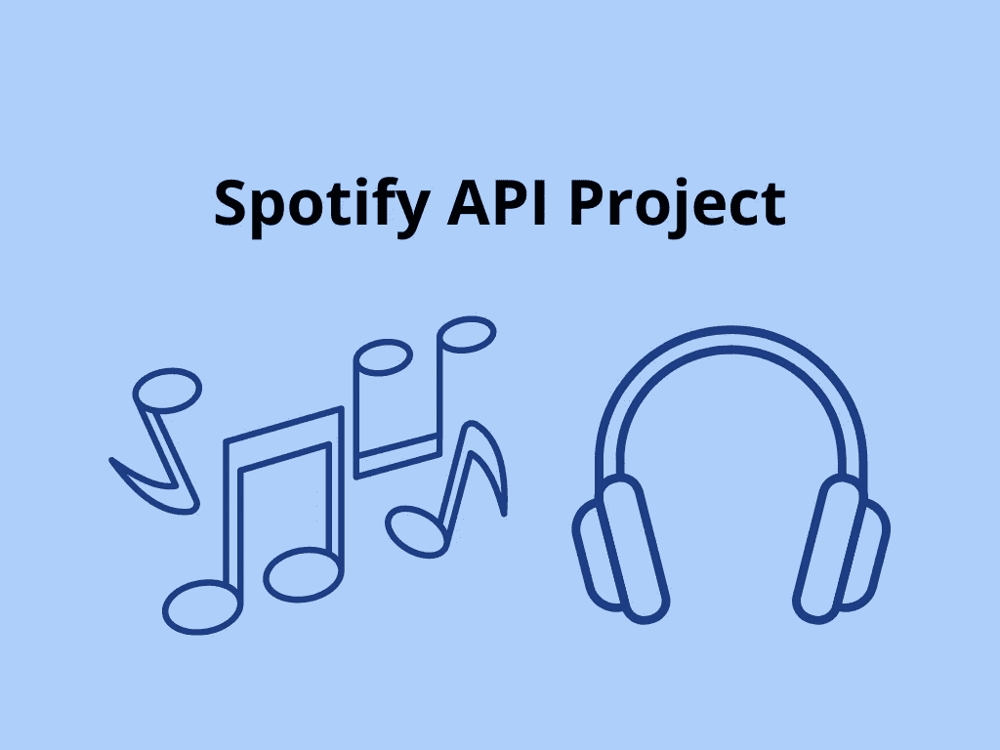
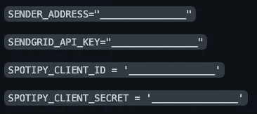
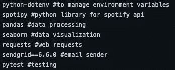
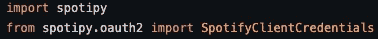
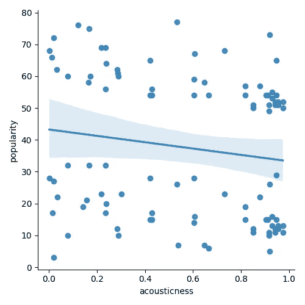
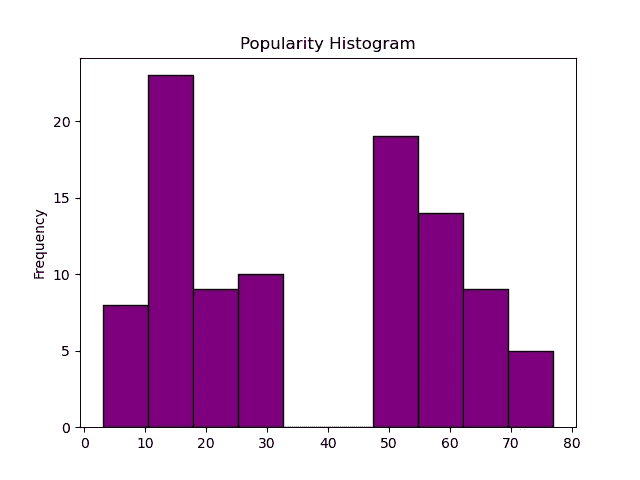
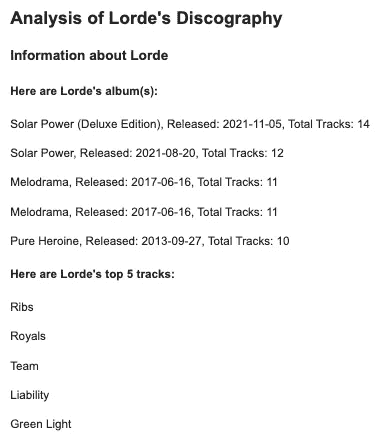
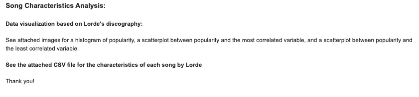

# 使用 Python 的 Spotify API 项目

> 原文：<https://medium.com/mlearning-ai/spotify-api-project-using-python-5fbcab921f5e?source=collection_archive---------0----------------------->

Spotify 的 API 拥有丰富的数据，允许公众访问与平台上任何歌曲或艺术家相关的各种信息。Spotify 的推荐算法和搜索引擎等其他功能也可以访问。这可以通过 [Spotipy](https://spotipy.readthedocs.io/en/2.19.0/#) 轻松完成，这是一个 Python 包，可以轻松提取数据。

我想熟悉从 API 中提取数据，并决定使用 Spotify 的 API，因为它的可用数据范围很大。在我的项目中，我希望创建一个应用程序，允许最终用户输入他们选择的艺术家，并接收包含艺术家信息、推荐和与艺术家唱片相关的数据分析的电子邮件报告。

我认为这可以帮助用户更多地了解他们所听的艺术家，并获得更多他们可能喜欢的音乐。在这里查看我的代码:【https://github.com/anushakuppahally/spotify-api-project】T2。

# 入门指南

为了开始我的项目，我首先创建了一个 [Spotify for Developers](https://developer.spotify.com/) 账户，以访问客户端 ID 和客户端密钥。这两者都是访问 Spotify API 所需要的。我用 Spotify 凭证登录后，导航到仪表盘，然后点击“创建应用程序”。然后，就可以访问必要的凭证。

我创建了一个 [Sendgrid](https://sendgrid.com/) 帐户来发送邮件报告。然后，导航到设置，我点击“API 密钥”，然后“创建 API 密钥”。我配置了该帐户的电子邮件地址，并获得了一个 API 密钥以供使用。

我将 Spotify API 和 Sendgrid 的凭证放在一个. env 文件中，为了安全起见，我创建了一个. gitignore 文件，因为我使用 Github 进行版本控制。

Contents of .env file

在这之后，我决定用我的项目需要的库来建立我的 requirements.txt 文件，涉及到数据查询、分析和可视化。

Contents of requirements.txt

在开始使用我的实际应用程序之前，我想完成我的设置。我将我的应用程序与[代码环境](https://codeclimate.com/)集成在一起，以评估我的代码质量。然后，我在根目录下创建了一个. codeclimate.yml 文件，以帮助提供自动化的代码质量检查。

然后，对于 organization，我在根目录中创建了一个 app 文件夹和一个 tests 文件夹，其中我的应用程序及其相关测试的代码将位于适当的文件夹中。我在根目录下创建了. conftest.py 来帮助我的测试找到应用程序代码。

我在下面创建了 python-app.yml 文件。github/workflows 有助于持续集成，或者每当我推送更改时自动测试。

最后，我创建了一个 README.md 文件来解释我的项目是如何工作的，还创建了一个 LICENSE.md 文件。

# 创建应用程序

设置完成后，我导入了我的凭证来访问 Spotify API。

Import Spotify credentials

为了简单起见，我决定将我的函数放在一个类中。我构建了我的应用程序，允许用户输入艺术家，所以一旦用户输入了艺术家，我就使用 Spotify 的搜索引擎来查找与输入相关的艺术家。然后，我要求用户验证搜索结果是否正确。

一旦通过验证，这些函数就使用艺术家的 URI 或统一资源标识符来返回请求的结果。我使用艺术家的 URI 来查找艺术家的专辑、前 5 首歌曲、歌曲推荐和艺术家推荐。

然后，我使用该艺术家的 URI 来查找该艺术家每张专辑下每首歌曲的曲目 id。然后，我使用一个单独的函数遍历每张专辑，并从 Spotify API 创建一个曲目及其特征的数据帧，如声音、长度、流行度等。

从那里，我想做一些基本的数据分析。我想找到与艺术家受欢迎程度最相关和最不相关的变量，并基于这些变量创建散点图。这是散点图的一个例子，其中响度与流行度最相关，而声音与流行度最不相关。

然后，我想创建一个流行度直方图，看看一个艺术家的流行度是如何分布的。

对于这些图像，我在根目录下创建了一个名为 reports 的文件夹，并添加了。gitkeep 到那个文件夹，这样文件夹最初就不会是空的。该文件夹将保存可视化效果，每次用户输入不同的艺术家时，可视化效果都会发生变化。

在构建电子邮件报告时，我使用了函数输出，并在电子邮件中附加了散点图、直方图和数据帧的 CSV 文件。我使用 HTML 来格式化电子邮件报告的内容，并根据关于艺术家和歌曲特征分析的信息来拆分电子邮件。

电子邮件发送成功后，用户会收到“202”的输出，然后可以在收件箱中看到该电子邮件。

# 测试

测试很重要，所以我为每个功能创建了测试。由于函数输出因艺术家而异，并且会随着时间的推移而变化，所以我能测试的部分是有限的。

然而，由于这些函数使用了 Spotify API，每当我推送我的更改时，我都必须跳过这些持续集成测试，因为这会导致构建失败。我不得不做一些改变来解决这个问题。首先，我将 *CI="true"* 添加到我的。环境文件。然后，在我的 python-app.yml 文件中，我将最后一行的 pytest 改为 *CI="true" pytest* 。最后，在我的测试文件中，我创建了一个 fixture 来调用该类，并在持续集成下推送更改时跳过了每个使用 Spotify API 的测试。

# 挑战和未来扩展

虽然我从来没有从事过这样的项目，但这个过程是一个很好的学习机会，我现在更愿意使用 API 数据。

我想做更多的数据分析，但由于我不能在电子邮件报告的正文中嵌入可视化，这导致我优先考虑文本输出而不是图像。然而，还有许多其他方法来分析跟踪数据。在未来，我想做多元回归分析，显著性测试，甚至尝试创建一个模型，根据歌曲的特点预测歌曲的受欢迎程度。我还想考虑其他因素，如流派。

另一个问题与 Spotify 的搜索引擎有关，因为一些艺术家即使输入正确也不会出现。我不确定如何解决这个问题，但这是将来要考虑的另一个因素。我还想做更多与此相关的错误处理。

我想在未来加入的另一个组件是用户凭证。我认为基于一个用户的收听历史而不是一个艺术家来创建类似的报告会很有趣。

总的来说，我真的很喜欢这个项目，很高兴能继续升级它！

 [## Mlearning.ai 提交建议

### 如何成为 Mlearning.ai 上的作家

medium.com](/mlearning-ai/mlearning-ai-submission-suggestions-b51e2b130bfb)