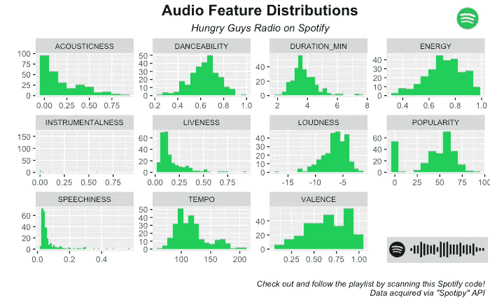
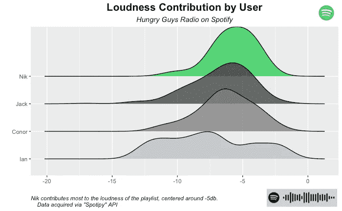
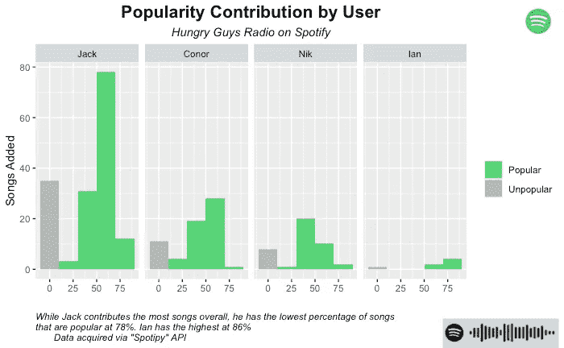
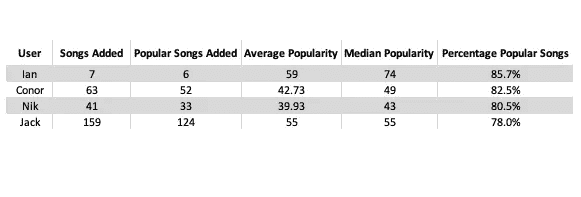
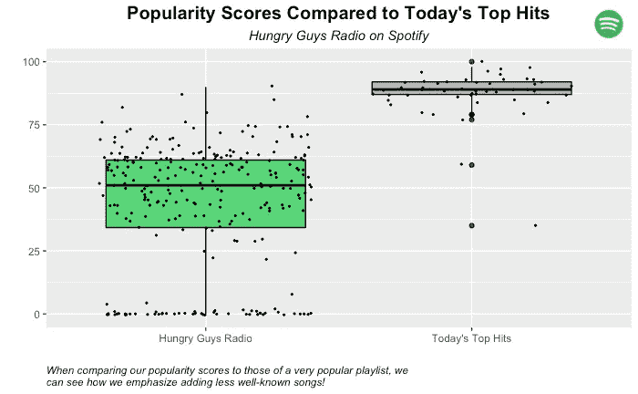
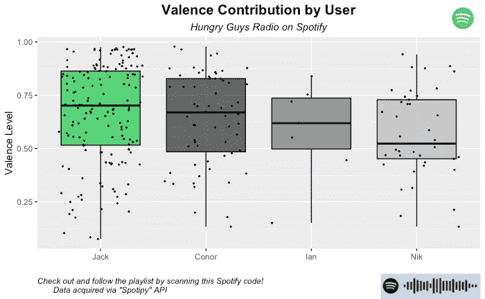
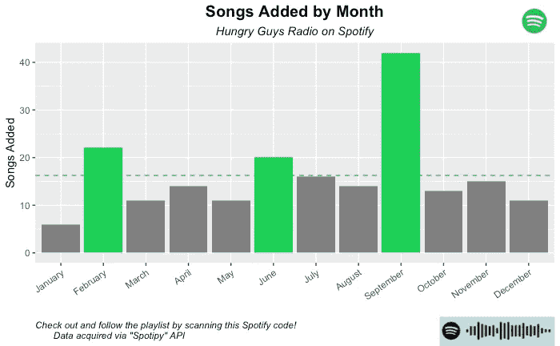
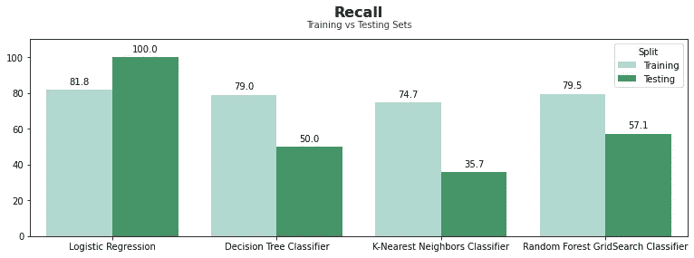
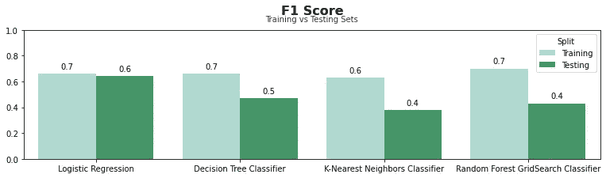
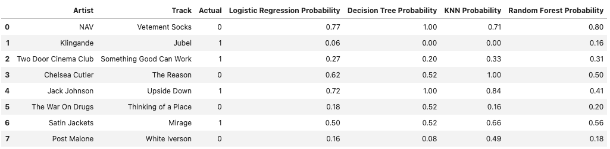

# Spotify 播放列表🤝数据科学

> 原文：<https://medium.com/mlearning-ai/spotify-playlists-data-science-69b05e628bb9?source=collection_archive---------1----------------------->

2019 年秋天，我和我的朋友们创建了一个名为 Hungry Guys Radio 的 Spotify 合作播放列表(“Hungry Guys”是指我们最喜欢的 SNL 草图之一，已经成为我们朋友群中的一个内部笑话)。在听了多年这个精心策划的播放列表(无耻插头)后，我现在能够通过听新添加的歌曲，仅凭它的共鸣就相当准确地猜出我的其他三个朋友中的哪一个添加了这首歌。我所说的“共鸣”是指各种歌曲属性的组合，比如艺术家、节奏、流派以及我稍后将深入探讨的许多其他属性。

作为一个喜欢在数据中发现见解的人，这让我想知道如何使用我的数据科学技能来量化和可视化这些差异，甚至可能找到一些机器学习用例！

# 重要定义

在继续之前，我想定义一下 Spotify 在其 API 中提供的所有音频功能，我可以在本次分析中利用这些功能…

*   **声学**:描述一首歌的声学程度。1.0 分意味着这首歌最有可能是一首原声歌曲。
*   **可跳舞性**:描述一首曲目在音乐元素组合的基础上适合跳舞的程度，包括速度、节奏稳定性、节拍强度和整体规律性。值 0.0 最不适合跳舞，1.0 最适合跳舞。
*   **能量:**代表强度和活动的感知度量。通常，高能轨道感觉起来很快，很响，很嘈杂。
*   **Liveness:** 描述了歌曲被现场观众录制的概率。“高于 0.8 的值表示音轨很有可能是实时的”。
*   **响度:**音轨的整体响度，单位为分贝(dB)。响度值是整个轨道的平均值。值通常在-60 和 0 db 之间。
*   **语音:**检测音轨中是否存在语音。如果一首歌曲的语音度高于 0.66，它可能是由口语词组成的，0.33 到 0.66 之间的分数是一首可能同时包含音乐和词的歌曲，而低于 0.33 的分数意味着这首歌曲没有任何语音。
*   **乐器性:**代表歌曲中的人声量。越接近 1.0，歌曲的器乐性越强。
*   **效价:**衡量从 0.0 到 1.0 描述一个音轨所传达的音乐积极性。高价曲目听起来更积极(例如，快乐、愉快、欣快)，而低价曲目听起来更消极(例如，悲伤、沮丧、愤怒)。

# 1.我们对饥饿人群的感知

在开始分析之前，我向其他三位投稿人(Jack、Conor 和 Ian)以及第四位经常收听的投稿人(Shane)发出了一份调查问卷，以评估我们如何看待自己的播放列表。

哪些形容词最能描述 HGR？很棒、有趣、折中和快乐是最常见的答案，3/5 的人说“很棒”,这很令人惊讶，因为这不是一个选择题。

**哪个音频功能最能抓住 HGR 的氛围？** 5/5 表示“价”，4/5 表示“能”，3/5 表示“可舞性”。

**在添加歌曲时，你会有选择性地添加歌曲以保持播放列表的氛围吗？**所有人都回答“是”。

总而言之，我们相信这个播放列表会很有趣，很棒，充满活力，并且在所有歌曲中都保持这种氛围。随着这些问题在整个分析过程中变得越来越重要，我将深入探讨更多的问题。

# 2.数据收集和清理

Spotify 维护着一个名为 Spotipy 的 API，允许开发者提取单个曲目、整个播放列表、艺术家排行榜等数据。为了访问 Spotipy，我编写了一个 Python 函数，该函数可以提取播放列表中的每一首曲目及其相应的音频特性。对 Samantha Jones 大声喊出来，他关于 API 的文章对入门有很大的帮助！她的博客可以在这里看到:

 [## 使用 Spotify 的 API 提取您最喜欢的播放列表信息

### 在这里，我再次分享另一个超级甜蜜的 API。总有一天我会把它们都用光，这样我就没有更多的东西可以分享了。

www.linkedin.com](https://www.linkedin.com/pulse/extracting-your-fav-playlist-info-spotifys-api-samantha-jones/) 

此外，我在整个分析中使用的所有代码都可以在下面我的 GitHub 页面上找到。仅供参考——这个博客将主要包括我的见解，而不是我的代码，但是，如果你对我的代码感兴趣，我肯定会检查它，因为我提供了所有内容的全面演练(特别是机器学习材料)。

 [## GitHub - NikLinnane/Spotify-API:使用 Spotipy API 分析 Spotify 数据。

### 使用 Spotipy API 分析 Spotify 数据。通过创建帐户为 NikLinnane/Spotify-API 开发做出贡献…

github.com](https://github.com/NikLinnane/Spotify-API) 

# 3.探索性数据分析

虽然 Python 非常适合进行 API 调用和训练机器学习模型，但我更喜欢在 R 中进行任何 EDA 和分析工作，因为 Dplyr 的管道功能使操作数据集变得非常容易；另外，我非常喜欢用 ggplot2 来创建可视化效果。

首先，我想对播放列表有一个高层次的概述，以便了解我可能想更深入了解的功能。在上面的情节中，有几个特征特别突出…

**响度:**多首歌往往比不听更响。当将响度的分布与问卷答案进行比较时，它确实让自己变得更时髦、有趣和快乐。更进一步，问卷还询问了我们每个人，我们认为自己对播放列表贡献最大的音频功能，以及我们认为其他人贡献最大的功能。虽然我确实听各种各样的音乐，但我特别喜欢另类摇滚氛围(我最喜欢的乐队是 Camino 乐队)，这种氛围往往更响亮。也就是说，我很自信我会为播放列表贡献最大的音量，结果我的朋友们也同意了。我和我的朋友都回答说，我们认为我对播放列表的音量和能量贡献最大——但我们是对的吗？

如上面的响度密度图所示，我确实为 Hungry Guys Radio 贡献了最大的响度，平均音轨响度为-5.7db，而第二大响度 Conor 为-6.3db。我的下一个假设是响度和能量密切相关，在我们的例子中，我的平均能量最高，为 0.74，而第二大响度 Conor 为 0.72。

**人气:**也许是最有趣的分布，有大量的曲目以 55 的人气评分为中心，但随后又有另外 50 首曲目的评分以 0 为中心。调查问卷问我们是否避免在播放列表中添加流行歌曲；我回答“是”，而其他人回答“也许/有时”。为了进一步细分流行度的分布，仅基于该播放列表中的分数，我将流行度分数为 20-100 的歌曲指定为“流行”，而将所有其他歌曲指定为“不受欢迎”，因为这是音频特征分布图中差距最大的地方。

乍一看，你可能会认为 Jack 对播放列表的流行贡献最大，然而，我们在这里真正看到的是，他只是总体上贡献了最多的歌曲(流行和不流行)。当我们更深入地观察，我们可以真正看到谁热衷于流行歌曲…

因为每个用户添加的歌曲分布不均匀，所以我想分解添加的流行歌曲的数量以及用户添加的流行歌曲的百分比。从上表可以清楚地看出，即使 Jack 添加了最多的流行歌曲，他也没有最高的平均流行度，实际上他添加的流行歌曲的百分比最低。事实证明，Ian 对播放列表的流行度贡献最大(当我们考虑到添加的歌曲总数时)，具有最高的中值流行度 74(比第二高的 Jack 多 19)，以及最高的流行歌曲百分比 86%。

值得注意的是，上述指标都是基于《饥饿男孩》电台的受欢迎程度分布，而不是除此之外的任何其他播放列表。为了比较我们的播放列表如何与一个旨在流行的列表相比较，我还从 Spotify 的今日热门歌曲播放列表中提取了数据。

现在变得很明显，我们把重点放在贡献不太知名的歌曲，因为范围更广，乐谱不太统一。出于好奇，我还将这些数据放入一个线性回归模型，试图找出是否有任何有意义的音频特征构成了一首流行歌曲。不幸的是，模型结果显示没有任何关系(非常低的 R 平方和非常高的 p 值),但这可能是我在未来通过提取更大的歌曲样本独自解决的项目。

这个播放列表显示了高价，这预示着我们最初对乐趣、时髦和快乐的描述。同样有趣的是，当被问及我们认为对播放列表贡献最大的是什么时，我们四个人的答案都是化合价。

虽然我们都认为我们贡献了最大的化合价，但杰克最终领先，康纳紧随其后。更有趣的是，我的三个朋友都认为我贡献了最大的化合价，而我是最后一个。

**(加分)大多数歌曲是什么时候加的？:**我和我的朋友们感兴趣的另一件事是我们一年中贡献歌曲最多的时间。下图显示了我们在 9 月份无疑是最活跃的跟踪增加；也许和秋天的好天气有关系，因为那些事实上是很棒的氛围？我还将注意到，当 Jack 在 2019 年 9 月首次填充该播放列表时，他在一天内添加了大量歌曲，因此这些歌曲被从下面的情节中删除。我们平均每月增加 16 首歌曲，这对那些想经常听到新歌的人来说是很棒的！(另一个不要脸的塞给它一个跟随)。

# 4.机器学习

在对播放列表有了更好的理解之后，我开始头脑风暴可能的机器学习应用。由于播放列表在分析时包含不到 300 首歌曲，我对训练一个模型来预测哪首歌曲是由哪个贡献者添加的持怀疑态度。也因为除了纯粹出于好奇，我看不出这有什么用处。相反，我决定训练几个模型来预测任何给定曲目符合《饥饿男孩》电台氛围的概率。目前 Spotify 有一个功能(可以在任何标题为“推荐”的播放列表底部找到)，可以推荐它认为与给定播放列表匹配的歌曲。不过，我的模型的不同之处在于，我们实际上可以收到我们好奇的歌曲适合播放列表的概率分数，而不是对 Spotify 推荐的内容一无所知。

为了解决这个问题，我不仅需要来自我们播放列表的数据，还需要来自风格、流派等不同的其他播放列表的数据。这将允许模型拾取模式和它们之间的差异(从非常基本的意义上来说，这本质上是机器学习所做的)。我的数据集最终由今天的热门歌曲、Hot Country、It's ALT Good、All New Jazz(全部由 Spotify 创建)、摩根·弗里曼(由 Jack 创建)以及当然还有 Hungry Guys Radio 组成。

正如我前面提到的，我将主要在这里讨论我的见解，但要深入了解我的代码和模型评估指标，请查看我的 Github！

**算法选择&模型训练:**由于这是一个分类问题，我决定使用以下算法…

*   **逻辑回归:**常用的分类算法，估计一个实例属于某个特定类(在本例中为 HGR)的概率。
*   **决策树分类器:**目标是通过学习从数据特征推断出的简单决策规则来创建预测目标变量的值的模型。在我的代码中，您可以查看实际的决策树及其规则！
*   **K-最近邻分类器:**在 k-NN 分类中，输出是一个类成员。通过其邻居的多次投票对对象进行分类，将该对象分配到其 k 个最近邻居中最常见的类别(k 是正整数，通常很小)。如果 k = 1，那么该对象被简单地分配给该单个最近邻的类。
*   **带 GridSearchCV 的随机森林分类器:**随机森林分类器从随机选择的训练集子集创建一组决策树。然后它聚集来自不同决策树的投票来决定测试对象的最终类。网格搜索是一种试图计算超参数最佳值的调整技术。这是对模型的特定参数值执行的穷举搜索。该模型也称为估计量。网格搜索练习可以节省我们的时间、精力和资源。
*   **精度，召回& F1 评分:**分类模型的重要评价指标。精确度是正(HGR)预测的精确度。召回率是模型能够识别的正面(HGR)预测的比率。F1 分数是介于 0-1 之间的调和平均值，除非精确度和召回率都很高，否则不会很高。精确度和召回率之间也存在反比关系——一个不能增加，另一个就不能减少。

在整个训练过程中(当模型学习构成 HGR 歌曲和非 HGR 歌曲的数据集模式时)，我能够识别每个模型的阈值，这将给我大约 80%的回忆。我决定专注于回忆而不是精确，因为音乐是如此主观。换句话说，我更喜欢能够更好地识别符合氛围(高回忆)的可能歌曲的模型，而不是明确告诉我歌曲符合氛围(高精度)的模型。正因为如此，该模型能够摄取一长串歌曲，并告诉我们应该听哪些歌曲，以便我们最终决定是否要添加它。

在我训练和测试的四个模型中，逻辑回归似乎是最好的选择，然而，我也喜欢随机森林的表现。我认为，由于数据有限，逻辑回归在这里大放异彩，否则我的猜测是，KNN 会表现得更好。我和我的朋友做的最后一件事是选择两首歌曲，其中一首他们会添加到播放列表中，另一首他们不会添加(在下图的“实际”栏中描述)。然后我们可以从四个模型中看到相应的概率…

# 5.结论

总的来说，我认为这些模型表现得很好，但出于某种原因，他们都喜欢 NAV 的“Vetement Socks”，这肯定不符合 vibe，但有类似的音频功能。在未来，我会喜欢为模型添加更多的功能，包括艺术家，流派，发行年份等。甚至可能运行一些无监督的聚类算法；但现在，我和我的朋友们肯定会对现有的模型感兴趣。

# 链接…

**饥饿者电台**

**Spotipy 文档**

 [## 欢迎来到 Spotipy！- spotipy 2.0 文档

### 编辑描述

spotipy.readthedocs.io](https://spotipy.readthedocs.io/en/2.19.0/) 

**我的 Github**

 [## GitHub - NikLinnane/Spotify-API:使用 Spotipy API 分析 Spotify 数据。

### 这个存储库包含 R 和 Python 笔记本，涵盖了整个项目。此分析的目标是…

github.com](https://github.com/NikLinnane/Spotify-API) 

**萨曼莎·琼斯的文章**

 [## 使用 Spotify 的 API 提取您最喜欢的播放列表信息

### 在这里，我再次分享另一个超级甜蜜的 API。总有一天我会把它们都用光，这样我就没有更多的东西可以分享了。

www.linkedin.com](https://www.linkedin.com/pulse/extracting-your-fav-playlist-info-spotifys-api-samantha-jones/)