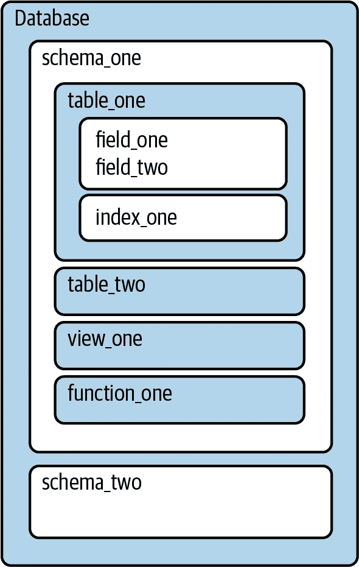
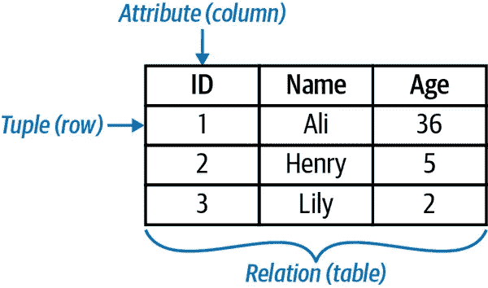
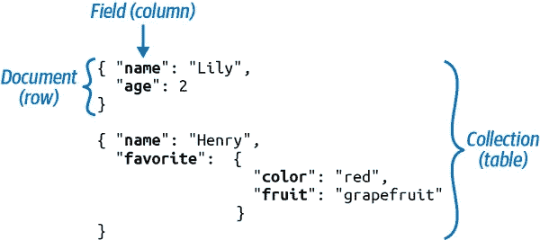
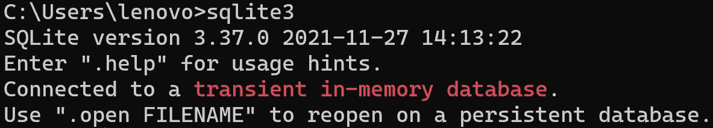
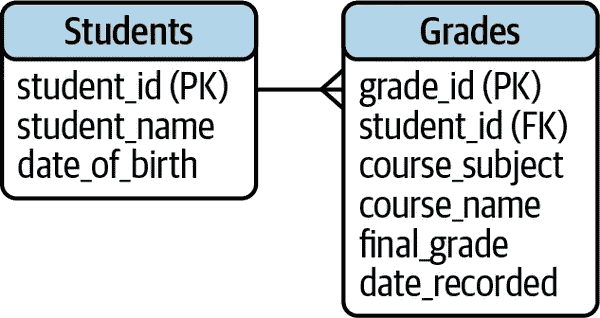

# 用于数据分析的 SQL

> 原文：<https://medium.com/mlearning-ai/sql-for-data-analysis-8228c923ce82?source=collection_archive---------1----------------------->

SQL 是一种与数据库通信的语言。尽管新技术不断出现，但了解 SQL 对于数据分析仍然很重要。您需要了解 SQL 查询，以便使用基于云的解决方案(如 Amazon Redshift 和 Google BigQuery)来提取数据。


Photo by [Mimi Thian](https://unsplash.com/@mimithian?utm_source=medium&utm_medium=referral) on [Unsplash](https://unsplash.com?utm_source=medium&utm_medium=referral)

数据库是以有组织的方式存储数据的地方。SQL 是一种与数据库通信的语言。SQL 代表结构化查询语言。SQL 是最古老的编程语言之一，至今仍被广泛使用。

让我们看看我要在这篇博文中谈论什么:

*   什么是 SQL 和数据库。？
*   什么是结构化和非结构化数据？
*   SQL 的优势
*   SQL vs Python 和 R
*   什么是数据模型？
*   运行中的 SQL 命令

在开始之前，我们制作关于数据科学、人工智能和编程的内容。别忘了订阅我们的 youtube 频道。

[](https://www.youtube.com/channel/UCFU9Go20p01kC64w-tmFORw) [## 蒂伦达兹学院

### Tirendaz Academy 是一个在线教育平台，在数据科学、人工智能、机器…

www.youtube.com](https://www.youtube.com/channel/UCFU9Go20p01kC64w-tmFORw) 

让我们深入了解一下什么是 SQL。

# 什么是 SQL？

关于 SQL 是否是一种编程语言，有一些争论。我可以说 SQL 不是 C 或者 Python 那样的通用编程语言。例如，你不能用 SQL 做一个网站。但是 SQL 是处理数据库中数据的强大语言。SQL 用于访问和操作数据库中的数据。

SQL 数据库也称为关系数据库。因为这些数据库是由关系组成的。数据库由一个或多个模式组成。



A database that consists of the schemas

模式包含表、视图和函数等对象。表由包含数据的列组成。在向表中添加任何数据之前，应该事先决定表的结构。



A table that includes information of students

如上表所示，第一列的名称是“ID ”,这一列是整数类型。第二列的名称是“name ”,该列是字符串类型。第三列的名称是“Age ”,这一列是整数类型

到目前为止，我简单地定义了 SQL 和数据库。现在让我们看看数据结构。

# 结构化与非结构化数据

数据通常分为结构化数据和非结构化数据。结构化数据可以存储在表中。大多数数据库是为结构化数据设计的。在这些数据库中，每个属性在列中，示例在行中。

另一方面，非结构化数据与结构化数据不同，数据模型或数据类型不是预先确定的。例如，图像、视频、音频文件都是非结构化数据的例子。非结构化数据可以存储在 NoSQL 数据库中。NoSQL 不仅仅意味着 SQL。2010 年后，它变得非常流行，因为你可以使用 NoSQL 存储结构化和非结构化数据。



An example for NoSQL databases

在 NoSQL 数据库中，数据是用键值对存储的，这些数据库的最大特点是它们是动态的。最流行的 NoSQL 数据库是 MongoDB。在 NoSQL，一张表叫做“集合”，一列叫做“字段”，一行叫做“文档”。在这一节中，我谈到了 NoSQL 数据库。让我们来看看 SQL 的好处。

# SQL 的优势

使用 SQL 有很多好处。SQL 是灵活的，你可以很容易地用这种语言连接到 SQL 数据库。世界上大部分数据都是表格数据。SQL 是处理数据库中数据的标准语言。您可以使用 Python 或 r 等语言连接到数据库并使用 SQL 分析您的数据。

SQL 很容易学，因为它的语法很简单。您可以快速学习关键字并使用数据库。我简单提到了 SQL 的好处。我们来对比一下 SQL 与 R 和 Python。

# SQL vs R & Python

虽然 SQL 是一种流行的数据分析语言，但它不是唯一的选择。可以用 R 和 Python 进行数据分析。r 是一种统计和图形语言，而 Python 是一种专门用于数据分析的通用语言。让我们用 SQL 来比较一下这两种语言。

## 使用数据库服务器

首先，SQL 运行在数据库服务器上，充分利用计算资源。r 和 Python 通常运行在本地机器上。当然，这里也有例外。例如，您也可以在数据库笔记本电脑上工作，或者在服务器上运行 R 和 Python。使用 SQL 定期更新报告是一个不错的选择，因为新数据经常被添加到数据库中。

## 存储数据

第二个区别是关于存储数据。关系数据库总是将数据存储在表中。所以 SQL 对每个查询都采用这种结构。r 和 Python 使用变量、列表或字典等结构来存储数据。

## 环

SQL 和大多数其他计算机编程语言的另一个区别是循环。如您所知，循环会一直持续，直到满足某个条件。对于 R 和 Python，可以使用带有关键字 For 和 while 的循环。例如，SQL 分组在数据集上循环，无需编写任何额外的代码。

你可能会问，SQL 没有缺点吗？让我们来看看 SQL 的一些缺点。

## SQL 的缺点

SQL 的一个缺点是数据必须在数据库中。但是，您可以使用 R 或 Python 导入本地存储的文件，然后就可以使用这些文件了。也可以用 R 和 Python 连接数据库。例如，您可以使用 dplyr for R 和 SQLAlchemy for Python 连接到数据库并运行 SQL 查询。

SQL 的另一个缺点是它不足以进行高级统计分析。比如你可以用 R 和 Python 做复杂的分析和机器学习项目。但是在 SQL 中，你可以做简单的统计分析。

到目前为止，我将 SQL 与 R 和 Python 语言进行了比较。我看到了每种语言的优缺点。现在让我们看看数据库管理系统。

[](https://www.youtube.com/shorts/Q5EniBcvy8g) [## 10 个重要的数据科学库🔥Python 库教程

### Python 数据科学库|机器学习包深度学习人工智能|如何学习数据…

www.youtube.com](https://www.youtube.com/shorts/Q5EniBcvy8g) 

# 数据库管理系统

数据库管理系统(DBMS)用于处理数据库。数据库管理系统是专门用于关系数据库的软件。

您可以使用 MySQL、PostgreSQL 和 SQLite 等数据库管理软件来管理数据。这些软件的语法都是基于 SQL 的，但是有一些不同。让我们看看在 5 个流行的数据库管理系统中打印前 10 行数据的命令。

MySQL、PostgreSQL 和 SQLite 的命令是相同的。

```
SELECT * FROM age LIMIT 10;
```

对于 Microsoft SQL Server，如下所示:

```
SELECT TOP 10 * FROM age;
```

对于 Oracle 数据库，如下所示:

```
SELECT * FROM age WHERE ROWNUM <= 10;
```

正如您所看到的，数据库管理系统软件有一些细微的差别。

可以在电脑上安装使用 MySQL、PostgreSQL 等软件编写 SQL 代码。在这篇博文中，我将使用 SQLite。

SQLite 是免费的，不会占用你的电脑太多空间。SQLite 是简单项目的王者。让我们打开一个命令提示符窗口来使用 SQLite。要启动 sqlite3，您可以键入 sqlite3 并按 enter 键。

```
sqlite3
```

但是有了这个命令，一切都在内存中运行。这意味着关闭 SQLite 时不会保存更改。



Connecting to SQLite

如果您注意到了，这里有一个红色警告，它以“临时内存数据库”的形式作为临时内存数据库。如果要保存更改，必须连接到数据库。让我们创建一个数据库。为此，让我们退出这个临时数据库。让我们使用。退出命令离开这里。

```
.quit
```

现在我们先写 sqlite3，再写数据库的名字。

```
sqlite3 my_demo.db
```

因此，我们创建了一个名为 my_demo.DB 的新数据库。

在 SQL 世界里，有一个通用的缩写叫做 CRUD。这个缩写代表“创建、读取、更新和删除”。在处理数据库时，这 4 个运算符非常常用。

现在让我们创建一个演示表。让我们确定将出现在这个表中的列的名称和数据类型。

```
CREATE TABLE demo (id int, num int);
```

让我们在这个表中添加两个值。

```
INSERT INTO demo VALUES (1, 100), (2, 200);
```

让我们最后选择第一行。

```
SELECT * FROM demo LIMIT 1;# Output:
1|100
```

在数据库中创建一个表并向其中添加数据是非常容易的。让我们看看我们正在使用的数据库。

```
.database# Output:
my_demo.db
```

现在让我们看看我们正在使用的表格。

```
.table# Output:
demo
```

那么什么是 SQL 查询呢？您使用 SQL 查询来查看和操作数据。数据分析师和数据科学家经常使用这些查询。例如，让我们编写一个 SQL 查询来查看一个表中的所有数据。

```
SELECT * FROM demo;#Output:
1|100
2|200
```

您可以在表格中看到所有值。在命令行上工作时，不要忘记在命令的末尾加上分号，以表示命令已经完成。现在让我们看一个数据模型。

[](https://www.youtube.com/shorts/MK_ZmLu1VkA) [## 用 PYTHON 学习机器学习的 6 个步骤

### 使用 python 的机器学习路线图|如何学习机器学习|数据科学的步骤|深度学习教程…

www.youtube.com](https://www.youtube.com/shorts/MK_ZmLu1VkA) 

# 数据模型

数据模型是显示数据库中所有相关表的摘要的可视化工具。

例如，让我们看看显示学生成绩的数据模型。



A data model

在这个数据模型中，有两个名为 student 和 grades 的表。如您所知，表格是由列组成的。这些列有时被称为属性或字段。这些矩形中的每个名称(如 student_id)都是列名。

学生表有个缩写叫 PK。这个主键指的是主键。主键将表中的每一行数据标识为唯一的。例如，在学生表中，主键是 student_id 列。这意味着“每一行数据的 student_id 是不同的”。

还有一个外键。一个表中的外键指向另一个表中的主键。例如，Grades 表中的 student_id 是一个外键。这意味着该列中的值与 student 表中的 student_id 相匹配。

通过使用这些键，我们可以将这些表相互关联起来。一个学生每门课都有多个成绩，对吗？例如，学生可以选修多门课程，如机器学习、深度学习和 SQL。如果一个值对应多个值，这种关系称为一对多关系。

在这一节中，我简要解释了什么是数据模型。现在让我们继续做练习。

[](https://www.youtube.com/shorts/9yD_AZeAD6A) [## 找数据科学工作的 5 个技巧

### 数据科学技巧|数据科学家路线图|人工智能与机器学习和深度学习教程(python 2022Hi…

www.youtube.com](https://www.youtube.com/shorts/9yD_AZeAD6A) 

# 实践

首先，让我们创建一个数据库。

The database that I am going to work

这里有两个表，EMP 和 DEPT。EMP 表由 14 行组成，只有数字、文本和日期值，DEPT 表由 4 行组成，有数字和文本值。

现在让我们展示基本命令。首先，我选择列名，然后编写表名。

```
SELECT empno, ename
FROM emp;# Output:
7369|SMITH
7499|ALLEN
7521|WARD
7566|JONES
7654|MARTIN
7698|BLAKE
7782|CLARK
7788|SCOTT
7839|KING
7844|TURNER
7876|ADAMS
7900|JAMES
7902|FORD
7934|MILLER
```

您可能还想选择所有列。星号用于选择所有列。

```
SELECT *
FROM emp;#Output:
7369|SMITH|CLERK|7902|1980-12-17|800||20
7499|ALLEN|SALESMAN|7698|1981-02-20|1600|300|30
7521|WARD|SALESMAN|7698|1981-02-22|1250|500|30
7566|JONES|MANAGER|7839|1981-04-02|2975||20
7654|MARTIN|SALESMAN|7698|1981-09-28|1250|1400|30
7698|BLAKE|MANAGER|7839|1981-05-01|2850||30
7782|CLARK|MANAGER|7839|1981-06-09|2450||10
7788|SCOTT|ANALYST|7566|1982-12-09|3000||20
7839|KING|PRESIDENT||1981-11-17|5000||10
7844|TURNER|SALESMAN|7698|1981-09-08|1500|0|30
7876|ADAMS|CLERK|7788|1983-01-12|1100||20
7900|JAMES|CLERK|7698|1981-12-03|950||30
7902|FORD|ANALYST|7566|1981-12-03|3000||20
7934|MILLER|CLERK|7782|1982-01-23|1300||10
```

其中用于选择特定的行。例如，让我们看看部门编号为 20 的所有雇员。

```
SELECT *
FROM emp
WHERE deptno = 20;#Output:
7369|SMITH|CLERK|7902|1980-12-17|800||20
7566|JONES|MANAGER|7839|1981-04-02|2975||20
7788|SCOTT|ANALYST|7566|1982-12-09|3000||20
7876|ADAMS|CLERK|7788|1983-01-12|1100||20
7902|FORD|ANALYST|7566|1981-12-03|3000||20
```

如果需要，您可以更改列的名称。比如我们把 salary 写成 sal。再来看看工资低于 5000 的员工。

```
SELECT sal as salary
FROM emp
WHERE salary < 5000;#Output:
800
1600
1250
2975
1250
2850
2450
3000
1500
1100
950
3000
1300
```

GROUP BY 用于对行进行分组。现在让我们按部门编号分组，看看各部门的平均工资。

```
SELECT deptno, AVG(sal)
FROM emp
GROUP BY deptno;#Output:
10|2916.66666666667
20|2175.0
30|1566.66666666667
```

如果需要，可以使用 round 命令对数字进行舍入。例如，让我们根据逗号后的第 1 位数字进行四舍五入。

```
SELECT deptno, ROUND(AVG(sal))
FROM emp
GROUP BY deptno;#Output:
10|2917.0
20|2175.0
30|1567.0
```

HAVING 子句允许在应用 GROUP BY 后过滤结果。为了说明这一点，我们先来看看工作职位。我将使用 COUNT 来查看组的数量。

```
SELECT job, COUNT(*)
FROM emp
GROUP BY job;#Output:
ANALYST|2
CLERK|4
MANAGER|3
PRESIDENT|1
SALESMAN|4
```

现在让我们只选择 4 名员工。为此，我将使用 HAVING 子句。

```
SELECT job, COUNT(*)
FROM emp
GROUP BY job
HAVING COUNT(*) = 4;#Output:
CLERK|4
SALESMAN|4
```

ORDER BY 用于对结果进行排序。为了显示这个子句，让我们选择名称和作业，并按名称对它们进行排序。

```
SELECT ename, job
FROM emp
ORDER BY ename;#Output:
ADAMS|CLERK
ALLEN|SALESMAN
BLAKE|MANAGER
CLARK|MANAGER
FORD|ANALYST
JAMES|CLERK
JONES|MANAGER
KING|PRESIDENT
MARTIN|SALESMAN
MILLER|CLERK
SCOTT|ANALYST
SMITH|CLERK
TURNER|SALESMAN
WARD|SALESMAN
```

如果我们想以相反的顺序排序，你可以使用 DESC 关键字，它是降序的缩写。

```
SELECT ename, job
FROM emp
ORDER BY ename DESC;#Output:
WARD|SALESMAN
TURNER|SALESMAN
SMITH|CLERK
SCOTT|ANALYST
MILLER|CLERK
MARTIN|SALESMAN
KING|PRESIDENT
JONES|MANAGER
JAMES|CLERK
FORD|ANALYST
CLARK|MANAGER
BLAKE|MANAGER
ALLEN|SALESMAN
ADAMS|CLERK
```

要快速查看表格，您可能想要查看几行，而不是打印整个表格。为此，您可以使用 LIMIT 子句。例如，让我们看看 emp 表的前五行。

```
SELECT *
FROM emp
LIMIT 5;#Output:
7369|SMITH|CLERK|7902|1980-12-17|800||20
7499|ALLEN|SALESMAN|7698|1981-02-20|1600|300|30
7521|WARD|SALESMAN|7698|1981-02-22|1250|500|30
7566|JONES|MANAGER|7839|1981-04-02|2975||20
7654|MARTIN|SALESMAN|7698|1981-09-28|1250|1400|30
```

在这一节中，我解释了基本的 SQL 查询。

[](https://www.youtube.com/shorts/pTLotOZaR48) [## 5 个数据驱动的职业🔥路线图

### 数据驱动的职业|数据科学家、数据工程师、机器学习工程师和数据分析师的路线图|…

www.youtube.com](https://www.youtube.com/shorts/pTLotOZaR48) 

# 结论

SQL 是一种与数据库通信的语言。数据通常存储在数据库中。了解 SQL 是数据分析师的一项重要技能。在这篇博文中，我谈到了用于数据分析的 SQL。总而言之，

*   首先，我解释了 SQL 和数据库。
*   我介绍了结构化和非结构化数据。
*   我谈到了 SQL 的好处，并将 SQL 与 R 和 Python 进行了比较。
*   我讨论了什么是数据模型。
*   最后，我展示了数据库中的 SQL 查询。

就是这样。我希望你喜欢它。

别忘了关注我们的[YouTube](https://www.youtube.com/channel/UCFU9Go20p01kC64w-tmFORw)|[GitHub](https://github.com/tirendazacademy)|[*Twitter*](https://twitter.com/TirendazAcademy)*|[ka ggle](https://www.kaggle.com/tirendazacademy)|*|*[*LinkedIn*](https://www.linkedin.com/in/tirendaz-academy)*👍**

# **资源**

*   **赵(2021)。SQL 袖珍指南:SQL 使用指南。).奥莱利媒体。**
*   **Tanimura，C. (2021b)。用于数据分析的 SQL:将数据转化为洞察力的高级技术。).奥莱利媒体。**
*   **莫里纳罗公司和格拉夫研发公司(2020 年)。SQL 食谱:面向所有 SQL 用户的查询解决方案和技术。).奥莱利媒体。**

**[](/mlearning-ai/mlearning-ai-submission-suggestions-b51e2b130bfb) [## Mlearning.ai 提交建议

### 如何成为 Mlearning.ai 上的作家

medium.com](/mlearning-ai/mlearning-ai-submission-suggestions-b51e2b130bfb) 

***如果这篇帖子有帮助，请点击鼓掌👏按钮几下，以示支持👇*****