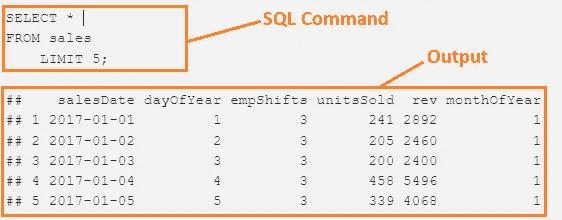
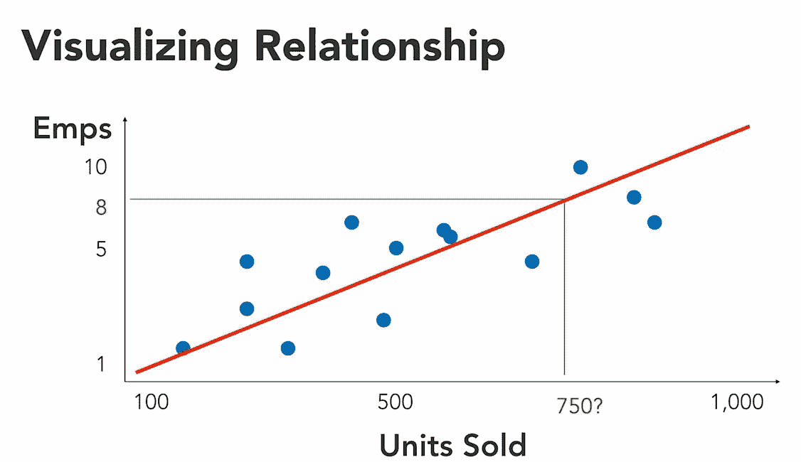

# 面向数据科学家的 SQL

> 原文：<https://medium.com/mlearning-ai/sql-for-statistics-67bf91443f70?source=collection_archive---------1----------------------->

在本文中，我们将介绍 SQL 中最重要的统计函数。统计学是数据科学家最重要的工具。我使用 PostgreSQL，但你可以使用任何 SQL 引擎，如 MySQL，MSSQL 等，语法是非常相同的。我们将介绍 SQL 中的以下函数

*   count()计算一列中元素的数量
*   min()，max()查找列的最小值和最大值
*   sum()、avg()、mode()来计算列的集中趋势
*   var_pop()、stddev_pop()来计算一列的离差
*   round()将数据舍入到小数点后指定的位数。
*   PERCENTILE_DISC()、PERCENTILE_CONT()来计算离散和连续的百分位数。
*   corr()来度量两个列之间的关系强度。
*   ROW_NUMBER()对数据进行排序。
*   regr_slope()来计算直线的斜率。
*   regr_intercept()来查找直线的 y 轴截距。

> 本文的最后一部分，一步一步地教你如何在 PostgreSQL 的 pgAdmin 4 和 MySQL 的 Workbanch 中设置数据集。

代码部分分为两部分，第一部分是 SQL 命令，第二部分是命令的输出。在下图中解释



## 显示前 5 行

```
SELECT * 
FROM sales 
    LIMIT 5;##    salesDate dayOfYear empShifts unitsSold  rev monthOfYear
## 1 2017-01-01         1         3       241 2892           1
## 2 2017-01-02         2         3       205 2460           1
## 3 2017-01-03         3         3       200 2400           1
## 4 2017-01-04         4         3       458 5496           1
## 5 2017-01-05         5         3       339 4068           1
```

## 清点记录

*   查找销售表中的记录总数

```
SELECT 
    COUNT(*) AS Total_Records 
FROM sales;##   Total_Records
## 1           365
```

*   在 sales 表中查找每个月的记录总数，并按“monthOfYear”列的升序对表进行排序。

```
SELECT 
    monthOfYear, 
    COUNT(*) 
FROM sales 
    GROUP BY monthofyear 
    ORDER BY monthofyear;##    monthOfYear COUNT(*)
## 1            1       31
## 2            2       28
## 3            3       31
## 4            4       30
## 5            5       31
## 6            6       30
## 7            7       31
## 8            8       31
## 9            9       30
## 10          10       31
## 11          11       30
## 12          12       31
```

*   在销售表中查找最大员工班次

```
SELECT 
    MAX(empShifts) 
FROM sales;##   max(empShifts)
## 1              9
```

*   在销售表中查找最小员工班次

```
SELECT 
    MIN(empShifts) 
FROM sales;##   max(empShifts)
## 1              3
```

*   在销售表中查找最小和最大雇佣班次

```
SELECT 
    MIN(empShifts) AS 'Min Employ Shift',  
    MAX(empShifts) AS 'Max Employ Shift' 
FROM sales;##   Min Employ Shift Max Employ Shift
## 1                3                9
```

*   在销售表中查找每月的最小和最大雇佣班次

```
SELECT 
    monthOfYear, 
    MIN(empShifts) AS 'Min Employ Shift',  
    MAX(empShifts) AS 'Max Employ Shift' 
FROM sales 
    GROUP BY monthOfYear 
    ORDER BY monthOfYear;##    monthOfYear Min Employ Shift Max Employ Shift
## 1            1                3                3
## 2            2                3                4
## 3            3                4                4
## 4            4                4                4
## 5            5                4                5
## 6            6                5                5
## 7            7                4                5
## 8            8                3                4
## 9            9                3                3
## 10          10                3                4
## 11          11                4                5
## 12          12                5                9
```

## 总和、平均值和众数

*   在销售表中找出销售单位的总数

```
SELECT 
    SUM(unitsSold) AS 'TOTAL UNIT SOLD'
FROM sales;##   TOTAL UNIT SOLD
## 1          177119
```

*   在销售表中找出每月销售量的总和及平均值

```
SELECT 
    monthOfYear, 
    SUM(unitsSold) AS 'TOTAL UNIT SOLD',
    avg(unitsSold) AS 'AVERAGE UNIT SOLD' 
FROM sales 
    GROUP BY monthOfYear 
    ORDER BY monthOfYear;##    monthOfYear TOTAL UNIT SOLD AVERAGE UNIT SOLD
## 1            1            8473          273.3226
## 2            2           12954          462.6429
## 3            3           16134          520.4516
## 4            4           15094          503.1333
## 5            5           16895          545.0000
## 6            6           17506          583.5333
## 7            7           18578          599.2903
## 8            8           15816          510.1935
## 9            9           12413          413.7667
## 10          10            8055          259.8387
## 11          11           16073          535.7667
## 12          12           19128          617.0323
```

*   在销售表中查找每月每班的员工人数

```
SELECT
    monthOfYear,
    MODE() WITHIN GROUP (ORDER BY empShifts) as emp_mode
FROM sales
    GROUP BY monthOfYear;##    monthofyear emp_mode
## 1            1        3
## 2            2        4
## 3            3        4
## 4            4        4
## 5            5        5
## 6            6        5
## 7            7        5
## 8            8        4
## 9            9        3
## 10          10        3
## 11          11        4
## 12          12        7
```

## 方差和标准差

*   在销售表中查找每月销售量的总和、平均值、方差和标准偏差

```
SELECT 
    monthOfYear, 
    SUM(unitsSold) AS 'TOTAL', 
    avg(unitsSold) AS 'AVERAGE', 
    VAR_POP(unitsSold) AS 'Variance', 
    STDDEV_POP(unitsSold) AS 'Standard_Deviation' 
FROM sales 
    GROUP BY monthOfYear 
    ORDER BY monthOfYear;##    monthOfYear TOTAL  AVERAGE  Variance Standard_Deviation
## 1            1  8473 273.3226  8737.702           93.47568
## 2            2 12954 462.6429 27407.015          165.55064
## 3            3 16134 520.4516 13782.119          117.39727
## 4            4 15094 503.1333 15481.716          124.42554
## 5            5 16895 545.0000 24040.065          155.04859
## 6            6 17506 583.5333 14059.916          118.57451
## 7            7 18578 599.2903 14998.851          122.46980
## 8            8 15816 510.1935 12227.382          110.57749
## 9            9 12413 413.7667 20261.912          142.34434
## 10          10  8055 259.8387 11790.845          108.58566
## 11          11 16073 535.7667 28680.246          169.35243
## 12          12 19128 617.0323 41761.580          204.35650
```

*   在 sales 表中查找每月销售量的总和、平均值、方差和标准偏差，并将输出四舍五入到小数点后两位。

```
SELECT 
   monthOfYear, 
   SUM(unitsSold) AS 'TOTAL', 
   ROUND(avg(unitsSold), 2) AS 'AVERAGE', 
   ROUND(VAR_POP(unitsSold), 2) AS 'Variance',    
   ROUND(STDDEV_POP(unitsSold), 2) AS 'Standard_Deviation'
FROM sales 
   GROUP BY monthOfYear 
   ORDER BY monthOfYear;##    monthOfYear TOTAL AVERAGE Variance Standard_Deviation
## 1            1  8473  273.32  8737.70              93.48
## 2            2 12954  462.64 27407.02             165.55
## 3            3 16134  520.45 13782.12             117.40
## 4            4 15094  503.13 15481.72             124.43
## 5            5 16895  545.00 24040.06             155.05
## 6            6 17506  583.53 14059.92             118.57
## 7            7 18578  599.29 14998.85             122.47
## 8            8 15816  510.19 12227.38             110.58
## 9            9 12413  413.77 20261.91             142.34
## 10          10  8055  259.84 11790.84             108.59
## 11          11 16073  535.77 28680.25             169.35
## 12          12 19128  617.03 41761.58             204.36
```

## 百分位数和频率

## 百分位

一个种群被分成一百个大小相等的群体

## 离散百分位数

***【percentile _ disc()】***是返回列中值的公式

## 连续百分点

***percentile _ cont()***是对百分位之间的边界值进行插值并返回值的公式。

我们将取第 95 个离散和连续百分位数，观察它们的值是否不同，因为离散百分位数返回列值中的值，而连续百分位数返回插值。

```
SELECT
    PERCENTILE_DISC(0.90) WITHIN GROUP (ORDER BY rev) AS Disc_90th,
    PERCENTILE_CONT(0.90) WITHIN GROUP (ORDER BY rev) AS Cont_90th
FROM sales");##   disc_90th cont_90th
## 1      8568    8563.2
```

我们将找到销售表的收入"***【rev】***"列的 5 位数汇总。

*   计算最小收入
*   计算第一个四分位数 Q1
*   计算第二个四分位数 Q2(中位数)
*   计算第三个四分位数 Q3
*   计算最大收入

```
SELECT
   MIN(rev) as Min_Value,
   PERCENTILE_DISC(0.0) WITHIN GROUP (ORDER BY rev) AS Min_Value,
   PERCENTILE_DISC(0.25) WITHIN GROUP (ORDER BY rev) AS Q1,
   PERCENTILE_DISC(0.50) WITHIN GROUP (ORDER BY rev) AS Q2,
   PERCENTILE_DISC(0.75) WITHIN GROUP (ORDER BY rev) AS Q3,
   PERCENTILE_DISC(0.999) WITHIN GROUP (ORDER BY rev) AS Max_Value,
   MAX(rev) AS Max_Value
FROM sales;##   min_value   q1   q2   q3 max_value
## 1      1018 4236 5832 7428      9792
```

## 相互关系

相关性是对两列如何一起变化的度量。它的值总是在-1 和 1 之间。

如果两列相同，则它们之间存在完全正相关，其值为 1，如果相关值接近+1，则两列之间存在强正相关，如果相关值为-1，则两列之间存在完全负相关，如果相关值接近 2-1，则两列之间存在强负相关。如果相关值为 0 或接近于 0，则两个变量之间不存在相关性。

*   “*”与“ ***rev*** ”的相关系数为 0.9240828，接近于 1，因此是强正相关关系*
*   *“***【units sold】***”和“***EMP shift***”之间的相关性是 0.5317558，与“ ***rev*** ”相比，这是相对较弱的关系*
*   *“*”与“ ***月份*** ”的相关系数为 0.1419347，接近于零，关系较弱。**

```
**SELECT
    CORR(unitsSold, rev)
FROM sales;##        corr
## 1 0.9240828SELECT
    CORR(unitsSold, empShifts)
FROM sales;
##        corr
## 1 0.5317558SELECT
    CORR(unitsSold, monthOfYear)
FROM sales;
##        corr
## 1 0.1419347**
```

## **行数函数**

**对行进行排序，但排序方式不依赖于查询的排序顺序。**

```
**SELECT
    salesdate,
    monthOfYear,
    unitsSold,
    ROW_NUMBER() OVER (ORDER BY unitsSold)
FROM sales
    ORDER BY salesdate;##      salesdate monthofyear unitssold row_number
## 1   2017-01-01           1       241         40
## 2   2017-01-02           1       205         30
## 3   2017-01-03           1       200         27
## 4   2017-01-04           1       458        157
## 5   2017-01-05           1       339         84
## 6   2017-01-06           1       427        137
## 7   2017-01-07           1       168         17
.
.
.
## 360 2017-12-26          12       204         28
## 361 2017-12-27          12       332         78
## 362 2017-12-28          12       252         45
## 363 2017-12-29          12       299         55
## 364 2017-12-30          12       159         16
## 365 2017-12-31          12       360         95**
```

## **线性模型**

## **估计值**

*   **我们刚刚开展了一次大规模的广告宣传活动，预计会比平时卖出更多的商品。我们应该雇佣多少员工？**
*   **我们预计网络流量会增加。我们的集群中需要多少台服务器来容纳流量？**

**使用回归技术可以回答这类问题，在本文中，我们将重点讨论线性回归。**

****

**我们需要斜率和 y 轴截距(c)。**

**雇员= m*单位 _ 售出+ c**

## **计算 Y 轴截距**

```
**SELECT
    regr_intercept(empShifts, unitsSold) AS c
FROM sales;##          c
## 1 2.713541**
```

**c = 2.713541**

## **计算斜率**

```
**SELECT
    regr_slope(empShifts, unitsSold) AS m
FROM sales##             m
## 1 0.002978549**
```

**m = 0.002978549**

**如果 unit_sold = 1500，则计算雇员数**

## **解决办法**

**c = 2.713541**

**m = 0.002978549**

**单位 _ 售出= 1500**

**雇员= m*单位 _ 售出+ c**

**员工数= 0.002978549* 1500 + 2.713541**

**雇员= 7.181364**

**现在我们在 SQL 中计算这个操作**

```
**SELECT
    regr_slope(empShifts, unitsSold) * 1500 +    regr_intercept(empShifts, unitsSold) as Employees
FROM sales##   employees
## 1 7.181364**
```

**雇员= 7.181364**

# **资料组**

**点击以下链接从 google drive 下载 ***sales.sql*** 文件。**

 **[## 销售. sql

### 编辑描述

drive.google.com](https://drive.google.com/file/d/1OKiYfO7q-wyWrHjfGz0bDBGV2udoBosj/view?usp=sharing)** 

**你要把代码选择复制粘贴到***MySQL work bench***的查询编辑器中，执行命令。**

*   **删除数据库" ***mystore*** "如果已经存在**
*   **创建一个数据库 ***mystore*****
*   **激活数据库 ***mystore*****
*   **在“***【my store】***”数据库中创建一个“*”销售表***
*   ***在“销售”表中插入记录。***
*   ***如果您正在使用“ **pg** Admin 4”，那么您不需要执行前三个命令。只需使用 GUI 创建“mystore”数据库，并执行表的模式和插入命令。***

```
***DROP DATABASE IF EXISTS mystore;
CREATE DATABASE mystore;
use mystore;
CREATE TABLE sales
(
    salesDate date NOT NULL,
    dayOfYear integer NOT NULL,
    empShifts integer,
    unitsSold integer,
    rev integer,
    monthOfYear integer
);
insert into sales values ('2017-01-01',1,3,241,2892,1);
insert into sales values ('2017-01-02',2,3,205,2460,1);
insert into sales values ('2017-01-03',3,3,200,2400,1);
insert into sales values ('2017-01-04',4,3,458,5496,1);
.
.
.***
```

## ***结论***

***在本文中，我们将介绍 SQL 中常见的统计函数。我们涵盖了线性回归，集中趋势，分散，五个数字的总结和相关性。***

***[](/mlearning-ai/mlearning-ai-submission-suggestions-b51e2b130bfb) [## Mlearning.ai 提交建议

### 如何成为 Mlearning.ai 上的作家

medium.com](/mlearning-ai/mlearning-ai-submission-suggestions-b51e2b130bfb)***