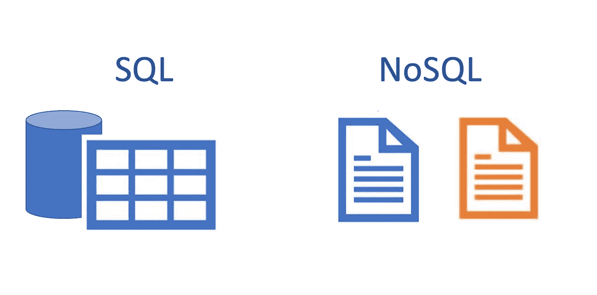
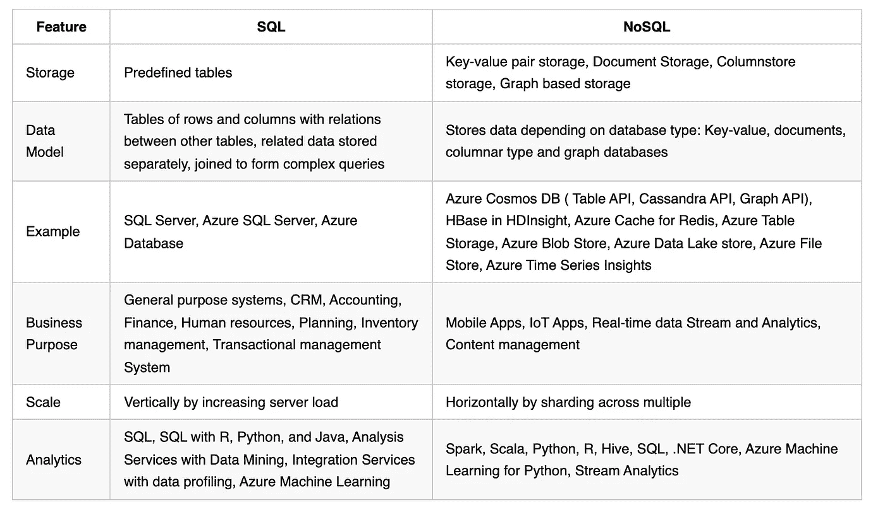

# 数据科学中的 SQL 与 NoSQL

> 原文：<https://medium.com/mlearning-ai/sql-vs-nosql-in-data-science-41a17edd0999?source=collection_archive---------2----------------------->

数据以各种形式出现，速度不同，数量也不同。如果这三个标准都定义了 SQL 和 NoSQL 之间的区别，那么这三个标准仍然与数据科学无关。

我的原则是，无论数据的形状、大小、频率、值和可信度如何，呈现数据的 SQL 类型仍然是最重要的。

在你们都跳起来开始写评论之前，坚持住，继续读下去。

# 技术

这些年来，我们所熟知的 SQL 数据库在速度、性能、容量、频率方面都有所改进，直到今天，仍然保持着关系模型、数据酸、隔离等等。所有这些—如果你想解决它们的话—固定的、僵化的、复杂的……趋势不仅保持了数据库的第一名，而且为业务、数字化浪潮和云计算提供了结构和数据可见性。

另一方面，正如许多人所描述的，NoSQL 数据库技术是灵活的，可以提供水平缩放，由于数据规范化而提供更好的查询性能，并且可以进行并行计算。

我不反对并行计算和水平扩展。但是休息的时候，我有大问题。

# Microsoft Azure 中的产品

让我们来看看 SQL 和 NoSQL 之间的不同之处:

Comparison SQL and NoSQL

# 与 NoSQL 之间的分析障碍和权衡

水平扩展和并行计算非常棒。它们都提供了资源的弹性和更快的分析结果。向分析部门交付数据时，必须收支平衡。

# 强一致性

你可能听说过“从最终到强一致性”这句话。这仅仅意味着模式是在读取时定义的，并且当文档、键-值对二进制文件、列文件在不同的转换区域之间被复制时，它将最终变得与模式、ACID 规则、完整性约束一致。但是，对于最终一致的数据，您正在获得快速响应(分析),但代价是潜在的错误或陈旧数据。将这种类型的数据交付给数据科学部门将总是导致充满烦人问题的来回沟通，并清除许多数据不一致。

# 数据转换

保持数据的原始格式非常好；将它转换成可读的数据集是数据架构师、数据工程师的一大权衡，也是数据科学的一大要务。

在没有复杂查询连接的情况下，可以在 NoSQL 概念内实现更快的查询性能。规范化数据意味着包括所有事务数据，以及所有维度数据(包括名称和解释)。无意中使数据集变大，但具有廉价的存储和可伸缩性，这不是问题。问题出在数据一致性上，更新了，嗯，酸。而且是配器。每次更改、更新或删除数据时，都要制作数据碎片和副本，这可能会很繁琐、不可见，并导致许多存储问题。但是所有的编排问题都可以通过正确的软件和一些编码来解决。

# 数据使用和交付

数据科学家爱 Python 熊猫，Numpy，R 的 Dplyr，data.table，Spark 的 dataframe，datasets，Julia 的 dataframe.jl 你懂的。所有都是基于列和行的。换句话说，所有 NoSQL 数据都是以 SQL 类型数据或列类型数据的形式交付的。甚至图形数据(带边和顶点)也以这种格式转换。

# 灵活性

我倾向于通过“上市时间”KPI 来计算 NoSQL 数据的灵活性。添加新类型的数据(图像、改变模式、新的 KPI)或对数据进行新的更改并将其交付给数据科学部门的速度是灵活性的关键。当然，还有其他与灵活性相关的关键因素，例如部署和操作、复制甚至可用性。

# 最后的想法

我很高兴 NoSQL 的概念、技术和统计方法已经渗透到数据科学领域。它不仅有助于开发新的计算方法，改进和开发新的算法，而且还开辟了分析格式的新方法，使它们比我们预想的更快地进入社区。但是对这些概念有一些警告。数据仍然需要清理、协调和整合。为了通过转换、争论和编排带来一致性和准确性。而且这些过程必须(！)不要被忽视、忽略或低估。如果是这样，完整的 NoSQL 范式将会付诸东流。这将耗费公司宝贵的资源、精力和不快。

最初发表于:[https://tomaztsql.wordpress.com/](https://tomaztsql.wordpress.com/)

tomaka trun 是一名数据极客，研究数据挖掘和数据科学，喜欢与数据打交道。社区是技术发展的核心。微软数据平台 MVP。github:【http://www.github.com/tomaztk 

 [## Mlearning.ai 提交建议

### 如何成为 Mlearning.ai 上的作家

medium.com](/mlearning-ai/mlearning-ai-submission-suggestions-b51e2b130bfb) 

🔵 [**成为作家**](/mlearning-ai/mlearning-ai-submission-suggestions-b51e2b130bfb)