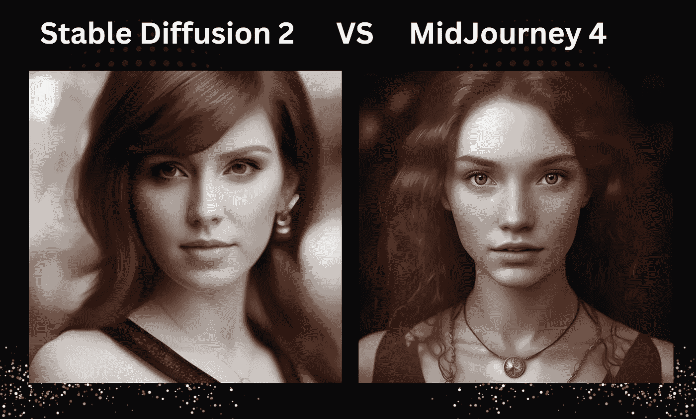

# 稳定扩散 2 与中途扩散 4—相同的提示，不同的结果

> 原文：<https://medium.com/mlearning-ai/stable-diffusion-2-vs-midjourney-4-same-prompt-different-results-ccb2398d30d5?source=collection_archive---------0----------------------->

Image by [Jim Clyde Monge](https://medium.com/u/819323b399ac?source=post_page-----ccb2398d30d5--------------------------------)

随着人工智能技术的进步，你现在可以在几秒钟内创建令人惊叹的逼真和高度细节化的图像，就像是由专业人士创建的一样。

今天最受欢迎的两个 AI 图像生成器是稳定扩散和中途。这两个工具最近都发布了令人惊讶的更新版本。