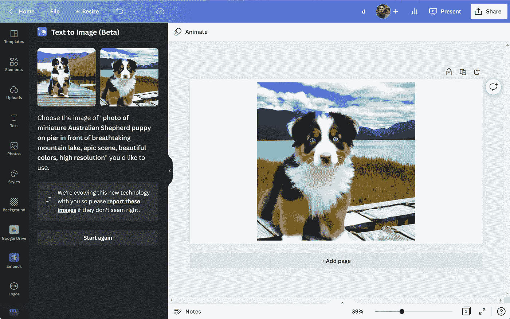

# 稳定扩散到达 Canva

> 原文：<https://medium.com/mlearning-ai/stable-diffusion-arrives-in-canva-da109f6c9c02?source=collection_archive---------1----------------------->

Image by [Jim Clyde Monge](https://medium.com/u/819323b399ac?source=post_page-----da109f6c9c02--------------------------------)

在线设计平台 anva 将变得更加智能。该公司最近宣布，它将把稳定扩散人工智能纳入其设计工具。

9 月 15 日，Canva 在[的推特](https://twitter.com/canva/status/1570109627785744384)上宣布了这一消息，推出了一款名为[的全新工具](https://www.canva.com/your-apps/text-to-image-(beta))。

> 文本到图像已在 Canva 上推出！从你的…