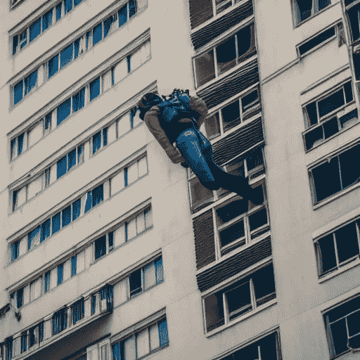

# 稳定扩散大幅度超过 Dall-E

> 原文：<https://medium.com/mlearning-ai/stable-diffusion-beats-dall-e-by-large-margin-7b327abe7064?source=collection_archive---------0----------------------->

稳定扩散:OpenAi 的开源替代

# 介绍

去噪自动编码器和扩散模型(DMs)的实现允许对图像数据产生最先进的合成结果，以及将这些模型用于图像修改任务，例如直接绘画而无需再培训。然而，由于这些模型通常直接在像素空间中操作，强大的 DMs 的优化通常消耗数百个 GPU 日，并且由于顺序评估，推断是昂贵的。为了在有限的计算资源上实现数据挖掘训练，同时保持其质量和灵活性，稳定扩散将它们应用于强大的预训练自动编码器的潜在空间。

> 检查这个

[Dream Studio Generated Image](https://beta.dreamstudio.ai/dream)

# 介绍

[稳定扩散](https://huggingface.co/spaces/stabilityai/stable-diffusion)，一种人工智能生成的文本到图像模型，将使数十亿人能够在几秒钟内创作出令人惊叹的艺术作品。这是速度和质量的突破，意味着它可以在消费级 GPU 上运行。您可以在此页面上看到一些由该模型创建的惊人输出，无需预处理或后处理。

扩散模型包括两个步骤:

**前向扩散**:前向扩散是一种通过逐渐扰动输入数据将数据映射到噪声的方法。这可以通过简单的随机过程来实现，该过程从数据样本开始，并使用高斯核迭代地产生噪声样本。在训练期间，这仅在训练集上进行；经过训练后，它不再用于推理。

**参数化反向**:撤销正向扩散，这是一个执行迭代去噪并将随机噪声转换为真实数据的过程，用于数据合成。

该模型本身建立在 CompVis 和 Runway 团队广泛使用的潜在扩散模型的基础上，结合了我们的首席生成人工智能开发人员 Katherine Crowson、Open AI 的 Dall-E 2、Google Brain 的 Imagen 和许多其他人从条件扩散模型中获得的见解。

[A dream of person falling from high building generated by Dream Studio](https://beta.dreamstudio.ai/dream)

[Dream Studio](https://beta.dreamstudio.ai/dream) 是一套新的生成媒体工具，通过赋予每个人使用自然语言处理和革命性的输入控制来创作革命性的艺术作品的能力，使他们可以轻松释放自己的创造力。

可以免费测试抱脸中的稳定扩散。它是一个开源程序，从 [Github](https://github.com/mallorbc/stable-diffusion-klms-gui) 下载就可以从头开始。

# 稳定扩散与 Dall-E

稳定扩散与谷歌图片等其他程序的关键区别在于，它使用一种非常简单的算法来生成艺术，该算法基于稳定扩散的概念，这意味着在生成初始随机图像后，无论你改变多少次，图像都将保持不变。这使得人们更容易创作出令人惊叹的艺术作品，因为他们不需要花几个小时来调整他们的图像，然后就可以在网上发布或打印在 t 恤或其他任何他们想展示他们作品的东西上。

与 Dall-E 等方法不同，前向扩散不使用梯度下降或反向传播算法进行训练。相反，它使用一个简单的优化过程来寻找其模型的超参数。

这种方法与其他方法如随机梯度下降(SGD)相比有几个优点:不需要计算梯度下降梯度；相反，前向扩散试图找到使对数似然性最大化的参数(观察值属于每个类别的概率的对数)。

# **结论**

我相信稳定扩散模型在某些方面比 OpenAI Dall-E 更好，但两者都有自己的好模型。

> [查看我们提供的更多信息。](https://www.analyticsvidhya.com/blog/2022/10/how-ai-can-improve-your-life-in-the-next-5-years/)

 [## Mlearning.ai 提交建议

### 如何成为 Mlearning.ai 上的作家

medium.com](/mlearning-ai/mlearning-ai-submission-suggestions-b51e2b130bfb)